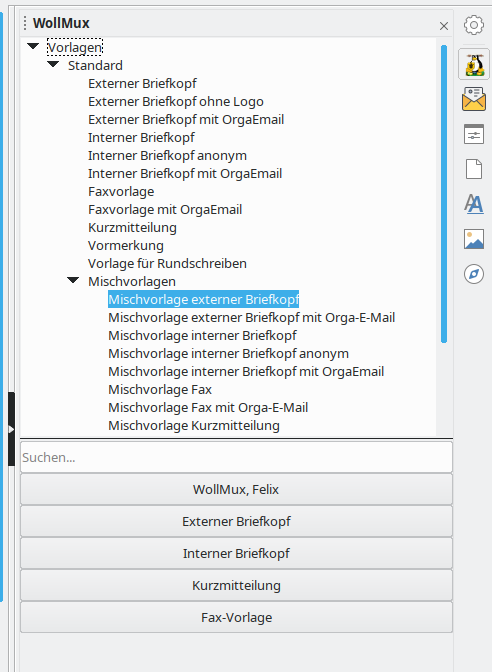
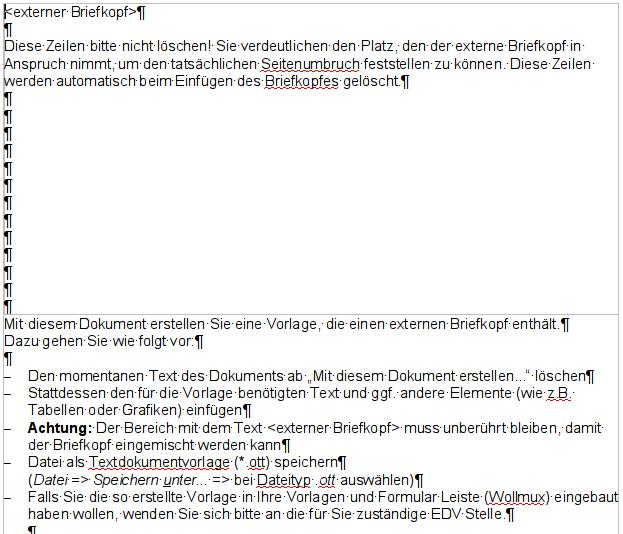
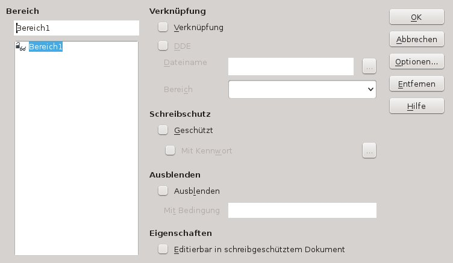

# Umstellung von MS Word Vorlagen

## Analyse der Vorlage

Die umzustellende Vorlage sollte – wenn möglich - in Word geöffnet und auf Besonderheiten überprüft werden. Sollte Word nicht mehr zur Verfügung stehen, kann diese Überprüfung auch im Writer erfolgen.

Besonderheiten könnten sein:
* Makros
* unsichtbarer Text
* aufwändige Formatierungen, wie Hoch-/Querformat gemischt, viele  grafische Elemente, komplexer textlicher Aufbau usw.

Insbesondere bei aufwändigeren Formatierung empfiehlt es sich die Vorlage auch auszudrucken, damit man die umgestellte Vorlage mit dem Original vergleichen kann.

### Entfernen von Makros

**Begriffserklärung:**

Unter einem Makro versteht man ein Programm, das eine fest vorgegebene Folge von Befehlen, Aktionen oder Tastaturcodes enthält. Alle Anweisungen des Makros werden automatisch ausgeführt, wenn das Makro entweder mit Hilfe eines Tastenschlüssels oder mit Hilfe eines Menünamens aufgerufen wird.

Makros werden z.B. in der Tabellenkalkulation, in der Textverarbeitung und in Datenbanken eingesetzt. Die Arbeit mit diesen Programmen wird dadurch erleichtert und beschleunigt, dass eine Befehlsfolge, die häufig gebraucht wird, mit Hilfe eines Makros ausgeführt wird.

Üblicherweise werden Programme in einer der Programmiersprachen (z.B. BASIC, Pascal) codiert. Es ist auch möglich, innerhalb einer Standardsoftware (z.B. LibreOffice, MS Office) eine eigene Programmiersprache zu benutzen. Dabei kann die Programmiersprache softwarebezogen oder zur Programmierung ganz allgemein angewandt werden (z.B. Lösen eines mathematischen Problems).

> **HINT** Wenn die Vorlage Makros enthält, die für die Funktionalität der Vorlage entscheidend sind, kann man diese nicht einfach entfernen – außer die Funktion des Makros kann durch Features des WollMux ersetzt werden. In diesen Fällen sollten solche Vorlagen bzw. Makros separat umgestellt werden.

**Makros aus der Vorlage entfernen:**

In Word in der Menüleiste unter *Extras → Makro* den Unterpunkt *Makros* anklicken. Falls dieser ausgegraut ist, enthält die Vorlage keine Makros.

Im Writer findet man die Makros unter *Extras → Makros → Makros verwalten → LibreOffice Basic*.

Im geöffneten Fenster muss die passende Vorlage ausgewählt werden. Danach die vorhandenen Makros markieren und löschen.

### Überprüfung auf unsichtbare Inhalte

In Word kann unter *Extras → Optionen* im Tab *Ansicht* der Haken bei „Ausgeblendeten Text“ gesetzt werden, um zu überprüfen, ob nicht sichtbarer Text enthalten ist. Im Writer findet sich diese Option unter *Extras → Optionen → LibreOffice Writer → Formatierungshilfen*.

Sollte ausgeblendeter Text enthalten sein, muss im Einzelfall geprüft werden, ob der Text gelöscht werden kann oder der ausgeblendete Text, ggf. mit Funktionalitäten des WollMux erhalten bleiben soll.

----------------------------------------

## Umwandlung der Vorlage

Wenn die Vorlage in MS Word geöffnet war, kann sie jetzt wieder geschlossen werden. Für die nächsten Schritte **muss** die Vorlage mit dem LibreOffice Writer geöffnet sein. Das ist wichtig, damit die Vorlage einmal den LibreOffice Importfilter durchlaufen hat. Der Text wird jetzt aus der ursprünglichen Vorlage heraus kopiert und in eine neue Vorlage eingefügt. Wird der Text direkt aus MS Word kopiert, ist die Wahrscheinlichkeit hoch, dass später Probleme (z.B mit der Formatierung) auftreten.

Bevor der Inhalt der ursprünglichen Vorlage in eine neue Vorlage kopiert wird, muss man sich überlegen, welchen Briefkopf die Vorlage benötigt. Der WollMux bietet u.a. Vorlagen für den externen, internen Briefkopf, Faxvorlage und Kurzmitteilung. Ggf. gibt es noch weitere Briefköpfe.

### Mischvorlagen anwenden

Wenn man weiß welcher Briefkopf benötigt wird, wird in der WollMux Leiste unter *Standard → Mischvorlagen* (die passende Vorlage geöffnet. Der Fundort der Mischvorlagen kann je nach Konfiguration abweichen.

Benötigt die Vorlage keinen Briefkopf entfällt der nächste Schritt und es geht weiter mit Kapitel [Formatierung der Vorlage](WollMux_Vorlage.md#Formatierung_der_Vorlage).

Eine genaue Beschreibung, um was es sich bei Mischvorlagen handelt, steht in Kapitel [Was ist eine Mischvorlage?](WollMux_Vorlage.md#Was_ist_eine_Mischvorlage).

Die Hinweise in der Mischvorlage werden gelöscht und der komplette Inhalt – ohne Briefkopf – der Ausgangsvorlage wird nun markiert, kopiert und in die Mischvorlage anstelle der Hinweise eingefügt.

### Bereiche aus dem Dokument entfernen:

In Word ist in den Vorlagen oftmals mit Abschnitten gearbeitet worden, um bestimmte Textstellen vor Änderungen zu schützen. Diese Abschnitte werden im Writer als Bereiche definiert und sollten hier entfernt werden.

**Begriffserklärung: Bereich:**

Mit Bereichen kann ein Textdokument in verschiedene Layoutbereiche unterteilt werden. Dabei muss man sich den Zweck von Bereichen irgendwo zwischen Seitenvorlagen und Textrahmen vorstellen.

Zum Beispiel kann ein Bereich mehrspaltig sein, wie die erwähnten Textrahmen und Seitenvorlagen. Der Unterschied liegt darin:
* Anders als bei Textrahmen ist ein Bereich nicht auf eine Seite beschränkt. Er kann irgendwo auf einer Seite beginnen und beliebig viele Seiten lang sein.
* Anders als Seitenvorlagen kann er Kopf-/Fußzeilen und Seitenränder nicht direkt beeinflussen, sondern übernimmt die Einstellungen der Seite, auf welcher er eingefügt wird.

Um die Bereiche zu entfernen in der Menüleiste *Format → Bereiche* wählen. Falls Bereiche vorhanden sind, können sie markiert und mit *Entfernen* entfernt werden.

Das weitere Vorgehen entspricht dem der [Erstellung einer neuen Vorlage](WollMux_Vorlage.md).