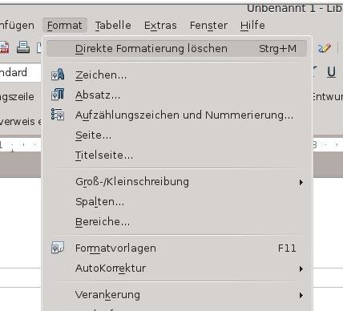
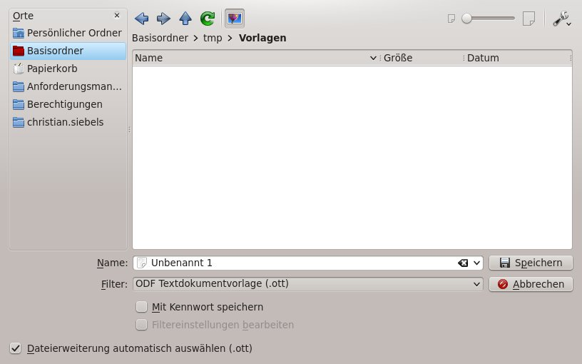

# Erstellung einer (WollMux-)Vorlage

<!-- toc -->

Die hier und auf [Sachleitende Verfügungen](SLV.md) erläuterten Themen erläutern Schritt für Schritt wie man mit LibreOffice und dem WollMux eine neue Vorlage erstellt. Ergänzungen zur Vorlagenumstellung sind gesondert markiert.

----------------------------------------

## Auswahl der Mischvorlage

### Was ist eine Mischvorlage

Eine Mischvorlage ist eine Vorlage für eine Vorlage. Fast alle Vorlagen bei der Landeshauptstadt München enthalten einen Briefkopf. Die Mischvorlagen ermöglichen es, dass man Vorlagen erstellen kann ohne sich Gedanken über das Design des Briefkopfes machen zu müssen. Man muss nur entscheiden, welchen Briefkopf die Vorlage enthalten soll und die passende Mischvorlage auswählen.

Die Mischvorlagen enthalten an sich noch keinen Briefkopf, sondern nur einen Befehl, über den dann beim Öffnen der fertigen Vorlage der entsprechende Briefkopf eingefügt wird.

Das hat auch den Vorteil, dass man in die Vorlage nicht extra einen Briefkopf hinein kopieren muss. Auch wird über die Mischvorlagen immer der exakt gleiche Briefkopf für alle Vorlagen verwendet. Diese Vorlagen können von vielen Personen verwendet werden, da die Personendaten erst beim Zusammenmischen des Briefkopfes mit der Vorlage eingetragen werden. Auch Anpassungen am Briefkopf sind ohne großen Aufwand vorzunehmen, da man nur einen Briefkopf ändern muss, der in allen Vorlagen verwendet wird.

> **WARNING** Vorlagen im WollMux enthalten niemals einen sichtbaren Briefkopf

### Vorgehen

1. Entscheiden welcher Briefkopf für die Vorlage benötigt wird.
2. In der WollMux Leiste im Menü *Standard → Mischvorlagen* die passende Mischvorlage auswählen. Ggf. weicht der Fundort für die Mischvorlagen in manchen Referaten ab.
3. Den Hinweistext löschen und die Vorlage mit Inhalt versehen.
4. Die so entstandene Vorlage als .ott abspeichern.

----------------------------------------

## Formatierung der Vorlage

Prinzipiell sollten Vorlagen und Dokumente so weit wie möglich über Formatvorlagen formatiert werden. Eine „harte“ Formatierung ist zu vermeiden.

### Richtige Formatierung

Details und Erläuterungen finden sich zur Genüge im Internet. Auf folgenden Seiten gibt es gute Dokumentationen:

1. [Einführung in Styles](http://wiki.documentfoundation.org/images/c/cc/0206WG3-IntroductionToStyles.pdf) (Englisch)
2. [Formatvorlagen](http://www.libreofficewiki.de/FormatVorlagen)

### Formatvorlagen des WollMux

Formatvorlagen kann man entweder selbst erstellen oder man verwendet die Formatvorlagen, die vom WollMux für die Briefköpfe verwendet werden. Diese Formatvorlagen befinden sich in einer eignen Writer Vorlage, die in jede beliebige Vorlage eingefügt werden kann. Diese Vorlage (Name: WOL\_Briefkopf-Absatzformate\_v1\_2005-11-22.ott) ist in jeder WollMux Konfiguration enthalten.

Diese Formatvorlagen können folgendermaßen verwendet werden:

1. In die Vorlage wechseln, in die die Formatvorlagen eingefügt werden sollen.
2. Bitte darauf achten, das kein Text o.ä. markiert ist – dieser würde gelöscht werden. Ansonsten ist es egal, an welcher Stelle der Cursor steht.
3. Über *Einfügen → Datei* die WOL\_Briefkopf-Absatzformate\_v1\_2005-11-22.ott einfügen. Dazu muss diese natürlich irgendwo im Dateisystem liegen.

In der WOL\_Briefkopf-Absatzformate\_v1\_2005-11-22.ott sind einige Formatvorlagen enthalten. Erläuterungen zu den Formatvorlagen sind im WollMux Wiki auf der Seite [Formatvorlagen](../Formatvorlagen.md) zu finden.

> **WARNING** Die so eingefügten Formatvorlagen dürfen nicht verändert werden! Diese Änderungen würden beim Einmischen des Briefkopfes in die Vorlage wieder verloren gehen.

Wenn diese Formatvorlagen angepasst werden sollen, muss dies über verknüpfte Formatvorlagen geschehen. Dies geschieht in der zu bearbeitenden Vorlage:

1. Rechtsklick auf die zu ändernde Formatvorlage und *Neu* wählen.
2. Einen sprechenden Namen vergeben, z.B. „Fließtext eingerückt 2cm“. Bei *verknüpft mit* steht „Fließtext“
3. Die Einstellungen für diese Formatvorlage vornehmen und speichern.

Die Vorlage kann nun mit den selbst erstellten und eingefügten Formatvorlagen formatiert werden. Wobei z.B. Fließtext für den normalen Vorlageninhalt verwendet wird.

► Bei umzustellenden Vorlagen sollten zuerst alle enthaltenden Formatierungen gelöscht werden. Dazu sollte ggf. vorher ein Ausdruck gemacht werden, um nachprüfen zu können, wie der Text vorher formatiert war, da dadurch Formatierungen wie Schriftgestaltung, Einrückungen, Aufzählungen, usw. verloren gehen können. Dazu wird der Text markiert und entweder über Rechtsklick oder über *Format → Standardformatierung* die Formatierung entfernt.



### Warum Formatvorlagen verwenden

Man sollte Formatvorlagen nicht nur aus Prinzip verwenden, sie bieten natürlich auch viele Vorteile, z.B.:

* Das Ändern der Formatierung von Text oder Textbereichen ist einfacher, wenn der Text mit Formatvorlagen formatiert ist.
* Es ist auch einfacher, z.B. eine Coporate Identity (wie das Visuelle Erscheinungsbild der Stadt München) umzusetzen.
* In vielen Fällen verringern Formatvorlagen auch die Probleme, die bei der Crossbearbeitung (in verschiedenen Office Suiten) auftreten können.

Man kann sich analog zur WOL\_Briefkopf-Absatzformate\_v1\_2005-11-22.ott auch eigene Vorlagen erstellen und in diese die eigenen Formatvorlagen „auslagern“. Diese können auch wie oben beschrieben, in jede beliebige Vorlage eingefügt werden. Dies kann man auch wie in Kapitel [Automatisches Einfügen von Sachbearbeiterdaten](WollMux_Vorlage.md#automatisches-einfügen-von-sachbearbeiterdaten) beschrieben über spezielle WollMux Befehle automatisieren.

### Speichern der Vorlage

Im Prinzip ist mit den vorher durchgeführten Schritten die Vorlage fertig umgestellt bzw. erstellt. Die in den nachfolgenden Kapiteln beschrieben Punkte dienen dazu die Vorlage professioneller, komfortabler und benutzerfreundlicher zu gestalten.

Um die formatierte Vorlage zu speichern, gehen Sie in der Menüleiste auf den Menüpunkt *Datei* und wählen dann den Unterpunkt *Speichern unter...* aus

Im folgenden Fenster können Sie einen beliebigen Dateinamen eingeben und müssen als Dateityp die Dokumentvorlage mit der Endung **.ott** auswählen.



### Öffnen von Vorlagen

Wenn eine Vorlage zum (weiter-)bearbeiten geöffnet werden soll, geht das nicht über *Datei → Öffnen* oder Doppelklick im Explorer/Konqueror bzw. Dateimanager. Das würde aus der Vorlage ein Dokument machen.

Um eine Vorlage zum Bearbeiten zu öffnen, gibt es u.a. diese Alternativen:

<table border="2" cellspacing="0" cellpadding="4" rules="all" style="margin:1em 1em 1em 0; border:solid 1px #AAAAAA; border-collapse:collapse; background-color:#F9F9F9; font-size:100%; empty-cells:show;">
<tr>
<td bgcolor="#87CEFA">Im Writer</td>
<td bgcolor="#87CEFA">Im Explorer (Windows)</td>
<td bgcolor="#87CEFA">Im Basisclient (nur Stadt München)</td>
<td bgcolor="#87CEFA">In der Konsole z.B.</td>
</tr>
<tr>
<td><i>Datei → Dokumentvorlage → Bearbeiten</i></td>
<td>Rechtsklick auf die Vorlage und <i>Öffnen</i> wählen</td>
<td>Rechtsklick auf die Vorlage und <i>Vorlage bearbeiten</i> wählen</td>
<td><code>$ libreoffice5.2 -o /home/Doks/Vorlage.ott</code></td>
</tr>
</table>

> **WARNING** Vorlagen im WollMux enthalten niemals einen sichtbaren Briefkopf

### Weitere Formatierungen

Auch die meisten anderen Formatierungen, wie Einrückungen, Tab-Stopps, usw. lassen sich am besten über Formatvorlagen lösen.

Tipps:

* Text nicht mit Leerzeichen einrücken. → besser Tabs oder Einrückungen in den Formatvorlagen verwenden.
* Text nicht durch mehrere Tabs einrücken. → ein definierter Tab in einer Formatvorlage eignet sich besser.
* Seitenumbrüche nicht über Zeilenschaltungen oder Absätze definieren. → Mit „Strg + Enter“ werden Seitenumbrüche eingefügt.
* Zur Ausrichtung von Text eignen sich auch Tabellen oder Rahmen.

----------------------------------------

## Automatisches Einfügen von Sachbearbeiterdaten

Der WollMux bietet die Möglichkeit, bestimmte Daten automatisiert ins Dokument einfügen zu lassen. Ein häufiger Fall sind hier die Sachbearbeiterdaten, wie sie auch im Briefkopf erscheinen. Z.B. soll am Schluss eines Schreibens immer automatisch der Vorname, Nachname und die Dienstbezeichnung des Sachbearbeiters erscheinen. Dies wird über die Verwendung von Textmarken realisiert.

### Textmarken einfügen

Bei der Verwendung von Textmarken ist es sinnvoll, am gewünschten Platz eine Art Platzhalter zu erstellen, da die Position der Textmarke in der Vorlage bzw. im Dokument sonst nicht sichtbar ist.

Den Platzhalter kennzeichnet man z.B. mit spitzen Klammern. Für eine Textmarke, die den Nachnamen einfügt, würde sich &lt;Nachname&gt; anbieten. Beim Ausführen des Dokumentes werden die Platzhalter dann automatisch durch die passenden Werte ersetzt..

Zum Einfügen der Textmarke markiert man das Wort/den Text inkl. der spitzen Klammern und wählt dann *Einfügen → Textmarke*.

Danach öffnet sich das Fenster **Textmarke einfügen**. In diesem Fenster wird der WollMux Befehl eingegeben. Dieser lautet folgendermaßen:

> **HINT** WM(CMD 'insertValue' DB_SPALTE '&lt;Spaltenname&gt;'

Bei der Eingabe des Befehls ist exakt auf Groß- und Kleinschreibung zu achten. Die Leerzeichen sind optional. &lt;Spaltenname&gt; ist durch Werte, wie sie auch im Abschnitt [Automatisch befüllbare Felder (Stadt München)](WollMux_Vorlage.md#automatisch-befüllbare-felder-stadt-münchen) sind, zu ersetzen.


### Aktualisierung von Feldern

Des Weiteren besteht die Möglichkeit, ein „update field“ einzufügen. Beim Einfügen von Textfragmenten, die Textfelder (z.B. das Datum-Feld) enthalten, werden diese Textfelder nicht automatisch von LibreOffice aktualisiert. Dieses Verhalten ist besonders bei der Erzeugung neuer Dokumente unerwünscht, da die Textfelder in diesem Fall natürlich den aktuellen Stand repräsentieren sollen. Das Kommando "updateFields" kann um ein oder mehrere solcher Textfelder gelegt werden und sorgt dafür, dass die enthaltenen Textfelder aktualisiert werden.

### Automatisch befüllbare Felder (Stadt München)

Die häufigsten Daten zum Einfügen in eine Vorlage am Beispiel der Stadt München
<table border="2" cellspacing="0" cellpadding="4" rules="all" style="margin:1em 1em 1em 0; border:solid 1px #AAAAAA; border-collapse:collapse; background-color:#F9F9F9; font-size:100%; empty-cells:show;">
<tr>
<td bgcolor="#87CEFA">Beschreibung</td>
<td bgcolor="#87CEFA">WollMux Kommandos</td>
</tr>
<tr>
<td>Nachname des Sachbearbeiters</td>
<td>WM(CMD 'insertValue' DB_SPALTE 'Nachname')</td>
</tr>
<tr>
<td>Vorname des Sachbearbeiters</td>
<td>WM(CMD 'insertValue' DB_SPALTE 'Vorname')</td>
</tr>
<tr>
<td>Lange Dienstbezeichnung des Sachbearbeiters</td>
<td>WM(CMD 'insertValue' DB_SPALTE 'DienstBezLang')</td>
</tr>
<tr>
<td>Kurze Dienstbezeichnung des Sachbearbeiters</td>
<td>WM(CMD 'insertValue' DB_SPALTE 'DienstBezKurz')</td>
</tr>
<tr>
<td>Anrede des Sachbearbeiters</td>
<td>WM(CMD 'insertValue' DB_SPALTE 'Anrede')</td>
</tr>
<tr>
<td>Titel des Sachbearbeiters</td>
<td>WM(CMD 'insertValue' DB_SPALTE 'Titel')</td>
</tr>
<tr>
<td>Telefonnummer des Sachbearbeiters</td>
<td>WM(CMD 'insertValue' DB_SPALTE 'Telefon')</td>
</tr>
<tr>
<td>Faxnummer des Sachbearbeiters</td>
<td>WM(CMD 'insertValue' DB_SPALTE 'Fax')</td>
</tr>
<tr>
<td>Emailadresse des Sachbearbeiters</td>
<td>WM(CMD 'insertValue' DB_SPALTE 'Mail')</td>
</tr>
<tr>
<td>Zimmernummer des Sachbearbeiters</td>
<td>WM(CMD 'insertValue' DB_SPALTE 'Zimmer')</td>
</tr>
<tr>
<td>Dienstgebäude des Sachbearbeiters</td>
<td>WM(CMD 'insertValue' DB_SPALTE 'Dienstgebaeude')</td>
</tr>
<tr>
<td>Postleitzahl des Dienstgebäudes des Sachbearbeiters</td>
<td>WM(CMD 'insertValue' DB_SPALTE 'DienstgebaeudePLZ')</td>
</tr>
<tr>
<td>Ortsbezeichnung des Dienstgebäudes des Sachbearbeiters</td>
<td>WM(CMD 'insertValue' DB_SPALTE 'DienstgebaeudeOrt')</td>
</tr>
<tr>
<td>Abkürzung der Organisationseinheit</td>
<td>WM(CMD 'insertValue' DB_SPALTE 'OrgaKurz')</td>
</tr>
<tr>
<td>Lange Bezeichnung der Organisationseinheit</td>
<td>WM(CMD 'insertValue' DB_SPALTE 'OrgaLang')</td>
</tr>
<tr>
<td>Name der Organisationseinheit</td>
<td>WM(CMD 'insertValue' DB_SPALTE 'OrgaName')</td>
</tr>
<tr>
<td>Postanschrift der Organisationseinheit</td>
<td>WM(CMD 'insertValue' DB_SPALTE 'Postanschrift')</td>
</tr>
<tr>
<td>Postleitzahl der Organisationseinheit</td>
<td>WM(CMD 'insertValue' DB_SPALTE 'PostPLZ')</td>
</tr>
<tr>
<td>Ort der Organisationseinheit</td>
<td>WM(CMD 'insertValue' DB_SPALTE 'PostOrt')</td>
</tr>
<tr>
<td>E-Mail der Organisationseinheit</td>
<td>WM(CMD 'insertValue' DB_SPALTE 'OrgaEmail')</td>
</tr>
<tr>
<td>Telefonnummer der Organisationseinheit</td>
<td>WM(CMD 'insertValue' DB_SPALTE 'OrgaTelefon')</td>
</tr>
<tr>
<td>Faxnummer der Organisationseinheit</td>
<td>WM(CMD 'insertValue' DB_SPALTE 'OrgaFax')</td>
</tr>
<tr>
<td>Referat des Sachbearbeiters</td>
<td>WM(CMD 'insertValue' DB_SPALTE 'Referat')</td>
</tr>
<tr>
<td>Aktualisierung von Feldern</td>
<td>WM(CMD 'updateFields')</td>
</tr>
</table>

### Textmarken ändern

Die Übersicht über die Textmarken findet man im Navigator, den Sie mit **F5**, dem kleinen Kompass in der Menüleiste oder mit *Bearbeiten → Navigator* aufrufen. Hier können die Textmarken bearbeitet und gelöscht werden.

Um die Textmarken zu sehen, muss man im Navigator mit der linken Maustaste auf das Plus links neben **Textmarken** klicken.


Der häufigste Fall ist wohl der, die Textmarke umzubenennen. Dazu macht man einen Rechtsklick auf die Textmarke und wählt dann *Textmarke → Umbenennen*.

> **WARNING** Wenn man den Eintrag „Bearbeiten“ wählt, wird eine Kopie der Textmarke erstellt, es existieren dann zwei, die auf der gleichen Position liegen. Die alte muss explizit gelöscht werden, da es zu Fehlern bei der Ausführung kommen kann (wenn z.B. ein Syntaxfehler vorhanden war).

Durch einen Doppelklick mit der linken Maustaste auf eine Textmarke wird die Lage der Textmarke im Text angezeigt.

> **WARNING** Es gibt leider einen Bug in LibreOffice, der dazu führt, dass die Änderung der Textmarke nicht erkannt wird. Wenn man also eine Textmarke ändert, macht man einfach irgendwo ein Leerzeichen und löscht dieses wieder. Dann kann man auf alle Fälle die Änderung speichern.

### Textmarken löschen

Das Löschen der Textmarken erfolgt ebenfalls im Navigator. Dazu wird nach Rechtsklick auf die zu löschende Textmarke, *Textmarke → Löschen* ausgewählt.

Textmarken kann man aber auch löschen, indem man im Menü über *Einfügen → Textmarke* die zu löschende Textmarke auswählt und dann den *Löschen* Button betätigt.

----------------------------------------

## Einfügen von Fragmenten

Der WollMux erlaubt auch das Einfügen von Fragmenten (ein Fragment entspricht im Prinzip einer Vorlage). Dadurch kann man z.B. verschiedene Daten aus der Datenquelle (z.B. LDAP) in einem Fragment zusammenfassen und dieses in eine Vorlage einfügen lassen. Dieses Prinzip wird auch für das Einfügen der Briefköpfe in die Mischvorlagen angewendet.

Der Befehl dazu lautet folgendermaßen:

> **HINT** WM(CMD 'insertFrag' FRAG_ID '$lt;FRAG_ID&gt;'

Das &lt;FRAG\_ID&gt; ist durch die passende FRAG\_ID zu ersetzen.

Die Vorlagen im WollMux sind durch eine Vielzahl von Fragmenten zusammengesetzt. Für die Vorlagenerstellung sind im Prinzip aber nur zwei davon geeignet:

* Unterschrift
* Name\_Bezeichnung

Durch Unterschrift wird

```
Mit freundlichen Grüßen

<Titel> <Vorname> <Nachname>

<DienstBezLang>
```

eingefügt.

Durch Name\_Bezeichnung wird

```
Mit freundlichen Grüßen

<Titel> <Nachname>
```

eingefügt.

Im Übrigen gelten die Hinweise aus Kapitel [Automatisches Einfügen von Sachbearbeiterdaten](WollMux_Vorlage.md#automatisches-einfügen-von-sachbearbeiterdaten).

> **WARNING** Um selbst erstellte Fragmente verwenden zu können, müssen diese in die WollMux Konfiguration eingebunden sein und eine ID, i.d.R. Der Dateiname, haben.

### OverrideFrag

Wenn man den Inhalt der Briefköpfe für manche Situationen anpassen muss, braucht man keinen neuen Briefkopf zu bauen oder den aktuellen zu verändern. Für diesen Fall gibt es den Befehlt “OverrideFrag”. Dieser Befehl ersetzt ein im Briefkopf befindliches Fragment mit einem anderen. Zum Beispiel wird normalerweise die persönliche Emailadresse im externen Briefkopf angezeigt, für manche Fälle wird aber die Emailadresse der Organisationseinheit benötigt.

Der Befehl dazu lautet:

> **HINT** WM(CMD 'overrideFrag' FRAG_ID 'Frag_id' NEW_FRAG_ID 'Neue_Frag_id')

Für obiges Beispiel würde das so aussehen:

WM(CMD 'overrideFrag' FRAG\_ID 'Email' NEW\_FRAG\_ID 'OrgaEMail')

Für das Einbauen dieses Befehls nimmt man die passende Mischvorlage und fügt im Bereich, in dem auch der Befehl für das einfügen des Briefkopfes steht, eine Textmarke mit diesem Befehl ein.

Alle Fragmente und die dazugehörigen IDs findet man in der WollMux Konfiguration.
