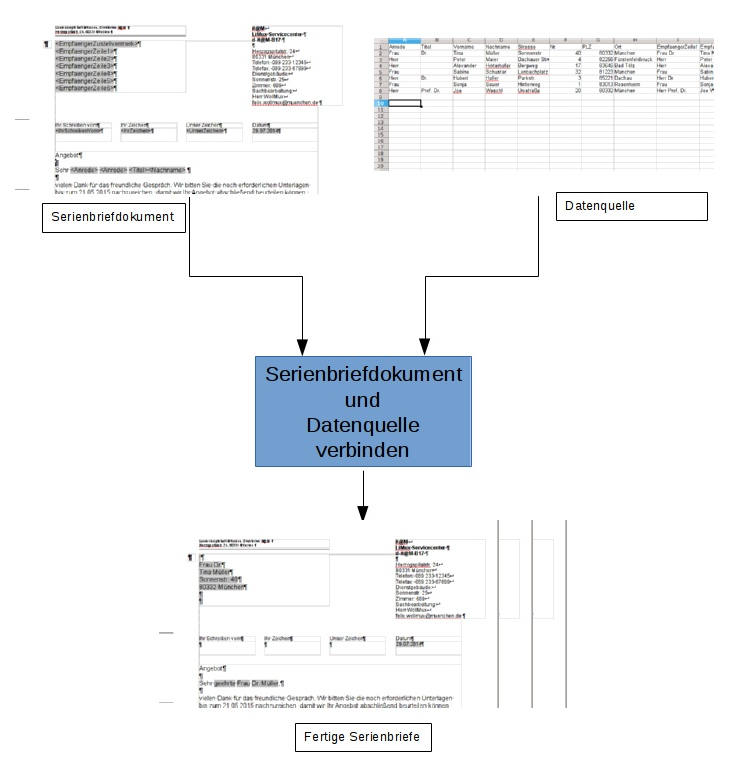

<!-- toc -->

# Grundsätzliches zu dieser Unterlage und zum WollMux Seriendruck

Diese Unterlage beschreibt den WollMux Seriendruck, den Sie in LibreOffice hinter dem *Briefumschlag in der Sidebar* finden. Der LibreOffice Seriendruck wird hier nicht weiter beschrieben..

In dieser Unterlage wird dargestellt, wie Sie mit dem WollMux Seriendruck zeitsparend weitgehend gleich lautende Briefe oder Texte auch an eine Großzahl an Adressaten versenden. Ebenso wird der Etikettendruck, den Sie unter *Datei → Neu → Etiketten* finden und dann mithilfe des WollMux Seriendrucks befüllen, beschrieben.

Zusätzlich kann der WollMux Seriendruck mit den Sachleitenden Verfügungen (SLVs) und der Formularfunktion des WollMux verknüpft werden.

## Darstellung des Seriendrucks

* **Ausgangsdokument bzw. Ausgangsvorlage**: Diese Datei besteht z. B. aus dem Brief(kopf) mit seinen gleich lautenden Textstellen. Für die veränderlichen (variablen) Textstellen werden Platzhalter, die sog. Serienbrieffelder, eingefügt.
* **Datenquelle**: Die Datenquelle ist eine weitere Datei, i.d.R. eine Calc Tabelle. In dieser Datei befinden sich all die Informationen (z.B. die Daten zum Adressaten), die sich bei jedem Brief ändern, also variabel sind.
* **Serienbrief oder Serienetikett**: Der Serienbrief bzw. das Serienetikett ist das Endergebnis. Er beinhaltet sowohl die festen als auch die variablen Texte aus dem Ausgangsdokument und der Datenquelle zum Zeitpunkt der Erstellung. Er wird durch das Zusammenführen dieser beiden Dateien erzeugt. Der Serienbrief bzw. das Serienetikett selbst kann in Dateiform (ein Dokument für alle Briefe oder pro Brief eine Datei) oder in Papierform (Drucker) ausgegeben werden.
* **Zusammenführen (Serienbriefdokument und Datenquelle verbinden)**: Vorgang bei dem der Serienbrief aus dem Ausgangsdokument -bzw. -vorlage und der Datenquelle erzeugt wird. Der Serienbrief ist ein Endergebnis, das die Daten zum Zeitpunkt der Erstellung beinhaltet. Er kann nicht aktualisiert werden. Wenn Sie das Ausgangsdokument oder die Datenquelle aktualisieren, müssen Sie das Zusammenführen erneut durchführen.
* **Serienbrieffeld**: Platzhalter an dem die passende Information aus der Datenquelle eingefügt wird.
* **Seriendruckfelder**: Allgemeiner Begriff / Oberbegriff für Serienbrieffelder.
* **Spezialfelder**: Felder zur individuellen Steuerung des variablen Inhalts, z.B. für Gender oder Wenn-Dann Funktionen.
