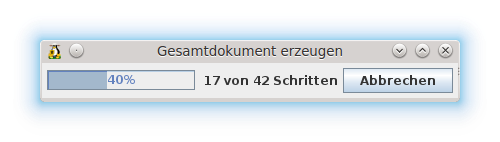

# Zusammenführen von Ausgangsdokument und Datenquelle

<!-- toc -->

## Vorschau

Um vor dem Zusammenführen von Ausgangsdokument und Datenquelle zu prüfen, ob das Ergebnis den eigenen Vorstellungen entsprechen wird, können Sie sich ein Vorschau anzeigen lassen.

### Vorschau anzeigen lassen

Klicken Sie auf die Schaltfläche *Vorschau* in der Sidebar. Sie sehen dann statt der Namen der Seriendruckfelder den Inhalt des ersten Datensatzes. Er wird etwas weiter rechts auch als Zahl angezeigt.

Die Schaltfläche heißt nun *&lt;Feldname&gt;*

### Vorschau ausschalten

Klicken Sie auf die Schaltfläche *&lt;Feldname&gt;* in der Sidebar. Sie sehen dann statt den Inhalten der Datensätze wieder die Namen der Seriendruckfelder.

Die Schaltfläche heißt nun wieder *Vorschau*.

## Serienbrief Drucken

Um den Serienbrief zu drucken betätigen Sie die Schaltfläche *Drucken* in der Sidebar. Es erscheint nun der Seriendruckdialog des WollMux, der Ihnen nun eine Reihe von Optionen bietet.

Über die Funktion *Folgende Datensätze verwenden* kann die Anzahl der Ausdrucke eingeschränkt werden.

### Gesamtdokument erstellen (.odt)

Diese Option ist die Standard Option, wenn Sie den Seriendruck Dialog starten.

Mit dieser Auswahl wird der Seriendruck mit allen Datensätzen in ein einzelnes Dokument geschrieben, das dann alle Datensätze enthält.

### Gesamtdokument erstellen (.pdf)

Ähnlich wie beim [Gesamtdokument erstellen (odt)](#gesamtdokument-erstellen-odt) wird ein einzelnes Dokument mit allen Datensatzen generiert. Da es sich aber um ein PDF handelt ist eine nachträgliche Anpassung wie bei [Gesamtdokument erstellen (odt)](#gesamtdokument-erstellen-odt) nicht möglich.

### Direkt drucken

Der Serienbrief kann auch direkt gedruckt werden. Dabei können die üblichen Drucker-Optionen eingestellt werden. Dazu muss der **Weiter &gt;** Button betätigt werden. Wenn man direkt **Fertigstellen** auswählt, so wird auf dem voreingestellten Drucker gedruckt.

→ Unterstützt „Nächster Datensatz“-Funktion

### E-Mails Verschicken

Hierüber können die Serienbriefe direkt als Email(s) versendet werden. Dazu gehen Sie bitte folgendermaßen vor:

* Wählen Sie zwischen den Ausgabeformaten ODT und PDF (vergleiche [Einzeldateien erzeugen](#einzeldateien-erzeugen)).
* Geben Sie ein Muster für den Namen des Anhangs an. Dabei können Serienbrieffelder verwendet werden (vergleiche [Einzeldateien erzeugen](#einzeldateien-erzeugen).
* Als Absender ersetzen Sie bitte &lt;felix.wollmux@muenchen.de&gt; durch Ihre Email Adresse.
* Die Datenquelle benötigt eine Spalte, die die Emailadressen der Empfänger enthält.
* Sie können über die entsprechenden Felder den Betreff und den Inhalt der Nachricht festlegen. Dazu können Sie auch Serienbrief- oder Spezialfelder verwenden.

### Einzeldateien erzeugen

Mit dieser Option werden die Serienbriefe in einzelne Dateien geschrieben. Folgende Optionen stehen dabei zur Verfügung:

* Als Ausgabeformat stehen .odt und .pdf zur Verfügung.
* Sie können ein Muster für die Dateinamen festlegen. Dazu können Sie auch Serienbrief- und Spezialfelder verwenden.
* Sie können ein beliebiges Zielverzeichnis, in das die Dateien gespeichert werden sollen auswählen.

Über die Funktion *Folgende Datensätze verwenden* kann die Anzahl der Einzeldateien eingeschränkt werden.

### Seriendruck starten

Alle Arten des Seriendrucks starten Sie mit dem Button *Los geht’s*. Ein Fortschrittsbalken informiert Sie über den Fortschritt des Drucks. Größere Dokumente – also mit vielen Datensätzen werden etwas länger dauern. Große Seriendrucke von ca. 300 bis zu ca. 8000 Datensätzen funktionieren mit dem pdf Gesamtdruck am besten.

## Leerseiten in Seriendokumenten drucken

In LibreOffice gibt es unter *Extras → Optionen → LibreOffice Writer → Drucken* die Option *Automatisch eingefügte Leerseiten drucken.* Diese Option ist standardmäßig aus technischen Gründen deaktiviert. Es gibt aber eine Konstellation, bei der Sie diese Einstellung aktivieren müssen. Nachfolgende Tabelle verdeutlicht die verschiedenen Optionen und die erforderlichen Einstellungen:

<table border="2" cellspacing="0" cellpadding="4" rules="all" style="margin:1em 1em 1em 0; border:solid 1px #AAAAAA; border-collapse:collapse; background-color:#F9F9F9; font-size:100%; empty-cells:show;">
<tr>
<td>Drucker</td>
<td>Seitenzahl</td>
<td>Automatisch eingefügte Leerseiten drucken</td>
</tr>
<tr">
<td>Duplex</td>
<td>gerade</td>
<td>deaktiviert</td>
</tr>
<tr style="background-color:red;">
<td>Duplex</td>
<td>ungerade</td>
<td>aktiviert</td>
</tr>
<tr>
<td>Einfach (ohne Duplex)</td>
<td>gerade</td>
<td>deaktiviert</td>
</tr>
<tr>
<td>Einfach (ohne Duplex)</td>
<td>ungerade</td>
<td>deaktiviert</td>
</tr>
</table>

Sie müssen also die Option *Automatisch eingefügte Leerseiten drucken* aktivieren, wenn Sie einen Duplexdrucker verwenden und einen Serienbrief haben, der eine ungerade Seitenzahl hat. Nach dem Druck sollten Sie die Option wieder deaktivieren.

Wenn Sie das nicht immer machen wollen, können Sie bei Serienbriefen mit ungerader Seitenzahl eine leere Seite am Schluss einfügen, damit Sie eine gerade Seitenzahl haben, dann brauchen Sie sich um die Option *Automatisch eingefügte Leerseiten drucken* nicht kümmern.

Mit strg + Enter fügen Sie am Ende Ihres Serienbriefes einen manuellen Seitenumbruch und damit eine leere Seite ein.

### Leerseiten im Gesamtdokument PDF

Sollten Sie ein Gesamtdokument PDF mit Leerseiten erstellen wollen, so muss eine andere Option gesetzt werden. Diese finden Sie unter *Datei → Exportieren als → Als PDF exportieren... → Automatisch eingefügte Leerseiten exportieren*. Leider ist es noch notwendig den Export einmal zu starten, damit die Einstellung gespeichert wird und beim Seriendruck verwendet werden kann. Das exportierte PDF-Dokument muss nicht gespeichert werden. Nun können Sie wie gewohnt den Seriendruck als Gesamtdokument PDF durchführen und erhalten bei einer ungeraden Seitenzahl nach jedem Datensatz eine Leerseite.

Nach dem Druck sollten Sie die Option wieder deaktivieren.

## Datensätze für den Ausdruck filtern

Wenn Sie für Ihren Seriendruck nur eine Auswahl Ihrer Datensätze verwenden wollen, können Sie dies ganz einfach mit den Filtermöglichkeiten in LibreOffice Calc machen. Prinzipiell gibt es dazu zwei verschieden Möglichkeiten, die hier aber nur kurz vorgestellt werden.

### Zeilen ausblenden

Indem Sie einfach einzelne Zeilen ausblenden, filtern Sie diese für den Seriendruck aus. Wenn es allerdings nicht allzu aufwendig werden soll, bietet diese Option aber nur wenig Möglichkeiten. Sie ist dafür geeignet, um z.B. Datensatz (Zeile) 25 – Ende auszufiltern. Dann werden nur noch die ersten 24 (wenn Zeile1 die Überschrift enthält) Datensätze für den Seriendruck verwendet.

Um in Calc Zeilen auszublenden, markieren Sie die Zeilen über die Zeilennummer und wählen im Kontextmenü (Rechtsklick) *Ausblenden*.

### In Calc filtern

Um Ihre Daten einzugrenzen können Sie die Filtermöglichkeiten von Calc nutzen. Die komfortabelste Lösung stellt hierzu wahrscheinlich der Autofilter da. Den Autofilter stellt man in Calc über *Daten → Filter → Autofilter* ein. Den eingeschalteten Autofilter erkennt man an den Kästchen mit den ▼

Der Autofilter ermöglicht es Ihnen in jeder Spalte bestimmte Kriterien auszuwählen, nach denen Sie Ihre Daten einschränken können.

Ebenso kann man natürlich auch Filter auf mehrere Spalten gleichzeitig anwenden, um die Daten noch mehr einzuschränken, so könnte man z.B. in der Spalte Anrede nach „Herr“ filtern und beim Ort nach „München“, so dass als Ergebnis nur noch die Datensätze übrig bleiben, bei denen sich um Herren handelt, die in München wohnen.

## Nutzung einer bereits bestehenden Ausgangsvorlage (oder Dokuments)

Wenn Sie Ihre Ausgangsvorlage gespeichert haben, können Sie sie jederzeit wieder aufrufen und das Zusammenführen erneut durchführen.

Beim Öffnen der Ausgangsvorlage wird die Seriendruck-Sidebar nicht automatisch aktiviert.

Rufen Sie sie wie gewohnt über *Extras → Seriendruck (WollMux)* auf.

Der Speicherort der Datenquelle ist in der Ausgangsvorlage gespeichert, so dass nach dem Aufruf die Datenquelle wie beim letzten Zusammenführen verbunden ist. Voraussetzung dafür ist, dass die Datei nicht verschoben oder umbenannt wurde.

Falls Sie nun eine andere Datenquelle mit der Ausgangsvorlage nutzen möchten, klicken Sie auf Datenquelle und wählen die gewünschte Datenquelle aus.
