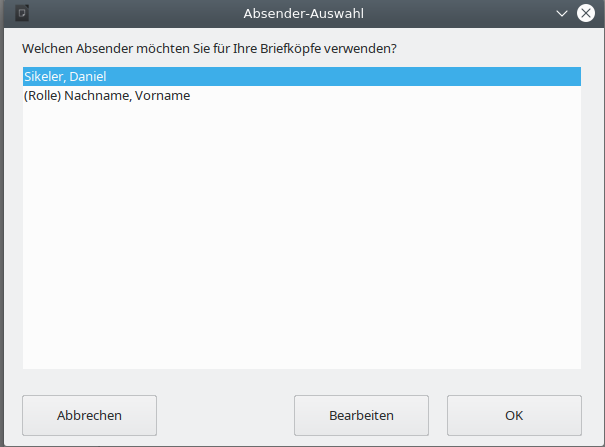
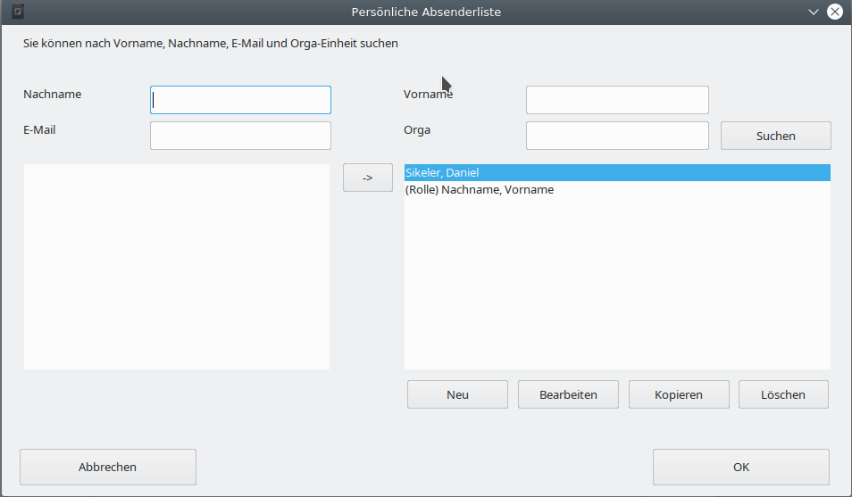

# {{ page.title }}

Der WollMux kann über verschiedene Schnittstellen von außen gesteuert werden. Sachbearbeiterinnen und Sachbearbeiter müssen im Normalfall von diesen Steuermöglichkeiten nichts wissen, da die Kommunikation über diese Schnittstellen für sie im Hintergrund abläuft. Der Artikel richtet sich an fortgeschrittene Vorlagenersteller und Entwickler, die aufbauend auf den WollMux Vorlagen und Programmbibliotheken erstellen.

<!-- toc -->

## Zusätzliche Schaltflächen in die Symbolleiste von LibreOffice einbinden

Manche WollMux-Funktionalitäten können in Form von Schaltflächen in die Symbolleiste von LibreOffice eingebunden werden.

Die Einbindung geht wie folgt:

1. Extras/Anpassen.../Reiter “Symbolleisten”
2. Ziel “Standard” auswählen
3. Bereich “LibreOffice Writer” auswählen
4. Kategorie "Makros" auswählen
5. Links bei Funktionen die gewünschte Funktionalität auswählen
6. Pfeil-Button
7. Button “OK”

Folgende Funktionalitäten sind derzeit über diese Schnittstelle verfügbar:

* **functionDialogEmpfaengerauswahl:** öffnet den Funktionsdialog “Empfängerauswahl” (siehe auch [\#wollmux:FunctionDialog](#wollmuxfunctiondialog))
* **FormularMax4000:** öffnet den FormularMax 4000 (siehe auch [\#wollmux:FormularMax4000](#wollmuxformularmax4000))
* **Kill:** schließt alle LibreOffice-Prozesse ohne Rückfrage (siehe auch [\#wollmux:Kill](#wollmuxkill))
* **DumpInfo:** erzeugt eine dump-Datei zur Fehlersuche (siehe auch [\#wollmux:DumpInfo](#wollmuxdumpinfo))
* **About:** zeigt den Dialog “Info über Vorlagen und Formulare” (siehe auch [\#wollmux:About](#wollmuxabout))
* **TextbausteinEinfuegen:** fügt ein vorhandenen Textbaustein ein" (siehe auch [\#wollmux:TextbausteinEinfuegen](#wollmuxtextbausteineinfuegen))
* **TextbausteinVerweisEinfuegen:** fügt eine 'insertFrag' Textmarke ein die erst nach dem speichern und nochmaligen öffnen ausgewertet wird" (siehe auch [\#wollmux:TextbausteinVerweisEinfuegen](#wollmuxtextbausteinverweiseinfuegen))
* **PlatzhalterAnspringen:** springt ab dem Cursor den nächsten vorhandenen Platzhalter an" (siehe auch [\#wollmux:PlatzhalterAnspringen](#wollmuxplatzhalteranspringen))
* **Seriendruck:** ruft die Seriendruckfunktion des WollMux auf (siehe auch [\#wollmux:Seriendruck](#wollmuxseriendruck))

Technisch gesehen handelt es sich bei dieser Schnittstelle um ein Basic-Bibliothek namens “WollMux” mit dem Modul “Call”, in der die entsprechenden [Dispatch-Kommandos](#die-dispatch-kommandos-des-wollmux) des WollMux abgesetzt werden. Das Modul wird mit dem WollMux.uno.pkg automatisch mit installiert.

## Tastenkombination für eine Schnittstelle setzen

Über einen [Tastenkuerzel Eintrag](Konfigurationsdatei_wollmux_conf.md#tastenkuerzel) in Konfigurationsdateien kann eine OOo-Writer Tastenkombination für eine Schnittstelle (z.B strg+t für wollmux:TextbausteinEinfuegen) gesetzt werden.

## Programmierschnittstellen

### Die Dispatch-Kommandos des WollMux

Der WollMux stellt eine Reihe von sog. “Dispatch-Kommandos” zur Verfügung, die über das [Dispatch-Framework](http://api.openoffice.org/docs/DevelopersGuide/OfficeDev/OfficeDev.xhtml#1_1_6_Using_the_Dispatch_Framework) von LibreOffice eingebunden sind und den WollMux veranlassen, verschiedene Aktionen auszuführen.

Das folgende Programmbeispiel in LibreOffice-Basic zeigt, wie die Dispatch-Kommandos des WollMux aufgerufen werden können:

```vbscript
Sub About
  dispatchURL("wollmux:About") # hier steht die <URL>
End Sub

Sub dispatchURL(urlStr` `as` `String)
  dim url as new com.sun.star.util.URL
  url.Complete = urlStr

  frame = ThisComponent.currentController.Frame
  dispatch = frame.queryDispatch(url, "_self", com.sun.star.frame.FrameSearchFlag.SELF)

  dim args() as new com.sun.star.beans.PropertyValue
  dispatch.dispatch(url, args)
End Sub
```

Dabei erwartet die Funktion dispatchURL(urlStr as String) eine der folgenden URLs:

#### wollmux:AbsenderAuswaehlen

Syntax der URL:

`wollmux:AbsenderAuswaehlen`

Öffnet den Dialog “Absender Auswählen” über den der aktuelle Absender des Briefkopfsystems festgelegt werden kann. Hier ein Beispiel für einen solchen Dialog:



#### wollmux:PALVerwalten

Syntax der URL:

`wollmux:PALVerwalten`

Öffnet den Dialog “Absenderliste verwalten” über den die aktuelle
Persönliche Absenderliste (PAL) des Briefkopfsystems verwaltet werden
kann. Hier ein Beispiel für einen solchen Dialog:



#### wollmux:Open

> **WARNING** Dieser Dispatch wird nicht länger unterstützt.

#### wollmux:OpenTemplate

Syntax der URL:

`wollmux:OpenDocument#<FRAG_ID>`

`wollmux:OpenDocument#<FRAG_ID1>&<FRAG_ID2>&<FRAG_ID3>...`

Öffnet die Vorlage mit der FRAG\_ID "<FRAG_ID>". Abhängig vom Typ des Dokuments und dem evtl. enthaltenen [Dokumentkommando setType](Dokumentkommandos_des_WollMux.md#das-kommando-settype) werden dabei die (anderen) enthaltenen [Dokumentkommandos](Dokumentkommandos_des_WollMux.md) bearbeitet oder nicht. Für die Verwendung im Zusammenspiel mit dem [insertContent-Kommando](Dokumentkommandos_des_WollMux.md#das-kommando-insertcontent) können mehrere FRAG\_IDs angegeben werden. Diese werden durch "&" getrennt.

#### wollmux:OpenDocument

Syntax der URL:

`wollmux:OpenDocument#<FRAG_ID>`

Öffnet die Vorlage mit der FRAG\_ID "<FRAG_ID>" zum bearbeiten. Dabei werden die in der Vorlage enthaltenen [Dokumentkommandos](Dokumentkommandos_des_WollMux.md) **nicht** ausgewertet.

#### wollmux:FunctionDialog

Syntax der URL:

`wollmux:FunctionDialog#<Dialogbezeichner>`

Öffnet den in der [Konfigurationsdatei wollmux.conf global definierten Funktionsdialog](Konfigurationsdatei_wollmux_conf.md#funktionsdialoge) mit der Bezeichnung "<Dialogbezeichner>" und überträgt die dort ausgewählten Funktionswerte in die im aktuell geöffneten Dokument enthaltenen [insertFormValue-Kommandos](Dokumentkommandos_des_WollMux.md#das-kommando-insertformvalue).

#### wollmux:FormularMax4000

Syntax der URL:

`wollmux:FormularMax4000`

Öffnet den [FormularMax 4000](FormularMax_4000.md), die graphische Oberfläche zur Erstellung von Formularen.

#### wollmux:ZifferEinfuegen

Syntax der URL:

`wollmux:ZifferEinfuegen`

Alle vom Cursor markierten Zeilen werden als Verfügungpunkte für Sachleitende Verfügungen markiert und mit den entsprechenden römischen Ziffern versehen. Befindet sich der Cursor bereits auf einer solchen Zeile, so wird die Markierung wieder aufgehoben und die römische Ziffer entfernt. Das Verhalten ist ausführlicher beschrieben auf der Seite [“Hilfen für Sachleitende Verfügungen verwenden”](Hilfen_fuer_Sachleitende_Verfuegungen_verwenden.md#die-schaltfläche-ziffer-einfügen).

#### wollmux:Abdruck

Syntax der URL:

`wollmux:Abdruck`

Ab der aktuellen Cursorposition wird ein neuer Absatz "&lt;Ziffer&gt; Abdruck von ..." eingefügt und als Verfügungspunkt von Sachleitenden Verfügungen markiert. Steht der Cursor bereits auf einem solchen Absatz, so wird der Abdruck entfernt. Das Verhalten ist ausführlicher beschrieben auf der Seite [“Hilfen für Sachleitende Verfügungen verwenden”](Hilfen_fuer_Sachleitende_Verfuegungen_verwenden.md#die-schaltfläche-abdruck).

#### wollmux:Zuleitungszeile

Syntax der URL:

`wollmux:Zuleitungszeile`

Alle über den Cursor ausgewählten Absätze des aktuellen Vordergrunddokuments werden als Zuleitungszeilen von Sachleitenden Verfügungen markiert oder eine evtl. bestehende Markierung wird aufgehoben. Das Verhalten ist ausführlicher beschrieben auf der Seite [“Hilfen für Sachleitende Verfügungen verwenden”](Hilfen_fuer_Sachleitende_Verfuegungen_verwenden.md#die-schaltfläche-zuleitungszeile).

#### wollmux:DumpInfo

Syntax der URL:

`wollmux:DumpInfo`

Veranlasst den WollMux eine Datei $HOME/.wollmux/dump&lt;DatumUndZeit&gt; zu erzeugen, die wichtige Informationen für die Fehlersuche im Zusammenhang mit dem WollMux enthält. DumpInfo ist vor allem für WollMux-Administratoren geeignet, die bei der Installation und Einrichtung des WollMux auf Fehler stoßen, für deren Lösung Unterstützung durch D-III-ITD-5.1 notwendig wird. In diesem Fall ist die über dumpInfo erzeugte dump-Datei an ein entsprechendes Vorfallticket anzuhängen.

#### wollmux:Kill

Syntax der URL:

`wollmux:Kill`

Schließt alle LibreOffice Fenster ohne jede Sicherheitsabfragen(!).

Hinweis: Abgestürzte LibreOffice Prozesse werden dadurch *nicht* beendet, auch der Schnellstarter nicht.

#### wollmux:About

Syntax der URL:

`wollmux:About`

`wollmux:About#`&lt;Version der WollMuxBar&gt;

Veranlass den WollMux, den Dialog “Info über Vorlagen und Formulare (WollMux)” anzuzeigen, der folgende wichtige Versionsinformationen enthält:

* Die Release-Version der WollMux-Kernkomponente WollMux.uno.pkg
* Die Release-Version der zugrundeliegenden WollMux-Konfiguration.
* Der DEFAULT\_CONTEXT, von dem die Konfiguration bezogen wird.

Hier ein Beispiel eines solchen Dialogs:


#### wollmux:TextbausteinEinfuegen

Syntax der URL:

`wollmux:TextbausteinEinfuegen`

Nach Betätigen eines vorher zugewiesenen Buttons oder einer Tastenkombination, wird vom Cursor ausgehend eine Rückwärts suche gestartet, die so lange läuft, bis in einem Absatz keine Textbausteine mehr gefunden werden. Alle dabei gefundenen Textbausteine werden entsprechend aufgelöst.

* Einrichten einer Tastenkombination siehe [Tastenkombination für eine Schnittstelle setzen](#tastenkombination-für-eine-schnittstelle-setzen)
* Einrichten eines Buttons siehe [Schaltflächen in die Symbolleiste von LibreOffice einbinden](#zusätzliche-schaltflächen-in-die-symbolleiste-von-LibreOffice-einbinden)

#### wollmux:TextbausteinVerweisEinfuegen

Syntax der URL:

`wollmux:TextbausteinVerweisEinfuegen`

Nach Betätigen eines vorher zugewiesenen Buttons oder einer Tastenkombination, wird vom Cursor ausgehend eine Rückwärts suche gestartet, die so lange läuft, bis in einem Absatz keine Textbausteine mehr gefunden werden. Für alle dabei gefundenen Textbausteine werden Textmarken mit dem Dokumenten-Kommando 'insertFrag' gesetzt diese werden aber nicht gleich ausgewertet sondern erst nach dem Speichern als Vorlage und spätrigen öffnen.

* Einrichten eines Buttons siehe [Schaltflächen in die Symbolleiste von LibreOffice einbinden](#zusätzliche-schaltflächen-in-die-symbolleiste-von-LibreOffice-einbinden)

#### wollmux:PlatzhalterAnspringen

Syntax der URL:

`wollmux:PlatzhalterAnspringen`

Nach Betätigen eines vorher zugewiesenen Buttons oder einer Tastenkombination wird vom Cursor ausgehend der nächste Platzhalter angesprungen. Falls kein Platzhalter vorhanden ist sondern eine Marke [WM(CMD 'setJumpMark')](Dokumentkommandos_des_WollMux.md#das-kommando-setjumpmark) wird diese angesprungen.

* Einrichten einer Tastenkombination siehe [Tastenkombination für eine Schnittstelle setzen](#tastenkombination-für-eine-schnittstelle-setzen)
* Einrichten eines Buttons siehe [Schaltflächen in die Symbolleiste von LibreOffice einbinden](#zusätzliche-schaltflächen-in-die-symbolleiste-von-LibreOffice-einbinden)

#### wollmux:Seriendruck

Syntax der URL:

`wollmux:Seriendruck`

Öffnet die Seriendruckleiste des WollMux über die alle Seriendruckfunktionen des WollMux angesprochen werden können. Ist bereits eine Seriendruckleiste geöffnet, so bleibt die bestehende Seriendruckleiste im Vordergrund.

Eine zugehörige Schaltfläche bietet der WollMux automatisch an im Menü des Writers unter “Extras&rarr;Seriendruck (WollMux)”

### Der UNO-Service de.muenchen.allg.itd51.wollmux.WollMux

Zusätzlich zu den Dispatch-Kommandos stellt der WollMux einen zentralen UNO-Service zur Verfügung, der über die folgende LibreOffice-Basic Zeile erzeugt werden kann:

In LibreOffice-Basic:

```vbscript
mux = createUNOService("de.muenchen.allg.itd51.wollmux.WollMux")
```

In Java:

```java
XWollMux mux = UnoRuntime.queryInterface(XWollMux.class, UNO.createUNOService("de.muenchen.allg.itd51.wollmux.WollMux");
```

Das Interface XWollMux ist dabei wie folgt definiert:

```java
/**
  Dieses Interface beschreibt alle Methoden, die der WollMux-Service exportiert.
*/
interface XWollMux
{
   // Methoden zum Registrieren/Deregistieren von XPALChangeEventListenern.
   interface XPALChangeEventBroadcaster;

   /**
    * Die in diesem Interface beschriebenen Methoden registrieren bzw. deregistrieren
    * enstprechende Listener vom Typ XEventListener, über die der WollMux
    * über den Status der Dokumentbearbeitung informiert (z.B. wenn ein Dokument
    * vollständig bearbeitet/expandiert wurde). Die register-Methode ignoriert alle
    * XEventListenener-Instanzen, die bereits registriert wurden.
    * Mehrfachregistrierung der selben Instanz sind also nicht möglich.
    *
    * Tritt ein entstprechendes Ereignis ein, so erfolgt der Aufruf der
    * entsprechenden Methoden XEventListener.notifyEvent(...) immer gleichzeitig
    * (d.h. für jeden Listener in einem eigenen Thread).
    *
    * Der WollMux liefert derzeit folgende Events:
    *
    * OnWollMuxProcessingFinished: Dieses Event wird erzeugt, wenn ein
    * Textdokument nach dem Öffnen vollständig vom WollMux bearbeitet und
    * expandiert wurde oder bei allen anderen Dokumenttypen direkt nach dem
    * Öffnen. D.h. für jedes in OOo geöffnete Dokument erfolgt früher oder später
    * ein solches Event. Wird ein neuer EventHandler registriert, so werden ihm
    * für alle bereits offenen LibreOffice Dokumente die
    * OnWollMuxProcessingFinished Events nachgeliefert.
    */
   interface com::sun::star::document::XEventBroadcaster;

   /**
     Diese Methode setzt den aktuellen Absender der Persönlichen Absenderliste
     (PAL) auf den Absender sender. Der Absender wird nur gesetzt, wenn die
     Parameter sender und idx in der alphabetisch sortierten Absenderliste des
     WollMux übereinstimmen - d.h. die Absenderliste der veranlassenden
     SenderBox zum Zeitpunkt der Auswahl konsistent zur PAL des WollMux war.
     Die Methode verwendet für sender das selben Format wie es vom
     XPALProvider:getCurrentSender() geliefert wird.
    */
   void setCurrentSender([in] string sender, [in] short index);

   /**
     Liefert die zum aktuellen Zeitpunkt im WollMux ausgewählten Absenderdaten (die
     über das Dokumentkommandos WM(CMD'insertValue' DB_SPALTE'<dbSpalte>') in ein
     Dokument eingefügt würden) in einem Array von PropertyValue-Objekten
     zurück. Dabei repräsentieren die Attribute PropertyValue.Name die
     verfügbaren DB_SPALTEn und die Attribute PropertyValue.Value die zu
     DB_SPALTE zugehörigen Absenderdaten.

     Jeder Aufruf erzeugt ein komplett neues und unabhängiges Objekt mit allen
     Einträgen die zu dem Zeitpunkt gültig sind. Eine Änderung der Werte des
     Rückgabeobjekts hat daher keine Auswirkung auf den WollMux.

     @return Array von PropertyValue-Objekten mit den aktuell im WollMux gesetzten
             Absenderdaten. Gibt es keine Absenderdaten, so ist das Array leer (aber
             != null).
    */
   com::sun::star::beans::PropertyValues getInsertValues();

   /**
     Diese Methode liefert den Wert der Absenderdaten zur Datenbankspalte dbSpalte,
     der dem Wert entspricht, den das Dokumentkommando WM(CMD'insertValue'
     DB_SPALTE'<dbSpalte>') in das Dokument einfügen würde, oder den Leerstring ""
     wenn dieser Wert nicht bestimmt werden kann (z.B. wenn ein ungültiger
     Spaltennamen dbSpalte übergeben wurde).

     Anmerkung: Diese Methode wird durch die Methode getInsertValues() ergänzt die
     alle Spaltennamen und Spaltenwerte zurück liefern kann.

     @param dbSpalte
              Name der Datenbankspalte deren Wert zurückgeliefert werden soll.
     @return Der Wert der Datenbankspalte dbSpalte des aktuell ausgewählten
             Absenders oder "", wenn der Wert nicht bestimmt werden kann.
    */
   string getValue([in] string dbSpalte);

   /**
     Macht das selbe wie XWollMuxDocument wdoc = getWollMuxDocument(doc); if (wdoc !=
     null) wdoc.addPrintFunction(functionName) und sollte durch diese Anweisungen
     entsprechend ersetzt werden.

     @param doc
              Das Dokument, dem die Druckfunktion functionName hinzugefügt werden
              soll.
     @param functionName
              der Name einer Druckfunktion, die im Abschnitt "Druckfunktionen" der
              WollMux-Konfiguration definiert sein muss.
     @deprecated since 2009-09-18
    */
   void addPrintFunction([in] com::sun::star::text::XTextDocument doc, [in] string functionName);

   /**
     Macht das selbe wie XWollMuxDocument wdoc = getWollMuxDocument(doc); if (wdoc !=
     null) wdoc.removePrintFunction(functionName) und sollte durch diese Anweisungen
     entsprechend ersetzt werden.

     @param doc
              Das Dokument, dem die Druckfunktion functionName genommen werden soll.
     @param functionName
              der Name einer Druckfunktion, die im Dokument gesetzt ist.
     @deprecated since 2009-09-18
   */
   void removePrintFunction([in] com::sun::star::text::XTextDocument doc, [in] string functionName);

   /**
     Ermöglicht den Zugriff auf WollMux-Funktionen, die spezifisch für das Dokument
     doc sind. Derzeit ist als doc nur ein c.s.s.t.TextDocument möglich. Wird ein
     Dokument übergeben, für das der WollMux keine Funktionen anbietet (derzeit zum
     Beispiel ein Calc-Dokument), so wird null zurückgeliefert. Dass diese Funktion
     ein nicht-null Objekt zurückliefert bedeutet jedoch nicht zwangsweise, dass der
     WollMux für das Dokument sinnvolle Funktionen bereitstellt. Es ist möglich, dass
     Aufrufe der entsprechenden Funktionen des XWollMuxDocument-Interfaces nichts
     tun.

     Hinweis zur Synchronisation: Aufrufe der Funktionen von XWollMuxDocument können
     ohne weitere Synchronisation sofort erfolgen. Jedoch ersetzt
     getWollMuxDocument() keinesfalls die Synchronisation mit dem WollMux.
     Insbesondere ist es möglich, dass getWollMuxDocument() zurückkehrt BEVOR der
     WollMux das Dokument doc bearbeitet hat. Vergleiche hierzu die Beschreibung von
     XWollMuxDocument.

     @param doc
              Ein LibreOffice-Dokument, in dem dokumentspezifische Funktionen des
              WollMux aufgerufen werden sollen.
     @return Liefert null, falls doc durch den WollMux nicht bearbeitet wird und eine
             Instanz von XWollMuxDocument, falls es sich bei doc prinzipiell um ein
             WollMux-Dokument handelt.
    */
   XWollMuxDocument getWollMuxDocument([in] com::sun::star::lang::XComponent doc);
};
```

Die folgenden Abschnitte beschreiben anhand bisher in der Praxis relevanter Szenarien, wie diese Schnittstelle sinnvoll eingesetzt werden kann:

#### Synchronisation anderer Anwendungen mit dem WollMux

Der WollMux bietet viele Features, wie z.B. die Möglichkeit mehrere Fragmente zu einem Dokument zusammenzufügen, die auch in anderen Erweiterungen für LibreOffice interessant sein können und genutzt werden sollen. Damit diese Anwendungen auf die Ergebnisse der Dokumentbearbeitung durch den WollMux zugreifen können, wurde ein Eventmechanismus eingeführt, über den eine Synchronisation mit dem WollMux erreicht wird. Die andere Anwendung registriert dazu ein com.sun.star.document.XEventListener-Objekt im WollMux, das bei Statusänderungen der Dokumentverarbeitung informiert wird. Die andere Anwendung kann damit gezielt auf bestimmte Ereignisse des WollMux reagieren.

Der oben erzeugte WollMux-Service implementiert dazu das Interface com.sun.star.document.XEventBroadcaster mit folgenden Methoden:

```java
published interface XEventBroadcaster: com::sun::star::uno::XInterface
{
 /**
  * Diese Methode registriert einen Listener im WollMux, über den der WollMux
  * über den Status der Dokumentbearbeitung informiert (z.B. wenn ein Dokument
  * vollständig bearbeitet/expandiert wurde). Die Methode ignoriert alle
  * XEventListenener-Instanzen, die bereits registriert wurden.
  * Mehrfachregistrierung der selben Instanz ist also nicht möglich.
  *
  * Tritt ein entstprechendes Ereignis ein, so erfolgt der Aufruf der
  * entsprechenden Methoden XEventListener.notifyEvent(...) immer gleichzeitig
  * (d.h. für jeden Listener in einem eigenen Thread).
  *
  * Der WollMux liefert derzeit folgende Events:
  *
  * OnWollMuxProcessingFinished: Dieses Event wird erzeugt, wenn ein
  * Textdokument nach dem Öffnen vollständig vom WollMux bearbeitet und
  * expandiert wurde oder bei allen anderen Dokumenttypen direkt nach dem
  * Öffnen. D.h. für jedes in OOo geöffnete Dokument erfolgt früher oder später
  * ein solches Event. Wird ein neuer EventHandler registriert, so werden ihm
  * für alle bereits offenen LibreOffice Dokumente die
  * OnWollMuxProcessingFinished Events nachgeliefert.
  *
  * @param l
  *          Der XEventListener, der bei Statusänderungen der
  *          Dokumentbearbeitung informiert werden soll.
  *
  * @author Christoph Lutz (D-III-ITD-5.1)
  */
 [oneway] void addEventListener( [in] XEventListener Listener );

 /**
  * Diese Methode deregistriert einen mit registerEventListener(XEventListener
  * l) registrierten XEventListener.
  *
  * @param l
  *          der XEventListener, der deregistriert werden soll.
  *
  * @author Christoph Lutz (D-III-ITD-5.1)
  * @see com.sun.star.document.XEventBroadcaster#removeEventListener(com.sun.star.document.XEventListener)
  */
 [oneway] void removeEventListener( [in] XEventListener Listener );
};
```

Über diesen Mechanismus können derzeit folgende Dokumentereignisse des WollMux abgefangen werden:

* **OnWollMuxProcessingFinished**: Dieses Event wird erzeugt, wenn ein Textdokument nach dem Öffnen vollständig vom WollMux bearbeitet und expandiert wurde oder bei allen anderen Dokumenttypen direkt nach dem Öffnen. D.h. für jedes in OOo geöffnete Dokument erfolgt früher oder später ein solches Event. Wird ein neuer EventHandler registriert, so werden ihm für alle bereits offenen LibreOffice Dokumente die **OnWollMuxProcessingFinished** Events nachgeliefert.

Tritt ein solches Ereignis auf, dann ruft der WollMux bei allen registrierten XEventListener-Objekten die Methode XEventListener.notifyEvent(com.sun.star.document.EventObject event) auf. Dieses EventObject enthält zwei wichtige Werte:

* **EventObject.EventName**: Enhält den Namen des Events wie oben beschrieben als String.
* **EventObject.Source**: Enthält das entsprechende Dokument vom Typ com.sun.star.lang.XComponent, auf das sich das Event bezieht.

Beispielimplementierung - loadComponentFromURLAndWaitForWollMux

Folgende Java-Klasse enthält ein Beispiel dafür, wie der Eventmechanismus verwendet werden kann. Sie stellt eine Methode loadComponentFromURLAndWaitForWollMux(...) bereit, über die ein Dokument in LibreOffice geöffnet werden kann. Die Methode kehrt aber erst dann zurück, wenn der WollMux das Dokument vollständig bearbeitet hat. Die Klasse kann bei Bedarf auch direkt in eigenen Anwendungen eingesetzt werden:

```java
import com.sun.star.beans.PropertyValue;
import com.sun.star.document.EventObject;
import com.sun.star.document.XEventBroadcaster;
import com.sun.star.document.XEventListener;
import com.sun.star.io.IOException;
import com.sun.star.lang.IllegalArgumentException;
import com.sun.star.lang.XComponent;
import com.sun.star.uno.UnoRuntime;
import de.muenchen.allg.afid.UNO;

public class WollMuxSensitiveLoader {

/**
 * Macht das selbe wie UNO.loadComponentFromURL(URL, asTemplate,
 * allowMacros), aber wartet nach der Ausführung so lange, bis der WollMux
 * seine Dokumentbearbeitung abgeschlossen hat. Erst dann kehrt die Methode
 * zurück. Ist kein WollMux installiert, dann kehrt die Methode direkt nach
 * der Durchführung von loadComponentFromURL(...) zurück.
 *
 * @param URL
 *            siehe
 *            {@link UNO#loadComponentFromURL(String, boolean, boolean, boolean)}
 * @param asTemplate
 *            siehe
 *            {@link UNO#loadComponentFromURL(String, boolean, boolean, boolean)}
 * @param allowMacros
 *            siehe
 *            {@link UNO#loadComponentFromURL(String, boolean, boolean, boolean)}
 * @param hidden
 *            siehe
 *            {@link UNO#loadComponentFromURL(String, boolean, boolean, boolean)}
 * @param timeoutSekunden
 *            Anzahl der Sekunden, die auf den WollMux gewartet werden soll
 *            (falls er installiert ist), bevor die Methode nach dem Laden
 *            des Dokuments auf jeden Fall zurückkehrt.
 * @return Liefert eine Instanz auf die neue geladene XComponent.
 * @throws IOException
 * @throws IllegalArgumentException
 *
 * @author Christoph Lutz (D-III-ITD-5.1)
 */
 public static XComponent loadComponentFromURLAndWaitForWollMux(String URL,
     boolean asTemplate, boolean allowMacros, boolean hidden,
     int timeoutSekunden) throws IOException, IllegalArgumentException {

   final XComponent[] compo = new XComponent[2];

   final XEventBroadcaster broadcaster = UNO.XEventBroadcaster(UNO.createUNOService("de.muenchen.allg.itd51.wollmux.WollMux"));

   if (broadcaster != null) {

     // WollMux installiert:
     broadcaster.addEventListener(new XEventListener() {
       public void disposing(com.sun.star.lang.EventObject arg0) {}

       public void notifyEvent(EventObject e) {
         synchronized (compo) {
           if ("OnWollMuxProcessingFinished".equalsIgnoreCase(e.EventName)
               && UnoRuntime.areSame(compo[0], e.Source)) {
             broadcaster.removeEventListener(this);
             compo[1] = compo[0];
             compo.notify();
           }
         }
       }
     });

     synchronized (compo) {
       // LoadComponentFromURL ausführen:
       compo[0] = UNO.loadComponentFromURL(URL, asTemplate, allowMacros, hidden);
       // Warten bis der WollMux fertig ist oder timeoutSekunden vergangen sind:
       try {
         long endTime = timeoutSekunden * 1000 + System.currentTimeMillis();
         while (compo[1] == null) {
           long ctime = System.currentTimeMillis();
           if (ctime >= endTime) break;
           compo.wait(endTime - ctime);
         }
       } catch (InterruptedException i) {}
     }

   } else {

     // Kein WollMux - LoadComponentFromURL normal ausführen:
     compo[0] = UNO.loadComponentFromURL(URL, asTemplate, allowMacros, hidden);

   }
   return compo[0];
 }
}
```

Diese Methode prüft ob der WollMux-Service vorhanden ist und das Interface XEventBroadcaster exportiert. Ist diese Bedingung nicht erfüllt, so ruft der WollMux direkt die Methode UNO.loadComponentFromURL(...) auf. Ist die Bedingung erfüllt, dann wird ein XEventListener-Objekt über eine anonyme Klasse erzeugt und mit broadcaster.addEventListener(...) registriert. Nachdem das Dokument geladen wurde und der WollMux die notifyEvent-Methode des anonymen Listener-Objekts aufgerufen hat, wird der Listener wieder deregistriert.

Folgende Beispielmethode verdeutlicht, wie obige Klasse eingesetzt werden kann:

```java
public static void main(String[] args) throws Exception {

   UNO.init();
   XComponent compo = loadComponentFromURLAndWaitForWollMux("file:///tmp/test.ott)",true, true, 20);

   System.out.println("Das Dokument ist nun vollständig aufgebaut (wenn mindestens WollMux 3.11.2 verwendet wird).");

   // Kontrolle - sind die Absenderdaten vollständig?
   try {
      XTextFrame frame = UNO.XTextFrame(UNO.XTextFramesSupplier(compo).getTextFrames().getByName("Absenderdaten"));

      System.out.println("Absenderdaten" + frame.getText().getString() + "'");
   } catch (NoSuchElementException e) {
      System.out.println("In diesem Dokument fehlt der Textrahmen 'Absenderdaten' oder der WollMux ist nicht installiert.");
   }

   System.exit(0);
}
```

Diese Methode öffnet die Vorlage /tmp/test.ott. Der Aufruf von loadComponentFromURLAndWaitForWollMux(...) kehrt erst dann zurück, wenn der WollMux das Dokument vollständig aufgebaut hat oder ein Timeout von 20 Sekunden abgelaufen ist. Zur Kontrolle, ob das Dokument auch tatsächlich vollständig aufgebaut wurde, wird geschaut, ob in dem erzeugten Dokument ein Textrahmen “Absenderdaten” vorhanden ist und ggf. der Inhalt dieses Textrahmens ausgegeben. Zum Testen dieser Funktion wurde für /tmp/test.ott eine über eine Mischvorlage für den externen Briefkopf erzeugte Vorlage verwendet. Sie enthält die Anweisungen die dafür sorgen, dass der Textrahmen “Absenderdaten” nachträglich in das Dokument hineingezogen wird.

Achtung: In allen obigen Beispielen wird eine Helperklasse de.muenchen.allg.afid.UNO verwendet. Diese Klasse steht in einem eigenen GitHub-Projekt [WollMux/UNOHelper](https://github.com/WollMux/UNOHelper) zur Verfügung. Obige Beispiele können bei Bedarf aber auch relativ einfach so umgeschrieben werden, dass diese Abhängigkeit nicht mehr notwendig ist. Alle anderen importierten Module sind Bestandteile der Standard JAR-Pakete von LibreOffice bzw. der Java-Umgebung. Es sind zur Ausführung obiger Beispiele keine WollMux-spezifischen JAR-Pakete notwendig. Damit dieser Mechanismus funktioniert, muss mindestens ein WollMux 3.11.2 installiert sein.

#### Einbinden einer SenderBox

Eine SenderBox ist in der Lage die Persönliche Absender List (PAL) des Briefkopfsystems anzuzeigen und einen bestimmten Absender daraus zu selektieren. Eine solche SenderBox ist derzeit beispielsweise in der WollMuxBar enthalten. Der Zugriff auf die Inhalte der PAL funktioniert über einen Listener-Callback-Mechanismus. Der oben erzeugte WollMux-Service implementiert dazu das Interface de.muenchen.allg.itd51.wollmux.XPALChangeEventBroadcaster:

```java
/**
  Das Interface XPALChangeEventBroadcasteristener definiert einen Broadcaster, der über
  Änderungen an der Persönlichen Absenderliste (PAL) informieren kann. Er enthält
  Methoden zum Registrieren und Deregistrieren von XPALChangeEventListenern.
 */
interface XPALChangeEventBroadcaster
{
   /**
     Diese Methode registriert einen XPALChangeEventListener, der updates
     empfängt wenn sich die PAL ändert. Nach dem Registrieren wird sofort ein
     ON_SELECTION_CHANGED Ereignis ausgelöst, welches dafür sort, dass sofort
     ein erster update aller Listener ausgeführt wird. Die Methode ignoriert
     alle XPALChangeEventListenener-Instanzen, die bereits registriert wurden.
     Mehrfachregistrierung der selben Instanz ist also nicht möglich.
    */
   void addPALChangeEventListener( [in] XPALChangeEventListener listener);

   /**
     Diese Methode registriert einen XPALChangeEventListener, der updates
     empfängt wenn sich die PAL ändert; nach der Registrierung wird geprüft, ob
     der WollMux und der XPALChangeEventListener die selbe WollMux-Konfiguration
     verwenden, wozu der Listener den HashCode wollmuxConfHashCode der aktuellen
     WollMux-Konfiguration übermittelt. Stimmt wollmuxConfHashCode nicht mit dem
     HashCode der WollMux-Konfiguration des WollMux überein, so erscheint ein
     Dialog, der vor möglichen Fehlern warnt. Nach dem Registrieren wird sofort
     ein ON_SELECTION_CHANGED Ereignis ausgelöst, welches dafür sort, dass
     sofort ein erster update aller Listener ausgeführt wird. Die Methode
     ignoriert alle XPALChangeEventListenener-Instanzen, die bereits registriert
     wurden. Mehrfachregistrierung der selben Instanz ist also nicht möglich.

     @param l
              Der zu registrierende XPALChangeEventListener
     @param wollmuxConfHashCode
              Der HashCode der WollMux-Config der zur Konsistenzprüfung
              herangezogen wird und über
              WollMuxFiles.getWollMuxConf().getStringRepresentation().hashCode()
              erzeugt wird.
    */
   void addPALChangeEventListenerWithConsistencyCheck( [in] XPALChangeEventListener listener, [in] long wollmuxConfHashCode);
\
   /**
     Diese Methode deregistriert einen XPALChangeEventListener wenn er bereits
     registriert war.
    */
   void removePALChangeEventListener( [in] XPALChangeEventListener listener);
};
```

Über addPALChangeEventListener kann ein Objekt vom Typ de.muenchen.allg.itd51.wollmux.XPALChangeEventListener im WollMux registriert werden. Dieser XPALChangeEventListener muss natürlich vorher z.B. über eine selbst geschriebene Java-Klasse implementiert werden:

```java
/**
  Das Interface XPALChangeEventListener definiert einen Listener, der Änderungen an der
  Persönlichen Absenderliste (PAL) behandeln kann.

  Siehe auch XPALChangeEventBroadcaster, in dem der Listener registriert werden kann.
 */
interface XPALChangeEventListener
{
    // Ableitung vom Standard-XEventListener
    interface com::sun::star::lang::XEventListener;

    /**
      Die Methode wird wird bei jeder Änderung (hinzufügen und entfernen von Einträgen oder
      wenn ein neuer Absender gesetzt wurde) an der Persölichen Absenderliste aufgerufen.
      Das eventObject.Source enthält den XPALProvider, dessen PAL sich geändert hat. Der
      übergebene XPALProvider kann verwendet werden, um die Absenderliste neu aufzubauen.
     */
    void updateContent( [in] com::sun::star::lang::EventObject eventObject );
};
```

Unmittelbar nach der Registrierung und bei jeder Änderung der PAL wird der de.muenchen.allg.itd51.wollmux.XPALChangeEventListener über die Methode updateContent(EventObject eventObject) informiert. Nun enthält das Feld eventObject.Source eine Instanz vom Typ de.muenchen.allg.itd51.wollmux.XPALProvider:

```java
/**
  Das Interface XPALProvider stellt Methoden zum Auslesen der aktuellen
  Persönliche Absenderliste (PAL) zur Verfügung.
 */
interface XPALProvider
{
    /**
      Diese Methode liefert eine alphabethisch aufsteigend sortierte Liste mit
      String-Repräsentationen aller Einträge der Persönlichen Absenderliste (PAL)
      in einem String-Array. Die genaue Form der String-Repräsentationen wird
      von diesem Interface nicht vorgeschrieben, sondern ist im Falle des WollMux
      abhängig vom Wert von SENDER_DISPLAYTEMPLATE in der WollMux-Konfiguration.
      Unabhängig von SENDER_DISPLAYTEMPLATE enthalten die über diese Methode
      zurückgelieferten String-Repräsentationen der PAL-Einträge aber auf jeden
      Fall immer am Ende den String "§§&amp;=&amp;§§" gefolgt vom Schlüssel des
      entsprechenden Eintrags!
     */
     sequence< string > getPALEntries();

    /**
      Diese Methode liefert eine String-Repräsentation des aktuell aus der
      persönlichen Absenderliste (PAL) ausgewählten Absenders zurück.
      Die genaue Form der String-Repräsentation wird von diesem Interface nicht
      vorgeschrieben, sondern ist im Falle des WollMux abhängig vom Wert von
      SENDER_DISPLAYTEMPLATE in der WollMux-Konfiguration.
      Unabhängig von SENDER_DISPLAYTEMPLATE enthält die über diese Methode
      zurückgelieferte String-Repräsentation aber auf jeden Fall immer am Ende
      den String "§§&amp;=&amp;§§" gefolgt vom Schlüssel des aktuell ausgewählten
      Absenders.
      Ist die PAL leer oder noch kein Absender ausgewählt, so liefert die Methode
      den Leerstring "" zurück. Dieser Sonderfall sollte natürlich entsprechend
      durch die aufrufende Methode behandelt werden.

      @return den aktuell aus der PAL ausgewählten Absender als String. Ist kein
              Absender ausgewählt wird der Leerstring "" zurückgegeben.
     */
     string getCurrentSender();
};
```

Über die Methoden getPALEntries() und getCurrentSender() besteht jetzt der Lesezugriff auf die Inhalte der Persönlichen Absenderliste und den aktuell ausgewählten Absender.

Zum Setzen eines neuen Absenders bietet der obige WollMux-Service die Methode setSender(...) an. Die Methode ist definiert im Interface de.muenchen.allg.itd51.wollmux.XWollMux, welches der WollMux-Service ebenfalls implementiert.

```java
/**
  Dieses Interface beschreibt alle Methoden, die der WollMux-Service exportiert.
*/
interface XWollMux
{
    [...]

    /**
      Diese Methode setzt den aktuellen Absender der Persönlichen Absenderliste
      (PAL) auf den Absender sender. Der Absender wird nur gesetzt, wenn die
      Parameter sender und idx in der alphabetisch sortierten Absenderliste des
      WollMux übereinstimmen - d.h. die Absenderliste der veranlassenden
      SenderBox zum Zeitpunkt der Auswahl konsistent zur PAL des WollMux war.
      Die Methode verwendet für sender das selben Format wie es vom
      XPALProvider:getCurrentSender() geliefert wird.
     */
    void setCurrentSender([in] string sender, [in] short index);

    [...]
};
```

#### Auslesen von Daten des aktuell im WollMux gesetzten Absenders

Die Hauptaufgabe des WollMux liegt in der Bearbeitung und Manipulation von Textdokumenten. Es ist jedoch denkbar, dass auch in anderen Anwendungen Daten des WollMux verarbeitet werden sollen, wie z.B. um Daten des aktuell im WollMux gesetzten Absenders in eine Calc-Tabelle zu übertragen. Den entsprechenden Zugriff ermöglichen die Methoden getInsertValues() und getValue(dbSpalte), die im Interface XWollMux definiert sind:

```java
/**
  Dieses Interface beschreibt alle Methoden, die der WollMux-Service exportiert.
*/
interface XWollMux
{
    [...]

   /**
     Liefert die zum aktuellen Zeitpunkt im WollMux ausgewählten Absenderdaten (die
     über das Dokumentkommandos WM(CMD'insertValue' DB_SPALTE'<dbSpalte>') in ein
     Dokument eingefügt würden) in einem Array von PropertyValue-Objekten
     zurück. Dabei repräsentieren die Attribute PropertyValue.Name die
     verfügbaren DB_SPALTEn und die Attribute PropertyValue.Value die zu
     DB_SPALTE zugehörigen Absenderdaten.

     Jeder Aufruf erzeugt ein komplett neues und unabhängiges Objekt mit allen
     Einträgen die zu dem Zeitpunkt gültig sind. Eine Änderung der Werte des
     Rückgabeobjekts hat daher keine Auswirkung auf den WollMux.

     @return Array von PropertyValue-Objekten mit den aktuell im WollMux gesetzten
             Absenderdaten. Gibt es keine Absenderdaten, so ist das Array leer (aber
             != null).
    */
    com::sun::star::beans::PropertyValues getInsertValues();

   /**
     Diese Methode liefert den Wert der Absenderdaten zur Datenbankspalte dbSpalte,
     der dem Wert entspricht, den das Dokumentkommando WM(CMD'insertValue'
     DB_SPALTE'<dbSpalte>') in das Dokument einfügen würde, oder den Leerstring ""
     wenn dieser Wert nicht bestimmt werden kann (z.B. wenn ein ungültiger
     Spaltennamen dbSpalte übergeben wurde).

     Anmerkung: Diese Methode wird durch die Methode getInsertValues() ergänzt die
     alle Spaltennamen und Spaltenwerte zurück liefern kann.

      @param dbSpalte
               Name der Datenbankspalte deren Wert zurückgeliefert werden soll.
      @return Der Wert der Datenbankspalte dbSpalte des aktuell ausgewählten
              Absenders oder "", wenn der Wert nicht bestimmt werden kann.
     */
    string getValue([in] string dbSpalte);

    [...]
};
```

Folgendes Beispiel (in OOo-Basic) zeigt, wie mit Hilfe dieser Methode die Spaltenwerte “Vorname” und “Nachname” (des aktuell gesetzten Absenders) in die ersten beiden Zellen einer Calc-Tabelle übertragen werden können:

```vbscript
Sub sachbearbeiterdatenInCalcEinfuegen
   mux = createUNOService("de.muenchen.allg.itd51.wollmux.WollMux")
   vorname = mux.getValue("Vorname")
   nachname = mux.getValue("Nachname")

   sheet = ThisComponent.Sheets.getByIndex(0)

   cell1a = sheet.getCellByPosition(0,0)
   cell1b = sheet.getCellByPosition(1,0)

   cell1a.setString(vorname)
   cell1b.setString(nachname)
End Sub
```

#### Ausführen dokumentspezifischer Aktionen

Neben den oben beschriebenen globalen WollMux-Funktionen des bietet die API des WollMux bestimmte Aktionen ausschließlich im Zusammenhang mit sich gerade in Bearbeitung befindlichen Dokumenten an. Der Umgang mit diesen Funktionen wirkt sich also nur auf ein bestimmtes Dokument aus und ist damit dokumentspezifisch. Für den Zugriff auf dokumentspezifische Funktionen stellt das Interface XWollMux die Methode getWollMuxDocument(XComponent compo) zur Verfügung:

``` java
/**
  Dieses Interface beschreibt alle Methoden, die der WollMux-Service exportiert.
*/
interface XWollMux
{

   [...]

   /**
     Ermöglicht den Zugriff auf WollMux-Funktionen, die spezifisch für das Dokument
     doc sind. Derzeit ist als doc nur ein c.s.s.t.TextDocument möglich. Wird ein
     Dokument übergeben, für das der WollMux keine Funktionen anbietet (derzeit zum
     Beispiel ein Calc-Dokument), so wird null zurückgeliefert. Dass diese Funktion
     ein nicht-null Objekt zurückliefert bedeutet jedoch nicht zwangsweise, dass der
     WollMux für das Dokument sinnvolle Funktionen bereitstellt. Es ist möglich, dass
     Aufrufe der entsprechenden Funktionen des XWollMuxDocument-Interfaces nichts
     tun.

     Hinweis zur Synchronisation: Aufrufe der Funktionen von XWollMuxDocument können
     ohne weitere Synchronisation sofort erfolgen. Jedoch ersetzt
     getWollMuxDocument() keinesfalls die Synchronisation mit dem WollMux.
     Insbesondere ist es möglich, dass getWollMuxDocument() zurückkehrt BEVOR der
     WollMux das Dokument doc bearbeitet hat. Vergleiche hierzu die Beschreibung von
     XWollMuxDocument.

     @param doc
              Ein LibreOffice-Dokument, in dem dokumentspezifische Funktionen des
              WollMux aufgerufen werden sollen.
     @return Liefert null, falls doc durch den WollMux nicht bearbeitet wird und eine
             Instanz von XWollMuxDocument, falls es sich bei doc prinzipiell um ein
             WollMux-Dokument handelt.
    */
   **XWollMuxDocument getWollMuxDocument([in]
com::sun::star::lang::XComponent doc);**\
\
   [...]
};
```

Das Interface XWollMuxDocument ist dabei wie folgt definiert:

```java
/**
  Dieses Interface beschreibt Methoden des WollMux, die sich nur dokumentspezifisch
  auswirken. Eine Instanz des Interfaces kann angefordert werden über die Methode
  XWollMux.getWollMuxCocument(c.s.s.l.XComponent compo). Es ist möglich, dass
  Aufrufe der mancher Funktionen im Kontext des zugehörigen Dokuments nichts tun
  (z.B. wenn das Dokument keine Einfügungen enthält und setFormValue(...) aufgerufen
  wird).

  Hinweis zur Synchronisation: Funktionsaufrufe in XWollMuxDocument werden in der Regel
  automatisch mit dem WollMux synchronisiert. Dennoch sollte sicher gestellt sein, dass
  der WollMux das zugehörige Dokument vollständig bearbeitet hat, bevor die Methoden
  dieses Interfaces benutzt werden. Sonst könnte es z.B. sein, dass das Dokument noch
  gar nicht vollständig aufgebaut ist, und Aktionen wie setFormValue() ohne Auswirkung
  bleiben, obwohl das vollständig aufgebaute Dokument insertFormValue-Einfügungen
  besitzt.
*/
interface XWollMuxDocument
{

   /**
      Setzt den Wert, der bei insertValue-Dokumentkommandos mit DB_SPALTE "dbSpalte”\
      eingefügt werden soll auf Wert. Es ist nicht garantiert, dass der neue Wert im
      Dokument sichtbar wird, bevor updateInsertFields() aufgerufen wurde. Eine
      Implementierung mit einer Queue ist möglich.

      Anmerkung: Eine Liste aller verfügbaren DB_SPALTEn kann mit der Methode
      XWollMux.getInsertValues() gewonnen werden.

      @param dbSpalte
               enthält den Namen der Absenderdatenspalte, deren Wert geändert werden
               soll.
      @param value
               enthält den neuen Wert für dbSpalte.
    */
   void setInsertValue([in] string dbSpalte, [in] string value);

   /**
      Setzt den Wert mit ID id in der FormularGUI auf Wert mit allen Folgen, die das
      nach sich zieht (PLAUSIs, AUTOFILLs, Ein-/Ausblendungen,...). Es ist nicht
      garantiert, dass der Befehl ausgeführt wird, bevor updateFormGUI() aufgerufen
      wurde. Eine Implementierung mit einer Queue ist möglich.

      Anmerkung: Eine Liste aller verfügbaren IDs kann über die Methode
      XWollMuxDocument.getFormValues() gewonnen werden.

      @param id
               ID zu der der neue Formularwert gesetzt werden soll.
      @param value
               Der neu zu setzende Formularwert.
    */
   void setFormValue([in] string id, [in] string value);

   /**
      Liefert die zum aktuellen Zeitpunkt gesetzten Formularwerte dieses
      WollMux-Dokuments in einem Array von PropertyValue-Objekten zurück. Dabei
      repräsentieren die Attribute PropertyValue.Name die verfügbaren IDs
      und die Attribute PropertyValue.Value die zu ID zugehörigen Formularwerte.

      Jeder Aufruf erzeugt ein komplett neues und unabhängiges Objekt mit allen
      Einträgen die zu dem Zeitpunkt gültig sind. Eine Änderung der Werte des
      Rückgabeobjekts hat daher keine Auswirkung auf den WollMux.

      @return Array von PropertyValue-Objekten mit den aktuell gesetzten
              Formularwerten dieses WollMux-Dokuments. Gibt es keine Formularwerte
              im Dokument, so ist das Array leer (aber != null).
    */
   com::sun::star::beans::PropertyValues getFormValues();

   /**
      Sorgt für die Ausführung aller noch nicht ausgeführten setInsertValue()
      Kommandos. Die Methode kehrt garantiert erst zurück, wenn alle
      setInsertValue()-Kommandos ihre Wirkung im WollMux und im entsprechenden
      Dokument entfaltet haben.
    */
   void updateInsertFields();

   /**
      Sorgt für die Ausführung aller noch nicht ausgeführten setFormValue()
      Kommandos. Die Methode kehrt garantiert erst zurück, wenn alle
      setFormValue()-Kommandos ihre Wirkung im WollMux und im entsprechenden
      Dokument entfaltet haben.
    */
   void updateFormGUI();

   /**
      Nimmt die Druckfunktion functionName in die Liste der Druckfunktionen des
      Dokuments auf. Die Druckfunktion wird dabei automatisch aktiv, wenn das
      Dokument das nächste mal mit Datei->Drucken gedruckt werden soll. Ist die
      Druckfunktion bereits in der Liste der Druckfunktionen des Dokuments
      enthalten, so geschieht nichts.

      Hinweis: Die Ausführung erfolgt asynchron, d.h. addPrintFunction() kehrt unter
      Umständen bereits zurück BEVOR die Methode ihre Wirkung entfaltet hat.

      @param functionName
               der Name einer Druckfunktion, die im Abschnitt "Druckfunktionen" der
               WollMux-Konfiguration definiert sein muss.
    */
   void addPrintFunction([in] string functionName);

   /**
      Löscht die Druckfunktion functionName aus der Liste der Druckfunktionen des
      Dokuments. Die Druckfunktion wird damit ab dem nächsten Aufruf von
      Datei->Drucken nicht mehr aufgerufen. Ist die Druckfunktion nicht in der Liste
      der Druckfunktionen des Dokuments enthalten, so geschieht nichts.

      Hinweis: Die Ausführung erfolgt asynchron, d.h. removePrintFunction() kehrt
      unter Umständen bereits zurück BEVOR die Methode ihre Wirkung entfaltet hat.

      @param functionName
               der Name einer Druckfunktion, die im Dokument gesetzt ist.
    */
   void removePrintFunction([in] string functionName);

};
```

Diese Schnittstelle lässt sich beispielsweise für folgenden Szenarien in der Praxis einsetzen:

##### Modifizieren von Feldern in WollMux-Dokumenten

Ein wichtiger Anwendungsfall ist das nachträgliche Ändern von durch den WollMux oder den Benutzer gesetzten Werten. So kann eine externe Anwendung bestimmte WollMux- oder Benutzereingaben nachbilden. Dabei kann die externe Anwendung auf alle weiteren Features die der WollMux z.B. für Benutzereingaben bereithält zugreifen. Dazu gehören insbesondere die Ausführung von Transformations-Funktionen (TRAFOS) und die Steuerung von Ein-/Ausblendungen über bestimmte Formularwerte. Das Interface XWollMuxDocument ermöglicht die nachträgliche Manipulation von Absenderangaben und das Setzen von Formularwerten:

* Die Methode `void setInsertValue(\[in\] string dbSpalte, \[in\] string value)`: Diese Methode ermöglicht die erneute Ausführung bereits durch den WollMux abgearbeiteter [insertValue-Kommandos](Dokumentkommandos_des_WollMux.md#das-kommando-insertvalue). Alle im Dokument enthaltenen insertValue-Kommandos deren DB\_SPALTE-Attribute mit dbSpalte übereinstimmen, werden dabei erneut ausgeführt und unter Berücksichtigung evtl. gesetzter TRAFO-Funktionen neu für den Wert value berechnet und in das Dokument geschrieben. Die bisher durch den WollMux gesetzten Absenderangaben werden dabei überschrieben. Die neuen Werte sind unter Umständen erst nach Ausführung des Befehls updateInsertFields() im Dokument aktiv.
* Die Methode `void updateInsertFields()`: Diese Methode stellt sicher, dass vorangegangene `setInsertValue(\[in\] string dbSpalte, \[in\] string value)`-Kommandos tatsächlich ausgeführt wurden.
* Die Methode `com::sun::star::beans::PropertyValues getFormValues()`: Über diese Methode können die aktuell im Formular gesetzten Formularwerte ausgelesen werden. Die Methode liefert ein Array von PropertyValue-Objekten zurück, deren Attribute *Name* die im Dokument verfügbaren IDs repräsentieren und deren Attribute *Value* die zum Aufrufzeitpunkt gesetzten Formularwerte. So kann diese Methode z.B. verwendet werden um festzustellen, welche ID-Werte-Paare über *setFormValue(id, value)* gesetzt werden können.
* Die Methode `void setFormValue(\[in\] string id, \[in\] string value)`: Diese Methode ermöglicht das Setzen bestimmter Formularwerte. Besitzt das Dokument eine Formularbeschreibung, so wird ein Wert value direkt in dem Formularfeld mit der ID id in der zugehörigen Form-GUI eingetragen und alle Folgen dieser Eintragung (AUTOFILLS, PLAUSIS, Ein-/Ausblendungen) ausgeführt. Besitzt das Dokument keine Formularbeschreibung, aber Formularfelder mit der ID id (wie z.B. EmpfaengerZeileN im externen Briefkopf), so werden nur die Formularfelder im Dokument entsprechend angepasst. Die neuen Werte sind unter Umständen erst nach Ausführung des Befehls updateFormGUI() im Dokument aktiv.
* Die Methode `void updateFormGUI()`: Diese Methode stellt sicher, dass vorangegangene `void setFormValue(\[in\] string id, \[in\] string value)`-Kommandos tatsächlich ausgeführt wurden.

Folgendes Codebeispiel (in Java) demonstriert, wie über den WollMux-Service das Ändern von Feldern möglich ist:

```java
XWollMux mux = (XWollMux) UnoRuntime.queryInterface(XWollMux.class, UNO.createUNOService("de.muenchen.allg.itd51.wollmux.WollMux"));
if (mux != null)
{
  XWollMuxDocument doc = mux.getWollMuxDocument(compo);
  if (doc != null)
  {
    // Setzen von insertValues:
    doc.setFormValue("EmpfaengerZeile1", "Mein lieber Herr Gesangsverein");
    doc.setFormValue("SGAnrede", "Herr");
    doc.updateFormGUI();
    System.out.println("SetFormValues done");

    // Setzen von Formularwerten:
    doc.setInsertValue("Nachname", "VollMilch");
    doc.setInsertValue("Telefon", "1234567");
    doc.setInsertValue("Titel", "Prof.");
    doc.updateInsertFields();
    System.out.println("SetInsertFields done");
  }
}
```

##### Programmatisches Setzen von Komfortdruckfunktionen

Komfortdruckfunktionen können entweder manuell bei der Vorlagenerstellung über den FormularMax 4000 gesetzt werden oder auch programmatisch. Dies kann in einigen Fällen sinnvoll sein, wenn z.B. ein externes Makro anhand einer bestimmten Logik erkennen soll, ob eine Komfortdruckfunktion für ein bestimmtes Dokument sinnvoll ist. In diesem Fall stehen die folgenden Methoden im Interface XWollMuxDocument zur Verfügung:

* Die Methode `void addPrintFunction(\[in\] string functionName)`: Diese Methode nimmt die Druckfunktion functionName in die Liste der Druckfunktionen des Dokuments auf. Die Druckfunktion wird dabei automatisch aktiv, wenn das Dokument das nächste mal mit Datei-&gt;Drucken gedruckt werden soll. Ist die Druckfunktion bereits in der Liste der Druckfunktionen des Dokuments enthalten, so geschieht nichts. Dabei erwartet der Parameter functionName den Namen einer Druckfunktion, die im Abschnitt “Druckfunktionen” der WollMux-Konfiguration definiert sein muss.
* Die Methode `void removePrintFunction(\[in\] string functionName)`: Diese Methode löscht die Druckfunktion functionName aus der Liste der Druckfunktionen des Dokuments. Die Druckfunktion wird damit ab dem nächsten Aufruf von Datei-&gt;Drucken nicht mehr aufgerufen. Ist die Druckfunktion nicht in der Liste der Druckfunktionen des Dokuments enthalten, so geschieht nichts.

Beispiel für die Verwendung von addPrintFunction(...) in einem Basic-Makro:

```vbscript
Sub Main
  doc = ThisComponent
  mux = createUNOService("de.muenchen.allg.itd51.wollmux.WollMux")
  wmDoc = mux.getWollMuxDocument(doc)
  if(NOT isNull(wmDoc)) then
    wmDoc.addPrintFunction("SeriendruckOhneAuswahl")
  endif
End Sub
```

## Einbinden eigener Komfortdruckfunktionen

Beim Drucken eines Dokuments über “Datei&rarr;Drucken...” oder den Drucken-Knopf in der Symbolleiste kann der WollMux an Stelle des normalen Druckdialogs selbst definierte Komfortdruckfunktionen aufrufen. Dabei können in jedem Dokument mehrere Komfortdruckfunktionen hinterlegt werden und in einer definierten Reihenfolge miteinander verkettet werden. So ist es z.B. möglich die Komfortdruckfunktion für Sachleitende Verfügungen mit der Komfortdruckfunktion für Serienbriefe zu verketten. Damit kann den Anwenderinnen und Anwendern sehr viel Zeit und unnötige Handarbeit erspart werden.

### Einbinden in Dokument oder Vorlage

Die Information, welche Druckfunktionen aktuell verwendet werden sollen, wird persistent unter dem Metadatenschlüssel ['PrintFunction'](Dokumentkommandos_des_WollMux.md#printfunction) im entsprechenden Dokument bzw. in der entsprechenden Vorlage abgelegt und von dort ausgelesen. Hilfreich ist dabei der Menüpunkt ['Druckfunktion setzen' des FormularMax 4000](FormularMax_4000.md#formulardruckfunktionen-setzen), über den die Druckfunktionen des Dokuments leicht manuell editiert werden können. Über das inzwischen veraltete Dokumentkommando [setPrintFunction](Dokumentkommandos_des_WollMux.md#das-kommando-setprintfunction), ist es ebenso möglich einzelne Druckfunktionen in die Liste der Druckfunktionen aufzunehmen. Des weiteren bietet der WollMux die Möglichkeit, Komfortdruckfunktionen programmatisch zu setzen oder aus einem Dokument zu entfernen. Diese Möglichkeit ist in Abschnitt [programmatisches Setzen von Komfortdruckfunktionen](#programmatisches-setzen-von-komfortdruckfunktionen) genauer beschrieben.

### Registrierung im Abschnitt Druckfunktionen

Alle im Dokument aufgeführten Druckfunktionen müssen in einem Abschnitt [Druckfunktionen](Konfigurationsdatei_wollmux_conf.md#druckfunktionen) in der Konfigurationsdatei wollmux.conf global definiert sein. Jeder Eintrag in diesem Abschnitt besteht aus dem Funktionsbezeichner und dem Verweis auf eine physikalisch existierende Funktion, die in Java geschrieben sein muss. Die Definition der Funktion mit dem Funktionsbezeichner  SachleitendeVerfuegung” sieht beispielsweise wie
folgt aus:

```
Druckfunktionen(
  SachleitendeVerfuegung(EXTERN(URL "java:de.muenchen.allg.itd51.wollmux.func.StandardPrint.sachleitendeVerfuegung") ORDER "10")
)
```

Im Beispiel ist die zugehörige Druckfunktion in Java geschrieben. Hier ein Auszug aus der entsprechenden Java-Datei StandardPrint.java:

```java
public static void sachleitendeVerfuegung(XPrintModel pmod)
{
  // [...] Dialog starten
}
```

### XPrintModel

Jede Druckfunktion bekommt ein Objekt vom Typ *de.muenchen.allg.itd51.wollmux.XPrintModel* übergeben. Über diese Schnittstelle kann die Druckfunktion vereinfacht auf Druckoperationen oder sonstige Funktionalitäten des WollMux zugreifen:

```java
/**
  Jeder Druckfunktion wird beim Aufruf ein XPrintModel-Objekt übergeben, über
  das der Zugriff auf das Dokument und Komfortmethoden für den Druck zur
  Verfuegung stehen. Verschiedene Druckfunktionen können dabei zu einer
  Aufrufkette zusammengefügt sein.
 */
interface XPrintModel
{

   /**
    * Jede Druckfunktion kann über dieses Interface beliebige funktionsspezifische
    * Properties im XPrintModel setzen, die von anderen Druckfunktionen in der
    * Aufrufkette des XPrintModels ausgewertet werden können. Abweichend vom
    * Standardverhalten von XPropertySet akzeptiert diese Implementierung alle
    * Property-Namen und fügt Properties neu hinzu, wenn sie noch nicht vorhanden
    * sind.
    */
   interface com::sun::star::beans::XPropertySet;

   /**
    * Lädt die in der wollmux.conf definierte Druckfunktion mit dem Namen
    * functionName in das XPrintModel und ordnet sie gemäß dem ORDER-Attribut an der
    * richtigen Position in die Aufrufkette der zu bearbeitenden Druckfunktionen
    * ein; Wird die Druckfunktion aufgerufen, so bekommt sie genau ein Argument
    * (dieses XPrintModel) übergeben.
    *
    * @param functionName
    *          Name der Druckfunktion, die durch das MasterPrintModel verwaltet
    *          werden soll.
    * @throws NoSuchMethodException
    *           Wird geworfen, wenn die Druckfunktion nicht definiert ist.
    */
   void usePrintFunction([in] string functionName) raises ( com::sun::star::lang::NoSuchMethodException );

   /**
    * Liefert das XTextDocument mit dem die Druckfunktion aufgerufen wurde.
    */
   com::sun::star::text::XTextDocument getTextDocument();

   /**
    * Diese Methode ruft numberOfCopies mal printWithProps() auf.
    */
   void print( [in] short numberOfCopies);

   /**
    * Druckt das TextDocument auf dem aktuell eingestellten Drucker aus oder leitet
    * die Anfrage an die nächste verfügbare Druckfunktion in der Aufrufkette weiter,
    * wenn eine weitere Druckfunktion vorhanden ist; Abhängig von der gesetzten
    * Druckfunktion werden dabei verschiedene Properties, die über
    * setPropertyValue(...) gesetzt wurden ausgewertet. Die Methode kehrt erst dann
    * wieder zurück, wenn der gesamte Druckvorgang dieser und der darunterliegenden
    * Druckfunktionen vollständig ausgeführt wurde.
    */
   void printWithProps();

   /**
    * Falls es sich bei dem zugehörigen Dokument um ein Formulardokument (mit
    * einer Formularbeschreibung) handelt, wird das Formularfeld mit der ID id
    * auf den neuen Wert value gesetzt und alle von diesem Formularfeld
    * abhängigen Formularfelder entsprechend angepasst. Handelt es sich beim
    * zugehörigen Dokument um ein Dokument ohne Formularbeschreibung, so werden
    * nur alle insertFormValue-Kommandos dieses Dokuments angepasst, die die ID
    * id besitzen.
    *
    * @param id
    *          Die ID des Formularfeldes, dessen Wert verändert werden soll.
    *          Ist die FormGUI aktiv, so werden auch alle von id abhängigen
    *          Formularwerte neu gesetzt.
    * @param value
    *          Der neue Wert des Formularfeldes id
    */
   void setFormValue( [in] string id, [in] string value);

   /**
    * Liefert true, wenn das Dokument als "modifiziert" markiert ist und damit
    * z.B. die "Speichern?" Abfrage vor dem Schließen erscheint.
    *
    * Manche Druckfunktionen verändern u.U. den Inhalt von Dokumenten. Trotzdem
    * kann es sein, dass eine solche Druckfunktion den "Modifiziert"-Status des
    * Dokuments nicht verändern darf um ungewünschte "Speichern?"-Abfragen zu
    * verhindern. In diesem Fall kann der "Modifiziert"-Status mit folgendem
    * Konstrukt innerhalb der Druckfunktion unverändert gehalten werden:
    *
    * boolean modified = pmod.getDocumentModified();
    *
    * ...die eigentliche Druckfunktion, die das Dokument verändert...
    *
    * pmod.setDocumentModified(modified);
    */
   boolean getDocumentModified();

   /**
    * Diese Methode setzt den DocumentModified-Status auf modified.
    */
   void setDocumentModified( [in] boolean modified);

   /**
    * Sammelt alle Formularfelder des Dokuments auf, die nicht von
    * WollMux-Kommandos umgeben sind, jedoch trotzdem vom WollMux verstanden
    * und befüllt werden (derzeit c,s,s,t,textfield,Database-Felder). So werden
    * z.B. Seriendruckfelder erkannt, die erst nach dem Öffnen des Dokuments
    * manuell hinzugefügt wurden.
    */
   void collectNonWollMuxFormFields();

   /**
    * Diese Methode setzt die Eigenschaften "Sichtbar" (visible) und die
    * Anzeige der Hintergrundfarbe (showHighlightColor) für alle Druckblöcke
    * eines bestimmten Blocktyps blockName (z.B. "AllVersions").
    *
    * @param blockName
    *          Der Blocktyp dessen Druckblöcke behandelt werden sollen.
    *          Folgende Blocknamen werden derzeit unterstützt: "AllVersions",
    *          "DraftOnly", "OriginalOnly", "CopyOnly" und "NotInOriginal”\
    * @param visible
    *          Der Block wird sichtbar, wenn visible==true und unsichtbar, wenn
    *          visible==false.
    * @param showHighlightColor
    *          gibt an ob die Hintergrundfarbe angezeigt werden soll (gilt nur,
    *          wenn zu einem betroffenen Druckblock auch eine Hintergrundfarbe
    *          angegeben ist).
    *
    * @author Christoph Lutz (D-III-ITD-5.1)
    */
   void setPrintBlocksProps([in] string blockname, [in] boolean visible, [in] boolean showHighlightColor);

   /**
    * Setzt den Sichtbarkeitsstatus der Sichtbarkeitsgruppe groupID auf den
    * neuen Status visible und wirkt sich damit auf alle Dokumentkommandos
    * WM(CMD'setGroups'...) bzw. alle Textbereiche aus, die über eine
    * GROUPS-Zuordnung die Sichtbarkeitsgruppe groupId verknüpft haben.
    *
    * @param groupID
    *          Name der Sichtbarkeitsgruppe, deren Sichtbarkeitsstatus
    *          verändert werden soll
    * @param visible
    *          Bei dem Wert true ist die Sichtbarkeitsgruppe sichtbar und bei
    *          false unsichtbar.
    */
   void setGroupVisible([in] string groupID, [in] boolean visible);

   /**
    * Liefert true, wenn der Druckvorgang aufgrund einer Benutzereingabe oder eines
    * vorangegangenen Fehlers abgebrochen wurde (siehe cancel()) und sollte
    * insbesonders von Druckfunktionen ausgewertet werden, die mehrmals
    * printWithProps() aufrufen und dabei aufwendige Vor- und Nacharbeiten leisten
    * müssen (die in diesem Fall sobald sinnvoll möglich eingestellt werden können).
    */
   boolean isCanceled();

   /**
    * Setzt das Flag isCanceled() auf true und sorgt dafür, dass künftige Aufrufe
    * von printWithProps() sofort ohne Wirkung zurückkehren. Die Methode kann von
    * jeder Druckfunktion aufgerufen werden wenn Fehler auftreten oder der
    * Druckvorgang durch den Benutzer abgebrochen wurde.
    */
   void cancel();

   /**
    * Diese Methode aktiviert die Anzeige der Fortschrittsleiste und initialisiert
    * die Anzahl der von dieser Druckfunktion zu erwartenden Versionen auf maxValue,
    * wenn maxValue größer 0 ist, oder entfernt die Druckfunktion aus der
    * Fortschrittsanzeige, wenn maxValue gleich 0 ist. Die Fortschrittsanzeige ist
    * prinzipiell in der Lage, den Druckstatus verschiedener verketteter
    * Druckfunktionen anzuzeigen. Die Berechnung der Gesamtausfertigungen und des
    * aktuellen Gesamtstatus wird von der Fortschrittsanzeige übernommen. Damit muss
    * jede Druckfunktion hier auch nur die Anzahl Versionen setzen, die von der
    * Druckfunktion selbst erzeugt werden.
    *
    * @param maxValue
    *          den maximalen Wert der von dieser Druckfunktion zu druckenden
    *          Ausfertigungen.
    */
   void setPrintProgressMaxValue([in] short maxValue);

   /**
    * Über diese Methode wird der Fortschrittsleiste ein neuer Fortschrittstatus
    * value (=Anzahl bis jetzt tatsächlich gedruckter Versionen) der aktuellen
    * Druckfunktion übermittelt. Der Wert value muss im Bereich 0 <= value <=
    * maxValue (siehe setPrintProgressMaxValue(maxValue)) liegen.
    *
    * @param value
    *          Die Anzahl der bis jetzt tatsächlich von dieser Druckfunktion
    *          gedruckten Versionen. Es muss gelten: 0 <= value <= maxValue
    */
   void setPrintProgressValue([in] short value);
};
```

Die Methoden print(n) bzw. printWithProps() und die zugehörigen Properties:

Die Methode XPrintModel.printWithProps() spielt eine besondere Rolle im Konzept der Komfortdruckfunktionen. Ist keine weitere Komfortdruckfunktion für dieses Dokument gesetzt, so wird automatisch eine finale Druckfunktion gestartet, die das Dokument beim ersten Aufruf einen Dialog für die Druckereinstellungen anzeigt und direkt auf dem Drucker ausdruckt. Ist dem Dokument noch eine weitere Komfortdruckfunktion zugeordnet, so sorgt sie dafür, dass die nächste Komfortdruckfunktion der Aufrufkette aufgerufen wird. Die Methode print(n) macht nichts anderes, als printWithProps() n mal aufzurufen. Bei beiden Methoden ist es über sog. Properties möglich, das Verhalten der aufgerufenen Folgefunktion zu beeinflussen. Jede Komfortdruckfunktion in der Aufrufkette kann dabei beliebige Properties setzen und auf alle bereits gesetzten Properties zugreifen.

Unter Verwendung des XPrintModels könnte eine simple Komfortdruckfunktion z.B. wie folgt aus sehen:

```java
public static void mySimplePrintfunction(XPrintModel pmod)
{
   // Druck starten
   pmod.print((short)` `2);
}
```

Das Beispiel druckt das aktuelle Dokument immer in zweifacher Ausfertigung auf dem aktuell eingestellten Drucker aus. Klar handelt es sich bei diesem Beispiel noch nicht um eine Funktion, die tatsächlich Anwendung in der Praxis haben wird. Interessant wird es erst, wenn die Druckfunktionen leichte Änderungen am Dokument vornimmt, bevor die Methode printWithProps() aufgerufen wird. Dazu steht die Methode getTextDocument() zur Verfügung, über die der volle Zugriff auf das TextDokument möglich ist. Über die Methoden setGroupVisible(...), setPrintBlocksProps(...) und setFormValue(...) können unter Verwendung bereits im WollMux bestehender Funktionalitäten ebenfalls Änderungen am Dokument vorgenommen werden, bevor es mit pmod.printWithProps() ausgedruckt wird.

Bei jedem Aufruf einer Methode von pmod ist sichergestellt, dass der Aufruf synchron erfolgt und die Funktion erst zurück kehrt, wenn die Aktion vollständig beendet ist. So ist es möglich, das Dokument anzupassen, dann eine Methode von pmod (z.B. printWithProps()) aufzurufen, das Dokument wieder zu ändern und erneut printWithProps() aufzurufen. Dabei würde immer das Dokument im jeweils zuvor gesetzten Zustand ausgedruckt werden.

Anmerkungen:

* Im Unterschied zu normalen Funktionen werden Druckfunktionen immer asynchron in einem eigenen Thread gestartet. Der WollMux überwacht nicht, ob die Druckfunktion zurückkehrt und ob dabei Fehler auftraten.
* Die externe Druckfunktion muss als ersten und einzigen Parameter ein Objekt vom Typ `de.muenchen.allg.itd51.wollmux.XPrintModel` entgegennehmen.
* Die externe Druckfunktion darf keinen Rückgabewert liefern bzw. werden Rückgabewerte nicht beachtet.

### Verketten von Druckfunktionen

Die Möglichkeit der Verkettung von Druckfunktionen wird hier am Beispiel der Komfortdruckfunktionen “SachleitendenVerfuegung” und “Seriendruck” präsentiert. Dabei soll erreicht werden, dass der Komfortdruckdialog für die Sachleitenden Verfügungen und der Dialog für den Seriendruck genau einmal aufgerufen wird (sonst würde für jede Ausfertigung der Sachleitende Verfügungen ein eigener Seriendruck-Dialog erscheinen). In den zwei Dialogen sollen die gewünschten Einstellungen für den kombinierten Druck genau einmal vorgenommen werden. Erst nachdem alle Einstellungen gesetzt wurden, startet der eigentliche Druck auf dem Drucker. Um dies zu erreichen, wurde die Druckfunktion SachleitendeVerfuegung in zwei Teile, einen GUI-Teil und einen Ausgabeteil, aufgeteilt. Gemeinsam mit der Druckfunktion “Seriendruck” sieht der Konfigurationsabschnitt Druckfunktionen daher z.B. wie folgt aus:

```
Druckfunktionen(
  SachleitendeVerfuegung(EXTERN(URL "java:de.muenchen.allg.itd51.wollmux.func.StandardPrint.sachleitendeVerfuegung") ORDER "10")
  Seriendruck(EXTERN(URL "java:de.muenchen.allg.itd51.wollmux.func.StandardPrint.seriendruck") ORDER "20")
  SachleitendeVerfuegungOutput(EXTERN(URL "java:de.muenchen.allg.itd51.wollmux.func.StandardPrint.sachleitendeVerfuegungOutput") ORDER "30")  
)
```

Die Komfortdruckfunktion “SachleitendeVerfuegung” besteht dabei nur aus dem notwendigen Dialog, über den die zugehörige Ausgabe-Komfortdruckfunktion “SachleitendeVerfuegungOutput” mit entsprechenden Daten über Properties versorgt wird. Die Druckfunktion “Seriendruck” enthält ebenfalls einen Dialog und wird direkt nach dem Dialog der Sachleitenden Verfügungen gestartet. Sie sorgt für eine Massenausgabe als Seriendruck und leitet alle Druckanfragen an die Ausgabe-Komfortdruckfunktion “SachleitendeVerfuegungOutput” weiter. Damit dieses Vorgehen funktioniert, müssen die Komfortdruckfunktionen also in exakt der Reihenfolge SachleitendeVerfuegung &rarr; Seriendruck &rarr; SachleitendeVerfuegungOutput aufgerufen werden.

Diese Reihenfolge ist im Konfigurationsabschnitt Druckfunktionen über das Attribut ORDER festgelegt. Alle Druckfunktionen, die einem Dokument zugeordnet sind, werden vom WollMux zu einer Aufrufkette verbunden und dabei nach dem ORDER-Wert sortiert. Druckfunktionen mit kleinem Orderwert kommen in der Aufrufkette vor Druckfunktionen mit höherem Orderwert.

### Anzeigen des Fortschrittsbalkens

Druckfunktionen können unter Umständen lange Bearbeitungszeiten haben. Ein Beispiel hierfür ist der Seriendruck, dessen Bearbeitungszeit von der Anzahl der Datensätze der Seriendruckdatenquelle abhängt. Um in diesen Fällen einen besseren Überblick über den Gesamtfortschritt zu erhalten, wurde ein Fortschrittsbalken eingeführt. Jede Druckfunktion kann diesen Fortschrittsbalken verwenden, um den Fortschritt des Druckvorgangs dazustellen. Ein Druckfunktion muss dazu lediglich die Methode `pmod.setPrintProgressMaxValue(maxValue)` aufrufen und damit mitteilen, wie viele Druckversionen von dieser Druckfunktion zu erwarten sind. Es wird damit automatisch der Fortschrittsbalken angezeigt. Danach kann der aktuelle Status der Druckfunktion mittels `pmod.setPrintProgressValue(value)` an den Fortschrittsbalken übermittelt werden.

Bei verketteten Druckfunktionen ist der Fortschrittsbalken in der Lage, automatisch die Gesamtzahl der Druckversionen, die sich aus der Multiplikation der Maximalwerte der einzelnen Druckfunktionen ergibt, korrekt zu bestimmen. Jede Druckfunktion muss also nur die Fortschrittswerte setzen, die auch in dieser Druckfunktion anfallen.

Die Property “STAGE” - Anzeigetitel des Fortschrittsfensters

Zusätzlich zur Anzeige des Fortschrittsbalkens kann über die Property “STAGE” auch der Anzeigetitel des Forschrittsfensters geändert werden. Dies macht z.B. dann Sinn, wenn mehrere (u.U. zeitaufwändige) Schritte zur Erzeugung eines Seriendrucks notwendig sind und der Anwender zwischen diesen Schritten unterscheiden können soll. Folgendes Code-Gerüst in Java zeigt, wie das aussehen könnte:

```java
public static void myPrintFunction(XPrintModel pmod) {
  
    pmod.setPropertyValue("STAGE", "Druck` `vorbereiten");

    // ... Code, der langwierige Vorbereitungen macht

    pmod.setPropertyValue("STAGE", "Druck` `durchführen");

    // ... Code, der den Druck startet, z.B. mit pmod.printWithProps()

}
```

Ein gesetzter Anzeigetitel gilt so lange auch für alle durch eine Druckfunktion aufgerufenen Druckfunktionen bis diese selbst den Anzeigetitel setzen. Wenn eine Druckfunktion zurück kehrt (zu der sie aufrufenden Druckfunktion), wird automatisch der Anzeigetiteln auf den Wert gesetzt, der vor dem Aufruf der Druckfunktion gegolten hat. Falls der Anzeigetitel gar nicht gesetzt ist, greift die Voreinstellung mit dem String “Drucke”.

## Einbindung der WollMux-Interfaces in eigene Java-Komponenten

Um die in den vorherigen Abschnitten aufgeführten Interfaces des WollMux (z.B. XWollMux, XPrintModel, ...) in eigenen Java-Komponenten nutzen zu können, müssen die dafür notwendigen .class-Dateien im Classpath des Java-Compilers bekannt sein. Zur Vereinfachung der Einbindung existiert im Downloadbereich der WollMux-Binärpakete seit WollMux 6.7.1 dafür ein eigenes Jar-File namens **WollMuxInterfaces.jar**. Es muss lediglich dieses Jar-File in den Classpath aufgenommen werden, und schon sind alle vom WollMux exportierten X-Interfaces ansprechbar.

<Category:Eierlegender_WollMux> <Category:Handbuch_des_WollMux>
