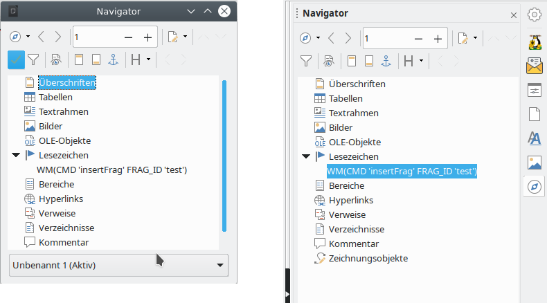

# Einführung

## Der Begriff Textfragment

Ein Textfragment ist ein Teil eines Writer-Dokuments. Ein Textfragment kann beliebig einfach (z.B. nur ein einzelnes Wort) oder komplex (z.B. eine komplette Briefkopfvorlage) sein. Das automatische Zusammensetzen von Textfragmenten aus unterschiedlichen Quellen ist einer der wesentlichen Aspekte des WollMux. Nur so ist es möglich, die stadtweiten Anforderungen (z.B. städtisches Erscheinungsbild) mit den referatsspezifischen (z.B. eigenes Logo) unter einen Hut zu bringen.

Es können auch Absatzformate in eigene Textfragmente ausgelagert werden. So ist es möglich auch die zu verwendenden Schriftarten zentral in einer Datei zu hinterlegen und darauf zu verzichten, diese Informationen in jedem Dokument vorzuhalten und dort warten zu müssen. Dies erlaubt z.B. auch ein zentrales Ändern der zu verwendenden Schrift, ohne alle Vorlagen anpassen zu müssen.

Anmerkung: Der Begriff “Textfragment” wurde gewählt, um einer Verwechslung mit dem Begriff “Textbaustein” vorzubeugen, der vor allem im Zusammenhang mit Texthandbüchern und manueller Auswahl durch den Benutzer verwendet wird.

## Verweise auf Textfragmente und automatisches Ersetzen

Der WollMux durchsucht jedes neu geöffnete Dokument nach speziellen Befehlen, den sog. [Dokumentkommandos](Dokumentkommandos_des_WollMux.md), die unter anderem einzufügende Textfragmente referenzieren können. Findet er einen entsprechenden Befehl, fügt er automatisch das referenzierte Textfragment ein. Dieser Vorgang findet rekursiv statt. Es ist also möglich, dass ein Textfragment auf ein oder mehrere andere Textfragmente verweist, die ebenfalls wieder auf ein oder mehrere Textfragmente verweisen können. Auf diese Weise können komplexe Inhalte aus einzelnen Teilen aufgebaut werden, die aus verschiedenen Quellen stammen können.

## Verwaltung der Textfragmente und Konfiguration der Verweisauflösung

Alle Verweise werden indirekt über eine Tabelle aufgelöst, die in der [Konfigurationsdatei wollmux.conf](Konfigurationsdatei_wollmux_conf.md#textfragmente) spezifiziert wird und Verweisbezeichner auf die konkreten Dateien umsetzt, in denen die Textfragmente gespeichert sind. Ziel dieses Konzepts ist es, bei der Änderung von zentralen Vorgaben zum Erscheinungsbild nur die zentralen Vorlagen anpassen zu müssen. Es sollen insbesondere keine massenhaften Änderungen an Vorlagen in den Referaten erforderlich sein.

Gemäß dem 3-stufigen Konzept können auch benutzerspezifische Anpassungen an Vorlagen durchgeführt werden, ohne dass dazu Kopien zentraler Vorlagen erstellt werden müssen. Zum Beispiel könnte so jeder Benutzer seine eigene Fusszeile verwenden, ohne dafür von jeder Vorlage eine Kopie erstellen und anpassen zu müssen, vor allem aber ohne das Problem, dass der Benutzer Änderungen an den zentralen Vorlagen verpasst.

Die Verwaltung der eigentlichen Fragment-Dateien obliegt den Referaten. Typischerweise würden sie in entsprechenden Verzeichnissen auf Netzlaufwerken gespeichert, der WollMux unterstützt jedoch z.B. auch das Laden über HTTP. Wann und wie geänderte Fragmente dem Benutzer zugänglich gemacht werden und insbesondere auch wann und wie neue stadtweite Fragmente in die Referate übernommen werden bleibt ebenfalls den Referaten überlassen.

Insbesondere ist eine automatische Verteilung über die stadtweite Software-Verteilung bislang nicht vorgesehen. Auch ein automatisches Cachen aller Textfragmente auf dem Benutzerrechner durch den WollMux ist nicht vorgesehen. Die Referate können dies jedoch leicht über ihre normalen Mechanismen zur Dateiverteilung auf Arbeitsplatzrechner selber realisieren.

## Beispiel: Stadtweites Erscheinungsbild, Referatsspezifische Inhalte

Nehmen wir an, es wird stadtweit folgendes Erscheinungsbild für alle externe Kommunikation vorgegeben.

```
|-------|
|Kopf   |
|-------|
|       |
|       |
|-------|
|L| Fuss|
|-------|
```

Dabei ist “Kopf” der Platz für die Kopfdaten (Sachbearbeiter etc.) und “Fuss” der Platz für die Fussdaten (Bankverbindungen etc.). Für ein referatsspezifisches Logo ist der Platz “L” vorgesehen.

Ohne den WollMux müssten die Referate jeweils Kopien dieser zentralen Vorlage erstellen und dort ihr eigenes Logo einbinden. Dies verursacht einen großen Aufwand und macht spätestens dann Probleme, wenn das Erscheinungsbild so geändert wird, dass das Logo rechts zu stehen hat:

```
|-------|
|Kopf   |
|-------|
|       |
|       |
|-------|
|Fuss |L|
|-------|
```

Ohne den WollMux müssten die Referate all ihre vorher erstellten Vorlagen ändern. Mit dem WollMux ist dies einfacher. Er erlaubt es, die Vorlage, die das Layout nach dem städtischen Erscheinungsbild beschreibt, zentral zur Verfügung zu stellen und an den von den Referaten anzupassenden Stellen “Kopf”, “Fuss” und “L” Verweise auf Textfragmente einzubetten. Der WollMux fügt beim Laden der Vorlage die entsprechenden Fragmente ein.

Wichtig ist hier, nochmals zu betonen, dass alle Verweise indirekt über eine Tabelle aufgelöst werden, die einen Verweisbezeichner auf die konkrete Datei umsetzt, in der das Textfragment gespeichert ist. Da die Tabelle gemäß dem überall im WollMux umgesetzten 3-stufigen Konzept vom Referat für die eigenen Benutzer ganz oder teilweise geändert werden kann, ist es kein Problem, dass jedes Referat ein eigenes Logo verwendet und gleichzeitig das Layout aus einer zentralen Datei bezieht, die vom Referat nicht geändert werden muss.

## Umgang mit Textfragmenten und Vorlagen

Der WollMux kennt keinen Unterschied zwischen Textfragmenten und Vorlagen, da jede Vorlage durch ein Textfragment im WollMux repräsentiert wird. Die folgenden Abschnitte gelten also sowohl für Textfragmente als auch für Vorlagen:

### Übernahme von Absatzformaten beim Einfügen von Textfragmenten

Wenn Sie ein Textfragment in eine Vorlage einfügen lassen (beispielsweise mit dem Dokumentkommando [insertFrag](Dokumentkommandos_des_WollMux.md#das-kommando-insertfrag), so gibt es zwei verschiedene Möglichkeiten für die Übernahme der dort definierten Absatzformate:

#### Absatzformate werden aus der Vorlage übernommen

Besteht das einzufügende Textfragment aus genau einem Absatz, so wird das Absatzformat des einfügenden Textfragments, welches meistens eine Vorlage ist, verwendet. Das folgende Bild verdeutlicht dieses Verhalten:


Auf der linken Seite sehen Sie die Vorlage, die den Einfügepunkt enthält. An dieser Stelle soll der Inhalt des rechten Textfragments eingefügt werden. Das rechte Textfragment besitzt das Absatzformat “Standard”, in der Vorlage ist jedoch am Einfügepunkt das Absatzformat “Bescheidtext” definiert.

Da das Textfragment auf der rechten Seite aus genau einem Absatz besteht, wird der Inhalt nach dem Einfügen im Absatzformat “Bescheidtext” der Vorlage dargestellt.

Auf diese Weise können Sie kleine Textfragmente erstellen, um deren Formatierung Sie sich zum Zeitpunkt der Erstellung noch nicht kümmern brauchen. Es kommt bei diesen Textfragmenten nur auf den Inhalt an. Erst beim Einfügen des Textfragments in eine Vorlage kommt die Formatierung ins Spiel. Sie können in der Vorlage frei definieren, in welchem Absatzformat das eingefügte Textfragment später erscheint.

#### Absatzformate werden aus dem einzufügenden Textfragment übernommen

Enthält das einzufügende Textfragment mindestens drei Absätze, von denen der erste und der letzte Absatz keinen Inhalt besitzt, so werden die Absatzformate des einzufügenden Textfragments übernommen. Nach dem Einfügen werden die beiden (ungewollten) leeren Absätze entfernt. Das folgende Bild verdeutlicht dieses Verhalten:


Die Vorlage auf der linken Seite enthält den Einfügepunkt "&lt;Hauptabteilung&gt;" an dem der Inhalt des rechten Textfragments eingefügt werden soll. Für den Einfügepunkt ist das Absatzformat “Standard” gesetzt, für das einzufügende Textfragment das Absatzformat “Hauptabteilung\_Fachbereich”.

Nach dem Einfügen des Textfragments in die Vorlage, befindet sich der eingefügte Inhalt im Absatzformat “Hauptabteilung\_Fachbereich”. Die beiden leeren Absätze zum Beginn und Ende des Textfragments werden nach dem Einsetzen entfernt, so dass nur noch der eigentlich gewollte Inhalt übrig bleibt.

Auf diese Weise können Sie vor-formatierte Inhalte in Ihre Vorlagen einfügen. Im Gegensatz zum vorhergehenden Fall, können vor-formatierte Inhalte auch mehr als einen Absatz umfassen. Wichtig ist dabei nur, dass der Inhalt in leere Absätze zum Beginn und zum Ende eingeschlossen ist.

#### Wichtige Hinweise

* Beim Einfügen von Textfragmenten werden grundsätzlich der erste und/oder der letzte Absatz entfernt, wenn sie leer sind. Deshalb sollte ein Textfragment immer nach einem der vorgenannten Schemata aufgebaut sein, d.h. entweder genau ein nicht-leerer Absatz oder Inhalt umschlossen von leeren Absätzen.
* Ein leerer letzter Absatz wird auch entfernt, wenn der erste Absatz nicht leer ist.
* Ein Absatz, der nur Textmarken enthält wird als leer betrachtet. Damit er erhalten bleibt muss mindestens ein Zeichen (z.B. Leerzeichen) vorhanden sein.
* Ist eine Tabelle der erste Inhalt eines Textfragments, so *muss* ihr ein leerer Absatz vorangestellt werden. Für anderer Fälle wird das korrekte Einfügen nicht garantiert und kann sich mit neuen WollMux-Versionen ändern.
* Ist eine Tabelle der letzte Inhalt eines Textfragments, so *muss* ihr ein leerer Absatz folgen. Für anderer Fälle wird das korrekte Einfügen nicht garantiert und kann sich mit neuen WollMux-Versionen ändern.

### Verhalten der Dateiendungen .odt und .ott

Für das Briefkopfsystem macht es prinzipiell keinen Unterschied, ob sie das Dokument als “Dokument” (.odt) oder als “Vorlage” (.ott) abspeichern. Wenn Sie das Dokument oder Textfragment über die WollMuxBar öffnen, so öffnet der WollMux das Textfragment immer in dem Modus "**als Vorlage**". D.h. es wird ein neues Dokument mit dem Titel “UnbenanntX” (X ist eine Zahl) erstellt und die in der Vorlage enthaltenen **Dokumentkommandos werden sofort interpretiert**.

Öffnen Sie eine Vorlage über das Dateisystem oder über den Browser so wird das Dokument in dem zur Endung passenen Modus geöffnet. D.h. lautet die Endung des Dokuments ".odt", so wird das Dokument "**als Dokument**" direkt zum Bearbeiten geöffnet, die enthaltenen **WollMux-Kommandos werden dabei nicht interpretiert**. Lautet die Endung ".ott", so wird das Dokument wie bereits gehabt “als Vorlage” geöffnet.

## Dokumentkommandos in Textfragmenten verwenden

> **INFO** Dokumentkommandos werden im Folgenden auch manchmal WollMux-Kommandos genannt.

### Dokumentkommandos in Dokumente einbinden

Am Schritt-für-Schritt Beispiel wird hier gezeigt, wie [WollMux-Kommandos](Dokumentkommandos_des_WollMux.md) in eigene Dokumente oder Vorlagen eingebunden werden:


An die Position zwischen den eckigen Klammern "\[\]" soll im Text das WollMux-Kommando “insertFrag” eingefügt werden. Wir positionieren unseren Cursor in die Mitte der beiden Klammern.

Da WollMux-Kommandos benannte Bookmarks (oder dt. “Textmarken”) sind, können die Kommandos direkt mit “Einfügen&rarr;Textmarke” erzeugt werden:


Es erscheint ein kleiner Dialog zur Erzeugung eines Bookmarks. In das Textfeld muss nun das gewünscht WM-Kommando “WM(CMD 'insertFrag' FRAG\_ID 'test\_a')” eingetragen werden. Damit das Kommando erfolgreich ausgeführt werden kann, muss das referenzierte Textfragment test\_a [erstellt und registriert](#umgang-mit-textfragmenten-und-vorlagen) werden.


Fertig! Das Kommando ist in das Dokument eingebettet. Wir können das Dokument unter einem beliebigen Namen abspeichern.

### Zwischen WollMux-Kommandos navigieren, Kommandos bearbeiten und löschen

Da WollMux-Kommandos in Bookmarks abgelegt sind, und alle Bookmarks standardmässig unsichtbar sind, hier eine Beschreibung, wie man zwischen den WollMux-Kommandos und dem normalen Text navigieren kann.

Angenommen der Cursor steht auf dem "." am Ende des Satzes. Wir möchten nun wissen:

* welche WollMux-Kommandos überhaupt im Dokument sind,
* wie man zu unserem eben erstellten Kommando kommt,
* wie man ein WollMux-Kommando nachträglich bearbeitet,
* und wie man ein WollMux-Kommando wieder entfernt.


Ein Rechts-Klick auf den String “Seite 1/1” in der Statuszeile links unten gibt uns eine Übersicht über alle vorhandenen Bookmarks. Da wir keine weiteren Bookmarks definiert haben, erscheint hier im Beispiel nur unser eben erzeugtes WollMux-Kommando. Der Links-Klick auf das Kommando versetzt den Cursor an die Stelle, an der unser Befehl eingefügt wurde.

Es gibt eine weitere Möglichkeit, schnell alle Bookmarks und damit alle WollMux-Kommandos angezeigt zu bekommen: Der “Navigator” zeigt u.A. auch alle definierten Bookmarks an. Man erreicht ihn über “Bearbeiten&rarr;Navigator”, die Sidebar oder schneller über F5:



* Navigieren: Im Navigator werden alle Bookmarks und WollMux-Kommandos angezeigt. Bei einem Doppelklick auf einen entsprechenden Eintrag wird der Cursor auf das Kommando gesetzt.
* Bearbeiten: Rechts-Klick auf den Eintrag im Navigator, dann “Textmarke&rarr;umbenennen” und einen neuen Kommandotext eingeben.
* Löschen: Durch Drücken der “Entf”- oder “Del”-Taste wird ein im Navigator markierter Eintrag gelöscht.

### WollMux-Kommandos ausführen und testen

1. Dokument oder Vorlage speichern und schließen.
2. Vorlage neu öffnen. Der WollMux wird automatisch aktiv und führt alle enthaltenen WollMux-Kommandos aus.

<Kategorie:Office_Vorlagenumsteller_Handbuch>

<Category:AG-Office> <Category:Eierlegender_WollMux>
<Category:Handbuch_des_WollMux>
