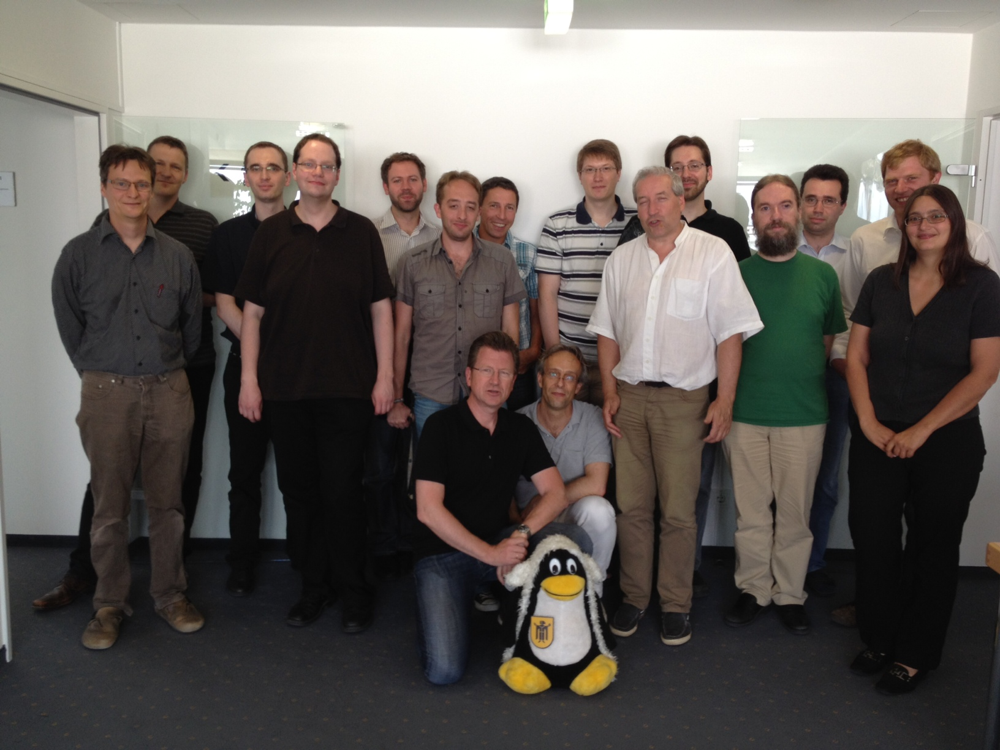

Ort
---

LiMux Projekt

Sonnenstraße 25

80331 München

**Vielen Dank an das Limux Projekt und seinem Team für die
Unterstützung!!!**

Termin
------

06.07.2012 13:45 - 19:30

Veranstalter
------------

Freies Office Deutschland e.V.
([<http://www.frodev.org>](http://www.frodev.org))

Ansprechpartner/ Organisation
-----------------------------

Harald Kagerer (<h.kagerer@frodev.org>)

Teilnehmer
----------

[Teilnehmerliste ](Media:images/120706_WMWS_TNListe.png)

Ziel
----

Das halbtägige Arbeitstreffen bietet den am WollMux Projekt
Interessierten Raum zur Klärung von offenen Fragen. Ziel ist es im
Besonderen gemeinsam Grundlagen und Leitlinien für die weitere
Fortentwicklung der Community und des Projekts zu finden.

Verlauf
-------

### Block 1: WollMux in der Praxis

#### Eröffnung

##### Grußworte

-   Limux Projektleiter Peter Hofmann (Landeshauptstadt München)
-   Vorsitzender des Freien Office Deutschland e.V. Thomas Krumbein

##### Vorstellungsrunde und Erfahrungsaustausch

Die TeilnehmerInnen kommen aus den Bereichen:

-   Anwendung
-   Entwicklung
-   Beratung
-   Marketing
-   Management
-   OpenSource Community Förderung

#### WollMux-Seriendruck

##### Vortrag/ Diskussion

Christoph Lutz (CIB) gibt in einem Vortrag einen Überblick über den Ad
Hoc Seriendruck in MS-Office und Libre Office (Nativ und mit WollMux
Unterstützung).

Danach geht er auf die Details der aktuellen WollMux
Seriendruckimplementierung und ihren Problemen ein.

Besonders problematisch beim “OOo Based Mail Merge Ansatz”:

1.  Ausführung atomar --&gt; kann nicht abgebrochen werden
2.  Ein-/Ausblendungen eines WollMux-Formulars funktionieren nicht
3.  Deutliche Performance-Probleme bei Datensatzanzahlen &gt; 500

Bei Druck in PDF Gesamtdokument:

1.  Abstürze durch Memory Leak in OOo (Bug Patch bekannt und in
    LibO integriert)
2.  Keine “Nächste Datensatz” Funktion

Ein möglicher, viel versprechender Lösungsansatz für den Seriendruck
könnte die Integration von Third Party Modulen der CIB sein. Der
vorgestellte Prototyp beeindruckt durch seine hohe Performance.

**[ Download der
Präsentation](http://www.wollmux.net/wiki/images/e/ea/StatusWollMuxSeriendruck.pdf)**

Die Diskussion ergibt:

-   Die beim CIB Modul nötige Konvertierung von ODF nach RTF im Workflow
    könnte ein Risiko sein.
-   Die Verwendung auch proprietärer Ergänzungen in
    WollMux-Anwendungsszenarien ist sinnvoll und ist zur Verbreitung des
    WollMux im professionellen Umfeld gerechtfertigt.
-   Eine (als Open Source implementierte) Schnittstelle (API) im WollMux
    für proprietäre Module zu implementieren wird begrüsst.
-   Diese API kann auch sehr gewinnbringend bei der Landeshauptstadt
    München (LHM) für Fachanwendungen genutzt werden.

##### ToDo - Nächste Schritte

-   Andor Ertsey \[LHM\] und Christoph Lutz \[CIB\] nehmen miteinander
    Kontakt zur weiteren Planung/Abstimmung dieser API auf.

#### Liste “Most Annoying WollMux-Issues” und Lösungsansätze

Unter
[<http://code.google.com/p/wollmux/issues/list>](http://code.google.com/p/wollmux/issues/list)
ist aktuell der Issuetracker des WollMux erreichbar.

Die dort erfassten Issues werden bisher eher informell und
unstrukturiert bearbeitet. Um hier Änderungen zur erreichen ist es
nötig, neben der Definition und der Organisation von
Bearbeitungsverfahren, Schritte umzusetzen, die es ermöglichen, dass es
für Entwickler interessant wird Incidents und Featurerequests
umzusetzen.

### Block 2: Community/ Kommunikation

#### Marketing

##### Zielgruppenpotential

Als Zielgruppe für den WollMux sind aktuell Unternehmen und die
öffentliche Verwaltung zu betrachten. Diese sollten durch geeignete
Maßnahmen dazu motiviert werden, die Behebung kritischer Fehler und die
Implementierung von neuen Features zu unterstützen. Durch eine
Konfigurationsvereinfachung mit Reduktion auf einzelne, für OOo/LibO
AnwenderInnen direkt attraktive Funktionalitäten könnte mit diesem
“WollMux Light” die Zielgruppe auch auf eine breite Basis mit
Privatanwendern ausgebaut werden, was als sehr wichtig zur Verbreiterung
der Anwenderbasis betrachtet wird.

##### Namen und Logo

###### Rechtestatus auf den “Markennamen”

Unklar ist der Rechtestatus auf den Namen “WollMux”. Hier sollte
Klarheit geschaffen werden. Das aktuelle Beispiel der Namensrechte bei
OOo/LibO zeigt die Bedeutung, die hier Rechssicherheit gibt.

Vorschlag von Thomas Krumbein: Der Verein FrODeV übernimmt in seiner
gemeinnützigen Eigenschaft die Markenrechte auf den Namen WollMux.

###### Änderung des Logos

Es besteht Einstimmigkeit, dass das bestehende Logo nicht beibehalten
werden soll. Ein neuer Logoentwurf soll über einen vom FrODeV
organisierten Logowettbewerb gefunden werden.

###### Änderung des Applikations/ Projektnamens

Folgende Optionen kommen in Betracht:

1.  Beibehalten von “WollMux” + eindeutige Funktionsbeschreibung + neues
    Logo
2.  Neuer Namen + Logo mit eindeutigen Funktionsbezug und größerer
    internationaler Kompatibilität

Ein Meinungsbild der TeilnehmerInnen ergibt:

Option 1: 9 Stimmen

Option 2: 6 Stimmen

Enthaltung: 3 Stimmen

##### ToDo/Nächste Schritte

-   Prüfung des Namensrechtstatus für “WollMux” bei der LHM (Andor
    Ertsey \[LHM\])
-   Organisation eines Logowettbewerbs (Harald Kagerer \[FrODeV\])

#### Community (Organisation)

Es wird folgende zukünftige Organisation für die WollMux Community
vereinbart:

1.  Den WollMux und seine Community betreffenden Entscheidungen werden
    über die
    WollMux-Mailingliste (http://joinup.ec.europa.eu/mailman/listinfo/wollmux-general)
    öffentlich vorgeschlagen, diskutiert und nach einfacher
    Mehrheit abgestimmt.
2.  Stimmberechtigt sind alle Communitymitglieder mit dem
    Status WollMux-Committer. WollMux-Commiter kann jede Person werden,
    die unabhängig von der Art des Beitrags zur Verbesserung und
    Förderung des WollMux beiträgt.
3.  Den formalen Status des WollMux-Committer erlangt man, indem man
    sich auf der WollMux Mailingliste persönlich vorstellt und seinen
    geplanten Beitrag zur WollMux Community beschreibt.
4.  Im WollMux Wiki (http://www.wollmux.net/wiki/) wird eine Liste aller
    Committer geführt.
5.  Es gibt zwei Ansprechpersonen (je eine für den Bereich Technik und
    eine für den Bereich Organisation), die die WollMux Community nach
    außen hin vertreten, aber keine besonderen anderen Rechte gegenüber
    den anderen Committern haben.
6.  Für den Bereich Technik wird Daniel Benkmann und für den Bereich
    Organisation Harald Kagerer als erste Ansprechspersonen bestimmt.
7.  In beratender, moderierender und begleitender Funktion wird ein
    Community-Gremium angestrebt. Es soll aus einem Vertreter/ einer
    Vertreterin der Community (Ansprechsperson), der Landeshauptstadt
    München (LHM) und des Freien Office Deutschlands e.V.
    (FrODEV) bestehen.

### Block 3: Prozesse und Verfahren

#### Zukünftiges Releasekonzept

1.  Unter <http://www.wollmux.net/daily/?C=M;O=D> werden “Daily Builds”
    zur Prüfung von neuen Features zur Verfügung gestellt.
2.  Release der LHM werden als besonders stabile und getestete Long Term
    Releases veröffentlicht.
3.  WollMux-Community Releases werden nach Abstimmung durch die
    WollMux-Commiter featuregesteuert zur Verfügung gestellt.

#### Qualitätssicherung für WollMux Community Releases

Als Basis für die Qualitätssicherung der WollMux Community Releases wird
angestrebt, eine Community getragene Testkonzeption zu planen und
umzusetzen. Vorschläge werden von Harald Kagerer vorbereitet.

#### Repository

Das bestehende Repository soll von Mercurial auf GIT umgestellt werden.
Diese Umstellung erfolgt durch Mitarbeiter der Landeshauptstadt München.
