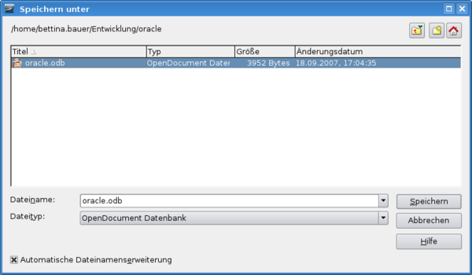

JDBC-Treiber downloaden
=======================

Für den Zugriff auf eine Datenbank wird ein jdbc-Treiber benötigt.

[Download Oracle JDBC-Treiber.](http://www.oracle.com/technology/software/tech/java/sqlj_jdbc/index.html)

[<http://dba.openoffice.org/FAQ/specific.html#oracle>](http://dba.openoffice.org/FAQ/specific.html#oracle)

Passend zur anzusteuernden Oracle-Datenbank bzw. zum verwendeten JAVA
ist der passende JDBC-Treiber zu verwenden: ojdbc5.jar mit 11g und JDK
1.5, ojdbc6.jar mit 11g und JDK 1.6, ojdbc12.jar mit 10g und JDK
1.2+1.3, ojdbc14.jar mit 10g und JDK 1.4 + 1.5.

Der Treiber sollte <u>nicht</u> auf einem Netzlaufwerk, sondern lokal
abgelegt werden.

JDBC-Treiber einbinden
======================

Systemweit
----------

Der JDBC-Treiber kann systemweit über eine referatseigene OpenOffice.org
Vorkonfiguration eingebunden werden.

Eintrag *DataAccess.xcu*

```xml
<node oor:name="JDBC">
   <node oor:name="DriverClassPaths">
     <node oor:name="oracle.jdbc.driver.OracleDriver" oor:op="replace">
       <prop oor:name="Path">
         <value>file:///<Pfad der.jar Datei>/<Name.jar></value>
       </prop>
     </node>
   </node>
 </node>
```

> **INFO** Für einen generellen Funktionstest kann die
> *DataAccess.xcu* auch im eigenen Profil erzeugt werden (im Verzeichnis
> `~/.openoffice.org/3/user/registry/data/org/openoffice/Office)`.

Benutzerweit
------------

Für einen einzelnen Benutzer einbinden:

-   OOo Writer &rarr; Extras &rarr; Optionen... &rarr; OpenOffice.org
    &rarr; Java &rarr; Button "Class Path" &rarr; Button "Archive
    hinzufügen..." &rarr; entsprechende .jar Datei bzw. .zip Datei des
    JDBC-Treibers auswählen &rarr; Button "Öffnen" &rarr; Fenster "Class
    Path" &rarr; Button "OK" &rarr; Fenster
    "Optionen-OpenOffice.org-Java" &rarr; Button "OK"

OOo Base aufrufen
=================

Basisclient
-----------

Über die Konsole

-   K-Menü &rarr; Systemadministration &rarr; Konsole (Terminal) &rarr;
    Eingabe: *soffice -base* oder *sbase*

Windows
-------

Über das Windows Startmenü\
\*Windows Startmenü &rarr; Programme &rarr; OpenOffice.org &rarr;
OpenOffice.org Base

Über die Windows Eingabeaufforderung\
\*Eingabeaufforderung &rarr; Eingabe: *&lt;OpenOffice.org
Installationspfad&gt;\\program\\sbase*

Einmaliges erstellen der benötigten OOo-Base Datenbank
======================================================

OOo\_Base\_aufrufen
-------------------

[ OOo Base aufrufen](#OOo_Base_aufrufen)

Datenbank auswählen
-------------------


Datenbankverbindung einrichten
------------------------------


Über den Button "Klasse testen" kann die entsprechende
JDBC-Treiberklasse getestet werden.

Benutzer-Authentifizierung einrichten
-------------------------------------


Verbindung zur Datenbank testen
-------------------------------

Schritt **3. Benutzer-Authentifizierung einrichten**&rarr;Button "Verbindungstest"


Foldende Meldung kommt, wenn der Verbindungstest erfolgreich war.


Fertig stellen und fortfahren
-----------------------------


OOo Datenquelle speichern
-------------------------



OOo Base Datenbank bereitstellen
================================

OOo Base Datenbank auf dem Webserver bereitstellen
--------------------------------------------------

Damit die OOo Base Datenbank von mehreren Benutzern benutzt werden kann,
ist es zu empfehlen die .odb Datei auf den Webserver zu legen.

OOo Base Datenbank über den WollMux registrieren
------------------------------------------------

Damit eine OOo Base Datenbank verwendet werden kann, muss diese über
einen **Registriere-Abschnitt** registriert werden. Ein Datenquelle kann
z.B. in der *referat.conf* registriert werden.

Beispiel mit der vorher erstellten oracle.odb:

```
Datenquellen(
  Registriere(
   NAME "MeineOOoDatenquelle"           # <Name_der_OOo_Datenquelle>
   URL "http://<Pfad>/oracle.odb"     # <URL_der_odb_Datei>
   REFRESH "true"                       # <true_oder_false>
  )
)
```

Weiter Informationen:

* [Registriere Datenquelle](Konfigurationsdatei_wollmux_conf.md#registriere)
* [Einrichten einer OOo Datenquelle](#einrichten-einer-ooo-datenquelle)
* [Datenquellen](Konfigurationsdatei_wollmux_conf.md#datenquellen)

Einrichten einer OOo Datenquelle
================================

Für den Zugiff auf eine externe Datenbank mit dem WollMux, muss in der
**referat.conf** eine OOo Datenquelle definiert werden, die auf die
registrierte OOo Base Datenbank verweist. Ebenso kann eine eigene .conf
Konfigurationsdatei erstellt werden, die über ein %include "<Name>.conf"
Eintrag in der referat.conf eingebunden wird.

Beispiel mit DB-Schema zum Dialog "Empfänger auswählen" anbinden:

```
Datenquellen(
  Datenquelle(
    NAME "MeineOOoDatenquelle"                       # <Name_der_WollMux_Datenquelle>
    TYPE "ooo"
    SOURCE "oracle"                                  # <Name_der_in_OOo_registrierten_Datenquelle
     TABLE "<Name_der_Tabelle_oder_Sicht>"
    USER "`<Benutzername / User>"
    PASSWORD "<Passwort>"
    SQL_SYNTAX "oracle"                              # <optional Syntaxbezeichner, unterstützt: ansi, oracle, mysql >
    Schema("<DB-Spalte mit Namen>" "<DB-Spalte mit Straße>" "<DB-Spalte mit PLZ>" "<DB-Spalte mit Ort>")
    Schluessel("<DB-Spalte mit Namen>")
    # Wenn ein Schema()-Abschnitt angegeben ist, muss auch ein Schluessel-Abschnitt angegeben werden.
  )
)
```

siehe [ Einrichten einer OOo Datenquelle](Konfigurationsdatei_wollmux.conf#TYPE_.22ooo.22)

Dialog "Empfänger auswählen" anbinden
=====================================

Der Dialog "Empfänger auswählen" kann über die Konfigurationsdatei
**adressauswahl-referat.conf** z.B durch einen extra Reiter, erweitert
werden. Als Beispiel dienen die Spielwarenläden in der
adressauswahl-referat.conf, dessen Eintrag kopiert und angepasst werden
kann. Die Datei adressauswahl-referat.conf wird durch das [xupdate Script](Standardkonfiguration_des_WollMux_installieren_und_pflegen#Liste_der_nicht_durch_xupdate_.C3.BCberschriebenen_Dateien)
nicht überschrieben.

Beispielanpassung für Spielwarenläden:

```
MeineOOoDatenquelle(       # Name der Datenquelle mit dem Typ ooo
       TITLE "<Titel>"
       CLOSEACTION "back"
       TIP "Einen Namen als Empfänger auswählen"
       
       Intro(
         (LABEL "Sie können nach Namensbestandteilen oder Straßennamen suchen" TYPE "label" )
         (TYPE "glue")
       )#Intro
    
       Suche(
         (TYPE "textfield" ID "suchanfrage" ACTION "search" AUTOFILL "")
         (LABEL "Suchen"  TYPE "button" HOTKEY "S"  ACTION "search")
       )#Suche
       
       Suchstrategie(
         MeineOOoDatenquelle()
         MeineOOoDatenquelle(<DB-Spalte mit Namen> "${suchanfrage1}*" )   # Die DB-Spalten müssen in der Datenquellen-Definition bei "Schema" eingetragen sein
         MeineOOoDatenquelle(<DB-Spalte mit Namen> "${suchanfrage1} ${suchanfrage2}" ) 
         MeineOOoDatenquelle(<DB-Spalte mit Namen> "${suchanfrage1} ${suchanfrage2} ${suchanfrage3}*" ) 
         MeineOOoDatenquelle(<DB-Ppalte mit PLZ> "${suchanfrage1}" ) 
         MeineOOoDatenquelle(<DB-Spalte mit Namen> "${suchanfrage1} ${suchanfrage2} ${suchanfrage3}" ) 
         MeineOOoDatenquelle(<DB-Spalte mit Namen> "${suchanfrage1} ${suchanfrage2}" ) 
         MeineOOoDatenquelle(<DB-Spalte mit Namen> "${suchanfrage1}" ) 
       )#Suchstrategie
       
       Spaltenumsetzung(
         EmpfaengerZeile1(VALUE("<DB-Spalte mit Namen>"))
         EmpfaengerZeile2(VALUE("<DB-Spalte mit Straße>"))
         EmpfaengerZeile3(CAT(VALUE("DB-Spalte mit PLZ>") " " VALUE("<DB-Spalte mit Ort>")))
       )
    
       Suchergebnis(
         (LABEL "Suchergebnis" TYPE "label")
         (TYPE "listbox" ID "suchergebnis" LINES "10" ACTION "select" 
           DISPLAY "${EmpfaengerZeile1}") #Bezieht sich schon auf Ergebnis nach Spaltenumsetzung
       )#Suchergebnis
    
       Vorschau( #Bezieht sich schon auf Ergebnis nach Spaltenumsetzung
         (LABEL "Vorschau" TYPE "label")
         (LABEL "Empfänger Zeile 1" DB_SPALTE "EmpfaengerZeile1" TYPE "textfield" READONLY "true")
         (LABEL "Empfänger Zeile 2" DB_SPALTE "EmpfaengerZeile2" TYPE "textfield" READONLY "true")
         (LABEL "Empfänger Zeile 3" DB_SPALTE "EmpfaengerZeile3" TYPE "textfield" READONLY "true")
         (TYPE "glue")
       )#Vorschau
      
       Fussbereich(
         (LABEL "Abbrechen"  TYPE "button" HOTKEY "A"  ACTION "back")
         (TYPE "glue")
         (LABEL "Auswählen"  TYPE "button" HOTKEY "S"  ACTION "select")
       )#Fussbereich
) #MeineOOoDatenquelle
```

Weitere Informationen:

* [Adressauswahl-Dialog](Standardkonfiguration_des_WollMux.md#adressauswahl-dialog)
* [Funktionsdialoge](Konfigurationsdatei_wollmux_conf.md#funktionsdialoge)
* [wollmux:FunctionDialog](Schnittstellen_des_WollMux_fuer_Experten.md#wollmuxfunctiondialog)
* [Fragen rund um Datenquellen](Fragen_rund_um_Datenquellen.md)
* [Handbuch des WollMux](Handbuch_des_WollMux.md)
* [Eierlegender WollMux](../Eierlegender_WollMux.md)
