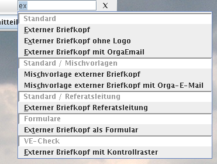

Die WollMuxBar ist eine Leiste, die über Menüs und Buttons Zugriff auf
Vorlagen und WollMux-Funktionen bietet.

<!-- toc -->

Installation
------------

Die WollMuxBar wird ausgeliefert als JAR-Datei *WollMuxBar.jar*. Diese
JAR-Datei kann an einen beliebigen Ort kopiert werden. Weiteres erfahren
Sie auf den Seiten [WollMux downloaden](../Hauptseite.md)
und [WollMux installieren](../Getting_Started.md).

Konfiguration
-------------

Die WollMuxBar liest ihre Konfiguration aus 2 Dateien. Zuerst liest sie
die [Konfigurationsdatei
wollmux.conf](Konfigurationsdatei_wollmux.conf), danach liest
sie die Datei `$HOME/.wollmux/wollmuxbar.conf`, wobei `$HOME` unter
Windows dem Profilverzeichnis des Benutzers entspricht.
Konfigurationseinstellungen aus der `wollmuxbar.conf` haben Vorrang.

In die Datei `wollmuxbar.conf` schreibt die WollMuxBar auch die
Änderungen, die mittels
[Menü-Manager](#menü-manager) und
[Optionen-Dialog](#optionen-dialog) getätigt
werden.

Über die [Konfigurationsoption *ALLOW\_USER\_CONFIG*](Konfigurationsdatei_wollmux_conf.md#die-option-allowuserconfig)
der Datei `wollmux.conf` kann die Auswertung der Datei `wollmuxbar.conf`
bei Bedarf zentral unterbunden werden. In diesem Fall stehen dann auch
die beiden Funktionen
[Menü-Manager](#menü-manager) und
[Optionen-Dialog](#optionen-dialog) nicht mehr zur
Verfügung.

Aufruf
------

### Linux

Wenn Sie das auf [WollMux downloaden](../Hauptseite.md) zur
Verfügung gestellte Skript *wollmuxbar* in den Pfad Ihres Systems
aufgenommen haben, so lässt sich die WollMuxBar einfach als *wollmuxbar*
bzw. (mit vollständigem Pfad z.B.) */usr/bin/wollmuxbar* aufrufen.

### Windows

Der Aufruf erfolgt mittels

`"<vollständiger Pfad zur Java-Installation>\javaw.exe" -jar "<vollstdg. Pfad zum WollMuxBar-Verzeichnis>\WollMuxBar.jar"`

Hinweis: Beachten Sie die Verwendung von `javaW.exe` statt `java.exe`. Dies verhindert, dass ein "DOS-Fenster" aufgeht.

#### Mehrere Javaversionen auf einem PC

Wenn mehrere Javaversionen auf einem PC benötigt werden, kann über ein
Skript die Javaversion zum Starten der WollMuxBar festgelegt werden. Die
Festlegung gilt nicht für das Plugin WollMux.uno.pkg

Beispiel:

``` bash
@echo off
set "JAR_FILE=<Pfad>\WollMuxBar.jar"
 set JAVA_HOME=C:\Programme\Java\<Java_Version>
set PATH=%JAVA_HOME%\bin;%PATH%
 start "WollMuxBar" javaw -jar "%JAR_FILE%" %1 %2 %3 %4 %5 %6 %7 %8
```

#### wollmuxbar.exe

Alternativ zum Starten der WollMuxBar mit javaw.exe kann die
mitgelieferte Datei wollmuxbar.exe ausgeführt werden. Dafür muss sich
diese Datei im selben Verzeichnis wie die Datei WollMuxBar.jar befinden.

Die wollmuxbar.exe sucht beim Ausführen automatisch nach einer auf dem
System vorhandenen Java-Installation an den folgenden Orten in der
angegebenen Reihenfolge:

1.  im Unterverzeichnis *jre* des Verzeichnisses, in dem sich die
    wollmuxbar.exe befindet
2.  in dem Verzeichnis, das im Wert "JavaHome" des
    Registrierungsschlüssels "HKEY\_CURRENT\_USER\\Software\\WollMux"
    angegeben ist
3.  in dem Verzeichnis, das im Wert "JavaHome" des
    Registrierungsschlüssels "HKEY\_LOCAL\_MACHINE\\Software\\WollMux"
    angegeben ist
4.  in dem Verzeichnis, das in der JAVA\_HOME Umgebungsvariable
    angegeben ist
5.  in dem Verzeichnis, das laut der von Java selbst angelegten
    Registrierungsschlüssel die aktuelle Java-Version auf dem System
    beherbergt

Wenn Sie also selbst festlegen wollen, welche Java-Installation für das
Ausführen der WollMuxBar verwendet wird, tun Sie dies am besten über den
Wert "JavaHome" im entsprechenden WollMux-Registrierungsschlüssel.

Der wollmuxbar.exe können beim Aufruf alle unten beschriebenen
[Kommandozeilen-Argumente](#kommandozeilen-argumente)
übergeben werden.

### LibreOffice

Der WollMux und die WollMuxBar können grundsätzlich auch zusammen mit
[LibreOffice](http://www.libreoffice.org) verwendet werden.
Dazu muss allerdings der ClassLoader der WollMuxBar angepasst werden, da
dieser standardmäßig die UNO-Installation von LibreOffice nicht findet.

Es gibt zwei Methoden um der WollMuxBar beim Start mitzuteilen, wo
LibreOffice installiert ist:

-   Beim Aufruf von JAVA kann die Systemvariable
    com.sun.star.lib.loader.unopath über den Parameter -D
    übergeben werden.

`$ java -Dcom.sun.star.lib.loader.unopath=/opt/libreoffice/program WollMuxBar.jar`

-   Vor dem Start wird die Envionmentvariable UNO\_PATH gesetzt

`$ export UNO_PATH=/opt/libreoffice/program`

Weitere Informationen darüber, wie der ClassLoader die UNO-Installation
sucht, befinden sich
[hier](http://wiki.services.openoffice.org/wiki/Documentation/DevGuide/ProUNO/Java/Transparent_Use_of_Office_UNO_Components#Finding_a_UNO_Installation).

Kommandozeilen-Argumente
------------------------

Der WollMuxBar können diverse Kommandozeilenargumente übergeben werden.

### --mm

Ruft nach dem Start der WollMuxBar sofort den
[Menü-Manager](#menü-manager) auf. So kann man
den Menü-Manager auch dann aufrufen, wenn für ihn kein Menüpunkt in der
WollMuxBar eingerichtet wurde oder sogar wenn noch gar keine
WollMuxBar-Konfiguration vorhanden ist.

### --quickstarter

Lässt die WollMuxBar als OOo-Quickstarter agieren, d.h. OOo bleibt
permanent im Hintergrund im Speicher, auch wenn das letzte Fenster
geschlossen wurde.

### --minimize

Startet die WollMuxBar im
[Minimize-Modus](Konfigurationsdatei_wollmux_conf.md#mode).

### --topbar

Startet die WollMuxBar im
[AlwaysOnTop-Modus](Konfigurationsdatei_wollmux_conf.md#mode).

### --normalwindow

Startet die WollMuxBar im
[Window-Modus](Konfigurationsdatei_wollmux_conf.md#mode).

### --load

Der folgende Aufruf

`wollmuxbar --load <Datei>`

öffnet &lt;Datei&gt; als Vorlage (d.h. es wird ein neues "UnbenanntX" Dokument
erstellt), unabhängig davon, ob es sich um eine ODT/DOC oder OTT/DOT
Datei handelt. Besonderheit hierbei ist, dass das Popup zum Ausfüllen
von Formularfeldern (nicht zur Verwechseln mit der Formular-GUI des
WollMux!) hier nicht erscheint. Das Verhalten ist also so als wäre die
Vorlage aus der WollMuxBar heraus geöffnet worden.

#### Verknüpfen der Datei-Erweiterung .ott im Konqueror mit wollmuxbar --load

Damit bei Doppelklick auf eine OTT-Datei im Konqueror diese mit
wollmuxbar --load gestartet wird (zum Unterdrücken des
Standard-Formular-Popups) sind folgende Schritte durchzuführen:

1.  Konqueror öffnen
2.  Einstellungen/Konqueror einrichten
3.  Fenster auf Vollbild maximieren
4.  In der vertikalen Leiste links "Dateizuordnungen" auswählen.
5.  In der Baum-Ansicht rechts "application" expandieren
6.  "vnd.oasis.opendocument.text-template" auswählen
7.  Unter "Rangfolge der zugeordneten Anwendungsprogramme" "OpenOffice
    Writer" selektieren und den "Entfernen" Knopf drücken
8.  Mit "OK" den Einstellungen-Dialog beenden.
9.  Jetzt auf eine OTT-Datei doppelklicken
10. Es erscheint die Abfrage mit welcher Anwendung die Datei geöffnet
    werden soll.
11. wollmuxbar --load eingeben
12. Checkbox "Programm diesem Datentyp fest zuordnen" ankreuzen
13. OK

#### Verknüpfen der Datei-Erweiterung .ott im Windows Explorer mit wollmuxbar --load

Damit bei Doppelklick auf eine OTT-Datei im Windows Explorer diese mit
wollmuxbar --load gestartet wird (zum Unterdrücken des
Standard-Formular-Popups) sind folgende Schritte durchzuführen:

1.  Explorer öffnen
2.  Extras/Ordneroptionen/Reiter "Dateitypen"
3.  In der Liste OTT auswählen
4.  Button "Erweitert" drücken
5.  In der "Vorgänge" Liste "new" auswählen und Button "Bearbeiten"
6.  Bei Anwendung für diesen Vorgang folgendes eintragen:

    `"<Pfad zur Java-Installation>/javaw.exe" -jar "<Pfad zum WollMuxBar-Verzeichnis>/WollMuxBar.jar" --load "%1"`

    > **WARNING** Beachten Sie die Anführungszeichen "..." um die
    Pfade herum, sowie um das "%1" herum. Diese sind wichtig, damit
    Pfade und Dateinamen mit enthaltenen Leerzeichen funktionieren.
    <BR>Beachten Sie außerdem die Verwendung von `javaW.exe`, nicht
    `java.exe`. Dies sorgt dafür, dass kein "DOS-Fenster" aufgeht.

7.  OK, OK, Schließen

Wenn Sie die [wollmuxbar.exe](#wollmuxbar.exe) verwenden,
kann Schritt 6 alternativ auch so aussehen:

1.  Bei Anwendung für diesen Vorgang folgendes eintragen:

    `"<Pfad zur wollmuxbar.exe>/wollmuxbar.exe" --load "%1"`

    > **WARNING** Beachten Sie die Anführungszeichen "..." um die
    Pfade herum, sowie um das "%1" herum. Diese sind wichtig, damit
    Pfade und Dateinamen mit enthaltenen Leerzeichen funktionieren.

### --fifo und --firstrun

Verfügbar ab WollMux 11.9

#### Schalter --fifo &lt;Fifo-Pipe-Datei&gt;

Mit dem Schalter --fifo &lt;Fifo-Pipe-Datei&gt; kann erreicht werden, dass das
Fenster der WollMuxBar nicht mehrfach gestartet wird wenn die WollMuxBar
mehrfach aufgerufen wird. Die zu erst gestartete WollMuxBar stellt dabei
den Hauptprozess der WollMuxBar dar. Alle später getätigten Aufrufe der
WollMuxBar führen dazu, dass die mitgegebenen Aufrufsparameter über die
FIFO-Pipe &lt;Fifo-Pipe-Datei&gt; an den Hauptprozes weiter geleitet und von
diesem ausgeführt werden.

Dabei hat die WollMuxBar folgendes Vorgehen:

-   Beim Starten einer WollMuxBar mit dem Schalter --fifo versucht diese
    zunächst, ihre Argumentenliste über die fifo-Pipe an einen
    Hauptprozess weiter zu leiten.
    -   Existiert bereits ein Hauptprozess, und nimmt dieser die
        Argumentenliste innerhalb von 2 Sekunden entgegen, so beendet
        sich die (neu erstellte) WollMuxBar sofort. Die Argumente werden
        in diesem Fall durch den Hauptprozess ausgeführt, der ein
        bestehendes Fenster der WollMuxBar schließt und mit den
        angenommenen Argumenten neu erzeugt.
-   Läuft der Timeout von 2 Sekunden ab, ohne dass ein Hauptprozess die
    Argumentenliste entgegen nimmt, so wird das Fenster der WollMuxBar
    mit den übergebenen Argumenten gestartet und der aktuelle Prozess
    selbst wird zum Hauptprozess, der wiederum Anfragen später
    getätigter WollMuxBar-Aufrufe entgegen nehmen kann.
-   Beim Beenden des Hauptprozesses wird auch die Fifo-Datei gelöscht,
    damit der nächste Aufruf der WollMuxBar über den Schalter --firstrun
    beschleunigt werden kann.

Das Argrument &lt;Fifo-Pipe-Datei&gt; muss auf eine bereits existierende (über
das Betriebssystem erstellte) fifo-Pipe verweisen. Unter Linux kann eine
solche fifo-Datei z.B. mit dem Kommando "mkfifo &lt;Fifo-Pipe-Datei&gt;"
erzeugt werden. Existiert die Fifo-Pipe-Datei nicht, oder ist sie nicht
lesbar, so bricht die WollMuxBar mit einer Fehlermeldung ab.

#### Schalter --firstrun

Der Schalter --firstrun wird nur im Zusammenhang mit dem Schalter --fifo
ausgewertet und sorgt dafür, dass die aktuelle WollMuxBar direkt zum
Hauptprozess wird, ohne vorangehende Prüfung, ob bereits ein
Hauptprozess existiert und auf die Fifo-Pipe-Datei lauscht.

Hinweis: Der Schalter [--load](#-load) wird unabhängig von den Schaltern --fifo und --firstrun immer sofort durch den Prozess der neu aufgerufenen WollMuxBar ausgeführt.

> **INFO** Die Wrapperskripte *wollmuxbar* bzw. *wollmux* für Linux/Unix-Systeme machen bereits korrekt von den Schaltern --fifo bzw. --firstrun gebrauch. Wenn Sie diese Skripte verwenden, gibt es keine Notwendigkeit, diese beiden Schalter per Hand zu benutzen.

Menü-Manager
------------

Der Menü-Manger ist ein interaktives Tool zum Bearbeiten der
WollMuxBar-Menüstruktur. Er wird aufgerufen, indem die WollMuxBar mit
dem Parameter [--mm](#-mm) gestartet wird, oder
indem ein in der WollMuxBar vorhandenes
[Menü-Elemente](Konfigurationsdatei_wollmux_conf.md#menue-elemente)
mit der
[ACTION](Konfigurationsdatei_wollmux_conf.md#das-attribut-action)
"menuManager" ausgewählt wird.

Der Menümanager verfolgt einen ähnlichen Zweck wie der derzeit in der
LHM etablierte *automux*-Mechanismus zur Steuerung der Inhalte der
WollMuxBar. Es ist aktuell unklar, ob der Menümanager den
automux-Mechanismus zukünftig ablösen wird und es gibt noch kein
durchgängiges Konzept dafür, wie die Pflege einer zentral
bereitgestellten WollMuxBar in diesem Fall erfolgen kann. **Der
Menümanager ist aus diesem Grund als experimentell eingestuft und wird
standardmäßig nicht in der WollMuxBar angezeigt**. Für
Evaluierungszwecke oder kleine Administrationseinheiten, die auf eine
zentrale WollMuxBar-Konfiguration verzichten möchten, kann der
Menümanager mit [--mm](#-mm) oder der
`wollmux.conf`-[Option ALLOW\_MENUMANAGER](Konfigurationsdatei_wollmux_conf.md#die-option-allowmenumanager)
jedoch temporär oder dauerhaft aktiviert werden. Es ist möglich, dass
sich die Voreinstellung für die Option *ALLOW\_MENUMANAGER* zukünftig
ändert.

### Bedienung


Der Menü-Manager stellt die komplette Menü- und Buttonleiste der
WollMuxBar als Baum dar. Die Darstellung und Bedienung ist dabei ähnlich
wie sie aus gebräuchlichen Dateimanagern bekannt ist. In der
Baum-Ansicht können Einträge, die Untereinträge enthalten, durch
Linksklick "ausgeklappt" werden. Zudem selektiert ein Linksklick den
Eintrag, auf dem sich der Mauscursor befindet. Individuelle
Mehrfachselektion durch Halten der Strg-Taste beim Anklicken sowie
Listenselektion mittels gedrückter Umschalttaste werden unterstützt.
Selektierte Einträge können per Drag'n'Drop im Baum hin und hergezogen
werden. Wird dafür nur die linke Maustaste verwendet, werden die
Einträge verschoben. Wird die Strg-Taste gedrückt gehalten, so werden
sie kopiert.

Eine Ausnahme von diesem Verhalten bilden Favoriten-Menüs (das sind
Menüs, die durch das [Attribut FAVO "1"](Konfigurationsdatei_wollmux_conf.md#das-attribut-favo)
gekennzeichnet sind). In diesem Fall wird beim Ziehen von Inhalten in
das Favoritenmenü hinein immer kopiert, auch wenn Strg nicht gedrückt
ist. Innerhalb des Favoritenmenüs wird wie üblich verschoben. Ein
Benutzer, der den Menü-Manager nur benutzt um sein Favoritenmenü zu
pflegen, benötigt die Strg-Taste also nicht.

Der Rechts-Klick auf einen Eintrag im Menü-Manager selektiert diesen und
lässt ein Popup-Menü erscheinen, das identisch zum [Menü "Bearbeiten"](#menü-bearbeiten) der Menüleiste
ist.

Einträge im Menü-Manager, die mit einem Sternchen markiert sind, sind
solche, die aus der Datei `.wollmux/wollmuxbar.conf` stammen (siehe auch
die Beschreibung des Befehls *Speichern* im [Menü "Datei"](WollMuxBar#Men.C3.BC_.22Datei.22)). D.h. es sind
Einträge, die der Benutzer im Vergleich zur Vorkonfiguration des
Administrators
([`wollmux.conf`](Konfigurationsdatei_wollmux_conf.md)) geändert
bzw. hinzugefügt hat. Zu beachten ist, dass z.B. das Ändern des Labels
eines Menüeintrages das Sternchen nicht bei diesem Eintrag sondern beim
enthaltenden Menü setzt. Das liegt daran, dass immer nur ganze Menüs,
nicht jedoch einzelne Einträge, in der Benutzerdatei `wollmuxbar.conf`
überschrieben werden können. Das Ändern eines einzigen Eintrages im
Menü-Manager bewirkt also, dass ALLE zukünftigen Änderungen, die
innerhalb der `wollmux.conf` vorgenommen werden und das Menü betreffen,
in dem sich dieser Eintrag befindet, nicht mehr beim Benutzer ankommen,
da die `wollmuxbar.conf` immer Vorrang hat.

Ist ein Menüeintrag mit CONF\_ID Attributen versehen, so werden diese in
eckigen Klammern der Bezeichnung dieses Eintrags vorangestellt.

### Menü "Datei"

Speichern : Schreibt die Einstellungen aller Leisten und Menüs (sowie eventuell angelegte CONF\_IDs), die gegenüber den Einstellungen der zentralen [Konfigurationsdatei wollmux.conf](Konfigurationsdatei_wollmux_conf.md) geändert sind (diese tragen in der Baumanzeige ein Sternchen) in die Datei `wollmuxbar.conf`.

Die `wollmuxbar.conf` wird im Verzeichnis <Profilverzeichnis>`/.wollmux/` erstellt (bzw. überschrieben, wenn sie schon vorhanden ist), wobei <Profilverzeichnis> auf einem deutschen Windows das Verzeichnis `C:\Dokumente` `und` `Einstellungen\`<Benutzername> bezeichnet, unter Linux das Benutzerverzeichnis.

Der Menü-Manager lässt beim Speichern in die `wollmuxbar.conf` bereits in der Datei vorhandene Konfigurationsabschnitte in Ruhe, die ihn nicht betreffen. Die Datei wird jedoch in jedem Fall neu aufgebaut, d.h. manuell in die Datei eingefügte Formatierungen und Kommentare gehen beim Speichern immer verloren.

Ein Workflow zur Verwendung des Menü Managers zur Pflege der zentralen WollMux-Konfiguration wäre z.B. dass ein Administrator die Datei `wollmuxbar.conf` über den Menü-Manager in seinem `.wollmux`-Verzeichnis erstellen lässt und dann in die zentrale Konfiguration kopiert.

<!-- -->

**Exportieren...**: Schreibt die Einstellungen aller Leisten und Menüs (sowie die CONF\_IDs) in die ausgewählte Datei. Im Gegensatz zum normalen *Speichern* werden beim Exportieren nicht nur die Einstellungen gespeichert, die sich gegenüber den Einstellungen der zentralen [Konfigurationsdatei wollmux.conf](Konfigurationsdatei_wollmux_conf.md) unterscheiden, sondern wirklich sämtliche Einstellungen der Leisten und Menüs (und CONF\_IDs). Falls als Zieldatei für den Export eine vorhandene Datei ausgewählt wird, so wird diese komplett überschrieben.

Ein Workflow zur Verwendung des Menü Managers zur Pflege der zentralen WollMux-Konfiguration wäre z.B. dass ein Administrator über die Export-Funktion eine Konfigurationsdatei erstellt und diese dann in die zentrale Konfiguration kopiert.

**Schließen**: Schließt den Menü-Manager.

Falls Änderungen am Menü vorgenommen wurden, erfolgt eine Abfrage, ob zuerst gespeichert werden soll. Nach dem Schließen des Menü-Managers startet sich die WollMuxBar auf jeden Fall neu und spiegelt damit die aktuelle Menüstruktur wieder.

### Menü "Bearbeiten"

Das Menü "Bearbeiten" steht auch als Popup zur Verfügung bei
Rechts-Klick auf einen Eintrag in der Baumansicht des Menü-Managers.

Bearbeiten... : Ruft einen Dialog zum Bearbeiten der Attribute des gewählten Menüelements auf (bei Mehrfachselektion des ersten gewählten Elements).

Die jeweils angezeigten Attribute variieren je nach Art des Menüelements - immer vorhanden sind jedoch [TYPE](Konfigurationsdatei_wollmux_conf.md#das-attribut-type) und [LABEL](Konfigurationsdatei_wollmux_conf.md#das-attribut-label). Eine ausführliche Dokumentation der möglichen Attribute findet sich in der Dokumentation der [Konfigurationsdatei wollmux.conf](Konfigurationsdatei_wollmux_conf.md) im Abschnitt ["Menues und Symbolleisten"](Konfigurationsdatei_wollmux_conf.md#menues-und-symbolleisten).

> **INFO** Das Bearbeiten von Buttons mit der ACTION "open" wird derzeit nicht unterstützt!

Haupteinsatzzweck dieses Dialogs ist die Bearbeitung der [Label](Konfigurationsdatei_wollmux_conf.md#das-attribut-label) der Menüeinträge. Zweiter wichtiger Einsatzzweck ist das Erstellen von Spezialeinträgen des [Typs](Konfigurationsdatei_wollmux_conf.md#das-attribut-type) "button", die bestimmte Aktionen auslösen. Weniger wichtiger Einsatzzweck ist das Einfügen von "glue" und "senderbox" Elementen.

**Standard wiederherstellen**: Hebt von allen selektierten Menüs und deren Untermenüs die Änderungen des Benutzers im Vergleich zur wollmux.conf auf. Es erfolgt vorher eine Sicherheitsabfrage.

**Neues (Unter)Menü**: Erstellt im ersten selektierten Menü bzw. vor dem ersten selektierten Menüeintrag ein neues Untermenü. Es erfolgt eine Abfrage des Namens des neuen Menüs. Dieser kann nachträglich natürlich auch noch über *Bearbeiten...* geändert werden.

**Neue Datei(en)**: Fügt am Ende des ersten selektierten Menüs bzw. wenn kein Menü
selektiert wurde vor dem ersten selektierten Menüeintrag neue Menüeinträge zum Öffnen von Dateien (typischerweise von ODF-Vorlagen, insbes. von WollMux-Formularen) hinzu. Es erscheint ein Dateiauswahl-Dialog, in dem eine Mehrfachauswahl möglich ist.

Dem Speicherort der Dateien kommt eine besondere Bedeutung zu. Dateien, die sich im Verzeichnisbaum unterhalb des in der WollMux-Konfiguration festgelegten [DEFAULT\_CONTEXTs](/Konfigurationsdatei_wollmux_conf.md#der-defaultcontext) befinden (Dieser bezeichnet typischerweise das Oberverzeichnis der WollMux-Konfiguration, also des Verzeichnisses, das die Unterverzeichnisse `plugins`, `conf`, `vorlagen` und `scripts` enthält), werden mit relativen URLs kodiert. Entsprechende Menüeinträge sind später auch bei anderen Benutzern und unter anderen Betriebssystemen lauffähig, auch wenn die ganze Konfiguration in ein anderes Verzeichnis oder gar auf einen Server kopiert wird.

Dateien, die sich im Verzeichnisbaum nicht unterhalb des DEFAULT\_CONTEXTs, aber unterhalb des Benutzerverzeichnisses (unter Linux: `/home/`<benutzername>, unter Windows typischerweise `C:\Dokumente` `und` `Einstellungen\`<benutzerkürzel>) befinden, werden so kodiert, dass für das Benutzerverzeichnis die Variable \${user.home} in die URL eingefügt wird. Auch diese Einträge sind später bei anderen Benutzern und auf anderen Betriebssystemen lauffähig, aber nur wenn die Vorlagendatei sich unterhalb des Benutzerverzeichnisses an genau dem selben Pfad befindet. Ein Kopieren einer solchen Konfiguration in ein anderes Verzeichnis oder auf einen Server ist nicht möglich.

Für alle anderen Speicherorte werden absolute URLs (`file:`) verwendet. Diese funktionieren in der Regel nur auf einem Rechner für einen einzigen Benutzer und sollten vermieden werden.

Über *Bearbeiten...* lässt sich die URL nachträglich ansehen und ändern.

**Neuer Separator**: Fügt vor dem ersten selektierten Element einen Separator ein.

**Neues ...**: Fügt in das erste selektierte Menü bzw. vor dem ersten selektierten Menüeintrag einen neuen unbeschrifteten Button ein und öffnet sofort den *Bearbeiten...*-Dialog für diesen Button.

**Löschen**: Löscht alle selektierten Elemente ohne Rückfrage!

### Menü "CONF\_IDs"

**Hinzufügen&rarr;&lt;conf_id&gt;**: Fügt allen selektierten Elementen das Attribut `CONF_ID "<conf_id>"` hinzu.

**Rekursiv hinzufügen&rarr;&lt;conf_id&gt;**: Fügt allen selektierten Elementen das Attribut `CONF_ID "<conf_id>"` hinzu. Sind unter den selektierten Elementen Menüs, so wird das Attribut auch allen in diesen Menüs enthaltenen Einträgen, Untermenüs, deren Einträgen, deren Untermenüs etc. hinzugefügt.

**Entfernen&rarr;&lt;conf_id&gt;**: Ist das Gegenstück zu *Hinzufügen&rarr;&lt;conf_id&gt;*.

**Rekursiv entfernen&rarr;&lt;conf_id&gt;**: Ist das Gegenstück zu *Rekursiv hinzufügen&rarr;&lt;conf_id&gt;*.

**Liste bearbeiten**: Ruft einen Dialog auf, der es erlaubt, die Liste der verfügbaren CONF\_IDs zu pflegen. Zu jeder CONF\_ID kann das Label bearbeitet werden, das im [Optionen-Dialog](#optionen-dialog) der WollMuxBar im Abschnitt "Aktive Menügruppen" angezeigt wird.

Da die `wollmuxbar.conf` eines Benutzers zwar über ihren WollMuxBarKonfigurationen/Labels-Abschnitt die zu CONF\_IDs gehörigen Labels ändern, jedoch keine in der zentralen Konfigurationsdatei `wollmux.conf` vorgegebenen CONF\_IDs löschen kann, ist der "Löschen"-Button bei CONF\_IDs, die aus der zentralen `wollmux.conf` kommen, ersetzt durch einen "Standard"-Button, der das Standardlabel wiederherstellt.

Optionen-Dialog
---------------

Über den Optionen-Dialog kann das
[Fensterverhalten](Konfigurationsdatei_wollmux.conf#WollMuxBar-Fenster)
eingestellt und es können die aktiven Menügruppen gewählt werden.

Über das [Attribut CONF\_ID](Konfigurationsdatei_wollmux_conf.md#das-attribut-confid)
können Menüs, Untermenüs, Buttons und alle anderen Bedienelemente der
WollMuxBar einer oder mehreren Menügruppen zugeordnet werden. Ein
Bedienelement wird nur dann angezeigt, wenn es entweder keiner einzigen
Menügruppe zugeordnet ist, oder mindestens eine seiner Menügruppen im
Optionen-Dialog unter "Aktive Menügruppen" ausgewählt ist.

Die WollMuxBar speichert Änderungen an den Optionen in der Datei
`$HOME/.wollmux/wollmuxbar.conf`, genauso wie der
[Menü-Manager](#menü-manager).

Suchleiste
----------

Die WollMuxBar unterstützt eine Suchfunktion, mit der nach einzelnen
Einträgen in den Menüs der WollMux-Leiste gesucht werden kann:


Bei dieser Funktion können Sie in das Feld "Suchen..." ein beliebiges
Wort oder den Teil eines Wortes schreiben, nach dem gesucht werden soll.
Alle Menüeinträge, die dieses Wort oder den Teil des Worts enthalten,
erscheinen anschließend in der Trefferliste. Bei der Suche wird nicht
auf die korrekte Groß-/Kleinschreibung geachtet. Desweiteren können Sie
mit Leerzeichen verschiedene Suchbegriffe trennen. Es werden dann nur
Menüeinträge angezeigt, die alle ihre Suchbegriffe enthalten.

Beispiel:

  

  Nach Eingabe von "ex" erscheinen in der Trefferliste alle Menüeinträge, die den Textteil "ex" enthalten. Die Menüpunkte "**Ex**<!-- -->terner Briefkopf..." werden auch gefunden, obwohl sie mit einem großen "E" beginnen. Die ausgegrauten weißen Zeilen zeigen an, in welchen Menüs bzw. Untermenüs die Menüeinträge gefunden wurden.   

  

  Hier wurde die Suche nach "ex" ergänzt um einen weiteren Suchbegriff "lo". Es werden nur noch Menüeinträge angezeigt, die "ex" UND "lo" enthalten (**Ex**<!-- -->terner Briefkopf ohne **Lo**<!-- -->go)

### Aktivierung der Suchleiste in Ihrem Referat

Dieser Abschnitt ist ausschließlich für Administratoren relevant, die in
Ihrem Referat die Konfiguration des WollMux betreuuen. Er beschreibt,
wie die Suchleiste über die WollMux-Konfiguration aktiviert werden kann.

Voraussetzung für die Suchfunktion ist der Einsatz einer WollMux-Version
ab 6.3.1. Damit die Suchleiste in der WollMuxBar angezeigt wird, müssen
Sie in Ihre Konfiguration unter
`<WurzelIhrerWollMux-Konfiguration>/vorlagen/<Standard, Blümchen, ...>`
eine leere Datei mit dem Namen "`<Nummer>.<Name>.searchbox`" aufnehmen.

-   Über die Nummer &lt;Nummer&gt; können Sie steuern, an welcher Stelle im
    Menü die Suchleiste angezeigt werden soll. Damit die Suchleiste wie
    im obigen Beispiel rechts oben vor dem "X"-Knopf angezeigt wird,
    musste im Falle der WollMux-Standard-Konfiguration der Wert 85
    vergeben werden (zwischen 80.glue und 90.X.button)
-   Über den Namen &lt;Name&gt; kann gesteuert werden, mit welchem Hinweistext
    die Suchleiste anfänglich belegt ist (z.B. "Suchen...").

Nachdem Sie die leere Datei angelegt haben, muss nur noch das Skript
*run\_automux* gestartet werden.

> **WARNING** Dieses Vorgehen funktioniert erst ab (der nicht veröffentlichten) WollMux-Standard-Config Version 6.4.2. Wenn Sie in Ihrem Referat eine WollMux-Konfiguration mit kleinerer Versionsnummer verwenden, so können Sie die Suchleiste durch Einsatz des neuen [automux](http://limux.tvc.muenchen.de/ablage/tp-client/ag-office/2010-04-13/automux)-Skripts dennoch aktivieren. Kopieren Sie diese Datei einfach in das Verzeichnis &lt;WurzelIhrerWollMux-Konfiguration&gt;/scripts, bevor Sie *run\_automux* aufrufen.

<!-- -->
> **WARNING** Wenn Sie die Suchleiste in Ihrer WollMux-Konfiguration aktiviert haben und diese Konfiguration mit einem alten WollMux nutzen (Versionsnummer kleiner 6.4.0), so wird bei jedem Start von OpenOffice.org eine ca. 1,6 kByte Fehlermeldung an das Ende der Datei \~/.wollmux/wollmux.log der Anwenderinnen und Anwender geschrieben. Die Datei wächst damit stetig an und wird durch den WollMux nicht gelöscht.

<Category:Eierlegender_WollMux> <Category:Handbuch_des_WollMux>
