# {{ page.title }}

> **INFO** Nachfolgender Artikel beschreibt die für die Briefkopfvorlagen im Wollmux verwendeten Formatvorlagen. Die hier vorgestellten Formatvorlagen können bzw. sollten auch in allen anderen Vorlagen verwendet werden. Die bis jetzt von uns zur Verfügung gestellten Vorlagen finden Sie [hier](http://limux.tvc.muenchen.de/ablage/sonstiges/wollmux/vorlagen/WOL_Briefkopf-Absatzformate_v1_2005-11-22.ott) bzw. in der Ihrem Referat eingesetzten Version dieser Datei. Die Vorlagen stehen Ihnen in jedem beliebigen Dokument zur Verfügung. Sie müssen die Datei nur vorher über Einfügen &rarr; Datei in das Dokument einfügen.

**Besonders für den Austausch von Dateien mit MS Office ist es sehr wichtig anstatt manueller Formatierung Formatvorlagen zu verwenden.** Insbesondere bei mehrmaligen Austausch kann es ansonsten zu größeren Problemen kommen.

> **WARNING** Die Formatvorlage "Standard" ist nicht eindeutig definierbar. Sie kann in verschiedenen Installation von LibreOffice abweichen. Daher darf die Formatvorlage "Standard", die in jedem Textdokument vorhanden ist, in Vorlagen nicht verwendet werden. Auch selbst definierte Formatvorlagen sollten niemals mit der Formatvorlage "Standard" verknüpft werden (Format&rarr;Formatvorlagen, dann entsprechende Formatvorlage mit der rechten Maustaste anklicken, dann Ändern.../Verwalten)

Die Schriftart ist Arial, außer es ist in der Tabelle etwas anderes angegeben. Die Maße und Vorgaben sind dem [Visuellen Erscheinungsbild](http://intranet.muenchen.de/?url=http://intranet.muenchen.de/basis/publ/erscheinungsbild/index.html) der LHM entnommen.

<table border="2" cellspacing="0" cellpadding="4" rules="all" style="margin:1em 1em 1em 0; border:solid 1px #AAAAAA; border-collapse:collapse; background-color:#F9F9F9; font-size:100%; empty-cells:show;">
<tr>
<td bgcolor="#87CEFA"> Bezeichung der Vorlage
</td>
<td bgcolor="#87CEFA"> Schriftgröße
</td>
<td bgcolor="#87CEFA"> Zeilenabstand
</td>
<td bgcolor="#87CEFA"> Absatzformat
</td>
<td bgcolor="#87CEFA"> Sonstige Einstellungen
</td>
<td bgcolor="#87CEFA"> Verwendung (Beispiel)
</td></tr>
<tr>
<td valign="top">Adresse_Angaben
</td>
<td valign="top">Standard 9pt
</td>
<td valign="top">Fest 0,35 cm
</td>
<td valign="top">0
</td>
<td valign="top">0
</td>
<td valign="top">

</td></tr>
<tr>
<td valign="top">Adresse_Empfänger
</td>
<td valign="top">Standard 11pt
</td>
<td valign="top">Fest 0,46 cm
</td>
<td valign="top">0
</td>
<td valign="top">0
</td>
<td valign="top">
</td></tr>
<tr>
<td valign="top">AnkerUndTabellenschutz
</td>
<td valign="top">Standard 2pt
</td>
<td valign="top">0
</td>
<td valign="top">0
</td>
<td valign="top">0
</td>
<td valign="top">Wird in dem kleinen Bereich vor dem Seitentextbereich verwendet, um diesen Bereich möglichst klein zu halten. Z.B. werden dort die Rahmen verankert.
</td></tr>
<tr>
<td valign="top">Bezeichung_Formular
</td>
<td valign="top"><b>Fett</b> 13pt
</td>
<td valign="top">Fest 0,46 cm
</td>
<td valign="top">0
</td>
<td valign="top">0
</td>
<td valign="top">

</td></tr>
<tr>
<td valign="top">Datum
</td>
<td valign="top">Standard 9pt
</td>
<td valign="top">Fest 0,35 cm
</td>
<td valign="top">0
</td>
<td valign="top">Gilt nur für den Externen Briefkopf.
</td>
<td valign="top">

</td></tr>
<tr>
<td valign="top">Fax_Beschriftung
</td>
<td valign="top">Standard 10pt
</td>
<td valign="top">Fest 0,39 cm
</td>
<td valign="top">0
</td>
<td valign="top">0
</td>
<td valign="top">

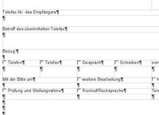

</td></tr>
<tr>
<td valign="top">Fensterzeile
</td>
<td valign="top">Standard 6pt
</td>
<td valign="top">Fest 0,25 cm
</td>
<td valign="top">0
</td>
<td valign="top">0
</td>
<td valign="top">

</td></tr>
<tr>
<td valign="top">Fließtext
</td>
<td valign="top">Standard 11pt
</td>
<td valign="top">Fest 0,45 cm
</td>
<td valign="top">0
</td>
<td valign="top">0
</td>
<td valign="top">Die Schrift für den Bereich im Briefkopf, in dem der tatsächliche Inhalt, z.B Bescheid, Schreiben usw. geschrieben wird.
</td></tr>
<tr>
<td valign="top">Fußzeile_Wollmux
</td>
<td valign="top">Standard 7pt
</td>
<td valign="top">Fest 0,28 cm
</td>
<td valign="top">0
</td>
<td valign="top">0
</td>
<td valign="top">

</td></tr>
<tr>
<td valign="top">Hauptabteilung_Fachbereich
</td>
<td valign="top"><b>Fett</b> 9pt
</td>
<td valign="top">Fest 0,35 cm
</td>
<td valign="top">0
</td>
<td valign="top">0
</td>
<td valign="top">

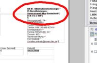

</td></tr>
<tr>
<td valign="top">kurzm_angaben
</td>
<td valign="top">Standard 9pt
</td>
<td valign="top">Fest 0,39 cm
</td>
<td valign="top">0
</td>
<td valign="top">0
</td>
<td valign="top">

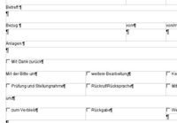

</td></tr>
<tr>
<td valign="top">LHM
</td>
<td valign="top">Standard 13pt
</td>
<td valign="top">Fest 0,46 cm
</td>
<td valign="top">0
</td>
<td valign="top">0
</td>
<td valign="top">

</td></tr>
<tr>
<td valign="top">Referat
</td>
<td valign="top"><b>Fett</b> 13pt
</td>
<td valign="top">Fest 0,46 cm
</td>
<td valign="top">0
</td>
<td valign="top">0
</td>
<td valign="top">

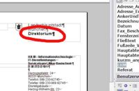

</td></tr>
<tr>
<td valign="top">Sachleitende Verfügung Sachleitende Verfügung dünn Sachleitende Verfügung unterstrichen
</td>
<td valign="top">
</td>
<td valign="top">
</td>
<td valign="top">
</td>
<td valign="top">
</td>
<td valign="top">Werden nicht mehr verwendet, da durch den WollMux Komfortdruck ersetzt.
</td></tr>
<tr>
<td valign="top">Schreiben
</td>
<td valign="top">Standard 9pt
</td>
<td valign="top">Fest 0,35 cm
</td>
<td valign="top">0
</td>
<td valign="top">0
</td>
<td valign="top">

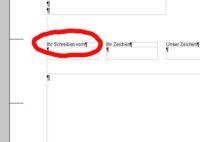

</td></tr>
<tr>
<td valign="top">Seite Seitenzahl
</td>
<td valign="top">Standard 9pt
</td>
<td valign="top">Fest 0,35 cm
</td>
<td valign="top">0
</td>
<td valign="top">Einzug vor Text: 12.20 cm
</td>
<td valign="top">

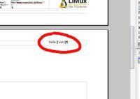

Vorlage für die Formatierung der Seitenzahl. Diese erscheint im internen oder externen Briefkopf ab der Seite 2 oben rechts.
</td></tr>
<tr>
<td valign="top">Verfasser
</td>
<td valign="top">Standard 11pt
</td>
<td valign="top">Fest 0,46 cm
</td>
<td valign="top">0
</td>
<td valign="top">0
</td>
<td valign="top">

</td></tr>
<tr>
<td valign="top">Weisse_Schrift
</td>
<td valign="top">irrelevant
</td>
<td valign="top">irrelevant
</td>
<td valign="top">0
</td>
<td valign="top">Die Schriftfarbe ist weiss.
</td>
<td valign="top">Das Konstrukt ist nötig, damit der Bereich hinter den Rahmen mit Absender, Empfängeradresse, usw. nicht beschriftet werden kann. Dieser "Workaround" stellt sicher, dass die Briefköpfe auch mit MS Office austauschbar bleiben und dort noch dem städtischen Erscheinungsbild entsprechen.

</td></tr>
<tr>
<td valign="top">WollMuxVerfuegungspunkt
</td>
<td valign="top"><b>Fett</b> 11pt
</td>
<td valign="top">Fest 0,46 cm
</td>
<td valign="top">0
</td>
<td valign="top">Einzug Erste Zeile -0,7cm
</td>
<td valign="top">

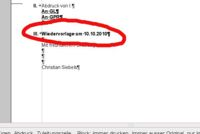

</td></tr>
<tr>
<td valign="top">WollMuxVerfuegungspunktAbdruck
</td>
<td valign="top">Standard 11pt
</td>
<td valign="top">Fest 0,46 cm
</td>
<td valign="top">0
</td>
<td valign="top">Einzug Erste Zeile -0,7cm
</td>
<td valign="top">

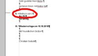

</td></tr>
<tr>
<td valign="top">WollMuxZuleitungszeile
</td>
<td valign="top">Standard 11pt
</td>
<td valign="top">Fest 0,46 cm
</td>
<td valign="top">0
</td>
<td valign="top">Unterstrichen
</td>
<td valign="top">

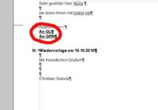

</td></tr>
<tr>
<td valign="top">Zeichen
</td>
<td valign="top">Standard 9pt
</td>
<td valign="top">Fest 0,35 cm
</td>
<td valign="top">0
</td>
<td valign="top">0
</td>
<td valign="top">

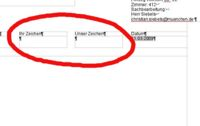

</td></tr>
<tr>
<td valign="top">Zusatz_Referat
</td>
<td valign="top">Standard 11pt
</td>
<td valign="top">Fest 0,46 cm
</td>
<td valign="top">0
</td>
<td valign="top">0
</td>
<td valign="top">

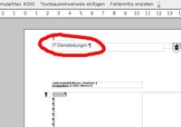

 Formatvorlage für die Zusatzbezeichung rechts oben im externen Briefkopf, den manche Dienststellen verwenden, z.B. Tourismusamt.
</td></tr></table>

<Kategorie:Office_Vorlagenumsteller_Handbuch>

<Category:AG-Office> <Category:Eierlegender_WollMux>
<Category:Handbuch_des_WollMux>
