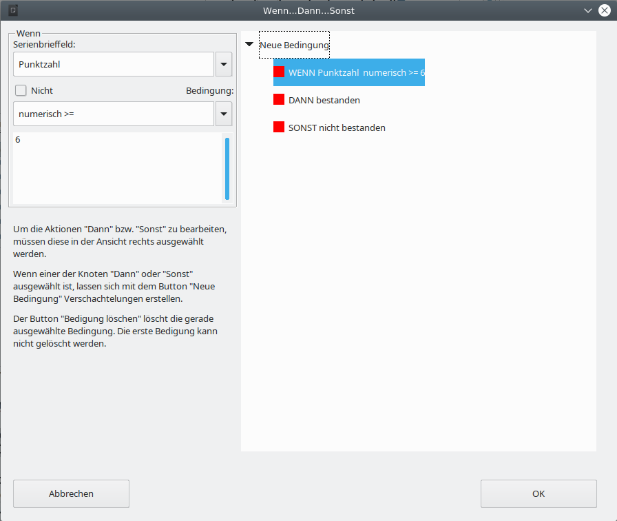

<!-- toc -->

# Grundsätzliches zu dieser Unterlage und zum WollMux Seriendruck

Diese Unterlage beschreibt den WollMux Seriendruck, den Sie in LibreOffice hinter dem *Briefumschlag in der Sidebar* finden. Der LibreOffice Seriendruck wird hier nicht weiter beschrieben.

In dieser Unterlage wird dargestellt, wie Sie mit dem WollMux Seriendruck zeitsparend weitgehend gleich lautende Briefe oder Texte auch an eine Großzahl an Adressaten versenden. Ebenso wird der Etikettendruck, den Sie unter *Datei → Neu → Etiketten* finden und dann mithilfe des WollMux Seriendrucks befüllen, beschrieben.

Zusätzlich kann der WollMux Seriendruck natürlich mit den Sachleitenden Verfügungen (SLVs) und der Formularfunktion des WollMux verknüpft werden.

## Darstellung des Seriendrucks

* **Ausgangsdokument bzw. Ausgangsvorlage**: Diese Datei besteht z. B. aus dem Brief(kopf) mit seinen gleich lautenden Textstellen. Für die veränderlichen (variablen) Textstellen werden Platzhalter, die sog. Serienbrieffelder, eingefügt.
* **Datenquelle**: Die Datenquelle ist eine weitere Datei, i.d.R. eine Calc Tabelle. In dieser Datei befinden sich all die Informationen (z.B. die Daten zum Adressaten), die sich bei jedem Brief ändern, also variabel sind.
* **Serienbrief oder Serienetikett**: Der Serienbrief bzw. das Serienetikett ist das Endergebnis. Er beinhaltet sowohl die festen als auch die variablen Texte aus dem Ausgangsdokument und der Datenquelle zum Zeitpunkt der Erstellung. Er wird durch das Zusammenführen dieser beiden Dateien erzeugt. Der Serienbrief bzw. das Serienetikett selbst kann in Dateiform (ein Dokument für alle Briefe oder pro Brief eine Datei) oder in Papierform (Drucker) ausgegeben werden.
* **Zusammenführen (Serienbriefdokument und Datenquelle verbinden)**: Vorgang bei dem der Serienbrief aus dem Ausgangsdokument -bzw. -vorlage und der Datenquelle erzeugt wird. Der Serienbrief ist ein Endergebnis, das die Daten zum Zeitpunkt der Erstellung beinhaltet. Er kann nicht aktualisiert werden. Wenn Sie das Ausgangsdokument oder die Datenquelle aktualisieren, müssen Sie das Zusammenführen erneut durchführen.
* **Serienbrieffeld**: Platzhalter an dem die passende Information aus der Datenquelle eingefügt wird.
* **Seriendruckfelder**: Allgemeiner Begriff / Oberbegriff für Serienbrieffelder.
* **Spezialfelder**: Felder zur individuellen Steuerung des variablen Inhalts, z.B. für Gender oder Wenn-Dann Funktionen.

# Die Datenquelle

Die Datenquelle (Calc Tabelle) beinhaltet alle variablen Daten (z. B. Adressen) die Sie in Ihrem Serienbrief nutzen möchten. Der Aufbau der Datenquelle beeinflusst die Erstellung des Ausgangsdokuments bzw. der Ausgangsvorlage und die Möglichkeiten, die Ihnen dort zur Verfügung stehen erheblich.

Sie sollten - wenn möglich immer - die Felder, die schon in der Ausgangsvorlage bzw. im Ausgangsdokument vorhanden sind, verwenden. Dies betrifft. insb. die Felder, die schon im Briefkopf enthalten sind. Wir empfehlen diese Felder **nicht** zu ändern – also **nicht** „EmpfaengerZeile1“ in „Anrede“ umzubenennen. Viel besser und auch flexibler ist es die Datenquelle entsprechend anzupassen.

## Grundlagen

Als Datenquelle können Sie Tabellen aus Tabellendokumenten, wie Sie sie mit Calc erstellen, verwenden. In diesem Handbuch wird primär die Nutzung der WollMux-Seriendruckfunktion mit Tabellen aus Tabellendokumenten beschrieben. Tabellen aus Textdokumenten (Writer) können nicht für den Seriendruck verwendet werden. Falls Sie Word-Tabellen für den Seriendruck in Word verwendet haben, müssen diese in Tabellendokumente (Calc) übernommen werden.

Jede Datenquelle besteht aus einer Tabelle, z. B. aus einer Tabelle eines Calc-Tabellendokuments. Diese Tabelle wiederum besteht aus Spalten und Zeilen. Dabei ist es notwendig, dass jede Spalte eine Überschrift hat. Diese Überschrift erklärt sozusagen, welche Informationen in der entsprechenden Spalte eingetragen werden müssen. Die Überschrift gibt der Spalte also ihren **Feldnamen**. Die Feldnamen stehen immer in der ersten Zeile der Tabelle (siehe ). Diese heißt daher auch Feldnamenszeile. Der Feldname entspricht dem Namen des Seriendruckfeldes im Ausgangsdokument. Die weiteren Zeilen sind die sog. Datensätze, in denen die variablen Informationen des Briefes eingetragen sind.

## Erstellung der Datenquelle

Eine neue Datenquelle kann in LibreOffice entweder über **Datei → Neu → Tabellendokument** oder über **Extras → Seriendruck (WollMux) → Neue Calc-Tabelle...** erstellt werden.

Tragen Sie in die erste Zeile die Feldnamen ein, die Sie später in Ihrem Serienbrief verwenden wollen ein. Nehmen Sie zu diesem Zeitpunkt noch
**keine** Rücksicht auf evtl. schon vorhandene Felder in Ihrer Ausgangsvorlage oder in Ihrem Ausgangsdokument. Schreiben Sie also für das Feld, das die Anrede enthalten soll, „Anrede“ und nicht „EmpfaengerZeile1“ oder ähnliches. Diese Anpassung bzw. Erweiterung erfolgt erst in einer der nächsten Schritte (siehe Kapitel [Datenquelle an die WollMux Felder anpassen](#datenquelle-an-die-wollmux-felder-anpassen)).

Ab der zweiten Zeile tragen Sie Ihre Daten ein. Wenn Sie alle Datensätze eingetragen haben, speichern Sie das Tabellendokument. Spätere Anpassungen, wie z.B. das Hinzufügen oder Löschen von Datensätzen sind natürlich jederzeit möglich (siehe Kapitel [Nachbearbeitung der Datenquelle](#nachbearbeitung-der-datenquelle)).

Bitte achten Sie darauf, dass Ihre Tabelle folgenden Qualitätskriterien entspricht:

* Die Feldnamen sollten nur aus folgenden Zeichen bestehen:
  * 0-9
  * a-z
  * A-Z
  * \_
  * Also keine Leerzeichen, Sonderzeichen etc. im Feldnamen.
* Bitte machen Sie in den Spaltenüberschriften, also bei den Feldnamen keine (manuellen) Zeilenumbrüche.
* Es sollten keine Leerspalten in der Datenquelle vorhanden sein: Die Feldnamenszeile muss vollständig ausgefüllt sein. Zwischen den Datenspalten darf keine Spalte existieren, die keine Überschrift hat.
  * In der Datenquelle können auch Spalten enthalten sein, die nicht für den Seriendruck verwendet werden sollen. Das bedeutet, Sie können auch Calc Tabellen verwenden, die Sie schon für andere Zwecke angelegt haben, die aber die Felder, die Sie für den Seriendruck verwenden wollen schon enthält. Dadurch brauchen Sie nicht extra eine weitere Tabelle anzulegen.
* Identische Information – Identischer Eintrag: Achten Sie darauf, dass z. B. in einer Spalte „Anrede“ wirklich immer die Anrede auf die gleiche Art eingetragen ist; also immer „Herr“ oder immer „Herrn“, aber auf keinen Fall mischen. Überprüfen Sie das mit der Funktion Autofilter in Calc. Näheres zum Autofilter finden Sie im Kapitel [Datensätze für den Ausdruck filtern](#datensätze-für-den-ausdruck-filtern).
* Verwenden Sie in verschiedenen Tabellen (Datenquellen) denselben Feldnamen für denselben Inhalt, z. B.: Nehmen Sie entweder immer „Nachname“ oder immer „Name“ als Feldname für den Familiennamen. Wenn sie in der einen Tabelle „Name“ schreiben und in einer anderen „Nachname“ und in der dritten „Familienname“, dann müssen Sie Ihre Serienbriefe immer wieder anpassen und es wird unübersichtlich.

## Nachbearbeitung der Datenquelle

Die Datenquelle kann jederzeit nachbearbeitet werden. Die Daten stehen sofort für den Seriendruck zu Verfügung. Öffnen Sie einfach das Tabellendokument, führen Sie die Änderungen durch und speichern Sie die Datei. Oder klicken Sie in der Sidebarauf die Schaltfläche *Tabelle bearbeiten*. Dadurch wechseln Sie zur Datenquelle.

## Datenquelle an die WollMux Felder anpassen

Wenn Sie sich ein WollMux Formular mit dem externen Briefkopf ansehen, werden Sie feststellen, dass dort einige Felder schon enthalten sind, die ebenfalls mit Daten aus der Datenquelle befüllt werden sollen.

Hierfür empfiehlt sich das WollMuxdokument oder die -vorlage unverändert zu lassen und stattdessen die Datenquelle zu erweitern.

Die wichtigsten Felder werden wahrscheinlich die Felder im Empfängerfeld sein, also die EmpfaengerZeile1 bis EmpfaengerZeile6. Im ersten Schritt muss man sich nun festlegen, welche der bereits vorhandenen Felder, wie in die Empfängerzeilen eingetragen werden sollen. Wo soll also z.B. die Anrede stehen oder in welcher Stelle steht die Straße und die Hausnummer?

<table border="2" cellspacing="0" cellpadding="4" rules="all" style="margin:1em 1em 1em 0; border:solid 1px #AAAAAA; border-collapse:collapse; background-color:#F9F9F9; font-size:100%; empty-cells:show;">
<tr>
<td>EmpfaengerZeile1</td>
<td>Anrede und Titel</td>
</tr>
<tr>
<td>EmpfaengerZeile2</td>
<td>Vorname und Nachname</td>
</tr>
<tr>
<td>EmpfaengerZeile3</td>
<td>Straße und Hausnummer</td>
</tr>
<tr>
<td>EmpfaengerZeile4</td>
<td>PLZ und Ort</td>
</tr>
<tr>
<td>EmpfaengerZeile5</td>
<td></td>
</tr>
<tr>
<td>EmpfaengerZeile6</td>
<td></td>
</tr>
</tbody>
</table>

1. Legen Sie in Calc die Spalten mit den Namen „EmpfaengerZeile1“ bis „EmpfaengerZeile6“ an. Wenn Sie z.B. die „EmpfaengerZeile6“ nicht benötigen, können Sie sie auch weglassen. Achten Sie bitte unbedingt auf die richtige Schreibweise!
2. Es ist dringend zu empfehlen sich die nun eingefügten Spalten automatisch befüllen zu lassen, damit man bei einer Anpassung der Tabelle die Daten immer nur an einer Stelle eintragen muss. Dazu benötigt man eine passende Calc Formel, die uns z.B. die Felder „Vorname“ und „Nachname“ automatisch in die Spalte „EmpfaengerZeile2“ überträgt.
3. Dafür bietet sich die Funktion „VERKETTEN“ an. Mit dieser Funktion können Inhalte von Zellen miteinander verbunden bzw. verkettet werden. Wenn beispielsweise in C2 der Vornamen und in D2 den Nachnamen steht, würde die Funktion folgendermaßen aussehen: `=VERKETTEN(C2; " "; D2)`
4. Diese Funktion wird in die Spalte „EmpfaengerZeile2“, in diesem Fall J2 eingetragen. Das sorgt dafür, dass in J2 nun zuerst der Inhalt aus C2 gefolgt von einem Leerzeichen (damit die Einträge nicht direkt „aneinander kleben“) und des Inhaltes von D2 erscheinen.
5. Wenn man die Zelle J2 nun markiert und nach unten zieht, werden alle Felder mit der Funktionen und den dazugehörigen Feldern befüllt.
6. Mit den anderen Felder wird einfach analog verfahren.

# Die Ausgangsvorlage bzw. das Ausgangsdokument

## Vorlage oder Dokument

Auch wenn man jedes beliebige Formular oder bestehendes Dokument oder auch ein neues Dokument für den Seriendruck verwenden kann, empfiehlt es sich gut zu überlegen, ob nicht die Verwendung einer richtigen Vorlage für den Serienbrief die beste Möglichkeit ist. In den meisten Fällen sollte diese Frage mit ja beantwortet werden können. Nachfolgende Tablle zeigt die wichtigsten Unterschiede zwischen der Verwendung einer Vorlage oder eines Dokuments:

<table border="2" cellspacing="0" cellpadding="4" rules="all" style="margin:1em 1em 1em 0; border:solid 1px #AAAAAA; border-collapse:collapse; background-color:#F9F9F9; font-size:100%; empty-cells:show;">
<tr>
<td bgcolor="#87CEFA"></td>
<td bgcolor="#87CEFA">Vorlage</td>
<td bgcolor="#87CEFA">Dokument</td>
</tr>
<tr>
<td>Briefkopfdaten</td>
<td>Die Daten des <strong>aktuellen</strong> Bearbeiters werden eingetragen – durch können mehrere Leute mit der Vorlage arbeiten</td>
<td>Feste Daten des Erstellers – kann deshalb auch nur von diesem verwendet werden</td>
</tr>
<tr class="even">
<td>Briefkopf sichtbar in der „Vorlage“?</td>
<td>Nein</td>
<td>Ja</td>
</tr>
<tr class="odd">
<td>Aktualisierung der Briefkopfdaten</td>
<td>Alle Daten werden aktualisiert</td>
<td>Nicht möglich</td>
</tr>
<tr class="even">
<td>Verwendung von bereits enthaltenen Feldern (z.B. Empfaengerfeld1)</td>
<td>Ohne Einschränkungen möglich – auch wenn die Felder in der Vorlage nicht sichtbar sind</td>
<td>Ohne Einschränkungen möglich</td>
</tr>
<tr class="odd">
<td>Verwendung von Formularfunktionen</td>
<td>Ohne Einschränkungen möglich</td>
<td>Ohne Einschränkungen möglich</td>
</tr>
<tr class="even">
<td>Verwendung von Sachleitenden Verfügungen</td>
<td>Ohne Einschränkungen möglich</td>
<td>Ohne Einschränkungen möglich</td>
</tr>
<tr class="odd">
<td>Bearbeiten</td>
<td>Rechtsklick → Vorlage bearbeiten</td>
<td>Doppelklick zum Öffnen des Dokuments</td>
</tr>
</table>

Im Handbuch wird davon ausgegangen, dass eine Vorlage für die Erstellung des Serienbriefes verwendet wird, weil das in der Regel der bessere Weg ist. Das Vorgehen bei Verwendung eines Dokumentes unterscheidet sich davon aber nicht wesentlich, so dass hierfür der Inhalt des Handbuches genauso gilt.

## Auswahl der Vorlage oder des Briefkopfes

Sie können als Grundlage für Ihren Serienbrief jede Mischvorlage, jeden Briefkopf aus dem WollMux oder auch schon jede bestehende Vorlage bzw. Dokument verwenden. Falls Sie Ihren Serienbrief mit Formularfunktionen oder Sachleitenden Verfügungen kombinieren wollen, sollten Sie die dazugehörigen Handbücher anschauen und im ersten Fall am besten die dazugehörigen Kurse besuchen.

Weil in der Praxis der externe Briefkopf wohl der häufigste Anwendungsfall sein wird, wird dieser als Beispiel im Handbuch verwendet.

## Erstellung des Serienbriefes

### Feste Inhalte

Am besten fängt man den Serienbrief so an, dass man alle festen Inhalte – falls nicht schon vorhanden – einfügt. Feste Inhalte sind die Bestandteile, die in jedem Serienbrief gleich sein werden. Die Teile, die die Serienbriefdaten enthalten werden, können zu diesem Zeitpunkt mit Platzhaltern oder Pseudeodaten belegt werden. Es würde sich ebenso anbieten, die Vorlage oder das Dokument gleich endgültig zu strukturieren und formatieren – idealerweise mit Formatvorlagen.

### Variable Inhalte – die Seriendruckfelder

Nachdem Sie alle festen Bestandteile der Ausgangsvorlage eingegeben haben, werden nun die variablen Bestandteile integriert.

Dazu müssen Sie zunächst eine Verbindung zwischen den Seriendruckdaten (Datenquelle) und der Ausgangsvorlage bzw. dem Ausgangsdokument (aktuelles Dokument) herstellen. Erst danach können Sie die Seriendruckfelder der gewählten Datenquelle in das Ausgangsdokument einfügen.

#### Verbindung von Ausgangsvorlage und Datenquelle

Öffnen Sie die Sidebar für den WollMux Seriendruck. Dort haben Sie vier Optionen eine Datenquelle zu verknüpfen:

1. *Datei...*: Hier können Sie eine bestehende Calcdatei aus dem Dateisystem als Datenquelle auswählen. Diese Datei wird dabei automatisch geöffnet.
2. *Datenbank*: Um eine Datenbank auszuwählen muss diese vorher unter LibreOffice registriert worden sein.
3. Wenn bereits eine Datenquelle (Calc Datei) offen ist, erscheinen diese als Einträge unterhalb der Schaltfläche "Datenbank" und können durch anklicken ausgewählt werden.
4. In dem Sie *Neue Calc-Tabelle* wählen, können Sie eine Datenquelle für Ihren Seriendruck anlegen. Danach geht es weiter wie in Kapitel [Die Datenquelle](#die-datenquelle) beschrieben.

Wenn eine Datenquelle mehrere Tabellenblätter enthält, erscheint für jedes Tabellenblatt ein Eintrag in der Datenquellen-Liste.

#### Überprüfen und Austauschen der Datenquelle

Wenn man die Seriendruck-Sidebar öffnet, so sieht man direkt, ob die Vorlage mit einer Datenquelle verbunden ist. Dann ist unterhalb von "Datenbank"  ein Eintrag in der Datenquellen-Liste markiert.

#### Einfügen von Serienbrieffeldern

In der geöffneten und mit der Datenquelle verbundenen Vorlage gehen Sie folgendermaßen vor:

1. Positionieren Sie den Cursor an der Stelle, an der Sie das Serienbrieffeld einfügen wollen
2. Betätigen Sie die Schaltfläche *Serienbrieffeld*. Es erscheint eine alphabetische Liste mit allen Felder der Datenquelle.
3. Klicken Sie auf den benötigten Eintrag. Das Feld erscheint an der Cursorposition.

#### Löschen von Serienbrieffeldern

Serienbrieffelder lassen sich genauso löschen, wie anderen Zeichen auch. Also durch

* *Entf*, wenn der Cursor vor dem Serienbrieffeld steht.
* *Backspace*, wenn der Cursor nach dem Serienbrieffeld platziert ist.
* *Entf* oder *Backspace* wenn das Serienbrieffeld markiert ist.

#### Ersetzen von bereits vorhandenen WollMux-Formularfeldern durch Serienbrieffeldern

Wenn Sie als Basis für Ihren Serienbrief ein bereits fertiges WollMux-Formular verwenden wollen oder auch nur einen Briefkopf, müssen Sie nicht alle Felder, die Sie nicht mehr benötigen, weil sie durch Serienbrieffelder ersetzt werden, manuell löschen. Sie können diese Felder direkt über die Sidebar austauschen.

Dazu gehen Sie folgendermaßen vor:

1. Verbinden Sie Ihr Formular mit Ihrer Datenquelle – falls noch nicht geschehen.
2. Betätigen Sie in der Sidebar die Schaltfläche *Alle Felder anpassen*.
3. Es erscheint ein Fenster mit einer Liste aller Felder, die nicht aus der Datenquelle stammen. In der rechten Spalte können Sie die neuen Felder direkt eintragen oder durch Betätigen der Schaltfläche *Serienbrieffeld* auswählen.

   
4. Mit der Schaltfläche *Felder anpassen* werden die alten Felder durch die neuen ersetzt.

Alle Felder, die Bestandteil des Briefkopfes sind, sollten nicht ersetzt werden. Nicht benötige Felder bleiben leer und stören deshalb nicht. Für die benötigten Felder sollte die Anpassung in der Datenquelle erfolgen (siehe Kapitel [Datenquelle an die WollMux Felder anpassen](#datenquelle-an-die-wollmux-felder-anpassen))

### Spezialfelder

Spezialfelder helfen abhängig von den Seriendruckdaten den Inhalt im Serienbrief zu steuern, ohne alles in der Datenquelle einzugeben. Wenn sie z. B. außer den Adressdaten noch eine variable Briefanrede in Ihrem Brief brauchen, gibt es verschiedene Wege das zu verwirklichen:

* **Ohne Spezialfelder:** Sie erstellen in der Datenquelle eine zusätzliche Spalte mit dem Feldnamen Briefanrede. 
  Pro Datensatz tragen Sie die entsprechende Anrede ein, wie „Sehr geehrter Herr Huber,“ „Sehr geehrte Frau Maier,“. In das Ausgangsdokument tragen Sie einfach das Seriendruckfeld Briefanrede (&lt;Briefanrede&gt;) an der entsprechenden Stelle ein.
* **Mit Spezialfeldern:** Sie verwenden das Feld Anrede um zwischen Frau und Herr zu unterscheiden und nutzen das Spezialfeld Gender, indem sie festlegen: Immer wenn im Feld Anrede Frau steht, soll Sehr geehrte Frau in den Brief eingetragen werden und immer wenn im Feld Anrede Herr steht soll Sehr geehrter Herr in den Brief eingetragen werden. Damit sparen Sie sich die zusätzliche Spalte in der Datenquelle.

Spezialfelder helfen, Ihre Datenquelle übersichtlich zu halten und flexibel mit Ihren Daten im Serienbrief zu arbeiten.

#### Einfügen und Bearbeiten von Spezialfeldern

Spezialfelder werden genauso eingefügt und gelöscht wie normale Serienbrieffelder.

Wenn Sie Spezialfelder nachbearbeiteten wollen, markieren Sie das gewünschte Spezialfeld und wählen in der Sidebar *Spezialfeld* → *Feld bearbeiten*. Es öffnet sich das Spezialfeld und kann bearbeitet werden.

#### Gender Funktion

Über das Spezialfeld Gender können geschlechtsspezifische Bezeichnungen anhand eines Seriendruckfeldes (i. d. R. Anrede mit dem Inhalt Frau/Herr – m/w – weibl./männl.) eingefügt werden.

Steht im Feld Anrede Frau, w, oder weibl., dann wird der Text im Feld *Text weibl*. in den Serienbrief geschrieben, steht im Feld Anrede Herr, m, oder maennl., dann wird der Text im Feld *Text männl.* in den Serienbrief geschrieben. Steht irgendetwas anderes im entsprechenden Feld, erscheint der Text aus dem Feld *Text sonst*. im Serienbrief.

#### Wenn...Dann...Sonst

Im Prinzip ist die Genderfunktion ein Spezialfall. Mit der Wenn...Dann...Sonst... Funktion kann der Inhalt eines Feldes universeller gesteuert werden. Wenn also ein Feld in der Datenquelle einen bestimmten Wert annimmt, soll ein definierter Wert angezeigt werden, ansonsten ein anderer Wert.

Wenn...Dann...Sonst-Felder sind verschachtelbar, hier sollte man allerdings beachten, dass die verschachtelten Felder einigermaßen übersichtlich bleiben. Außerdem sind in diesen Feldern Seriendruckfelder über die Schaltfläche *Serienbrieffeld* nutzbar.

Der Text im Dann- bzw. Sonst-Bereich des Feldes kann beliebig lang sein.

##### Beispiel: Entstehende Leerzeichen unterdrücken

Wenn Sie mit Seriendruckfeldern arbeiten, die auch leer sein können, kann es zu unerwünschten Leerzeichen bzw. -zeilen kommen. Diese leeren Stellen lassen sich mit dem Spezialfeld Wenn...Dann...Sonst... unterdrücken.

Wenn Sie in der Anrede auch Titel mit aufnehmen, werden Sie einige Personen haben, die einen Titel haben, viele werden aber ohne Titel sein. In der Vorlage würde das ohne Wenn...Dann...Sonst... Funktion so aussehen:

`Sehr·<Anrede>;·<Titel>·<Nachname>,`

zeigt entweder bei Personen mit Titel folgendes an:

`Sehr·geehrte·Frau·Dr.·Müller,`

oder bei Personen ohne Titel:

`Sehr·geehrter·Herr··Müller,`

Es würden also bei Personen ohne Titel zwei Leerzeichen zwischen Anrede und Nachname entstehen. Das ist optisch sind sonderlich schön, kann aber mit der Wenn...Dann...Sonst... Funktion leicht behoben werden:

Die Eintrag im Serienbrief sieht nun so aus:

`Sehr·<Anrede>·<Titel><Nachname>,`

Wobei das Feld Titel nun kein Serienbrieffeld mehr ist sondern ein Spezialfeld und zwischen &lt;Titel&gt; und Nachname **kein** Leerzeichen sein darf.

* **Wenn:** Hier ist die Bedingung dass der Titel genau leer ist.
* **Dann:** Ist das Feld leer
* **Sonst:** Wird der Titel angezeigt und ein Leerzeichen danach, dass allerdings in nicht sichtbar ist. Wenn man aber in das Feld klickt, sieht man den Abstand zwischen &lt;Titel&gt; und dem blinkenden Cursor.

Das führt zu folgendem Ergebnis:

* Mit Titel:

`Sehr·geehrte·Frau·Dr.·Müller,`

* Ohne Titel:

`Sehr·geehrter·Herr·Müller,`

Somit stimmen für beide Fälle die Anzahl der Leerzeichen zwischen den einzelnen Feldern.

##### Beispiel: Wertebereich

Es soll an Prüflinge ein Brief verschickt werden, in dem unter anderem auch steht, ob sie eine Prüfung bestanden haben, oder nicht. In unserer Datenquelle ist die Punktzahl der Prüflinge hinterlegt. In diesem Beispiel muss man von möglichen 15 Punkten mindestens 6 Punkte erreichen, um die Prüfung bestanden zu haben.

Für diesen Fall fügen Sie wieder ein Spezialfeld Wenn...Dann...Sonst... ein, das sich auf die Punktzahl bezieht. Das Feld sollte so aussehen wie in nachfolgender Abbildung.

Natürlich ist es genauso richtig, wenn man die Funktion umgekehrt angeben würde: `WENN Punktzahl < 6 DANN nicht bestanden SONST bestanden`.

#### Verschachtelung von Wenn...Dann...Sonst...Funktionen

Wenn...Dann...Sonst...Funktionen lassen sich nicht nur auf einer Ebene einsetzten, sondern können auch über mehrere Ebenen gehen – man nennt dies auch verschachteln. Dazu dient der Button "Neue Bedingung" der im Dann- und Sonst- zur Verfügung steht.

WENN Statement1 DANN tue dies SONST WENN Statement2 DANN tue das SONST tue was anderes.

##### Beispiel Wertebereich

Wenn man dem Beispiel mit den Prüfungsergebnissen aus dem vorherigen Kapitel hinzufügt, dass Prüflinge mit einem Prüfungsergebnis von 14 und 15 Punkten mit Auszeichnung bestanden haben, und Prüflinge mit 5 Punkten eine Nachprüfung machen können, benötigt man eine verschachtelete Wenn...Dann...Sonst...Funktion.

<table border="2" cellspacing="0" cellpadding="4" rules="all" style="margin:1em 1em 1em 0; border:solid 1px #AAAAAA; border-collapse:collapse; background-color:#F9F9F9; font-size:100%; empty-cells:show;">
<tr class="odd">
<td>Ergebnis</td>
<td>Eintrag im Feld</td>
</tr>
<tr class="even">
<td>14 -15</td>
<td>Bestanden mit Auszeichnung</td>
</tr>
<tr class="odd">
<td>13 – 6 </td>
<td>bestanden</td>
</tr>
<tr class="even">
<td>5</td>
<td>Nicht bestanden (Möglichkeit zur Nachprüfung)</td>
</tr>
<tr class="odd">
<td>4 - 0</td>
<td>Nicht bestanden</td>
</tr>
</tbody>
</table>

Auch hier sind mehrere Lösungsmöglichkeiten denkbar. Eine ist in nachfolgender Abbildung zu sehen.

#### Reguläre Ausdrücke

In der Wenn-Abfrage des Wenn...Dann...Sonst...-Feldes können Sie mit Regulären Ausdrücken arbeiten. Reguläre Ausdrücke sind Platzhalter, die Sie beim Suchen in LibreOffice verwenden können.

Beispiele:

* Platzhalter für genau ein beliebiges Zeichen: .
* Platzhalter für beliebig viele beliebige Zeichen: .\*

Weitere Reguläre Ausdrücke finden Sie in der Hilfe von LibreOffice.

#### Datensatznummer

Über dieses Spezialfeld können Sie auf jedem Brief die Nummer des Datensatzes in Ihrer Datenquelle aufdrucken. Beim Datensatz 100 stehtdann 100 auf dem Brief.

Wenn beim Drucken jeder Brief in eine eigene Datei gedruckt werden soll, z. B. um die Datei zu mailen, kann über das Feld Datensatznummer ein Dateiname automatisch erzeugt werden.

#### Serienbriefnummer

Über dieses Spezialfeld können Sie auf jedem Brief die Nummer des Serienbriefes des jeweiligen Ausdrucks ausgeben lassen. Wenn Sie also 100 Datensätze haben und alle Datensätze drucken, sind Datensatznummer und Serienbriefnummer identisch.

Wenn sie nur die Datensätze 50 – 100 für Ihren Seriendruck verwenden, hat der erste Brief die Datensatznummer 50 und die Serienbriefnummer 1.

Wenn beim Drucken jeder Brief in eine eigene Datei gedruckt werden soll, z. B. um die Datei zu mailen, kann über das Feld Serienbriefnummer ein Dateiname automatisch erzeugt werden.

#### Nächster Datensatz

Dieses Spezialfeld kann dazu verwendet werden, um auf einer Seite mehrere Datensätze zu drucken. Z.B. wird dieses Feld benötigt, wenn Sie Etiketten über den WollMux Seriendruck erstellen wollen.

# Zusammenführen von Ausgangsdokument und Datenquelle

## Vorschau

Um vor dem Zusammenführen von Ausgangsdokument und Datenquelle zu prüfen, ob das Ergebnis den eigenen Vorstellungen entsprechen wird, können Sie sich ein Vorschau anzeigen lassen.

### Vorschau anzeigen lassen

Klicken Sie auf die Schaltfläche *Vorschau* in der Sidebar. Sie sehen dann statt der Namen der Seriendruckfelder den Inhalt des ersten Datensatzes. Er wird etwas weiter rechts auch als Zahl angezeigt.

Die Schaltfläche heißt nun *&lt;Feldname&gt;*

### Vorschau ausschalten

Klicken Sie auf die Schaltfläche *&lt;Feldname&gt;* in der Sidebar. Sie sehen dann statt den Inhalten der Datensätze wieder die Namen der Seriendruckfelder.

Die Schaltfläche heißt nun wieder *Vorschau*.

## Serienbrief Drucken

Um den Serienbrief zu drucken betätigen Sie die Schaltfläche *Drucken* in der Sidebar. Es erscheint nun der Seriendruckdialog des WollMux, der Ihnen nun eine Reihe von Optionen bietet.

Über die Funktion *Folgende Datensätze verwenden* kann die Anzahl der Ausdrucke eingeschränkt werden.

### Gesamtdokument erstellen

Diese Option ist die Standard Option, wenn Sie den Seriendruck Dialog starten. Sie bietet zwei mögliche Ausgabeformate:

* **ODT-Datei**
  * Mit dieser Auswahl wird der Seriendruck mit allen Datensätzen in ein einzelnes Dokument geschrieben, das dann alle Datensätze enthält.
  * Ermöglicht die Vorschau und Archivierung
  * Unterstützt „nächster Datensatz“ Funktion
* **PDF-Datei**
  * Ermöglicht die Vorschau und Archivierung, aber keine nachträgliche Bearbeitung
  * Ein-/Ausblendungen können über die Datenquelle angesteuert werden.
  * Keine Unterstützung der Funktion „nächster Datensatz“
  * **Die beste Möglichkeit des Ausdrucks bei „großen“ Serienbriefen mit vielen Datensätzen (ab ca. 300 Seiten).**

Bei beiden Optionen besteht die Möglichkeit die Anzahl der Datensätze über die Funktion *Folgende Datensätze verwenden* einzuschränken.

### Direkt drucken

Der Serienbrief kann auch direkt gedruckt werden. Dabei können die üblichen Drucker-Optionen eingestellt werden. Dazu muss der **Weiter &gt;** Button betätigt werden. Wenn man direkt **Fertigstellen** auswählt, so wird auf dem voreingestellten Drucker gedruckt.

→ Unterstützt „Nächster Datensatz“-Funktion

### E-Mails Verschicken

Hierüber können die Serienbriefe direkt als Email(s) versendet werden. Dazu gehen Sie bitte folgendermaßen vor:

* Wählen Sie zwischen den Ausgabeformaten ODT und PDF (vergleiche [Einzeldateien erzeugen](#einzeldateien-erzeugen)).
* Geben Sie ein Muster für den Namen des Anhangs an. Dabei können Serienbrieffelder verwendet werden (vergleiche [Einzeldateien erzeugen](#einzeldateien-erzeugen).
* Als Absender ersetzen Sie bitte &lt;felix.wollmux@muenchen.de&gt; durch Ihre Email Adresse.
* Die Datenquelle benötigt eine Spalte, die die Emailadressen der Empfänger enthält.
* Sie können über die entsprechenden Felder den Betreff und den Inhalt der Nachricht festlegen. Dazu können Sie auch Serienbrief- oder Spezialfelder verwenden.

### Einzeldateien erzeugen

Mit dieser Option werden die Serienbriefe in einzelne Dateien geschrieben. Folgende Optionen stehen dabei zur Verfügung:

* Als Ausgabeformat stehen .odt und .pdf zur Verfügung.
* Sie können ein Muster für die Dateinamen festlegen. Dazu können Sie auch Serienbrief- und Spezialfelder verwenden.
* Sie können ein beliebiges Zielverzeichnis, in das die Dateien gespeichert werden sollen auswählen.

Über die Funktion *Folgende Datensätze verwenden* kann die Anzahl der Einzeldateien eingeschränkt werden.

### Seriendruck starten

Alle Arten des Seriendrucks starten Sie mit dem Button *Los geht’s*. Ein Fortschrittsbalken informiert Sie über den Fortschritt des Drucks. Größere Dokumente – also mit vielen Datensätzen werden etwas länger dauern. Große Seriendrucke von ca. 300 bis zu ca. 8000 Datensätzen funktionieren mit dem pdf Gesamtdruck am besten.

## Leerseiten in Seriendokumenten drucken

In LibreOffice gibt es unter *Extras → Optionen → LibreOffice Writer → Drucken* die Option *Automatisch eingefügte Leerseiten drucken.* Diese Option ist standardmäßig aus technischen Gründen deaktiviert. Es gibt aber eine Konstellation, bei der Sie diese Einstellung aktivieren müssen. Nachfolgende Tabelle verdeutlicht die verschiedenen Optionen und die erforderlichen Einstellungen:

<table border="2" cellspacing="0" cellpadding="4" rules="all" style="margin:1em 1em 1em 0; border:solid 1px #AAAAAA; border-collapse:collapse; background-color:#F9F9F9; font-size:100%; empty-cells:show;">
<tr>
<td>Drucker</td>
<td>Seitenzahl</td>
<td>Automatisch eingefügte Leerseiten drucken</td>
</tr>
<tr">
<td>Duplex</td>
<td>gerade</td>
<td>deaktiviert</td>
</tr>
<tr style="background-color:red;">
<td>Duplex</td>
<td>ungerade</td>
<td>aktiviert</td>
</tr>
<tr>
<td>Einfach (ohne Duplex)</td>
<td>gerade</td>
<td>deaktiviert</td>
</tr>
<tr>
<td>Einfach (ohne Duplex)</td>
<td>ungerade</td>
<td>deaktiviert</td>
</tr>
</table>

Sie müssen also die Option *Automatisch eingefügte Leerseiten drucken* aktivieren, wenn Sie einen Duplexdrucker verwenden und einen Serienbrief haben, der eine ungerade Seitenzahl hat. Nach dem Druck sollten Sie die Option wieder deaktivieren.

Wenn Sie das nicht immer machen wollen, können Sie bei Serienbriefen mit ungerader Seitenzahl eine leere Seite am Schluss einfügen, damit Sie eine gerade Seitenzahl haben, dann brauchen Sie sich um die Option *Automatisch eingefügte Leerseiten drucken* nicht kümmern.

Mit strg + Enter fügen Sie am Ende Ihres Serienbriefes einen manuellen Seitenumbruch und damit eine leere Seite ein.

## Datensätze für den Ausdruck filtern

Wenn Sie für Ihren Seriendruck nur eine Auswahl Ihrer Datensätze verwenden wollen, können Sie dies ganz einfach mit den Filtermöglichkeiten in LibreOffice Calc machen. Prinzipiell gibt es dazu zwei verschieden Möglichkeiten, die hier aber nur kurz vorgestellt werden.

### Zeilen ausblenden

Indem Sie einfach einzelne Zeilen ausblenden, filtern Sie diese für den Seriendruck aus. Wenn es allerdings nicht allzu aufwendig werden soll, bietet diese Option aber nur wenig Möglichkeiten. Sie ist dafür geeignet, um z.B. Datensatz (Zeile) 25 – Ende auszufiltern. Dann werden nur noch die ersten 24 (wenn Zeile1 die Überschrift enthält) Datensätze für den Seriendruck verwendet.

Um in Calc Zeilen auszublenden, markieren Sie die Zeilen über die Zeilennummer und wählen im Kontextmenü (Rechtsklick) *Ausblenden*.

### In Calc filtern

Um Ihre Daten einzugrenzen können Sie die Filtermöglichkeiten von Calc nutzen. Die komfortabelste Lösung stellt hierzu wahrscheinlich der Autofilter da. Den Autofilter stellt man in Calc über *Daten → Filter → Autofilter* ein. Den eingeschalteten Autofilter erkennt man an den Kästchen mit den ▼

Der Autofilter ermöglicht es Ihnen in jeder Spalte bestimmte Kriterien auszuwählen, nach denen Sie Ihre Daten einschränken können.

Ebenso kann man natürlich auch Filter auf mehrere Spalten gleichzeitig anwenden, um die Daten noch mehr einzuschränken, so könnte man z.B. in der Spalte Anrede nach „Herr“ filtern und beim Ort nach „München“, so dass als Ergebnis nur noch die Datensätze übrig bleiben, bei denen sich um Herren handelt, die in München wohnen.

# Nutzung einer bereits bestehenden Ausgangsvorlage (oder Dokuments)

Wenn Sie Ihre Ausgangsvorlage gespeichert haben, können Sie sie jederzeit wieder aufrufen und das Zusammenführen erneut durchführen.

Beim Öffnen der Ausgangsvorlage wird die Seriendruck-Sidebar nicht automatisch aktiviert.

Rufen Sie sie wie gewohnt über *Extras → Seriendruck (WollMux)* auf.

Der Speicherort der Datenquelle ist in der Ausgangsvorlage gespeichert, so dass nach dem Aufruf die Datenquelle wie beim letzten Zusammenführen verbunden ist. Voraussetzung dafür ist, dass die Datei nicht verschoben oder umbenannt wurde.

Falls Sie nun eine andere Datenquelle mit der Ausgangsvorlage nutzen möchten, klicken Sie auf Datenquelle und wählen die gewünschte Datenquelle aus.

# Sachleitende Verfügungen im Serienbrief

Die Funktionalität Sachleitende Verfügung können Sie in einem Serienbrief genauso einsetzen, wie in einem Einzelbrief.

Eine detaillierte Beschreibung der Sachleitenden Verfügungen finden Sie [Handbuch zu den Sachleitenden Verfügungen](../Hilfen_fuer_Sachleitende_Verfuegungen_verwenden.md).

Wenn Sie z.B. einen einseitigen Brief mit zwei Sachleitenden Verfügungen und einer Wiedervorlage erstellen, also eine Seite Original und je eine Seite für die drei sogenannten Verfügungspunkte, und diesen an 30 Adressaten schicken, bekommen Sie 120 Seiten im Ausdruck.

Weitere Hinweise und Tipps zu SLV und Seriendruck finden Sie im [FormularMax4000-Handbuch im Kapitel Kombinationsmöglichkeiten mit dem Seriendruck](../FormularMax/KomboSeriendruck.md).

# Etikettendruck

Im Unterschied zum Serienbrief werden bei Serienetiketten die Daten mehrerer Datensätze auf einer Seite ausgegeben. Um das zu gewährleisten wird das Spezialfeld *Nächster Datensatz* benötigt.

Zur Erstellung von Serienetiketten können Sie die gleiche Datenquelle verwenden, wie für den normalen Seriendruck. Auch die Neuerstellung einer Datenquelle funktioniert analog zum „normalen“ Seriendruck (siehe Kapitel [Die Datenquelle](#die-datenquelle)).

## Erstellen des Ausgangsdokument

Das Erstellen eines Ausgangsdokument funktioniert im ersten Schritt genauso wie im LibreOffice Seriendruck. Zuerst müssen Sie das Format Ihrer Etiketten wählen. *Dazu gehen ins Menü Datei → Neu → Etiketten*.

In diesem Dialog müssen Sie nur das Format auswählen. Die restlichen Felder werden nur für den LibreOffice Etikettendruck benötigt.

Danach wechseln Sie auf den Reiter *Optionen*. Dort gibt es noch eine wichtige Einstellung, die die Erstellung der Etiketten wesentlich einfacher gestaltet. Falls noch nicht aktiviert, setzten Sie das Häkchen bei *Inhalte synchronisieren*. Dadurch können Sie relativ schnell den Inhalt der ersten Etiketten-Zelle in alle anderen übertragen.

Nach Setzen des Häkchens erscheint in Ihren Serienetiketten ein kleines Fenster mit einem Button *Etiketten synchronisieren*. Zum Erstellen des Ausgangsdokuments bestätigen Sie den Button *Neues Dokument*.

## Einfügen der Seriendruckfelder

Im Prinzip funktioniert das Einfügen der Seriendruckfelder genauso so wie beim „normalen“ Seriendruck. Beim Erstellen von Etiketten müssen Sie nur darauf achten, dass Sie die Eingaben immer im linken, oberen Feld machen. Der Übertrag in die anderen Felder erfolgt dann durch *Etiketten synchronisieren*.

Nachdem Sie Ihr Etikettenformat bestätigt haben, starten Sie den WollMux Seriendruck, wählen Ihre Datenquelle aus und fügen die benötigten Felder ein. Zwei Dinge fehlen hier noch: Zum einen müssen die Etiketten noch synchronisiert werden und zum anderen wurde das Spezialfeld *Nächster Datensatz* noch nicht eingefügt.

Man würde nun vermuten, dass hier etwas nicht stimmt, da ja in allen Feldern der gleiche Eintrag steht. Die Vorschau zeigt in diesem Fall aber nur den optischen Aufbau an, nicht den richtigen Inhalt. Jetzt betätigen Sie in der Sidebar den Button *Drucken* und wählen das Ausgabeformat, z.B. Gesamtdruck. In diesem Schritt werden dann erst die richtigen Daten eingefügt.

## Fehlerhafte Seitenränder anpassen

Manchmal stimmen die Ränder der Papieretiketten nicht mit den Rändern des Dokuments überein, das über die Funktion Etiketten erstellt wurde. Passen Sie dann das Seitenformat an. Meistens erreichen Sie den gewünschten Effekt mit A4.

Stellen Sie dazu ggf. das Seitenformat über Format → Seite... → Register Seite → Papierformat von Benutzer auf A4 um, oder Sie passen Sie die Seitenränder an, falls es Probleme beim Drucken gibt.
