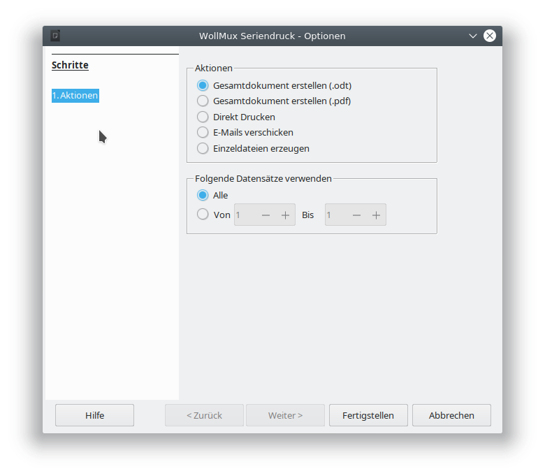

# {{ page.title }}

Auf dieser Seite werden die neuen Funktionen des WollMux-Serienbrief beschrieben.

## ad hoc Seriendruck mit einer vorgegebenen Tabelle

Um einen ad hoc Serienbrief mit einer vorgegebenen Tabelle erstellen zu können, sind folgende Schritte notwendig:

### Briefkopf öffnen

Über einen Klick auf "Externer Briefkopf" in der WollMux-Sidebar wird ein neues Serienbriefdokument erzeugt.

### Inhalte und Seriendruckfelder einfügen

Im soeben erzeugten Serienbriefdokument können die Textinhalte des Briefs frei eingegeben werden. Um ein Serienbrieffeld in das Dokument einzufügen, wird die Seriendruck-Sidebar zu Hilfe genommen:

Beim ersten Aufruf der Seriendruck-Sidebar muss die Datenquelle, in diesem Beispiel eine bereits bestehende Datenquelle festgelegt werden. Dazu kann über den Button "Datei..." ein Dateiauswahldialog geöffnet werden:

Da die Datenquelle in diesem Beispiel unter /home/christoph.lutz/Datenquelle\_Einladung.ods abgelegt ist, wird die Datenquelle über den Knopf "Datei ..." geöffnet. Es erscheint folgender Dateiauswahldialog:

Nach der Auswahl der Datei datenquelle.ods kann über die Listbox in der Sidebar das Tabellenblatt mit den Daten ausgewählt werden.

Anmerkungen:

* Die Auswahl der zu verwendenden Datenquelle ist nun abgeschlossen und muss nicht wiederholt werden. Die getroffenen Entscheidungen werden im Serienbriefdokument gespeichert, können aber nachträglich geändert werden.

## Dokument/Vorlage bearbeiten

Serienbriefe lassen sich jederzeit speichern und zu einem späteren Zeitpunkt wieder öffnen. Es kann dabei die bisherige Datenquelle, aber auch eine andere/neuere verwendet werden. Falls sich in dem Dokument bzw. der Vorlage noch Felder befinden, die in der Datenquelle nicht vorhanden sind, so lassen sich diese Felder mittels "Tabelle-&gt;Alle Felder anpassen" neuen Feldern zuweisen.

## Serienbrief-Vorlage erstellen

Eine Serienbrief-Vorlage unterscheidet sich nur dadurch von einem ad hoc Serienbrief, dass bei der Erstellung eine Vorlage bzw. Michschvorlage mit der Dateiendung \*.ott benutzt wird.

## WollMux-Formular verwenden

Ein bereits bestehendes WollMux-Formular lässt sich ebenso zu einem Serienbrief abändern. Die Serienbrieffunktionalität lässt sich auch noch nachträglich durch die Seriendruck-Sidebar einfügen.

## Seriendruck-Sidebar

### Datenquelle

Über die 3 Buttons "Datei...", "Neue Calc-Tabelle" und "Datenbank" lässt sich eine andere Datenquelle öffnen. Die geöffneten Datenquellen sind in der Listbox unter den Buttons aufgeführt. Dort kann eine Datenquelle durch anklicken ausgewählt werden.

#### Serienbrieffeld

Über das Dropdown-Menü "Serienbrieffeld" können die in der Datenquelle enthaltenen Serienbrieffelder in das Dokument eingefügt werden. Alle Serienbrieffelder sind in dem Menü aufgelistet.

#### Spezialfeld

Über das Dropdown-Menü "Spezialfeld" können folgende Spezialfelder in das Dokument eingefügt werden:

#### Gender

Über den Eintrag "Gender" können geschlechtsabhängige Bezeichnungen, anhand eines Seriebrieffeldes (i.d.R. Anrede mit dem Inhalt Frau/Herr - w/m - weibl./männl.) eingefügt werden.

Bsp: steht in der Datenquelle im Anredefeld Frau, so wird "Ansprechpartnerin" eingefügt. Steht im Anredefeld Herr, so ist das Ergebnis "Ansprechpartner".

#### Wenn...Dann...Sonst

Mit diesem Button können "Wenn...Dann...Sonst"-Felder eingefügt werden. Es ist auch möglich mehrere Bedingungsfelder in einander zu verschachteln.

#### Datensatznummer

Fügt die Nummer des Datensatzes in das Dokument ein.

#### Serienbriefnummer

Fügt die Nummer des Serienbriefs in das Dokument ein. Datensatznummer und Serienbriefnummer unterscheiden sich, wenn man nur einen Teil der Datensätze ausdruckt.

#### Feld bearbeiten

Existierende Felder können nicht über einen Dialog bearbeitet werden. Deswegen empfiehlt es sich die Felder zu löschen und dann neu an zu legen.

Alternativ müssen die entsprechenden TRAFO Funktionen, die in dem Dokument gespeichert sind, angepasst werden.

### Vorschau - "&lt;&lt;Feldname&gt;&gt;"

Nach Klick auf die Schaltfläche "Vorschau" kann über die Pfeilknöpfe geprüft werden, ob alle Datensätze zu den gewünschten Ergebnissen führen. Bei Formatierungsfehlern können die notwendigen Änderungen direkt im Dokument vorgenommen werden. Bei Fehlern in den Serienbriefdaten kann die zugehörige Datentabelle über "Tabelle bearbeiten" in den Vordergrund geholt werden. Danach können die Fehler direkt in der Datenquelle korriegiert werden.

Der Knopf "Vorschau" zeigt immer den Modus an, in den gewechselt werden soll. Ist die Seriendruck-Leiste bereits im Vorschau-Modus, so zeigt der Knopf "&lt;&lt;Feldname&gt;&gt;" an.

### Drucken

Über die Schaltfläche "Drucken" werden die Serienbriefe erstellt. Die Serienbriefe können dabei entweder:

* in ein Gesamtdokument geschrieben werden
* in ein PDF-Gesamtdokument geschrieben werden
* direkt auf dem Drucker ausgegeben werden
* als Emails verschickt werden
* in einzelne Dateien geschrieben werden.

Es erscheint ein Wizard, über den die notwendigen Einstellungen getroffen werden können.

### Tabelle

#### Tabelle bearbeiten

Wechsel zur ausgewählten Datenquelle (funktioniert bei Datenbanken natürlich nicht).

#### Tabellenspalten ergänzen

Ergänzt die Datenquelle um weitere Spalten. Dabei können fixe Texte aber auch Werte aus anderen Spalten (Serienbreiffedl) verwendet werden.

#### Alle Felder anpassen

Ersetzt die Felder durch neue Seriendruck-Felder. Dabei können fixe Texte aber auch Werte aus anderen Spalten (Serienbreiffedl) verwendet werden.

[Kategorie:Handbuch des WollMux](Kategorie:Handbuch_des_WollMux)

<Category:Eierlegender_WollMux>
