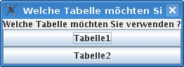
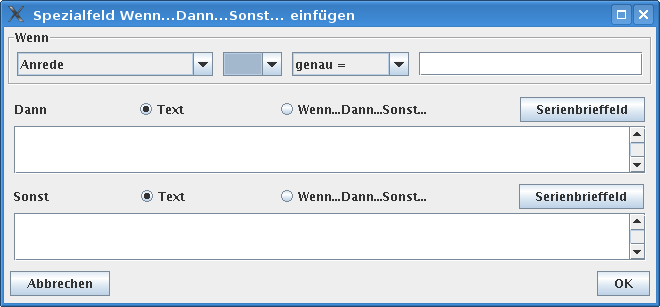
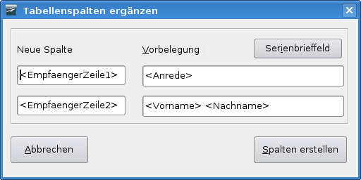

Auf dieser Seite werden die neuen Funktionen des WollMux-Serienbrief
beschrieben.

ad hoc Seriendruck mit einer vorgegebenen Tabelle
=================================================

Um einen ad hoc Serienbrief mit einer vorgegebenen Tabelle erstellen zu
können, sind folgende Schritte notwendig:

Briefkopf öffnen
----------------

Über einen Klick auf "Externer Briefkopf" in der WollMux-Leiste wird ein
neues Serienbriefdokument erzeugt.

Inhalte und Seriendruckfelder einfügen
--------------------------------------

Im soeben erzeugten Serienbriefdokument können die Textinhalte des
Briefs frei eingegeben werden. Um ein Serienbrieffeld in das Dokument
einzufügen, wird die Seriendruck-Leiste zu Hilfe genommen, die über
Extras&rarr;Seriendruck (WollMux) gestartet wird:

Beim ersten Aufruf von 'Extras&rarr;Seriendruck (WollMux)' muss die
Datenquelle, in diesem Beispiel eine bereits bestehende Datenquelle
festgelegt werden. Dazu erscheint folgender Dialog:

Da die Datenquelle in diesem Beispiel unter
/home/christoph.lutz/Datenquelle\_Einladung.ods abgelegt ist,
wird die Datenquelle über den Knopf "Datei ..."
geöffnet. Es erscheint folgender Dateiauswahldialog:

Nach der Auswahl der Datei datenquelle.ods erscheint ein weiterer Dialog
zur Auswahl des zu verwendenden Tabellenblattes.

Anmerkungen:

-   Wenn die Beispieldatenquelle genau ein beschriebenes Tabellenblatt
    besitzt, dann wird dieses verwendet und der Dialog erscheint nicht.
    Die Beispieldatenquelle enthält aber mehrerer beschriebene
    Tabellenblätter und darum erscheint die Auswahl.
-   Nach der Auswahl des Tabellenblattes kommt das zu bearbeitende
    Serienbriefdokument wieder in den Vordergrund.
-   Die Auswahl der zu verwendenden Datenquelle ist nun abgeschlossen
    und muss nicht wiederholt werden. Die getroffenen Entscheidungen
    werden im Serienbriefdokument gespeichert, können aber nachträglich
    geändert werden.

Nun erscheint folgende Leiste, die frei auf der Arbeitsfläche
positioniert werden kann und immer im Vordergrund ist, solange an dem
Serienbriefdokument gearbeitet wird.

Dokument/Vorlage bearbeiten
===========================

Serienbriefe lassen sich jederzeit speichern und zu einem späteren
Zeitpunkt wieder öffnen. Es kann dabei die bisherige Datenquelle, aber
auch eine andere/neuere verwendet werden. Falls sich in dem Dokument
bzw. der Vorlage noch Felder befinden, die in der Datenquelle nicht
vorhanden sind, so lassen sich diese Felder mittels "Tabelle-&gt;Alle
Felder anpassen" neuen Feldern zuweisen.

Serienbrief-Vorlage erstellen
=============================

Eine Serienbrief-Vorlage unterscheidet sich nur dadurch von einem ad hoc
Serienbrief, dass bei der Erstellung eine Vorlage bzw. Michschvorlage
mit der Dateiendung \*.ott benutzt wird.

WollMux-Formular verwenden
==========================

Ein bereits bestehendes WollMux-Formular lässt sich ebenso zu einem
Serienbrief abändern. Die Serienbrieffunktionalität lässt sich auch noch
nachträglich via "Exras-&gt;Seriendruck (WollMux)" einfügen.

Seriendruckleiste
=================

Anmerkung:

-   Beim Umschalten auf ein anderes Fenster von OOo wird die
    Serienbriefleiste ausgeblendet.

Datenquelle
-----------

Über diesen Button lässt sich eine andere Datenquelle festlegen. Es wird
der Dialog zur Datenquellenauswahl geöffnet, der auch bei neuen
Serienbriefen angezeigt wird.

Folgende Möglichkeiten sind auswählbar:

-   neue Datenquelle in Calc
-   bestehende Calc-Datenquelle verwenden
-   Verknüpfung zu einer Datenbank herstellen

Serienbrieffeld
---------------

Über das Menü "Serienbrieffeld" können die in der Datenquelle
enthaltenen Serienbrieffelder in das Dokument eingefügt werden. Alle
Serienbrieffelder sind in dem Menü aufgelistet.

Wenn in dem Menü mehr Serienbrieffelder sind als auf dem Bildschirm
darstellbar, so lautet der letzte Menüpunkt "Weitere Felder..." und
führt zu einem Dialog, in dem alle Felder in einer Listbox aufgelistet
sind und so eingefügt werden können.

Spezialfeld
-----------

Über das Menü "Spezialfeld" können folgende Spezialfelder in das
Dokument eingefügt werden:

### Gender

Über den Button "Gender" können geschlechtsabhängige Bezeichnungen,
anhand eines Seriebrieffeldes (i.d.R. Anrede mit dem Inhalt Frau/Herr -
w/m - weibl./männl.) eingefügt werden.

Bsp: steht in der Datenquelle im Anredefeld Frau, so wird
"Ansprechpartnerin" eingefügt. Steht im Anredefeld Herr, so ist das
Ergebnis "Ansprechpartner".

### Wenn...Dann...Sonst

Mit diesem Button können "Wenn...Dann...Sonst"-Felder eingefügt werden.
Es ist auch möglich mehrere Bedingungsfelder in einander zu
verschachteln. Über den Button "Serienbrieffeld" lassen sich in jedem
Texteld weitere Serienbrieffelder einfügen.

### Datensatznummer

-

### Serienbriefnummer

-

### Feld bearbeiten

Über diesen Button lassen sich zuvor markierte Spezialfelder bearbeiten.

Vorschau - &lt;&lt;Feldname&gt;&gt;
-----------------------------

Nach Klick auf die Schaltfläche "Vorschau" kann über die Pfeilknöpfe
geprüft werden, ob alle Datensätze zu den gewünschten Ergebnissen
führen. Bei Formatierungsfehlern können die notwendigen Änderungen
direkt im Dokument vorgenommen werden. Bei Fehlern in den
Serienbriefdaten kann die zugehörige Datentabelle über "Tabelle
bearbeiten" in den Vordergrund geholt werden. Danach können die Fehler
direkt in der Datenquelle korriegiert werden.

Der Knopf "Vorschau" zeigt immer den Modus an, in den gewechselt werden
soll. Ist die Seriendruck-Leiste bereits im Vorschau-Modus, so zeigt der
Knopf "&lt;&lt;Feldname&gt;&gt;" an.

Drucken
-------

Über die Schaltfläche "Drucken" werden die Serienbriefe erstellt. Die
Serienbriefe können dabei entweder direkt auf dem Drucker ausgegeben
oder in ein Gesamtdokument geschrieben werden. Es erscheint der folgende
Dialog:

Tabelle
-------

### Tabelle bearbeiten

Wechsel zur ausgewählten Datenquelle (funktioniert bei Datenbanken
natürlich nicht)

### Tabellenspalten ergänzen

### Alle Felder anpassen

-

[Kategorie:Handbuch des WollMux](Kategorie:Handbuch_des_WollMux)

<Category:Eierlegender_WollMux>
