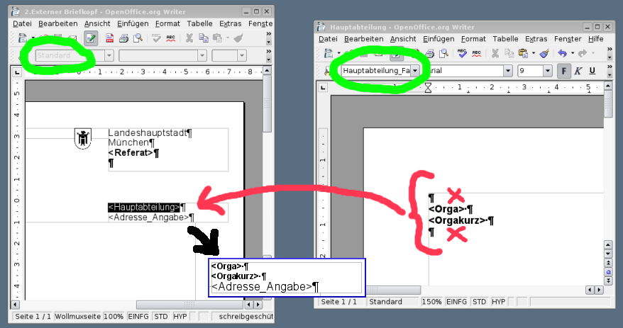
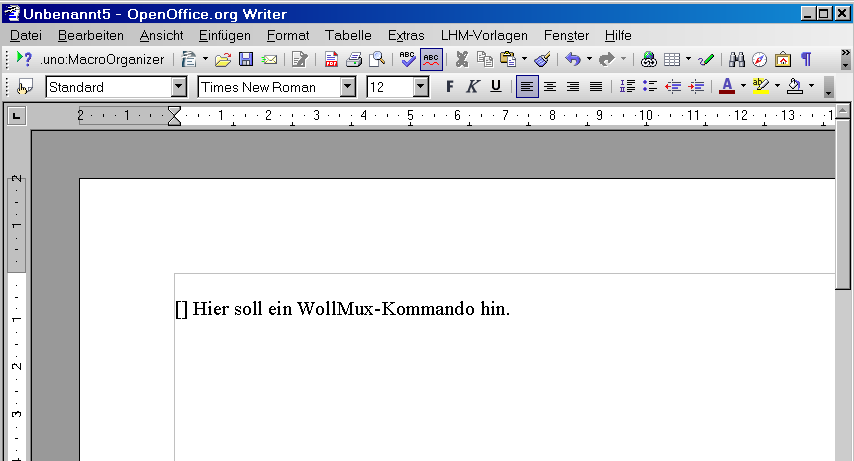
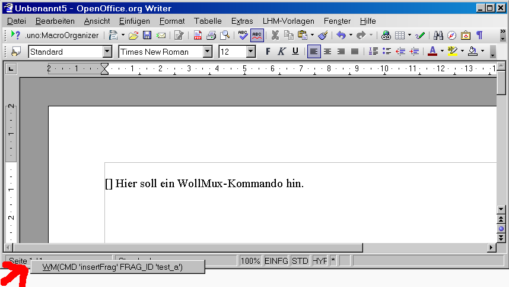

Einführung
==========

Der Begriff Textfragment
------------------------

Ein Textfragment ist ein Teil eines Writer-Dokuments. Ein Textfragment
kann beliebig einfach (z.B. nur ein einzelnes Wort) oder komplex (z.B.
eine komplette Briefkopfvorlage) sein. Das automatische Zusammensetzen
von Textfragmenten aus unterschiedlichen Quellen ist einer der
wesentlichen Aspekte des WollMux. Nur so ist es möglich, die stadtweiten
Anforderungen (z.B. städtisches Erscheinungsbild) mit den
referatsspezifischen (z.B. eigenes Logo) unter einen Hut zu bringen.

Es können auch Absatzformate in eigene Textfragmente ausgelagert werden.
So ist es möglich auch die zu verwendenden Schriftarten zentral in einer
Datei zu hinterlegen und darauf zu verzichten, diese Informationen in
jedem Dokument vorzuhalten und dort warten zu müssen. Dies erlaubt z.B.
auch ein zentrales Ändern der zu verwendenden Schrift, ohne alle
Vorlagen anpassen zu müssen.

Anmerkung: Der Begriff “Textfragment” wurde gewählt, um einer Verwechslung mit dem Begriff “Textbaustein” vorzubeugen, der vor allem im Zusammenhang mit Texthandbüchern und manueller Auswahl durch den Benutzer verwendet wird.

Verweise auf Textfragmente und automatisches Ersetzen
-----------------------------------------------------

Der WollMux durchsucht jedes neu geöffnete Dokument nach speziellen
Befehlen, den sog.
[Dokumentkommandos](Dokumentkommandos_des_WollMux.md), die unter
anderem einzufügende Textfragmente referenzieren können. Findet er einen
entsprechenden Befehl, fügt er automatisch das referenzierte
Textfragment ein. Dieser Vorgang findet rekursiv statt. Es ist also
möglich, dass ein Textfragment auf ein oder mehrere andere Textfragmente
verweist, die ebenfalls wieder auf ein oder mehrere Textfragmente
verweisen können. Auf diese Weise können komplexe Inhalte aus einzelnen
Teilen aufgebaut werden, die aus verschiedenen Quellen stammen können.

Verwaltung der Textfragmente und Konfiguration der Verweisauflösung
-------------------------------------------------------------------

Alle Verweise werden indirekt über eine Tabelle aufgelöst, die in der
[Konfigurationsdatei wollmux.conf](Konfigurationsdatei_wollmux_conf.md#textfragmente)
spezifiziert wird und Verweisbezeichner auf die konkreten Dateien
umsetzt, in denen die Textfragmente gespeichert sind. Ziel dieses
Konzepts ist es, bei der Änderung von zentralen Vorgaben zum
Erscheinungsbild nur die zentralen Vorlagen anpassen zu müssen. Es
sollen insbesondere keine massenhaften Änderungen an Vorlagen in den
Referaten erforderlich sein.

Gemäß dem 3-stufigen Konzept können auch benutzerspezifische Anpassungen
an Vorlagen durchgeführt werden, ohne dass dazu Kopien zentraler
Vorlagen erstellt werden müssen. Zum Beispiel könnte so jeder Benutzer
seine eigene Fusszeile verwenden, ohne dafür von jeder Vorlage eine
Kopie erstellen und anpassen zu müssen, vor allem aber ohne das Problem,
dass der Benutzer Änderungen an den zentralen Vorlagen verpasst.

Die Verwaltung der eigentlichen Fragment-Dateien obliegt den Referaten.
Typischerweise würden sie in entsprechenden Verzeichnissen auf
Netzlaufwerken gespeichert, der WollMux unterstützt jedoch z.B. auch das
Laden über HTTP. Wann und wie geänderte Fragmente dem Benutzer
zugänglich gemacht werden und insbesondere auch wann und wie neue
stadtweite Fragmente in die Referate übernommen werden bleibt ebenfalls
den Referaten überlassen.

Insbesondere ist eine automatische Verteilung über die stadtweite
Software-Verteilung bislang nicht vorgesehen. Auch ein automatisches
Cachen aller Textfragmente auf dem Benutzerrechner durch den WollMux ist
nicht vorgesehen. Die Referate können dies jedoch leicht über ihre
normalen Mechanismen zur Dateiverteilung auf Arbeitsplatzrechner selber
realisieren.

Beispiel: Stadtweites Erscheinungsbild, Referatsspezifische Inhalte
-------------------------------------------------------------------

Nehmen wir an, es wird stadtweit folgendes Erscheinungsbild für alle
externe Kommunikation vorgegeben.

```
|-------|
|Kopf   |
|-------|
|       |
|       |
|-------|
|L| Fuss|
|-------|
```

Dabei ist “Kopf” der Platz für die Kopfdaten (Sachbearbeiter etc.) und
“Fuss” der Platz für die Fussdaten (Bankverbindungen etc.). Für ein
referatsspezifisches Logo ist der Platz “L” vorgesehen.

Ohne den WollMux müssten die Referate jeweils Kopien dieser zentralen
Vorlage erstellen und dort ihr eigenes Logo einbinden. Dies verursacht
einen großen Aufwand und macht spätestens dann Probleme, wenn das
Erscheinungsbild so geändert wird, dass das Logo rechts zu stehen hat:

```
|-------|
|Kopf   |
|-------|
|       |
|       |
|-------|
|Fuss |L|
|-------|
```

Ohne den WollMux müssten die Referate all ihre vorher erstellten
Vorlagen ändern. Mit dem WollMux ist dies einfacher. Er erlaubt es, die
Vorlage, die das Layout nach dem städtischen Erscheinungsbild
beschreibt, zentral zur Verfügung zu stellen und an den von den
Referaten anzupassenden Stellen “Kopf”, “Fuss” und “L” Verweise auf
Textfragmente einzubetten. Der WollMux fügt beim Laden der Vorlage die
entsprechenden Fragmente ein.

Wichtig ist hier, nochmals zu betonen, dass alle Verweise indirekt über
eine Tabelle aufgelöst werden, die einen Verweisbezeichner auf die
konkrete Datei umsetzt, in der das Textfragment gespeichert ist. Da die
Tabelle gemäß dem überall im WollMux umgesetzten 3-stufigen Konzept vom
Referat für die eigenen Benutzer ganz oder teilweise geändert werden
kann, ist es kein Problem, dass jedes Referat ein eigenes Logo verwendet
und gleichzeitig das Layout aus einer zentralen Datei bezieht, die vom
Referat nicht geändert werden muss.

Umgang mit Textfragmenten und Vorlagen
======================================

Der WollMux kennt keinen Unterschied zwischen Textfragmenten und
Vorlagen, da jede Vorlage durch ein Textfragment im WollMux
repräsentiert wird. Die folgenden Abschnitte gelten also sowohl für
Textfragmente als auch für Vorlagen:

Übernahme von Absatzformaten beim Einfügen von Textfragmenten
-------------------------------------------------------------

Wenn Sie ein Textfragment in eine Vorlage einfügen lassen
(beispielsweise mit dem Dokumentkommando
[insertFrag](Dokumentkommandos_des_WollMux.md#das-kommando-insertfrag),
so gibt es zwei verschiedene Möglichkeiten für die Übernahme der dort
definierten Absatzformate:

#### Absatzformate werden aus der Vorlage übernommen

Besteht das einzufügende Textfragment aus genau einem Absatz, so wird
das Absatzformat des einfügenden Textfragments, welches meistens eine
Vorlage ist, verwendet. Das folgende Bild verdeutlicht dieses Verhalten:


Auf der linken Seite sehen Sie die Vorlage, die den Einfügepunkt
enthält. An dieser Stelle soll der Inhalt des rechten Textfragments
eingefügt werden. Das rechte Textfragment besitzt das Absatzformat
“Standard”, in der Vorlage ist jedoch am Einfügepunkt das Absatzformat
“Bescheidtext” definiert.

Da das Textfragment auf der rechten Seite aus genau einem Absatz
besteht, wird der Inhalt nach dem Einfügen im Absatzformat
“Bescheidtext” der Vorlage dargestellt.

Auf diese Weise können Sie kleine Textfragmente erstellen, um deren
Formatierung Sie sich zum Zeitpunkt der Erstellung noch nicht kümmern
brauchen. Es kommt bei diesen Textfragmenten nur auf den Inhalt an. Erst
beim Einfügen des Textfragments in eine Vorlage kommt die Formatierung
ins Spiel. Sie können in der Vorlage frei definieren, in welchem
Absatzformat das eingefügte Textfragment später erscheint.

#### Absatzformate werden aus dem einzufügenden Textfragment übernommen

Enthält das einzufügende Textfragment mindestens drei Absätze, von denen
der erste und der letzte Absatz keinen Inhalt besitzt, so werden die
Absatzformate des einzufügenden Textfragments übernommen. Nach dem
Einfügen werden die beiden (ungewollten) leeren Absätze entfernt. Das
folgende Bild verdeutlicht dieses Verhalten:



Die Vorlage auf der linken Seite enthält den Einfügepunkt
"<Hauptabteilung>" an dem der Inhalt des rechten Textfragments eingefügt
werden soll. Für den Einfügepunkt ist das Absatzformat “Standard”
gesetzt, für das einzufügende Textfragment das Absatzformat
“Hauptabteilung\_Fachbereich”.

Nach dem Einfügen des Textfragments in die Vorlage, befindet sich der
eingefügte Inhalt im Absatzformat “Hauptabteilung\_Fachbereich”. Die
beiden leeren Absätze zum Beginn und Ende des Textfragments werden nach
dem Einsetzen entfernt, so dass nur noch der eigentlich gewollte Inhalt
übrig bleibt.

Auf diese Weise können Sie vor-formatierte Inhalte in Ihre Vorlagen
einfügen. Im Gegensatz zum vorhergehenden Fall, können vor-formatierte
Inhalte auch mehr als einen Absatz umfassen. Wichtig ist dabei nur, dass
der Inhalt in leere Absätze zum Beginn und zum Ende eingeschlossen ist.

#### Wichtige Hinweise

-   Beim Einfügen von Textfragmenten werden grundsätzlich der erste
    und/oder der letzte Absatz entfernt, wenn sie leer sind. Deshalb
    sollte ein Textfragment immer nach einem der vorgenannten Schemata
    aufgebaut sein, d.h. entweder genau ein nicht-leerer Absatz oder
    Inhalt umschlossen von leeren Absätzen.
-   Ein leerer letzter Absatz wird auch entfernt, wenn der erste Absatz
    nicht leer ist.
-   Ein Absatz, der nur Textmarken enthält wird als leer betrachtet.
    Damit er erhalten bleibt muss mindestens ein Zeichen (z.B.
    Leerzeichen) vorhanden sein.
-   Ist eine Tabelle der erste Inhalt eines Textfragments, so *muss* ihr
    ein leerer Absatz vorangestellt werden. Für anderer Fälle wird das
    korrekte Einfügen nicht garantiert und kann sich mit neuen
    WollMux-Versionen ändern.
-   Ist eine Tabelle der letzte Inhalt eines Textfragments, so *muss*
    ihr ein leerer Absatz folgen. Für anderer Fälle wird das korrekte
    Einfügen nicht garantiert und kann sich mit neuen
    WollMux-Versionen ändern.

Verhalten der Dateiendungen .odt und .ott
-----------------------------------------

Für das Briefkopfsystem macht es prinzipiell keinen Unterschied, ob sie
das Dokument als “Dokument” (.odt) oder als “Vorlage” (.ott)
abspeichern. Wenn Sie das Dokument oder Textfragment über die WollMuxBar
öffnen, so öffnet der WollMux das Textfragment immer in dem Modus "**als
Vorlage**". D.h. es wird ein neues Dokument mit dem Titel “UnbenanntX”
(X ist eine Zahl) erstellt und die in der Vorlage enthaltenen
**Dokumentkommandos werden sofort interpretiert**.

Öffnen Sie eine Vorlage über das Dateisystem oder über den Browser so
wird das Dokument in dem zur Endung passenen Modus geöffnet. D.h. lautet
die Endung des Dokuments ".odt", so wird das Dokument "**als Dokument**"
direkt zum Bearbeiten geöffnet, die enthaltenen **WollMux-Kommandos
werden dabei nicht interpretiert**. Lautet die Endung ".ott", so wird
das Dokument wie bereits gehabt “als Vorlage” geöffnet.

Dokumentkommandos in Textfragmenten verwenden
=============================================

> **INFO** Dokumentkommandos werden im Folgenden auch manchmal WollMux-Kommandos genannt.

Dokumentkommandos in Dokumente einbinden
----------------------------------------

Am Schritt-für-Schritt Beispiel wird hier gezeigt, wie
[WollMux-Kommandos](Dokumentkommandos_des_WollMux.md) in eigene
Dokumente oder Vorlagen eingebunden werden:



An die Position zwischen den eckigen Klammern "\[\]" soll im Text das
WollMux-Kommando “insertFrag” eingefügt werden. Wir positionieren
unseren Cursor in die Mitte der beiden Klammern.

Da WollMux-Kommandos benannte Bookmarks (oder dt. “Textmarken”) sind,
können die Kommandos direkt mit “Einfügen&rarr;Textmarke” erzeugt werden:


Es erscheint ein kleiner Dialog zur Erzeugung eines Bookmarks. In das
Textfeld muss nun das gewünscht WM-Kommando “WM(CMD 'insertFrag'
FRAG\_ID 'test\_a')” eingetragen werden. Damit das Kommando erfolgreich
ausgeführt werden kann, muss das referenzierte Textfragment test\_a
[erstellt und registriert](#umgang-mit-textfragmenten-und-vorlagen)
werden.


Fertig! Das Kommando ist in das Dokument eingebettet. Wir können das
Dokument unter einem beliebigen Namen abspeichern.

Zwischen WollMux-Kommandos navigieren, Kommandos bearbeiten und löschen
-----------------------------------------------------------------------

Da WollMux-Kommandos in Bookmarks abgelegt sind, und alle Bookmarks
standardmässig unsichtbar sind, hier eine Beschreibung, wie man zwischen
den WollMux-Kommandos und dem normalen Text navigieren kann.

Angenommen der Cursor steht auf dem "." am Ende des Satzes. Wir möchten
nun wissen:

-   welche WollMux-Kommandos überhaupt im Dokument sind,
-   wie man zu unserem eben erstellten Kommando kommt,
-   wie man ein WollMux-Kommando nachträglich bearbeitet,
-   und wie man ein WollMux-Kommando wieder entfernt.



Ein Rechts-Klick auf den String “Seite 1/1” in der Statuszeile links
unten gibt uns eine Übersicht über alle vorhandenen Bookmarks. Da wir
keine weiteren Bookmarks definiert haben, erscheint hier im Beispiel nur
unser eben erzeugtes WollMux-Kommando. Der Links-Klick auf das Kommando
versetzt den Cursor an die Stelle, an der unser Befehl eingefügt wurde.

Es gibt eine weitere Möglichkeit, schnell alle Bookmarks und damit alle
WollMux-Kommandos angezeigt zu bekommen: Der “Navigator” zeigt u.A. auch
alle definierten Bookmarks an. Man erreicht ihn über
“Bearbeiten&rarr;Navigator” oder schneller über F5:


- Navigieren: Im Navigator werden alle Bookmarks und WollMux-Kommandos angezeigt. Bei einem Doppelklick auf einen entsprechenden Eintrag wird der Cursor auf das Kommando gesetzt.

- Bearbeiten: Rechts-Klick auf den Eintrag im Navigator, dann “Textmarke&rarr;umbenennen” und einen neuen Kommandotext eingeben.

- Löschen: Durch Drücken der “Entf”- oder “Del”-Taste wird ein im Navigator markierter Eintrag gelöscht.

WollMux-Kommandos ausführen und testen
--------------------------------------

1. Dokument oder Vorlage speichern und schließen.

2. Vorlage neu öffnen. Der WollMux wird automatisch aktiv und führt alle
enthaltenen WollMux-Kommandos aus.


Im Beispiel wurde nach dem Öffnen automatisch der Text “Dieser Text
kommt aus Textfragment 'test\_a'” aus dem Textfragment 'test\_a' an die
Stelle des Kommandos eingefügt.

<Kategorie:Office_Vorlagenumsteller_Handbuch>

<Category:AG-Office> <Category:Eierlegender_WollMux>
<Category:Handbuch_des_WollMux>
