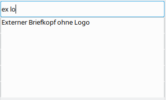

# {{ page.title }}

Die WollMux-Sidebar ist eine Leiste, die über Menüs und Buttons Zugriff auf Vorlagen und WollMux-Funktionen bietet.

## Konfiguration

Die WollMux-Sidebar liest ihre Konfiguration aus 2 Dateien. Zuerst liest sie die [Konfigurationsdatei wollmux.conf](Konfigurationsdatei_wollmux.conf), danach liest sie die Datei `$HOME/.wollmux/wollmubar.conf`, wobei `$HOME` unter Windows dem Profilverzeichnis des Benutzers entspricht. Konfigurationseinstellungen aus der `WollMux-Sidebar.conf` haben Vorrang.

## Aufruf

Die WollMux-Sidebar kann über alle Anwendungen von LibreOffice aufgerufen werden. Dazu muss die Sidebar aktiviert sein und das "Pinguin"-Symbol angeklickt werden.

## Suchleiste

Die WollMux-Sidebar unterstützt eine Suchfunktion, mit der nach einzelnen Einträgen in den Menüs der WollMux-Leiste gesucht werden kann:

Bei dieser Funktion können Sie in das Feld "Suchen..." ein beliebiges Wort oder den Teil eines Wortes schreiben, nach dem gesucht werden soll. Alle Menüeinträge, die dieses Wort oder den Teil des Worts enthalten, erscheinen anschließend in der Trefferliste. Bei der Suche wird nicht auf die korrekte Groß-/Kleinschreibung geachtet. Desweiteren können Sie mit Leerzeichen verschiedene Suchbegriffe trennen. Es werden dann nur Menüeinträge angezeigt, die alle ihre Suchbegriffe enthalten.

Beispiel:

Nach Eingabe von "ex" erscheinen in der Trefferliste alle Menüeinträge, die den Textteil "ex" enthalten. Die Menüpunkte "**Ex**<!-- -->terner Briefkopf..." werden auch gefunden, obwohl sie mit einem großen "E" beginnen. Die ausgegrauten weißen Zeilen zeigen an, in welchen Menüs bzw. Untermenüs die Menüeinträge gefunden wurden.

Hier wurde die Suche nach "ex" ergänzt um einen weiteren Suchbegriff "lo". Es werden nur noch Menüeinträge angezeigt, die "ex" UND "lo" enthalten (**Ex**<!-- -->terner Briefkopf ohne **Lo**<!-- -->go)

### Aktivierung der Suchleiste in Ihrem Referat

Dieser Abschnitt ist ausschließlich für Administratoren relevant, die in Ihrem Referat die Konfiguration des WollMux betreuuen. Er beschreibt, wie die Suchleiste über die WollMux-Konfiguration aktiviert werden kann.

Damit die Suchleiste in der WollMux-Sidebar angezeigt wird, müssen Sie in Ihre Konfiguration unter `<WurzelIhrerWollMux-Konfiguration>/vorlagen/<Standard, Blümchen, ...>` eine leere Datei mit dem Namen "`<Nummer>.<Name>.searchbox`" aufnehmen.

- Über die Nummer &lt;Nummer&gt; können Sie steuern, an welcher Stelle im Menü die Suchleiste angezeigt werden soll. Damit die Suchleiste wie im obigen Beispiel rechts oben vor dem "X"-Knopf angezeigt wird, musste im Falle der WollMux-Standard-Konfiguration der Wert 85 vergeben werden (zwischen 80.glue und 90.X.button)
- Über den Namen &lt;Name&gt; kann gesteuert werden, mit welchem Hinweistext die Suchleiste anfänglich belegt ist (z.B. "Suchen...").

Nachdem Sie die leere Datei angelegt haben, muss nur noch das Skript *run\_automux* gestartet werden.

<Category:Eierlegender_WollMux> <Category:Handbuch_des_WollMux>
