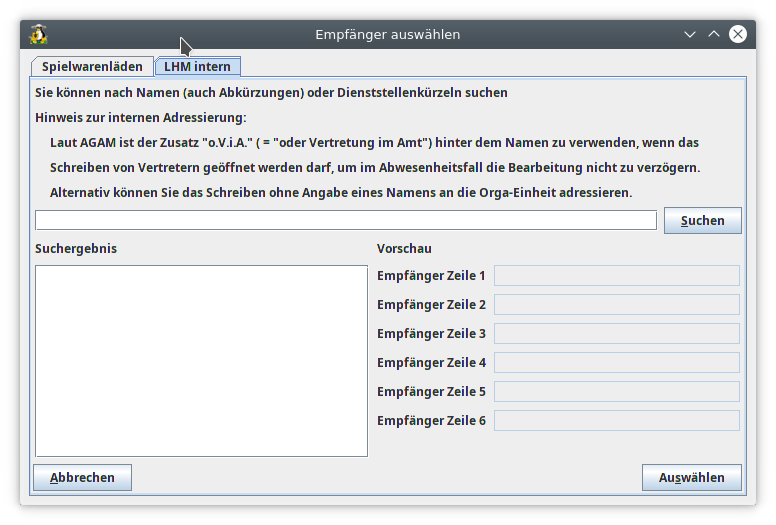

Seitenleiste
============

So öffnen Sie die Seitenleiste: Wählen Sie **Ansicht &rarr; Seitenleiste**

WollMux-Sidebar
----------

Die **[WollMux-Sidebar](WollMuxBar.md)** ist der Einstiegspunkt für alle Vorlagen und Formulare.

### Aufruf:

Seriendruck (WollMux)
---------------------

Über die Seitenleiste **Seriendruck** können Serienbriefe erstellt werden die auch WollMux Features, wie z.B. WollMux-Formulare, verwenden.

### Aufruf:

Symbolleisten
=============

So zeigen Sie eine geschlossene Symbolleiste an: Wählen Sie in **LibreOffice** --&gt; Menü **Ansicht** --&gt; **Symbolleisten** und klicken Sie auf den Namen der Symbolleiste.

Symbolleiste Sachleitende Verfügungen (WollMux)
-------------------------------------------------

Die Symbolleiste **Sachleitende Verfügen** stellt Werkzeuge zur Bearbeitung von Sachleitenden Verfügungen zur Verfügung.

[Hilfen für Sachleitende Verfügungen verwenden](Hilfen_fuer_Sachleitende_Verfuegungen_verwenden.md)

### Aufruf:

Falls noch nicht angezeigt: **LibreOffice** --&gt; Menü **Ansicht** --&gt; **Symbolleisten** --&gt; **Sachleitende Verfügungen (WollMux)**

### Die Schaltfläche Ziffer einfügen

[ Hilfen für Sachleitende Verfügungen verwenden - Ziffer einfügen](Hilfen_fuer_Sachleitende_Verfuegungen_verwenden.md#die-schaltfläche-ziffer-einfügen)

### Die Schaltfläche Abdruck

[ Hilfen für Sachleitende Verfügungen verwenden - Abdruck](Hilfen_fuer_Sachleitende_Verfuegungen_verwenden.md#die-schaltfläche-abdruck)

### Die Schaltfläche Zuleitungszeile

[ Hilfen für Sachleitende Verfügungen verwenden - Zuleitungszeile](Hilfen_fuer_Sachleitende_Verfuegungen_verwenden.md#die-schaltfläche-zuleitungszeile)

### Die Schaltfläche Immer drucken

[ Hilfen für Sachleitende Verfügungen verwenden - Immer drucken](Hilfen_fuer_Sachleitende_Verfuegungen_verwenden.md#schaltfläche-immer-drucken)

### Die Schaltfläche Nicht im Original

[ Hilfen für Sachleitende Verfügungen verwenden - Nicht im Original](Hilfen_fuer_Sachleitende_Verfuegungen_verwenden.md#schaltfläche-nicht-im-original)

### Die Schaltfläche Nur Original

[ Hilfen für Sachleitende Verfügungen verwenden - Nur Original](Hilfen_fuer_Sachleitende_Verfuegungen_verwenden.md#schaltfläche-nur-original)

### Die Schaltfläche Nur Entwurf

[ Hilfen für Sachleitende Verfügungen verwenden - Nur Entwurf](Hilfen_fuer_Sachleitende_Verfuegungen_verwenden.md#schaltfläche-nur-entwurf)

### Die Schaltfläche “Nur Abdrucke”

[ Hilfen für Sachleitende Verfügungen verwenden - Nur Abdrucke](Hilfen_fuer_Sachleitende_Verfuegungen_verwenden.md#schaltfläche-nur-abdrucke)

Symbolleiste Textbausteine (WollMux)
--------------------------------------

Die Symbolleiste **Textbausteine** stellt Werkzeuge zum Arbeiten mit Textbausteinen zu Verfügung.

### Aufruf:

Falls noch nicht angezeigt: **LibreOffice** --&gt; Menü **Ansicht** --&gt; **Symbolleisten** --&gt; **Textbausteine (WollMux)**

### Die Schaltfläche Textbaustein einfügen

Nach Betätigen der Schaltfläche , wird vom Cursor ausgehend rückwärts das erste Wort ausgewählt. Dieses wird dann durch einen Textbaustein ersetzt, falls ein solcher existiert. In den einzelnen Textbausteinen können Platzhalter eingefügt werden (LibreOffice&rarr;Menü “Einfügen”&rarr;Feldbefehle&rarr;Andere&rarr;Reiter “Funktionen”&rarr;Feldtyp “Platzhalter”&rarr;Format “Text”). Nach dem Einfügen der Textbausteine steht der Cursor auf dem ersten eingefügten Platzhalter. Mit dem Textbaustein können auch Parameter angegeben werden, die automatisch in freie Platzhalter eingetragen werden z.B `<Name des Textbaustein><SEPARATOR><Einzufügender Text><SEPARATOR><Einzufügender Text>`.

Damit Textbausteine über die Schaltfläche einfügt werden können, müssen diese über die [WollMux-Konfiguration](Konfigurationsdatei_wollmux_conf.md#textbausteine) eingebunden sein. In der WollMux-Konfiguration wird auch der Textbausteinname, der dann aufgerufen wird, konfiguriert. Der Befehl **Textbaustein einfügen** kann auch über die WollMux-Konfiguration einem [Tastenkürzel](Konfigurationsdatei_wollmux_conf.md#tastenkuerzel) zugeordnet werden.

Weitere Informationen:

* [wollmux:TextbausteinEinfuegen](Schnittstellen_des_WollMux_fuer_Experten.md#wollmuxtextbausteineinfuegen)
* [Tastenkuerzel](Konfigurationsdatei_wollmux_conf.md#tastenkuerzel)
* [Textbausteine](Konfigurationsdatei_wollmux_conf.md#textbausteine)
* [Textbausteine - SEPARATOR](Konfigurationsdatei_wollmux_conf.md#separator-)

### Die Schaltfläche Platzhalter anspringen

Über die Schaltfläche **Platzhalter anspringen** kann nach dem Einfügen der Textbausteine, vom ersten angefangen (falls es welche gibt), die darauf folgenden Platzhaltern angesprungen werden. Nach dem Anspringen können die Platzhalter durch Text überschrieben werden. Siehe auch [Schaltfläche “Textbaustein einfügen”](#die-schaltfläche-textbaustein-einfügen)

Weitere Informationen:

* [wollmux:PlatzhalterAnspringen](Schnittstellen_des_WollMux_fuer_Experten.md#wollmuxplatzhalteranspringen)

### Die Schaltfläche Empfänger auswählen

Über die Schaltfläche **Empfänger auswählen** wird der Dialog **Empfänger auswählen** aufgerufen. Über den Reiter **LHM intern** kann eine städtische Person gesucht werden und deren Adresse in das Empfängerfeld, z.B des Externen Briefkopf oder der Kurzmitteilung, übernommen werden. Der Reiter **Spielwarenläden** dient als Beispiel für Referate für eine Anpassung des Dialogs.

Weitere Informationen:

* [wollmux:FunctionDialog](Schnittstellen_des_WollMux_fuer_Experten.md#wollmuxfunctiondialog)
* [Funktionsdialoge](Konfigurationsdatei_wollmux_conf.md#funktionsdialoge)
* [Adressauswahl-Dialog](Standardkonfiguration_des_WollMux.md#Adressauswahl_Dialog)
* [Fragen rund um Datenquellen](Fragen_rund_um_Datenquellen.md)

Symbolleiste Werkzeuge für Vorlagenersteller (WollMux)
------------------------------------------------------

Bei der Symbolleiste **Werkzeuge für Vorlagenersteller** handelt es sich um eine Ansammlung von speziellen Werkzeugen die hauptsächlich von Vorlagenerstellern benötigt werden.

### Aufruf:

Falls noch nicht angezeigt: **LibreOffice** &rarr; Menü **Ansicht** &rarr; **Symbolleisten** &rarr; **Werkzeuge für Vorlagenersteller (WollMux)**

### Die Schaltfläche FormularMax 4000

Über die Schaltfläche **FormularMax 4000** wird der FormularMax 4000 gestartet. Der FormularMax 4000 ist eine integrierte Entwicklungsumgebung für die Erstellung und Pflege von WollMux-Formularen und Vorlagen.

Weitere Informationen:

* [FormularMax 4000](FormularMax_4000.md)

### Die Schaltfläche Textbausteinverweis einfügen

Über die Schaltfläche **Textbausteinverweis einfügen** wird der Befehl **Textbaustein einfügen** nicht gleich ausgewertet, sondern erst nach dem Speichern als Vorlage und spätrigen öffnen. Es kann z.B bei der Vorlagenerstellung verwendet werden, wenn gewünscht wird das die Textbausteine erst beim Verwenden der Vorlage eingefügt werden sollen. Siehe auch [Textbaustein einfügen](#die-schaltfläche-textbaustein-einfügen)

Weitere Informationen:

* [wollmux:TextbausteinVerweisEinfuegen](Schnittstellen_des_WollMux_fuer_Experten.md#wollmuxtextbausteinverweiseinfuegen)

### Die Schaltfläche Fehlerinfos erstellen

Die Schaltfläche **Fehlerinfos erstellen** erzeugt eine Datei `$HOME/.wollmux/dump<DatumUndZeit>`, die wichtige Informationen für die Fehlersuche im Zusammenhang mit dem WollMux enthält. Die Schaltfläche **Fehlerinfos erstellen** ist vor allem für WollMux-Administratoren geeignet, die bei der Installation und Einrichtung des WollMux auf Fehler stoßen, für deren Lösung Unterstützung durch IBS151 notwendig wird. In diesem Fall ist die über die Schaltfläche **Fehlerinfos erstellen** erzeugte dump-Datei an ein entsprechendes Vorfallticket anzuhängen.

Weitere Informationen

* [wollmux:DumpInfo](Schnittstellen_des_WollMux_fuer_Experten.md#wollmuxdumpinfo)

Menüeinträge
============

Info über Vorlagen und Formulare (WollMux)
------------------------------------------

In dem Dialog **Info über Vorlagen und Formulare** wird der verwendete WollMux und die verwendete Konfiguration angezeigt.

Weitere Informationen:

* [wollmux:About](Schnittstellen_des_WollMux_fuer_Experten.md#wollmuxabout)

### Aufruf:

**LibreOffice** &rarr; Menü **Hilfe** &rarr; **Info über Vorlagen und Formulare (WollMux)**

<Category:AG-Office> <Category:Eierlegender_WollMux>
<Category:Handbuch_des_WollMux> <Category:Office_Endanwender_Handbuch>
