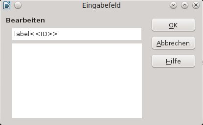
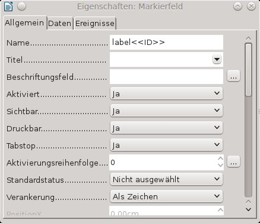
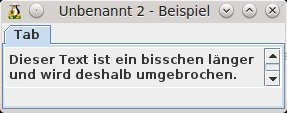
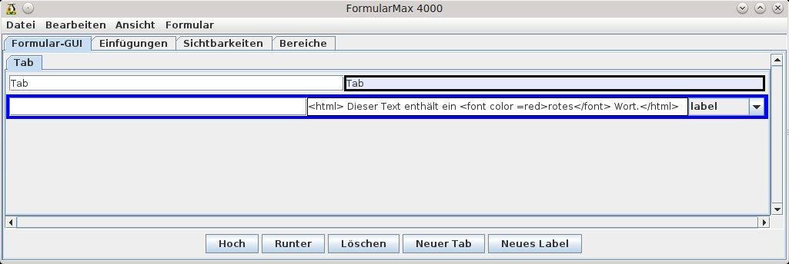

# Formular erstellen

<!-- toc -->

Der FM4000 ist ein Werkzeug, um aus Vorlagen WollMux Formulare zu erstellen. Mithilfe des FM4000 kann man viele Komfortfunktionen in Formulare einbauen, die es vorher zum größten Teil nicht gab.

Formular-GUI (GUI = Grafische Benutzerschnittstelle) lagert die Formularbearbeitung komplett in ein extra Fenster aus. Dieses erscheint links vom Writer Fenster. Um diese Formular-GUI zu erzeugen, wurde der FM4000 entwickelt. Dieser ist eine Entwicklungsumgebung für Vorlagenersteller, um Formulare zu erstellen.


Bei der Arbeit mit dem FM4000 sollte man folgende Dinge beachten:
* Kopieren und einfügen geht nur über „strg+c“ und „strg+v“; mit strg+x kann man ausschneiden
* Das Löschen von Elementen geht nicht über die Taste „Entf“ sondern nur über die Schaltfläche *Löschen*.

## Vorarbeiten

Bevor das Formular im FM4000 bearbeitet wird, müssen einige Vorarbeiten in der Vorlage vorgenommen werden, die die spätere Arbeit erleichtern werden.

Jedes Formular enthält Formularelemente. Im FM4000 bzw. im WollMux arbeitet man mit drei verschiedenen Typen:
* Eingabefelder
* Eingabelisten (Comboboxen)
* Markierfelder (Checkboxen)

Diese Felder müssen in der Vorlage angelegt oder schon vorhanden sein und sie sollten richtig beschriftet werden.

► Beim Umstellen einer MS Word Vorlage können die dort enthaltenen Formularelemente weiter verwendet werden.

Die Beschriftung ist im Standard immer so aufgebaut, dass zuerst die Bezeichnung (Label) des Feldes kommt und dann, ohne Leerzeichen dazwischen, in zwei spitzen Klammern die ID (Eindeutiger Bezeichner, der später im FM4000 benötigt wird). Die Bezeichnung und die ID des Feldes dürfen auch identisch sein. Der Text der Bezeichnung wird dann später in der Formular-GUI (Ausfüllhilfe) erscheinen. Dieser Text kann im FM4000 auch noch angepasst werden.

> **HINT** Bezeichnung&lt;&lt;ID&gt;&gt;<br>
für ein Feld „Wohnort“ könnte das dann so aussehen: Wohnort&lt;&lt;Wohnort&gt;&gt;<br>

Vorgaben für die Bezeichnung:
* zwischen der Bezeichnung und der ID ist kein Leerzeichen
* die ID darf keine Sonderzeichen und Umlaute enthalten
* erlaubt sind bei der ID Unterstrich „_“ und Zahlen, außer am Beginn der ID
* der Bezeichner kann beliebig aufgebaut sein

> **INFO** Wie man mehrere Felder mit den gleichen Werten füllt ist unter [Gleiche Werte mehrmals verwenden](Komfortfunktionen.md#gleiche-werte-mehrmals-verwenden) beschrieben

### Eingabefelder 

Ein Eingabefeld ist ein Feld, in das man beliebigen Text eingeben kann.

Zum Einfügen eines Eingabefeldes wählt man mit dem Cursor die Position aus, an der man das Eingabefeld einfügen möchte. Danach wählt man *Einfügen → Feldbefehl → Andere...* bzw. „Strg +F2“ und in dem dann erscheinenden Fenster wechselt man auf den Tab *Funktionen* .

Dort wählt man den Feldtyp Eingabefeld aus und fügt unter Hinweis die Beschriftung nach dem Muster **Label&lt;&lt;ID&gt;&gt;** ein.

Über *Einfügen* wird das Eingabefeld an der Cursorposition eingefügt.


Daraufhin öffnet sich der Eingabefeld - Dialog. Hier kann man in dem unteren Textbereich dem Eingabefeld noch Hinweise hinzufügen. Diese erscheinen später als Vorbelegung des Feldes, die aber überschrieben werden können. Man gibt an dieser Stelle zumindest mehrere (ca.5) Leerzeichen ein, damit man in der Vorlage besser erkennen kann, wo das Eingabefeld eingefügt wurde. Die Leerzeichen werden beim Anwenden der Vorlage automatisch bis auf ein einzelnes Leerzeichen gelöscht, damit kann man sofort mit der Eingabe beginnen, ohne die Leerzeichen selbst entfernen zu müssen.



Das Eingabefeld wird mit **OK** abgeschlossen.

### Eingabelisten (Comboboxen)

Eine Eingabeliste ist ein Feld bzw. Liste, in der man vorgegebene Werte auswählen kann. Der FM4000 bietet darüber hinaus die Funktion auch Freieingaben zu zulassen.

Zum Einfügen einer Eingabeliste wählt man mit dem Cursor die Position aus, an der man das Eingabefeld einfügen möchte. Danach wählt man *Einfügen → Feldbefehl → Andere...* bzw. „Strg +F2“ und in dem dann erscheinenden Fenster wechselt man auf den Tab *Funktionen*.

Dort wählt man den Feldtyp Eingabeliste aus und fügt unter Name die Beschriftung nach dem Muster **Label&lt;&lt;ID&gt;&gt;**ein. Die Werte für die Eingabeliste werden bei Eintrag eingegeben.

Über *Einfügen* wird die Eingabeliste an der Cursorposition eingefügt.


### Markierfelder (Checkboxen)

Markierfelder dienen zum Aktivieren oder Deaktivieren von Funktionen in Formularen. In vielen Fällen werden über Markierfelder, die Optionen ausgewählt, die für diesen Fall gelten sollen. Meistens verwendet man für Markierfelder den geläufigeren Namen „Checkboxen“.

Die Verwendung von Checkboxen unterscheidet sich deutlich von Eingabefeldern oder -listen.

Um Checkboxen einzufügen, benötigt man die dazugehörige Symbolleiste. Diese findet man unter *Ansicht → Symbolleisten → Formular-Steuerelemente*.

Falls in der Symbolleiste die Unterpunkte ausgegraut sind, muss noch der Entwurfsmodus aktiviert werden.

Um eine Checkbox einzufügen, klickt man auf das Icon in der Symbolleiste. Der Mauszeiger ändert sich daraufhin zu einem Fadenkreuz.


Danach zieht man die Checkbox an der Stelle, an der sie erscheinen soll auf (linke Maus Taste gedrückt halten).


Über Doppelklick auf die Checkbox öffnet sich das Eigenschaftenfenster.

Dort löscht man die Bezeichnung unter Titel und fügt bei Name wieder die Bezeichnung des Formularelements nach bekanntem Muster ein. (z.B.: Label&lt;&lt;ID&gt;&gt;).



Die Änderungen werden gespeichert, wenn man das Fenster über das „x“ rechts oben schließt.

**Tipps:**
* Verkleinern Sie den Bereich der Checkbox soweit wie möglich, damit diese möglichst wenig Platz benötigt.<br>
")
* Anstatt viele Checkboxen einzufügen und wieder anzupassen, empfiehlt es sich eine Checkbox einzufügen und diese dann zu kopieren. Dabei muss man nur noch die Bezeichnung ändern.
* Bei Problemen mit der Ausrichtung von Checkboxen kann man z.B. auf Tabellen zurückgreifen.
* Es empfiehlt sich, die Checkboxen „als Zeichen“ zu verankern.

----------------------------------------

## FormularMax 4000 aufrufen

Über *Ansicht → Symbolleisten* aktiviert man die Leiste *Werkzeuge für Vorlagenersteller (WollMux)*.

Diese erscheint mit drei Schaltflächen in der Menüleiste


Diese Einstellung braucht nur einmal vorgenommen zu werden. Solange keine Einstellungen am System verändert werden, bleibt sie so erhalten.

Über einen Klick auf die Schaltfläche *FormularMax 4000* wird der FM4000 gestartet. Die anderen beiden Schaltflächen sind für die Formularerstellung erst einmal irrelevant.

----------------------------------------

## Tabs im FM4000

Der FM4000 enthält vier Tabs, die unterschiedliche Aufgaben erfüllen:

### Tab *Formular-GUI*

In diesem Tab wird die Gestaltung der Formular-GUI festgelegt. Die einzelnen Schritte werden im Kapitel [Erstellen eines WollMux Formulars](FM4000.md#erstellen-eines-wollmux-formulars) detailliert erläutert.

### Tab *Einfügungen*

Der Tab *Einfügungen* bietet eine Übersicht aller Einfügestellen und erlaubt die Manipulation derselbigen in der Vorlage. Einfügestellen sind sowohl Stellen an denen Formularwerte eingefügt werden als auch Stellen an denen Daten aus der globalen Datenquelle (z.B. Sachbearbeiterdaten wie der Namen des Sachbearbeiters) eingefügt werden.

Man kann sich den Tab *Einfügungen* wie eine Art Verbindung zwischen dem Formular und der Writer Vorlage vorstellen.

### Tabs *Sichtbarkeiten* und *Bereiche*

Diese Tabs werden für die Erstellung und Anpassung von Sichtbarkeiten, wie sie im Kapitel [Sichtbarkeiten](Komfortfunktionen.md#sichtbarkeiten) erläutert werden, benötigt.

----------------------------------------

## Erstellen eines WollMux Formulars

Die nachfolgenden Kapitel beschreiben die Vorgehensweise zur Erstellung eines WollMux Formulars.Dazu sollte die Vorlage dringend so wie in der vorhergehenden Kapiteln beschrieben vorbereitet sein. Die hier vorgeschlagene Reihenfolge ist dabei größtenteils nicht zwingend einzuhalten.

### Formularfelder aus Vorlage einlesen

Über *Formular → Formularfelder* *aus Vorlage einlesen* werden alle Eingabefelder, Eingabelisten und Checkboxen, *die noch nicht von WollMux-Kommandos umschlossen sind* (d.h. nur die seit dem letzten Mal neu hinzugekommenen) aus der Vorlage eingelesen und in das Formular integriert. Des Weiteren werden die entsprechenden Formularelemente der Vorlage mit passenden WollMux-Textmarken umschlossen.

> **WARNING** Derzeit werden Checkboxen nur erfasst, wenn sie am Zeichen oder als Zeichen verankert sind oder wenn sie aus Word-Dokumenten importiert sind (und damit keine Standardverankerung haben).

Beim Erfassen der Felder schaut der FormularMax4000 nach speziellen Hinweisen/Namen/Einträgen, die diesem Muster entsprechen

`Text1<<Text2>>`

Diese Zusatzinformationen werden herangezogen um Labels, IDs und andere Informationen zu bestimmen. Folgende Fälle werden unterschieden:
* *Eingabefeld*: Als "Hinweis" kann "Label&lt;&lt;ID&gt;&gt;" angegeben werden und wird beim Import entsprechend berücksichtigt um Label und ID des Feldes in der Formular-GUI zu liefern. Wird nur "&lt;&lt;ID&gt;&gt;" angegeben, so markiert das Feld eine reine Einfügestelle (insertValue oder insertContent) und es wird kein Formularsteuerelement in der Formular-GUI erzeugt.
* *Eingabeliste/Dropdown*: Als "Name" kann "Label&lt;&lt;ID&gt;&gt;" angegeben werden und wird wie oben berücksichtigt. Als Spezialeintrag in der Liste kann "&lt;&lt;Freitext&gt;&gt;" eingetragen werden und ignalisiert dem FM4000, dass die ComboBox in der Formular-GUI auch die Freitexteingabe erlauben soll. Wie bei Eingabefeldern auch ist die Angabe "&lt;&lt;ID&gt;&gt;" ohne Label möglich und signalisiert, dass es sich um eine reine Einfügestelle handelt, die keine ComboBox in der Formular-GUI erzeugen soll. Falls vorhanden werden bis zu N-1 Leerzeichen am Ende der Einträge in der Dropdown-Liste entfernt, wobei N die Anzahl der Einträge ist, die bis auf folgende Leerzeichen identisch zu diesem Eintrag sind. Dies ermöglicht es, das selbe Wort mehrfach in die Liste aufzunehmen.
* *Checkbox*: Bei Checkboxen kann als "Hilfetext" "Label&lt;&lt;ID&gt;&gt;" angegeben werden und wird beim Import entsprechend berücksichtigt.
* Bei Eingabefeldern und Eingabelisten ist auch die Angabe "&lt;&lt;ID&gt;&gt;" ohne Label möglich. Dies signalisiert eine reine Einfügestelle an der der Wert des Formularfelds ID eingefügt wird. Dies wird verwendet, um den selben Wert an mehreren Stellen einfügen zu können ohne dass der Benutzer ihn mehrmals eingeben muss. Bei Eingabefeldern und Eingabelisten ist auch die Angabe "&lt;&lt;glob:ID&gt;&gt;" ohne Label möglich. Dies signalisiert eine insertValue-Einfügestelle, an der globale Daten (normalerweise die Absenderdaten des Sachbearbeiters) eingefügt werden.
* Bei Eingabelisten/Dropdows ist die Angabe "&lt;&lt;gender:ID&gt;&gt;" erlaubt. Diese erzeugt eine reine Einfügestelle, die mit einer Gender-TRAFO versehen wird, die abhängig vom Formularfeld ID einen der Werte des Dropdowns auswählt, und zwar bei "Herr" oder "Herrn" den ersten Eintrag, bei "Frau" den zweiten Eintrag und bei allem sonstigen den dritten Eintrag. Hat das Dropdown nur 2 Einträge, so wird im sonstigen Fall das Feld ID untransformiert übernommen. Falls vorhanden werden ein bis 2 Spaces am Ende eines Eintrages der Dropdown-Liste entfernt. Dies ermöglicht es, das selbe Wort mehrfach in die Liste aufzunehmen.

Die bei den Formularelementen vergebenen Bezeichnung erscheinen nun im Tab Formular-GUI. Dabei wird die linke Spalte aus der ID gebildet und die rechte Spalte aus dem Label.

### Formulartitel setzen

Über *Formular → Formulartitel* *setzen* kann man einen Titel für das Formular vergeben oder ändern.

Der Titel erscheint dann in der Programmleiste der Formular-GUI.

### Optische Gestaltung der Formular-GUI

Es gibt vielfältige Gestaltungsmöglichkeiten in der Formular-GUI. Man sollte letztendlich aber immer darauf achten, das Formular so benutzerfreundlich wie möglich zu gestalten.

#### Anpassung von Bezeichnungen (Labels) und Tabs

Die Labels werden prinzipiell schon in der Vorlage vergeben und dann in die Formular-GUI eingelesen. Oft ist es aber nötig diese Labels noch weiter anzupassen, um möglichst aussagekräftige Bezeichnungen zu erhalten. Die Bezeichnungen können im FM 4000 beliebig angepasst werden. Eine Formatierung des Textes direkt über den FM4000 ist nicht möglich. Allerdings kann der Text über html Befehle (z.B. Zeilenumbrüche, Schriftgröße, Schriftfarbe u.ö.) gestaltet werden. Details hierzu stehen im Kapitel [Formatierung von Text](FM4000.md#formatierung-von-text).

Zum Anpassen des Labels klickt man auf die entsprechende Stelle des Textes und schreibt dann ganz normal. Das markierte (Formular-)Element wird blau umrahmt. Genau so können auch Tabs umbenannt werden.


#### Einfügen und Löschen von Tabs

Wenn ein Formular viele Elemente enthält, sollte man mit mehreren Tabs arbeiten, um ein unnötiges Scrollen zu vermeiden. Um einen neuen Tab einzufügen, markiert man das Element (darauf klicken), das das erste Element auf dem neuen Tab sein soll und klickt dann auf die Schaltfläche *Neuer Tab*.

Um einen Tab wieder zu löschen, wählt man das Element „Tab“ (das oberste Element im Tab) aus und betätigt dann die Schaltfläche *Löschen*. Dabei werden die auf dem gelöschten Tab enthaltenen Elemente an den vorhergehenden Tab unten angehängt.

#### Einfügen und Löschen von Elementen

Zusätzlich zu den bereits eingelesenen Elementen können im FM4000 noch weitere Elemente angelegt werden. Diese werden dann nur in der Formular-GUI, aber nicht in der Vorlage angezeigt.

Neue Elemente werden immer über dem markierten Element durch die Schaltfläche *Neues Label* eingefügt.

Folgende Elemente stehen zur Auswahl:

* label<br>
Standardmäßig wird beim Betätigen der Schaltfläche *Neues Label* ein Label eingefügt. Ein Label dient z.B. dazu Hilfetexte oder Beschreibungen für andere Elemente oder ganze Bereiche einzufügen.
* combobox<br>
Hierüber wird eine Liste mit vorgegebenen Werten erstellt. Im Unterschied zur Eingabeliste in der Vorlage kann hier auch Freitext zugelassen werden.
  * „N“ fügt ein neuen Eintrag hinzu.
  * „X“ löscht einen vorhandenen, ausgewählten Eintrag
  * Über das Aktivieren des Kästchen zwischen der Combobox und dem „N“ kann festgelegt werden, ob Freitext zugelassen ist.
* textfield<br>
Über Textfield kann ein weiteres Eingabefeld eingefügt werden.
* textarea<br>
Die Textarea entspricht im Prinzip einem Textfield. Bei der Textarea kann allerdings die Anzahl der in der Formular-GUI anzuzeigenden Zeilen festgelegt werden.<br>
Manchmal ist es sinnvoll auch ein eingelesenes Textfield in eine Textarea umzuwandeln, wenn zu erwarten ist, dass in dieses Feld längerer Text eingegeben wird.
* separator<br>
Ein Separator ist eine horizontale Linie. Sie dient dazu zusammengehörige Elemente optisch zu gruppieren.
* glue<br>
Ein Glue ist ein unsichtbares Element, das dazu dient, Abstände zwischen 2 Feldern einzufügen.
* checkboxa<br>
Die Checkbox entspricht im Prinzip der Checkbox, die aus der Vorlage eingelesen werden kann. Sie kann entweder aktiviert oder deaktiviert sein.
* button<br>
Theoretisch können auch weitere Buttons definiert werden. Meistens werden aber nur die Buttons verwendet, die über *Einfügen → Standardelemente einfügen* eingefügt werden.

Um Elemente wieder zu löschen markiert man das Element und betätigt *Löschen*. Um mehrere Elemente gleichzeitig zu markieren, hält man die strg-Taste gedrückt.

#### Verschieben von Elementen

Über die Schaltflächen *Hoch* und *Runter* können Elemente beliebig verschoben werden. Wird das oberste Element eines Tabs noch oben verschoben, wird es an den vorhergehenden Tab – falls vorhanden - unten angehängt. Wird das letzte Element eines Tabs nach unten verschoben, wird es – falls noch ein weiterer Tab vorhanden ist - oben angefügt.

### Standardelemente einfügen

Es gibt vier vorgefertigte Standardelemente, die über *Bearbeiten → Standardelemente einfügen* eingefügt werden können. Dabei spielt es keine Rolle, ob bzw. welches Element im Moment in der Formular-GUI markiert ist, Standardelemente werden immer ganz unten auf dem aktuellen Tab eingefügt.

> **INFO** Seit WollMux-5.10.2 ist das *Standardelemente einfügen* Menü konfigurierbar, kann also von den hier vorgestellten Funktionalitäten abweichen.

#### Empfängerauswahl-Tab

Fügt am Anfang der Formularbeschreibung ein Standard-Tab ein zum Ausfüllen des Empfängerfeldes des externen Briefkopfes. Diese Funktion muss ausgeführt werden bei Dokumenten, die mit einem externen Briefkopf versehen sind (d.h. die auf Basis der Mischvorlage externer Briefkopf erstellt werden).

#### Abbrechen, &lt;-Zurück, Weiter-&gt;

Fügt ganz unten auf dem aktuell sichtbaren Tab die Standardbuttons "Abbrechen", "&larr;Zurück" und "Weiter&rarr;" ein. Dies sind die korrekten Buttons für ein mittleres Tab (d.h. ein Tab dem noch ein Tab vorangeht und eines folgt).

#### Abbrechen, &lt;-Zurück, PDF, Drucken

Fügt ganz unten auf dem aktuell sichtbaren Tab die Standardbuttons "Abbrechen", "&larr;Zurück", "PDF" und "Drucken" ein. Dies sind die korrekten Buttons für das letzte Tab. Gibt es nur ein einziges Tab sollte der Button "&larr;Zurück" gelöscht werden.

#### Abbrechen, &lt;-Zurück, Speichern, Drucken

Fügt ganz unten auf dem aktuell sichtbaren Tab die Standardbuttons "Abbrechen", "&larr;Zurück", "Speichern" und "Drucken" ein. Dies sind die korrekten Buttons für das letzte Tab. Gibt es nur ein einziges Tab sollte der Button "&larr;Zurück" gelöscht werden.

### Formatierung von Text

Text, z.B. von Labels, kann nicht direkt formatiert werden. Um Text zu formatieren, muss auf html tags zurückgegriffen werden. Diese bieten eine ausreichende Menge an Formatierungsmöglichkeiten.

#### Allgemeines

> **HINT** Alle html tags beginnen immer mit **&lt;html&gt;** und werden mit **&lt;/html&gt;** wieder geschlossen

Zwischen &lt;html&gt; und &lt;/html&gt; wird der Text des Labels geschrieben und die gewünschten Befehle wie Zeilenumbruch, Schriftgröße, Schriftfarbe, etc.. eingegeben.

#### Zeilen- bzw. Textumbrüche

Der Befehl für einen Zeilenumbruch ist **&lt;br&gt;**, br steht für break = umbrechen. Zeilenumbrüche macht man, damit die Formular-GUI nicht zu breit wird und deshalb zu wenig Platz für das Writer Fenster bleibt. Die Breite der Formular-GUI ergibt sich u.a. aus den Ausmaßen, der darin enthaltenen Label bzw. Bezeichnungen.

Beispiel: &lt;html&gt;Dieser Text ist ein bisschen länger&lt;br&gt; und wird deshalb umgebrochen.&lt;/html&gt;


Nach dem Speichern und öffnen als Dokument wird der Text dann wie gewünscht angezeigt.



#### Farbige Texte 

Farbige Texte beginnen mit dem Befehl **&lt;font color = farbe&gt;**, geschlossen wird der farbige Text mit **&lt;/font&gt;**. farbe wird mit einer Bezeichnung aus der folgenden Tabelle ersetzt; im Internet findet man noch zahlreiche weitere Farbbezeichnungen.

<table border="2" cellspacing="0" cellpadding="4" rules="all" style="margin:1em 1em 1em 0; border:solid 1px #AAAAAA; border-collapse:collapse; background-color:#F9F9F9; font-size:100%; empty-cells:show;" width=100%>
<tr>
<td bgcolor="#000000"><font color="white">black</font></td>
<td bgcolor="#808080">grey</td>
<td bgcolor="#800000"><font color="white">maroon</font></td>
<td bgcolor="#FF0000">red</td>
</tr>
<tr>
<td bgcolor="#008000">green</td>
<td bgcolor="#00FF00">lime</td>
<td bgcolor="#808000">olive</td>
<td bgcolor="#FFFF00">yellow</td>
</tr>
<tr>
<td bgcolor="#000080"><font color="white">navy</font></td>
<td bgcolor="#0000FF"><font color="white">blue</font></td>
<td bgcolor="#800080"><font color="white">purple</font></td>
<td bgcolor="#FF00FF">fuchsia</td>
</tr>
<tr>
<td bgcolor="#008080">teal</td>
<td bgcolor="#00FFFF">aqua</td>
<td bgcolor="#808080">silver</td>
<td bgcolor="#FFFFFF">white</td>
</tr>
</table>

Beispiel: &lt;html&gt;Dieser Text enthält ein &lt;font color = red&gt;rotes&lt;/font&gt; Wort.&lt;/html&gt;



Nach dem Speichern und öffnen als Dokument wird der Text dann wie gewünscht angezeigt.


#### Schriftgröße ändern

Um eine andere Schriftgröße zu wählen, nimmt man den Befehl **&lt;font size = größe**&gt;, beendet wird der Befehl wieder mit **&lt;/font&gt;**. größe ist durch 1 bis 7 zu ersetzen, wobei 1 die kleinste und 7 die größte Schriftgröße ist. 3 entspricht der Standardschriftgröße.

Beispiel: &lt;html&gt; Dieser Text enthält ein &lt;font size = 5&gt;großes&lt;/font&gt; und ein &lt;font size = 1&gt;kleines&lt;/font&gt; Wort.&lt;/html&gt;


Nach dem Speichern und öffnen als Dokument wird der Text dann wie gewünscht angezeigt.


#### Verwendung von styles

Um noch mehr Möglichkeiten für Schriftfarben und -größen zu haben und um beide einfacher zu kombinieren, kann man auf so genannte styles zurückgreifen.

Bei der Schriftgröße kann man so die aus Writer gewohnte Größe in pt angeben, z.B. 11pt, und kann so die Größe auch exakter steuern.

Bei der Farbe hat man die Auswahl aus allen RGB Farben. Übersichten zu den Codes findet man im Internet zur Genüge.

Die Befehle dazu lauten:
* Schriftgröße: `<span style=“font-size: 14pt“>...</span>`
* Schriftfarbe: `<span style="color:\#ff0000">...</span>`
* kombiniert: `<span style=“font-size: 14pt; color:\#ff0000">...</span>`

Der Farbcode kann auch durch den entsprechenden Namen (siehe [Farbige Texte](FM4000.md#farbige-texte)) ersetzt werden.

Beispiel: &lt;html&gt;Dieser Text erhält ab hier &lt;span style="font-size: 18pt; color:#6495ED"&gt;Schriftgröße 18 und die Farbe cornflowerblue&lt;/span&gt; und danach wieder normal.&lt;/html&gt;


Nach dem Speichern und öffnen als Dokument wird der Text dann wie gewünscht angezeigt.


### Formular Speichern und FM4000 beenden

*Datei → Speichern* und *Datei → Speichern unter...* sind identisch zu den Menüpunkten im Writer. *Datei → Beenden* beendet den FM4000, das Writer Fenster bleibt weiterhin geöffnet.

### Nachträgliche Änderungen

Oft kommt es vor, dass man nachträglich Änderungen an der Vorlage an den Labels und IDs in der Vorlage vornehmen muss. Z.B. weil neue Felder hinzugekommen sind oder Ids bzw. Labels anders vergeben werden sollen oder sich irgendwo ein Fehler eingeschlichen hat.

#### Neue Elemente in der Vorlage hinzufügen

Wenn in der Vorlage neue Elemente hinzukommen, werden diese einfach so eingelesen, wie bei einem neuen Formular. Es gibt keine Besonderheiten, die beachtet werden müssen.

Die neuen Elemente werden am Ende - also auf dem letzten Tab ganz unten angefügt. Sie werden dann über *Hoch* an die richtige Stelle in der Formular-GUI geschoben.

#### Vorhandene Elemente anpassen

Es gibt Fälle, in denen bereits vorhandene Elemente neu eingelesen werden müssen. Dabei sind ein paar Dinge zu beachten:

1. Das Element kann aus der Formular-GUI gelöscht werden. Die Schaltfläche *Löschen* entfernt das Element ausschließlich aus der Formular-GUI.
2. Im Tab Einfügungen wird die Verbindung des dazugehörigen Element über die Schaltfläche *DeMux* aufgehoben.
3. In der Writer Vorlage werden die Anpassungen vorgenommen.
4. Das weitere Vorgehen entspricht dem unter Kapitel [Neue Elemente in der Vorlage hinzufügen](FM4000.md#neue-elemente-in-der-vorlage-hinzufügen).

#### Vorhandene Elemente löschen

Wenn einzelne Elemente nicht mehr benötigt werden, können sie folgendermaßen komplett – sowohl aus der Formular-GUI als auch der Writer Vorlage gelöscht werden:

1.  Das Element wird aus der Formular-GUI gelöscht. Die Schaltfläche *Löschen* entfernt das Element ausschließlich aus der Formular-GUI.
2.  Im Tab *Einfügungen* wird das entsprechende Element ebenfalls über die Schaltfläche *Löschen* entfernt . Dies löscht sowohl die Einfügestelle – die Verbindung zwischen Formular und Vorlage - als auch das Element, das an dieser Einfügestelle liegt!

Sämtliche Elemente können über *Formular → WollMux-Formularmerkmale aus Vorlage entfernen* gelöscht werden. Damit wird die Vorlage im Prinzip wieder auf den Ausgangszustand zurückgesetzt. Dieser Befehl sollte nur dann verwendet werden, wenn das Formular vollkommen verworfen werden soll!

#### *Entfernen (Demux)* im Tab *Einfügungen*

Hierüber wird die Einfügestelle (=Textmarke) in der Vorlage gelöscht. Das dazugehörige Element in der Formular-GUI bleibt erhalten. Man benötigt diesen Button, wenn man alte Elemente löschen und beispielsweise durch neue ersetzen will.

### Weitere Optionen im FM4000

#### Formularbeschreibung editieren

Über *Formular → Formularbeschreibung editieren* schaltet man auf eine Texteditor-Ansicht zum manuellen Bearbeiten der Formularbeschreibung um. Im Prinzip kann man hier alles, was man über die grafische Oberfläche des FomularMax4000 macht, auch direkt in Textform eingeben. Man kann sich auch alles, was man mit dem FomularMax4000 eingestellt hat in Textform ansehen. Es gibt ein paar wenige Einstellungen, die man über die grafische Oberfläche nicht vornehmen kann und die dann hier eingegeben werden müssen (siehe [Aufheben von Gruppen in Sichtbarkeiten](Komfortfunktionen.md#aufheben-von-gruppen-in-sichtbarkeiten)).

Änderungen werden in der Formularbeschreibung nur über *Datei → Speichern* wirksam.

In den folgenden Bildern wird der externe Briefkopf als Formular im FormularMax4000 und der Formularbeschreibung dargestellt.


")

#### Ansichten anpassen

Über *Ansicht* können Sie die anzuzeigenden Elemente des FM4000 steuern. Standardmäßig werden die ID, Label, Type und Elementspezifische Felder angezeigt.

-   Über ID wird die (linke) Spalte, in der die ID steht, ein- oder ausgeblendet.
-   Über Label wird die (rechte) Spalte, in der das Label steht, ein- oder ausgeblendet.
-   Über Type wird der Typ, z.B. combobox, textfield oder checkbox ein- oder ausgeblendet.
-   Manche Formularelemente erlauben neben ID, Label und TYPE zusätzliche Angaben. Zum Beispiel kann man bei Elementen des Typs "combobox" die im Pull-Down-Menü auswählbaren Werte festlegen und ob die ComboBox direkte Eingaben erlauben soll. Bei Elementen des Typs "textarea" dagegen kann man die Anzahl der anzuzeigenden Zeilen spezifizieren. Ist *Ansicht → Elementspezifische Felder* angeschaltet, so werden die Bedienelemente für derartige Zusatzangaben eingeblendet.
-   TRAFO, PLAUSI, AUTOFILL blendet ein Zusatzpanel zum Bearbeiten derselbigen ein bzw. aus. Details zu diesen Themen stehen in Kapitel [AUTOFILLs, PLAUSIs, TRAFOs und GROUPS](Komfortfunktionen.md#autofills-plausis-trafos-und-groups).
-   Funktionstester: Öffnet ein weiteres Fenster, in dem Funktionen erstellt und getestet werden können. Weitere Informationen dazu stehen im Kapitel [Der Funktionstester](Komfortfunktionen.md#der-funktionstester).

#### Checkboxen zu ComboBox

Viele Formulare verwenden Reihen von Checkboxen in denen genau eine anzukreuzen ist (z.B. `[ ] Ja [ ] Nein [ ] keine Angabe`). Werden solche Checkboxen mit dem FM4000 erfasst, entstehen dadurch WollMux-Formulare die mit Checkboxen (die in der WollMux-FormularGUI immer vertikal angeordnet werden) überladen und nicht vernünftig bedienbar sind. Statt mehrerer Checkboxen sollte in solchen Fällen eine ComboBox verwendet werden, die je nach im Pull-Down-Menü ausgewählten Wert die passende Checkbox im Dokument aktiviert. Dies von Hand umzusetzen ist zwar möglich, aber sehr mühsam. Die Funktion *Checkboxen zu ComboBox* erledigt dies utomatisch und kann dadurch bei Formularen, die derartige Checkbox-Reihen verwenden, stark zur Verbesserung der Usability beitragen.

Die Funktion wird wie folgt verwendet:
1. Checkboxen erfassen
2. Alle Checkboxen mit Labels versehen. Die Labels der Checkboxen ergeben später die Einträge des Auswahlmenüs der ComboBox. Da sich diese später nicht mehr so leicht ändern lassen sollte auf diesen Schritt besondere Sorgfalt verwendet werden.
3. Die Checkboxen in die richtige Reihenfolge bringen. Die Einträge im Menü der ComboBox entsprechen nachher der Reihenfolge der Checkboxen. Da sich die Reihenfolge der Einträge der ComboBox derzeit nicht einfach ändern lässt, sollte auch dieser Schritt sorgsam überlegt sein.
4. Die Checkboxen bei gedrückter Strg-Taste mit der linken Maustaste markieren, so dass alle zu kombinierenden Checkboxen gleichzeitig markiert sind.
5. Menüpunkt *Bearbeiten/Checkboxen zu ComboBox* aufrufen. Wenn Sie alles richtig gemacht haben, dann werden die Checkboxen gelöscht und durch eine ComboBox ersetzt.

> **HINT** Technischer Hinweis: Dass je nach Auswahl des Eintrages in der ComboBox die richtige Checkbox aktiviert wird, wird durch TRAFOs auf den Einfügestellen (siehe Reiter *Einfügungen* im FM4000) realisiert, die die folgende Form haben:
```
MATCH(
  VALUE "ComboBoxWert"
  "<Eintrag in der ComboBox>"
)
```
Hieraus ist ersichtlich, dass ein nachträgliches Ändern der Werteliste der ComboBox eine Anpassung der entsprechenden TRAFOs auf den einfügestellen erfordert, da ansonsten die entsprechenden Checkboxen nicht mehr schalten. Der FM4000 versucht, bei Änderungen an der Werteliste die TRAFOs automatisch anzupassen. Dies funktioniert jedoch nur solange, wie zu jedem Zeitpunkt maximal ein Eintrag der Werteliste fehlt oder zuviel ist. D.h. wenn sie einen Eintrag zur Werteliste hinzufügen und dann einen alten Eintrag entfernen, so wird der FM4000 korrekt die entsprechenden TRAFOs, die vorher auf den entfernten Eintrag verwiesen haben so umbiegen, dass sie sich nun auf den neuen Eintrag beziehen. Wenn sie dagegen 2 Einträge zur Werteliste hinzufügen und dann 2 alte Einträge löschen, ist es sehr wahrscheinlich, dass der FM4000 die TRAFOs falsch anpasst. Sollte dies geschehen müssen die TRAFOs manuell angepasst werden.<br>

> **WARNING** Den Typ einer Checkbox in eine Combobox zu ändern, ist etwas anderes als das hier beschriebene Vorgehen und bringt in der Regel kein sinnvolles Ergebnis!

#### Druckfunktion setzen

Über *Formular → Druckfunktion* *setzen* können eine oder mehrere Druckfunktionen aus einer DropDown-Liste ausgewählt und für diese Vorlage verwendet werden.

In der DropDown-Liste werden alle Druckfunktionen angezeigt, die im globalen [Druckfunktionen-Abschnitt](../Konfigurationsdatei_wollmux_conf.md#druckfunktionen) der WollMux-Konfiguration konfiguriert sind.

#### Formular/Dateiname vorgeben

Über diesen Menüpunkte kann in der Vorlage eine Logik hinterlegt werden,die den Dateinamen vorschlägt unter dem ein neu aus der Vorlage erzeugtes Dokument abgespeichert werden soll, wenn es bislang noch nicht abgespeichert wurde (was daran zu erkennen ist, dass z.B. "Unbenannt 1" in der Titelzeile angezeigt wird). Dabei kann sich der vorgeschlagene Dateiname aus fest definierten Bestandteilen und aus Inhalten von Formularfeldern zusammen setzen.

Nach Betätigen des Menüpunktes erscheint ein Dialog in dem folgende Einstellungen getroffen werden können:
* Das Feld "Dateiname"<br>
In dieses Feld wird der zu vergebende Dateiname eingetragen, der sich aus Text und Inhalten von Formularfeldern zusammen setzen kann, die über einen Button "ID" eingefügt werden können. Ist die angegebene Datei mit einem absoluten Pfad hinterlegt (wie z.B. /mnt/share/mein\_verz/schreiben<UnserZeichen>\_<Datum>.odt oder U:\\gemeinsameSchreiben\\schreiben<UnserZeichen>\_<Datum>.odt), so wird dieser Pfad verwendet. Ist die Datei mit einem relativen Pfad hinterlegt (wie z.B. brief<UnserZeichen>.odt), so wird diese Datei relativ zu dem in LibreOffice unter Extras&rarr;Optionen/Pfade definierten Arbeitsverzeichnis aufgelöst. Ein evtl. angegebenes aber noch nicht existierendes Verzeichnis wird durch den WollMux nicht angelegt, sondern ignoriert.<br>
Enthält das Feld Dateiname keinen Inhalt, so ist die Funktion zum
Vorschlagen eines Dateinamens deaktiviert.
* Das Feld "Nachträgliche Anpassung"<br>
Über dieses Feld kann eine Funktion ausgewählt werden, die den sich aus
dem obigen Feld "Dateiname" ergebenen Dateinamen nachträglich anpasst.
Damit kann z.B. eine in Ihrem Unternehmen gesetzte Dateinamenskonvention
umgesetzt werden (wie z.B. das Ersetzen aller Umlaute ä, ö, ü durch ae,
oe und ue). In diesem Feld werden alle in Ihrer WollMux-Konfiguration
definierten Funktionen zur Auswahl angezeigt, die einen Parameter namens
"Filename" erwarten. Eine solche Funktion könnte z.B. wie folgt aussehen:
```
# Diese Funktion bring einen Dateinamen in eine garantiert bei der LHM zulässige Form.
# Dazu werden mehrere Anpassungen vorgenommen:
#
# 1) Die Umlautzeichen ö, ä, ü, ß werden durch oe, ae, ue, ss ersetzt
#    (in Groß- und Kleinschreibung)
# 2) alle anderen Zeichen außer a-z, A-Z, 0-9, _ und / werden durch _ ersetzt
# 3) Der Dateinamensteil ohne Suffix wird nach 236 Zeichen abgeschnitten
#
# Die Funktion verarbeitet Dateinamen mit und ohne Suffix.
Funktionen(
  LHMDateinamensanpassung(
    CAT(
      REPLACE( REPLACE( REPLACE( REPLACE( REPLACE( REPLACE( REPLACE( REPLACE( REPLACE( REPLACE(
        VALUE "Filename"
        "^(.*)\.\w+$" "$1") "ö" "oe") "ä" "ae") "ü" "ue") "Ö" "OE") "Ä" "AE") "Ü" "UE") "ß" "ss") "[^a-zA-Z_0-9\/]", "_") "(.{0,236}).*" "$1")
      IF(MATCH(VALUE "Filename", "^(.*)(\.\w+)$")
        THEN(REPLACE( VALUE "Filename", "^(.*)(\.\w+)$", "$2"))
        ELSE("")
      )
    )
  )
)
```
Die Angabe einer Funktion für die nachträgliche Anpassung ist optional.

> **INFO** Die Funktion "Formular/Dateiname vorgeben" kann erst verwendet werden, wenn das Formular einen Namen hat. Deshalb muss das Formular erst unter einem beliebigen Namen gespeichert werden und dann die Funktion angewandt werden. Ansonsten kann das Formular nicht mehr als Vorlage gespeichert werden!