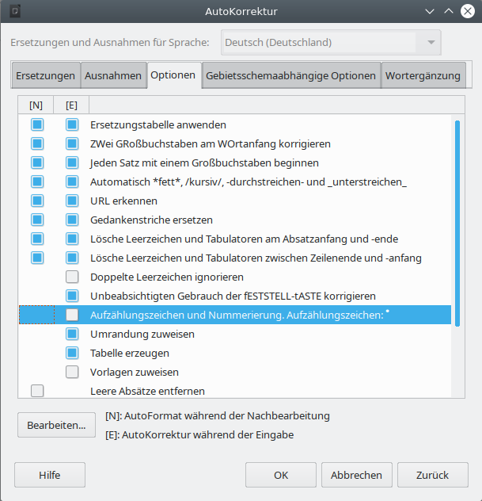
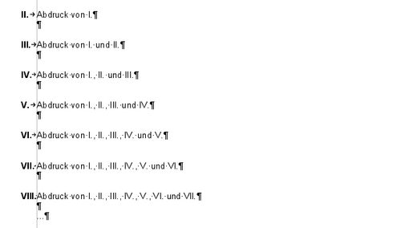
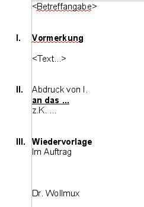

# Sachleitende Verfügungen

<!-- toc -->

Der WollMux bietet mit den Sachleitenden Verfügungen eine Möglichkeit die Ausdrucke zu regeln und andere Einstellungen (z.B. Druckblöcke) vorzunehmen.

## Einstellungen in LibreOffice

Folgende Einstellungen müssen in LibreOffice gesetzt sein, damit eine reibungslose Arbeit mit Sachleitenden Verfügungen möglich ist:

Unter *Extras → Optionen → /Writer/Formatierungshilfen* muss die Anzeige von ausgeblendeten Text ausgeschaltet sein. Beim Drucken verwendet der WollMux die Möglichkeit in LibreOffice, Textbereiche ausblenden zu können. Damit LibreOffice beim Drucken die Anzahl der Gesamtseiten richtig berechnen kann, dürfen die ausgeblendeten Bereiche nicht angezeigt werden. Diese Option ist auf dem Basisclient bereits richtig gesetzt.

Unter *Extras → AutoKorrektur Optionen... → Optionen* muss die Option „Nummerierung anwenden – Symbol:\*" deaktiviert sein. Die Verfügungspunkte von Sachleitenden Verfügungen beginnen mit römischen Ziffern. Damit LibreOffice diese Ziffern nicht als Aufzählungen interpretiert, muss diese Option ausgeschaltet werden. Auf dem Basisclient ist diese Option bereits richtig gesetzt. Außerdem schaltet der WollMux diese Option automatisch ab, wenn das erste Mal mit Sachleitenden Verfügungen gearbeitet wird.

Die Symbolleiste "Sachleitende Verfügung" muss im Writer im Menü *Ansicht" → Symbolleisten → Sachleitende Verfügungen (WollMux)* aktiviert werden. Die neue Symbolleiste enthält die Schaltflächen *Ziffer einfügen*, *Abdruck* und *Zuleitungszeile*. Des weiteren sind fünf Schaltflächen zur Erstellung der Blöcke zur Drucksteuerung enthalten:

----------------------------------------

## Setzen bzw. Einfügen von Sachleitenden Verfügungen

Über die folgenden drei Schaltflächen können die Sachleitenden Verfügungen eingefügt oder entfernt werden.

### Die Schaltfläche *Ziffer Einfügen*

Über die Schaltfläche *Ziffer Einfügen* ist es möglich eine römische Ziffer einzufügen, mit der ein Verfügungspunkt im Dokument gesetzt werden kann. Die neue Nummer ist um eins höher als die bereits im Dokument vorhandenen vorherigen Ziffern. Folgen auf den neu gesetzten Verfügungspunkt noch weitere Verfügungspunkte, so werden diese neu nummeriert, so dass die Gesamtnummerierung aller Verfügungspunkte wieder stimmt.

Ebenso können über die Schaltfläche bereits bestehende Verfügungspunkte entfernt werden. Steht der Cursor auf einem Absatz, der bereits eine Überschrift eines Verfügungspunktes ist, so wird die römische Ziffer am Anfang der Zeile gelöscht und die Formatierung dieses Absatzes auf "Fließtext" zurückgesetzt.

Im Externen Briefkopf wird die „I“ neben dem Empfängerfeld automatisch eingetragen sobald eine Sachleitende Verfügung in der Vorlage/im Dokument eingetragen wird.

### Die Schaltfläche *Abdruck*

Über die Schaltfläche *Abdruck* ist es möglich einen Verfügungspunkt mit dem Inhalt "Abdruck von I.\[...\]" einzufügen. Der neue Verfügungspunkt wird immer hinter dem Absatz eingefügt, in dem der Cursor steht.

Die Nummerierung der restlichen Verfügungspunkte wird dabei, wie unter [Die Schaltfläche *Ziffer Einfügen*](SLV.md#die-schaltfläche-ziffer-einfügen) beschrieben, automatisch angepasst. Bei bereits bestehenden Abdrücken wird dabei auch der Text "Abdruck von I.\[...\]" so angepasst, dass stets alle Vorgänger aufgeführt sind.

Folgendes Beispiel verdeutlicht, wie die automatische Benennung der Abdruck-Zeilen funktioniert. Es entstand durch mehrmaliges Drücken auf "Abdruck":

Ebenso können über die Schaltfläche bereits bestehende Abdrucke entfernt werden.

### Die Schaltfläche *Zuleitungszeile*

Über die Schaltfläche *Zuleitungszeile* ist es möglich Absätze als Zuleitungszeilen zu formatieren, die momentan markiert sind bzw. den Cursor enthalten. Jeder Absatz des Typs Zuleitungszeile führt zu einem weiteren Ausdruck. Eine Zuleitungszeile kann auch eine richtige Adresse mit Straße, Hausnummer und PLZ sein. Für mehrzeilige Zuleitungsangaben muss zwingend ein *Zeilen*umbruch (Shift-Enter bzw. *Einfügen → Manueller Umbruch → Zeilenumbruch*), kein *Absatz*umbruch (einfaches Drücken der Enter-Taste) verwendet werden, da ansonsten die Anzahl der ausgedruckten Exemplare falsch berechnet wird.

Falls der Absatz schon als Zuleitungszeile definiert ist, wird dieser nach Betätigen der Schaltfläche wieder aufgehoben (und das Absatzformat auf Fließtext zurückgesetzt).

----------------------------------------

## Die Schaltflächen zur Drucksteuerung einzelner Blöcke

Für all diese Druckoptionen gilt: Ist in der Wollmux-Konfiguration eine Hintergrundfarbe für diesen Druckblock definiert, so wird der Druckblock mit der dort definierten Farbe hinterlegt um den Block optisch abzuheben und leichter orten zu können. Beim Drucken eines entsprechenden Dokuments wird die Hintergrundfarbe **nicht** mit ausgedruckt.

### Schaltfläche *Immer drucken*

Mit der Schaltfläche *Immer drucken* kann ein markierter Block ausgezeichnet werden, der in allen Ausdrucken gedruckt wird, auch dann, wenn Textbereiche unter einer Überschrift eines Verfügungspunktes sonst ausgeblendet werden.

Zum Entfernen einer *Immer drucken* Markierung markiert man den entsprechenden Text mit der Maus und betätigt die Schaltfläche *Immer drucken* erneut.

### Schaltfläche *Nicht im Original*

Mit der Schaltfläche *Nicht im Original* kann ein markierter Block ausgezeichnet werden, der in allen Ausfertigungen außer dem Original gedruckt wird, Als Original gilt dabei grundsätzlich immer die Fassung, bei der alle römischen Ziffern inklusive I. ausgeblendet sind.

Das Markieren eines Blocks und das Aufheben der Markierung eines Blocks funktioniert analog zu *Immer drucken* durch das Betätigen der zugehörigen Schaltfläche.

### Schaltfläche *Nur Original*

Mit der Schaltfläche *Nur Original *kann ein markierter Block ausgezeichnet werden, der ausschließlich im Original gedruckt wird.Als Original gilt dabei grundsätzlich immer die Fassung, bei der alle römischen Ziffern inklusive I. ausgeblendet sind.

Das Markieren eines Blocks und das Aufheben der Markierung eines Blocks funktioniert analog zu *Immer drucken* durch das Betätigen der zugehörigen Schaltfläche.

### Schaltfläche *Nur Entwurf*

Mit der Schaltfläche *Nur Entwurf *kann ein markierter Block ausgezeichnet werden der nur im Entwurf gedruckt wird. Als Entwurf wird der Ausdruck bezeichnet der alle Sachleitende Verfügungen enthält.

Das Markieren eines Blocks und das Aufheben der Markierung eines Blocks funktioniert analog zu *Immer drucken* durch das Betätigen der zugehörigen Schaltfläche.

### Schaltfläche *Nur Abdrucke*

Mit der Schaltfläche *Nur Abdrucke* kann ein markierter Block ausgezeichnet werden, der nur in Abdrucken gedruckt wird. Als Abdrucke werden alle Ausdrucke außer dem ersten (dem Original) und dem letzten (dem Entwurf) bezeichnet.

Das Markieren eines Blocks und das Aufheben der Markierung eines Blocks funktioniert analog zum Block *Immer drucken* durch das Betätigen der zugehörigen Schaltfläche.

----------------------------------------

## Der Textrahmen "WollMuxVerfuegungspunkt1"

Ist in der Vorlage/im Dokument ein Textrahmen mit dem Namen "WollMuxVerfuegungspunkt1" vorhanden (Beispiel externer Briefkopf), so wird dieser Rahmen besonders behandelt. Er dient dazu, die Ziffer "I." zu positionieren, die im externen Briefkopf neben dem Empfängerfeld angezeigt werden soll.

Der Rahmen kann ausschließlich den Inhalt "I." besitzen und wird vom WollMux automatisch verwaltet. Bei der Erstellung dieses Textrahmens muss kein Inhalt eingefügt werden, da der WollMux den Inhalt "I." genau dann automatisch einträgt, wenn mindestens ein (weiterer) Verfügungspunkt im Dokument vorhanden ist. Ist kein Verfügungspunkt im Dokument vorhanden, so bleibt dieser Rahmen leer.

Ist in der Vorlage/im Dokument ein Textrahmen "WollMuxVerfuegungspunkt1" vorhanden, so beginnt die Zählung der weiteren Verfügungspunkte automatisch mit "II.".

----------------------------------------

## Definition von Textbereichen zum Ausblenden problematischer Inhalte

Manche Textinhalte werden von LibreOffice.org beim Drucken nicht korrekt ausgeblendet, wenn sie sich unterhalb eines ausgeblendeten Verfügungspunktes befinden. Davon sind folgende Elemente betroffen:

* An Seiten verankerte Objekte werden nicht ausgeblendet, da sie keinem Bereich angehören.
* Tabellen mit sichtbaren Rahmen: Beim Ausblenden eines Verfügungspunktes der eine Tabelle mit sichtbaren Rahmen enthält, wird zwar der Inhalt der Tabelle ausgeblendet, die Rahmen bleiben aber als Gerüst sichtbar.
* Manuelle Seitenumbrüche: Wird unterhalb eines ausgeblendeten Verfügungspunktes mit Seitenumbrüchen gearbeitet, so blendet LibreOffice.org diese Seitenumbrüche nicht aus. Als Ergebnis entstehen unerwünschte leere Seiten, bei denen nur die Kopfzeile mit einer falschen Gesamtseitenzahl angezeigt wird.

|||

Mit Hilfe sogenannter Textbereiche ist es aber dennoch möglich, diese Inhalte zuverlässig auszublenden. Dazu markiert man die betroffenen Textteile mit der Maus und fügt über *Einfügen → Bereich...* einen neuen Bereich ein. Abhängig von der Position des betroffenen Textteils muss man bei der Erstellung des Bereichs auf folgende Regeln achten:

* **Unterhalb eines Verfügungspunktes:** 
  Befindet sich der problematische Inhalt unterhalb einer Überschrift eines Verfügungspunktes, so kann der Bereich beliebig benannt werden. Man muss aber beim Markieren der betroffenen Textteile darauf achten, dass der Bereich nicht vor der Überschrift des zugehörigen Verfügungspunktes startet. Innerhalb eines so erzeugten Bereichs können keine Druckblöcke (z.B. *Immer drucken)* verwendet werden, da stets der gesamte betroffene Bereich ausgeblendet wird und so auch die Druckblöcke nicht angezeigt würden, wenn sie angezeigt werden sollten.
  ||
* **Innerhalb eines Blocks zur Drucksteuerung** 
  Mit den Blöcken zur Drucksteuerung können beliebige Textstellen beim Drucken der Sachleitenden Verfügungen ein- oder ausgeblendet werden, auch dann, wenn sie sich nicht direkt unterhalb einer Überschrift, sondern z.B. in einem eigenen Textrahmen befinden. Liegt der problematische Inhalt in einem solchen Druckblock, so muss der Bereichsname nach folgendem System aufgebaut sein:`<beliebiger Name> GROUPS '<SLV_Sichtbarkeitsgruppe>'` 
  Dabei können Sie an die Stelle &lt;beliebiger Name&gt; einen beliebigen Namen setzen. An der Stelle &lt;SLV\_Sichtbarkeitsgruppe&gt; muss einer der folgenden Werte eingetragen werden:
  * SLV\_AllVersions: Analog zum Druckblock "immer drucken" wird dieser Bereich in allen Ausfertigungen gedruckt.
  * SLV\_NotInOriginal: Analog zum Druckblock "immer außer Original" wird dieser Bereich in allen Ausfertigungen außer dem Original gedruckt.
  * SLV\_OriginalOnly: Analog zum Druckblock "nur im Original" wird dieser Bereich ausschließlich im Original gedruckt.
  * SLV\_DraftOnly: Analog zum Druckblock "nur im Entwurf" wird dieser Bereich nur im Entwurf gedruckt.
  * SLV\_CopyOnly: Analog zum Druckblock "Nur Abdrucke" wird dieser Bereich in alle Ausdrucke außer dem Original und dem Entwurf gedruckt.

Auf diese Weise definieren Sie einen Textbereich mit der Namenserweiterung GROUPS, der über obige spezielle Sichtbarkeitsgruppen angesteuert wird. Die Sichtbarkeitsgruppen werden beim Drucken automatisch vom WollMux gesetzt und steuern so die Sichtbarkeit des Textbereichs.

----------------------------------------

## Drucken von Sachleitenden Verfügungen

Sachleitende Verfügungen können über das Symbol in der Writer Symbolleiste oder über das Writer Menü *Datei → Drucken* ausgedruckt werden. Es erscheint der Dialog "Wollmux Komfortdruck" falls Sachleitende Verfügungen vorhanden sind.

### Ausdrucke

In der Spalte "Ausdrucke" sind die Überschriften aller erkannten Verfügungspunkte aufgelistet. Für jede Zuleitungszeile eines Verfügungspuntes wird der Kopien-Zähler dieses Verfügungspunktes um eins hoch gezählt.

### Kopien

In der Spalte "Kopien" kann für jeden Ausdruck eingestellt werden, wie oft dieser Ausdruck gedruckt werden soll. Da normalerweise für jede Zuleitungszeile des Verfügungspunktes eine Kopie benötigt wird, wird der Kopien-Zähler mit der Anzahl der zugehörigen Zuleitungszeilen vorbelegt. Um zu verhindern, dass ein Ausdruck erzeugt wird, setzen Sie den entsprechenden Kopien-Zähler auf 0.

### Ausdruck in umgekehrter Reihenfolge

Hier kann man festlegen, dass der Ausdruck in umgekehrter Reihenfolge startet. Bei aktivierter Checkbox wird zuerst der Entwurf (Wiedervorlage) gedruckt.

### Beispiel: Drucken einer Vormerkung

Über das Symbol *Datei direkt drucken* oder den Menüeintrag *Drucken* erscheint der Dialog "Wollmux Komfortdruck".

Nach Betätigen der Schaltfläche *Alle drucken* erhält man drei Ausdrucke. Jede als Zuleitungszeile markierte Zeile, zählt als ein Ausdruck. Wiedervorlage zählt ebenfalls als ein Ausdruck. Bei nicht benötigen eines Ausdruckes muss die Zahl entsprechend gesetzt werden. Ein- und Ausblendungen z.B für "I.A. Name" können über Schaltflächen zur Drucksteuerung einzelner Blöcke gesetzt werden.

<table>
<tr>
<td></td>
<td></td>
<td></td>
</tr>
<tr>
<td>Ausdruck kann auch einzeln über die Schaltfläche "Drucken" rechts neben "III. Weglegen" ausgedruckt werden</td>
<td>Ausdruck kann auch einzeln über die Schaltfläche "Drucken" rechts neben "II. Abdruck von I." ausgedruckt werden</td>
<td>Ausdruck kann auch einzeln über die Schaltfläche "Drucken" rechts neben "I. Vormerkung" ausgedruckt werden</td>
</tr>
</table>

### Drucken eines externen Briefkopfes

Über das Symbol *Datei direkt drucken* oder den Menüeintrag *Drucken* erscheint der Dialog "Wollmux Komfortdruck".

Nach Betätigen der Schaltfläche *Alle drucken *erhält man vier Ausdrucke. Jede als Zuleitungszeile markierte Zeile, zählt als ein Ausdruck. WV (Wiedervorlage) zählt ebenfalls als ein Ausdruck. Bei nicht benötigen eines Ausdruckes muss die Zahl entsprechend gesetzt werden. Ein- und Ausblendungen z.B für "I.A. Name" können über Schaltflächen zur Drucksteuerung einzelner Blöcke gesetzt werden.

<table>
<tr>
<th>Ausdruck "III. WV....."</th>
<th>Ausdruck "II. Abdruck von I."</th>
<th>Ausdruck "II. Abdruck von I."</th>
<th>Ausdruck "I. Original"</th>
</tr>
<tr>
<td></td>
<td></td>
<td></td>
<td></td>
</tr>
<tr>
<td>Ausdruck kann auch einzeln über die Schaltfläche "Drucken" rechts neben "III. WV ....." ausgedruckt werden</td>
<td>Ausdruck kann auch einzeln über die Schaltfläche "Drucken" rechts neben "II. Abdruck von I." ausgedruckt werden</td>
<td>Ausdruck kann auch einzeln über die Schaltfläche "Drucken" rechts neben "II. Abdruck von I." ausgedruckt werden</td>
<td>Ausdruck kann auch einzeln über die Schaltfläche "Drucken" rechts neben "I. Original" ausgedruckt werden</td>
</tr>
</table>

### Grundsätzliches zu Sachleitende Verfügungen Drucken

* Bei einem Externen Brief wird die I. als "I. Original" angezeigt, sonst wird die Beschreibung aus der Verfügung angezeigt (z.B. Vormerkung oder Niederschrift).
* Falls bei einer Verfügung kein Absatz als Zuleitungszeile markiert ist, wird der Druckzähler mit 1 initialisiert.
* Jede Ausfertigung kann einzeln mit einer Schaltfläche "Drucken" neben der entsprechenden Verfügung ausgedruckt werden.
* Die Summe aller Ausdrucke wird als "read only" Feld angezeigt.
* Alle Ausdrucke können über die Schaltfläche "Alle Drucken" ausgedruckt werden.
* Über die Schaltfläche "Druckeinstellungen" kann ein anderer Drucker ausgewählt werden oder Einstellungen geändert werden.

----------------------------------------

## Übersicht über mögliche Konstellationen

Hier eine Zusammenfassung des Verhaltens aller Schaltflächen in den verschiedenen möglichen Situationen:

<table border="2" cellspacing="0" cellpadding="4" rules="all" style="margin:1em 1em 1em 0; border:solid 1px #AAAAAA; border-collapse:collapse; background-color:#F9F9F9; font-size:100%; empty-cells:show;">
<tr>
<td bgcolor="#87CEFA">Situation/Schaltfläche</td>
<td bgcolor="#87CEFA">Ziffer Einfügen</td>
<td bgcolor="#87CEFA">Abdruck</td>
<td bgcolor="#87CEFA">Zuleitungszeile</td>
</tr>
<tr>
<td>1) Der Cursor steht auf Fließtext und markiert keinen Bereich</td>
<td>1a) Die römische Ziffer wird links in dem Absatz eingefügt, in dem sich der Cursor befindet (bei Bereichen an der Startposition des Cursors) und als Verfügungspunkt (fett) formatiert. Der Cursor bleibt unverändert.</td>
<td>1b) An der Cursorposition (Bei Bereichen vor der Startposition des Cursors) wird ein neuer Absatz eingefügt und als Verfügungspunkt mit dem Text "Abdruck von I. ..." formatiert. Danach folgt ein zusätzlicher Absatz nach dem Abdruck. Der Cursor steht in jedem Fall danach am Anfang des ersten Absatzes nach dem Abdruck.</td>
<td>1c) Der Absatz in dem sich der Cursor befindet wird als Zuleitungszeile formatiert und der Cursor bleibt unverändert.</td>
</tr>
<tr>
<td>2) Der Cursor steht auf einem Verfügungspunkt und markiert keinen Bereich</td>
<td>2a) Die römische Ziffer des Verfügungspunktes wird gelöscht und das Absatzformat auf "Fließtext" zurück gesetzt. Der Cursor bleibt unverändert.</td>
<td>2b) Am Ende des Absatzes des Verfügungspunktes wird der Abdruck eingefügt (bis auf die Position) wie unter 1b) beschrieben.</td>
<td>2c) Der Verfügungspunkt in dem sich der Cursor befindet wird als Verfügung mit Zuleitung formatiert und der Cursor bleibt unverändert</td>
</tr>
<tr>
<td>3) Der Cursor steht auf einem Abdruck und markiert keinen Bereich</td>
<td>3a) Der Abdruck wird entfernt wie unter 3b) beschrieben.</td>
<td>3b) Der komplette Absatz des Abdrucks wird gelöscht. Folgte auf den Abdruck eine Leerzeile, so wird auch diese gelöscht. Der Cursor steht danach am Ende der Vorgängerzeile des Abdruck</td>
<td>3c) Nach dem Abdruck wird eine neue Leerzeile eingefügt und diese als Zuleitungszeile formatiert. Der Cursor steht am Anfang der neuen Zuleitungszeile.</td>
</tr>
<tr>
<td>4) Der Cursor steht auf einem Verfügungspunkt mit Zuleitung und markiert keinen Bereich</td>
<td>4a) Die Ziffer wird entfernt und der Absatz als Zuleitungszeile markiert. Der Cursor bleibt unverändert.</td>
<td>4b) Am Ende des Absatzes des Verfügungspunktes mit Zuleitung wird der Abdruck eingefügt (bis auf die Position) wie unter 1b) beschrieben.</td>
<td>4c) Die Zuleitung wird entfernt, in dem der Absatz als normaler Verfügungspunkt formatiert wird. Der Cursor bleibt unverändert.</td>
</tr>
<tr>
<td>5) Der Cursor steht auf einer Zuleitungszeile und markiert keinen Bereich</td>
<td>5a) Die römische Ziffer wird in dem Absatz eingefügt, in dem der Cursor steht (bei Bereichen an der Startposition des Cursors) und der Absatz als Verfügungspunkt mit Zuleitung markiert. Der Cursor bleibt unverändert.</td>
<td>5b) Der Abdruck wird eingefügt wie unter 1b) beschriebe.</td>
<td>5c) Die Zuleitungszeile wird entfernt, in dem das Absatzformat auf "Fließtext" zurück gesetzt wird. Der Cursor bleibt unverändert.</td>
</tr>
<tr>
<td>6) Der Cursor erstreckt sich über mehrere Zeilen und markiert damit verschiedene Elemente (Verfügungspunkte, Zuleitungszeilen, Abdrücke, Verfügungspunkte mit Zuleitungen). Mindestens ein Absatz mit dem Typ des einzufügenden Elements ist in der Auswahl vorhanden:</td>
<td>6a) Alle enthaltenen Verfügungspunkte mit Zuleitung werden wie in 4a) beschrieben entfernt. Alle enthaltenen Abdrücke werden wie in 3b) beschrieben entfernt. Alle anderen enthaltenen Verfügungspunkte werden wie in 2a) beschrieben entfernt. Der Cursor bleibt unverändert</td>
<td>6b) Alle enthaltenen Abdrücke werden wie in 3b) beschrieben entfernt. Der Cursor bleibt unverändert.</td>
<td>6c) Alle enthaltenen Zuleitungszeilen werden wie in 5c) beschrieben entfernt. Der Cursor bleibt unverändert.</td>
</tr>
<tr>
<td>7) Der Cursor erstreckt sich über mehrere Zeilen und markiert damit verschiedene Elemente (Verfügungspunkte, Zuleitungszeilen, Abdrücke, Verfügungspunkte mit Zuleitungen). Jedoch ist kein Absatz mit dem Typ des einzufügenden Elements ist in der Auswahl vorhanden:</td>
<td>7a) Der Absatz, in dem sich die Startposition des Bereichs befindet wird als Verfügungspunkt formatiert (für Fließtext 1a) und für Zuleitungszeilen 5a)). Der Cursor bleibt unverändert.</td>
<td>7b) An der Startposition des Bereiches wird der der Abdruck eingefügt (für Fließtext und Zuleitungszeilen 1b), für für Verfügungspunkte 3b))</td>
<td>7c) Alle Fließtext-Absätze werden wie in 1c) behandelt, alle Abdrücke werden ignoriert und alle anderen Verfügungspunkte wie 2c) behandelt. Der Cursor bleibt unverändert.</td>
</tr>
</table>
