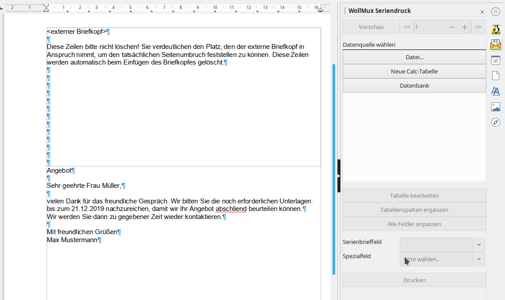

# Die Ausgangsvorlage bzw. das Ausgangsdokument

<!-- toc -->

## Vorlage oder Dokument

Auch wenn man jedes beliebige Formular oder bestehendes Dokument oder auch ein neues Dokument für den Seriendruck verwenden kann, empfiehlt es sich gut zu überlegen, ob nicht die Verwendung einer richtigen Vorlage für den Serienbrief die beste Möglichkeit ist. In den meisten Fällen sollte diese Frage mit ja beantwortet werden können. Nachfolgende Tablle zeigt die wichtigsten Unterschiede zwischen der Verwendung einer Vorlage oder eines Dokuments:

<table border="2" cellspacing="0" cellpadding="4" rules="all" style="margin:1em 1em 1em 0; border:solid 1px #AAAAAA; border-collapse:collapse; background-color:#F9F9F9; font-size:100%; empty-cells:show;">
<tr>
<td bgcolor="#87CEFA"></td>
<td bgcolor="#87CEFA">Vorlage</td>
<td bgcolor="#87CEFA">Dokument</td>
</tr>
<tr>
<td>Briefkopfdaten</td>
<td>Die Daten des <strong>aktuellen</strong> Bearbeiters werden eingetragen – dadurch können mehrere Leute mit der Vorlage arbeiten</td>
<td>Feste Daten des Erstellers – kann deshalb auch nur von diesem verwendet werden</td>
</tr>
<tr class="even">
<td>Briefkopf sichtbar in der „Vorlage“?</td>
<td>Nein</td>
<td>Ja</td>
</tr>
<tr class="odd">
<td>Aktualisierung der Briefkopfdaten</td>
<td>Alle Daten werden aktualisiert</td>
<td>Nicht möglich</td>
</tr>
<tr class="even">
<td>Verwendung von bereits enthaltenen Feldern (z.B. Empfaengerfeld1)</td>
<td>Ohne Einschränkungen möglich – auch wenn die Felder in der Vorlage nicht sichtbar sind</td>
<td>Ohne Einschränkungen möglich</td>
</tr>
<tr class="odd">
<td>Verwendung von Formularfunktionen</td>
<td>Ohne Einschränkungen möglich</td>
<td>Ohne Einschränkungen möglich</td>
</tr>
<tr class="even">
<td>Verwendung von Sachleitenden Verfügungen</td>
<td>Ohne Einschränkungen möglich</td>
<td>Ohne Einschränkungen möglich</td>
</tr>
<tr class="odd">
<td>Bearbeiten</td>
<td>Rechtsklick → Vorlage bearbeiten</td>
<td>Doppelklick zum Öffnen des Dokuments</td>
</tr>
</table>

Im Handbuch wird davon ausgegangen, dass eine Vorlage für die Erstellung des Serienbriefes verwendet wird, weil das in der Regel der bessere Weg ist. Das Vorgehen bei Verwendung eines Dokumentes unterscheidet sich davon aber nicht wesentlich, so dass hierfür der Inhalt des Handbuches genauso gilt.

## Auswahl der Vorlage oder des Briefkopfes

Sie können als Grundlage für Ihren Serienbrief jede Mischvorlage, jeden Briefkopf aus dem WollMux oder auch schon jede bestehende Vorlage bzw. Dokument verwenden. Falls Sie Ihren Serienbrief mit Formularfunktionen oder Sachleitenden Verfügungen kombinieren wollen, sollten Sie die dazugehörigen Handbücher anschauen.

Weil in der Praxis der externe Briefkopf wohl der häufigste Anwendungsfall sein wird, wird dieser als Beispiel verwendet.

## Erstellung des Serienbriefes

### Feste Inhalte

Am besten fängt man den Serienbrief so an, dass man alle festen Inhalte – falls nicht schon vorhanden – einfügt. Feste Inhalte sind die Bestandteile, die in jedem Serienbrief gleich sein werden. Die Teile, die die Serienbriefdaten enthalten werden, können zu diesem Zeitpunkt mit Platzhaltern oder Pseudeodaten belegt werden. Es würde sich ebenso anbieten, die Vorlage oder das Dokument gleich endgültig zu strukturieren und formatieren – idealerweise mit Formatvorlagen.

### Variable Inhalte – die Seriendruckfelder

Nachdem Sie alle festen Bestandteile der Ausgangsvorlage eingegeben haben, werden nun die variablen Bestandteile integriert.

Dazu müssen Sie zunächst eine Verbindung zwischen den Seriendruckdaten (Datenquelle) und der Ausgangsvorlage bzw. dem Ausgangsdokument (aktuelles Dokument) herstellen. Erst danach können Sie die Seriendruckfelder der gewählten Datenquelle in das Ausgangsdokument einfügen.

#### Verbindung von Ausgangsvorlage und Datenquelle

Öffnen Sie die Sidebar für den WollMux Seriendruck. Dort haben Sie vier Optionen eine Datenquelle zu verknüpfen:

1. *Datei...*: Hier können Sie eine bestehende Calcdatei aus dem Dateisystem als Datenquelle auswählen. Diese Datei wird dabei automatisch geöffnet.
2. *Datenbank*: Um eine Datenbank auszuwählen muss diese vorher unter LibreOffice registriert worden sein.
3. Wenn bereits eine Datenquelle (Calc Datei) offen ist, erscheinen diese als Einträge unterhalb der Schaltfläche "Datenbank" und können durch anklicken ausgewählt werden.
4. In dem Sie *Neue Calc-Tabelle* wählen, können Sie eine Datenquelle für Ihren Seriendruck anlegen. Danach geht es weiter wie in Kapitel [Die Datenquelle](datasource.md) beschrieben.

Wenn eine Datenquelle mehrere Tabellenblätter enthält, erscheint für jedes Tabellenblatt ein Eintrag in der Datenquellen-Liste.

#### Überprüfen und Austauschen der Datenquelle

Wenn man die Seriendruck-Sidebar öffnet, so sieht man direkt, ob die Vorlage mit einer Datenquelle verbunden ist. Dann ist unterhalb von "Datenbank"  ein Eintrag in der Datenquellen-Liste markiert.

#### Einfügen von Serienbrieffeldern

In der geöffneten und mit der Datenquelle verbundenen Vorlage gehen Sie folgendermaßen vor:

1. Positionieren Sie den Cursor an der Stelle, an der Sie das Serienbrieffeld einfügen wollen
2. Betätigen Sie die Schaltfläche *Serienbrieffeld*. Es erscheint eine alphabetische Liste mit allen Felder der Datenquelle.
3. Klicken Sie auf den benötigten Eintrag. Das Feld erscheint an der Cursorposition.

#### Löschen von Serienbrieffeldern

Serienbrieffelder lassen sich genauso löschen, wie anderen Zeichen auch. Also durch

* *Entf*, wenn der Cursor vor dem Serienbrieffeld steht.
* *Backspace*, wenn der Cursor nach dem Serienbrieffeld platziert ist.
* *Entf* oder *Backspace* wenn das Serienbrieffeld markiert ist.

#### Ersetzen von bereits vorhandenen WollMux-Formularfeldern durch Serienbrieffeldern

Wenn Sie als Basis für Ihren Serienbrief ein bereits fertiges WollMux-Formular verwenden wollen oder auch nur einen Briefkopf, müssen Sie nicht alle Felder, die Sie nicht mehr benötigen, weil sie durch Serienbrieffelder ersetzt werden, manuell löschen. Sie können diese Felder direkt über die Sidebar austauschen.

Dazu gehen Sie folgendermaßen vor:

1. Verbinden Sie Ihr Formular mit Ihrer Datenquelle – falls noch nicht geschehen.
2. Betätigen Sie in der Sidebar die Schaltfläche *Alle Felder anpassen*.
3. Es erscheint ein Fenster mit einer Liste aller Felder, die nicht aus der Datenquelle stammen. In der rechten Spalte können Sie die neuen Felder direkt eintragen oder durch Betätigen der Schaltfläche *Serienbrieffeld* auswählen.

   
4. Mit der Schaltfläche *Felder anpassen* werden die alten Felder durch die neuen ersetzt.

Alle Felder, die Bestandteil des Briefkopfes sind, sollten nicht ersetzt werden. Nicht benötige Felder bleiben leer und stören deshalb nicht. Für die benötigten Felder sollte die Anpassung in der Datenquelle erfolgen (siehe Kapitel [Datenquelle an die WollMux Felder anpassen](datasource.md#datenquelle-an-die-wollmux-felder-anpassen))

WollMux-Formularfelder, die nicht durch Serienbrieffelder ersetzt werden, werden mit den Daten aus dem Formular befüllt.

### Spezialfelder

Spezialfelder helfen abhängig von den Seriendruckdaten den Inhalt im Serienbrief zu steuern, ohne alles in der Datenquelle einzugeben. Wenn sie z. B. außer den Adressdaten noch eine variable Briefanrede in Ihrem Brief brauchen, gibt es verschiedene Wege das zu verwirklichen:

* **Ohne Spezialfelder:** Sie erstellen in der Datenquelle eine zusätzliche Spalte mit dem Feldnamen Briefanrede. 
  Pro Datensatz tragen Sie die entsprechende Anrede ein, wie „Sehr geehrter Herr Huber,“ „Sehr geehrte Frau Maier,“. In das Ausgangsdokument tragen Sie einfach das Seriendruckfeld Briefanrede (&lt;Briefanrede&gt;) an der entsprechenden Stelle ein.
* **Mit Spezialfeldern:** Sie verwenden das Feld Anrede um zwischen Frau und Herr zu unterscheiden und nutzen das Spezialfeld Gender, indem sie festlegen: Immer wenn im Feld Anrede Frau steht, soll Sehr geehrte Frau in den Brief eingetragen werden und immer wenn im Feld Anrede Herr steht soll Sehr geehrter Herr in den Brief eingetragen werden. Damit sparen Sie sich die zusätzliche Spalte in der Datenquelle.

Spezialfelder helfen, Ihre Datenquelle übersichtlich zu halten und flexibel mit Ihren Daten im Serienbrief zu arbeiten.

#### Einfügen und Bearbeiten von Spezialfeldern

Spezialfelder werden genauso eingefügt und gelöscht wie normale Serienbrieffelder.

Wenn Sie Spezialfelder nachbearbeiteten wollen, markieren Sie das gewünschte Spezialfeld und wählen in der Sidebar *Spezialfeld* → *Feld bearbeiten*. Es öffnet sich das Spezialfeld und kann bearbeitet werden.

#### Gender Funktion

Über das Spezialfeld Gender können geschlechtsspezifische Bezeichnungen anhand eines Seriendruckfeldes (i. d. R. Anrede mit dem Inhalt Frau/Herr – m/w – weibl./männl.) eingefügt werden.

Steht im Feld Anrede Frau, w, oder weibl., dann wird der Text im Feld *Text weibl*. in den Serienbrief geschrieben, steht im Feld Anrede Herr, m, oder maennl., dann wird der Text im Feld *Text männl.* in den Serienbrief geschrieben. Steht irgendetwas anderes im entsprechenden Feld, erscheint der Text aus dem Feld *Text sonst*. im Serienbrief.

#### Wenn...Dann...Sonst

Im Prinzip ist die Genderfunktion ein Spezialfall. Mit der Wenn...Dann...Sonst... Funktion kann der Inhalt eines Feldes universeller gesteuert werden. Wenn also ein Feld in der Datenquelle einen bestimmten Wert annimmt, soll ein definierter Wert angezeigt werden, ansonsten ein anderer Wert.

Wenn...Dann...Sonst-Felder sind verschachtelbar, hier sollte man allerdings beachten, dass die verschachtelten Felder einigermaßen übersichtlich bleiben. Außerdem sind in diesen Feldern Seriendruckfelder über die Schaltfläche *Serienbrieffeld* nutzbar.

Der Text im Dann- bzw. Sonst-Bereich des Feldes kann beliebig lang sein.

##### Beispiel: Entstehende Leerzeichen unterdrücken

Wenn Sie mit Seriendruckfeldern arbeiten, die auch leer sein können, kann es zu unerwünschten Leerzeichen bzw. -zeilen kommen. Diese leeren Stellen lassen sich mit dem Spezialfeld Wenn...Dann...Sonst... unterdrücken.

Wenn Sie in der Anrede auch Titel mit aufnehmen, werden Sie einige Personen haben, die einen Titel haben, viele werden aber ohne Titel sein. In der Vorlage würde das ohne Wenn...Dann...Sonst... Funktion so aussehen:

`Sehr·<Anrede>;·<Titel>·<Nachname>,`

zeigt entweder bei Personen mit Titel folgendes an:

`Sehr·geehrte·Frau·Dr.·Müller,`

oder bei Personen ohne Titel:

`Sehr·geehrter·Herr··Müller,`

Es würden also bei Personen ohne Titel zwei Leerzeichen zwischen Anrede und Nachname entstehen. Das ist optisch sind sonderlich schön, kann aber mit der Wenn...Dann...Sonst... Funktion leicht behoben werden:

Die Eintrag im Serienbrief sieht nun so aus:

`Sehr·<Anrede>·<Titel><Nachname>,`

Wobei das Feld Titel nun kein Serienbrieffeld mehr ist sondern ein Spezialfeld und zwischen &lt;Titel&gt; und Nachname **kein** Leerzeichen sein darf.

* **Wenn:** Hier ist die Bedingung dass der Titel genau leer ist.
* **Dann:** Ist das Feld leer
* **Sonst:** Wird der Titel angezeigt und ein Leerzeichen danach, dass allerdings in nicht sichtbar ist. Wenn man aber in das Feld klickt, sieht man den Abstand zwischen &lt;Titel&gt; und dem blinkenden Cursor.

Das führt zu folgendem Ergebnis:

* Mit Titel:

`Sehr·geehrte·Frau·Dr.·Müller,`

* Ohne Titel:

`Sehr·geehrter·Herr·Müller,`

Somit stimmen für beide Fälle die Anzahl der Leerzeichen zwischen den einzelnen Feldern.

##### Beispiel: Wertebereich

Es soll an Prüflinge ein Brief verschickt werden, in dem unter anderem auch steht, ob sie eine Prüfung bestanden haben, oder nicht. In unserer Datenquelle ist die Punktzahl der Prüflinge hinterlegt. In diesem Beispiel muss man von möglichen 15 Punkten mindestens 6 Punkte erreichen, um die Prüfung bestanden zu haben.

Für diesen Fall fügen Sie wieder ein Spezialfeld Wenn...Dann...Sonst... ein, das sich auf die Punktzahl bezieht. Das Feld sollte so aussehen wie in nachfolgender Abbildung.

Natürlich ist es genauso richtig, wenn man die Funktion umgekehrt angeben würde: `WENN Punktzahl < 6 DANN nicht bestanden SONST bestanden`.

#### Verschachtelung von Wenn...Dann...Sonst...Funktionen

Wenn...Dann...Sonst...Funktionen lassen sich nicht nur auf einer Ebene einsetzten, sondern können auch über mehrere Ebenen gehen – man nennt dies auch verschachteln. Dazu dient der Button "Neue Bedingung" der im Dann- und Sonst- zur Verfügung steht.

WENN Statement1 DANN tue dies SONST WENN Statement2 DANN tue das SONST tue was anderes.

##### Beispiel Wertebereich

Wenn man dem Beispiel mit den Prüfungsergebnissen aus dem vorherigen Kapitel hinzufügt, dass Prüflinge mit einem Prüfungsergebnis von 14 und 15 Punkten mit Auszeichnung bestanden haben, und Prüflinge mit 5 Punkten eine Nachprüfung machen können, benötigt man eine verschachtelete Wenn...Dann...Sonst...Funktion.

<table border="2" cellspacing="0" cellpadding="4" rules="all" style="margin:1em 1em 1em 0; border:solid 1px #AAAAAA; border-collapse:collapse; background-color:#F9F9F9; font-size:100%; empty-cells:show;">
<tr class="odd">
<td>Ergebnis</td>
<td>Eintrag im Feld</td>
</tr>
<tr class="even">
<td>14 -15</td>
<td>Bestanden mit Auszeichnung</td>
</tr>
<tr class="odd">
<td>13 – 6 </td>
<td>bestanden</td>
</tr>
<tr class="even">
<td>5</td>
<td>Nicht bestanden (Möglichkeit zur Nachprüfung)</td>
</tr>
<tr class="odd">
<td>4 - 0</td>
<td>Nicht bestanden</td>
</tr>
</tbody>
</table>

Auch hier sind mehrere Lösungsmöglichkeiten denkbar. Eine ist in nachfolgender Abbildung zu sehen.

#### Reguläre Ausdrücke

In der Wenn-Abfrage des Wenn...Dann...Sonst...-Feldes können Sie mit Regulären Ausdrücken arbeiten. Reguläre Ausdrücke sind Platzhalter, die Sie beim Suchen in LibreOffice verwenden können.

Beispiele:

* Platzhalter für genau ein beliebiges Zeichen: .
* Platzhalter für beliebig viele beliebige Zeichen: .\*

Weitere Reguläre Ausdrücke finden Sie in der Hilfe von LibreOffice.

#### Datensatznummer

Über dieses Spezialfeld können Sie auf jedem Brief die Nummer des Datensatzes in Ihrer Datenquelle aufdrucken. Beim Datensatz 100 stehtdann 100 auf dem Brief.

Wenn beim Drucken jeder Brief in eine eigene Datei gedruckt werden soll, z. B. um die Datei zu mailen, kann über das Feld Datensatznummer ein Dateiname automatisch erzeugt werden.

#### Serienbriefnummer

Über dieses Spezialfeld können Sie auf jedem Brief die Nummer des Serienbriefes des jeweiligen Ausdrucks ausgeben lassen. Wenn Sie also 100 Datensätze haben und alle Datensätze drucken, sind Datensatznummer und Serienbriefnummer identisch.

Wenn sie nur die Datensätze 50 – 100 für Ihren Seriendruck verwenden, hat der erste Brief die Datensatznummer 50 und die Serienbriefnummer 1.

Wenn beim Drucken jeder Brief in eine eigene Datei gedruckt werden soll, z. B. um die Datei zu mailen, kann über das Feld Serienbriefnummer ein Dateiname automatisch erzeugt werden.

#### Nächster Datensatz

Dieses Spezialfeld kann dazu verwendet werden, um auf einer Seite mehrere Datensätze zu drucken. Z.B. wird dieses Feld benötigt, wenn Sie Etiketten über den WollMux Seriendruck erstellen wollen.
