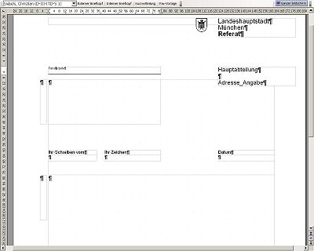
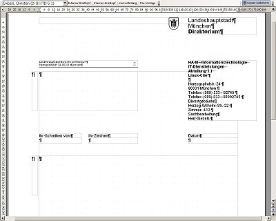
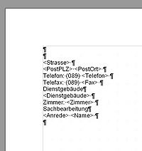

> **INFO** Dieser Artikel beschreibt anhand eines Beispiels die Erstellung eigener Vorlagen bzw. die Anpassung bestehender Vorlagen basierend auf der Seite [Textfragmente im WollMux](Textfragmente_im_WollMux.md "wikilink"), die auch ausführliche Informationen zum neuen Konzept der sog. "Textfragmente" enthält, die der WollMux unterstützt.

Als Beispiel dient die Vorlage für den externen Briefkopf, die für den
Wollmux neu - nach dem [Visuellen Erscheinungsbild](http://intranet.muenchen.de/?url=http://intranet.muenchen.de/basis/publ/erscheinungsbild/index.html)
der Landeshauptstadt München - erstellt wurde. Hinweise zur Gestaltung
des Briefkopfes sind im [Leitfaden zum Dokumentenaustausch](Leitfaden_zum_Dokumentenaustausch_zwischen_MS_Office_und_OOo#Erstellung_von_mit_MS_Office_austauschbaren_Vorlagen_in_Open_Office "wikilink") zu finden. Deshalb geht der Artikel nur auf die Einbindung der
entsprechenden Daten über [Textfragmente](Textfragmente_im_WollMux.md "wikilink") in vorhandenden oder
neu erstellten Vorlagen ein.

Weitere Dokumentationen
-----------------------

Hinweise zu den weiteren Dokumentationen zum Wollmux und zum Briefkopf
bzw. Formularsystem und welche davon sie für welche Fragestellung
benötigen, erfahren Sie im [Wegweiser](Handbuch_des_WollMux.md#wegweiser "wikilink").

Aufbau des externen Briefkopfs
==============================

Der Briefkopf wurde so erstellt, dass er möglichst flexibel für
Anpassungen von Inhalten ist. Alle Inhalte (bis auf den Schriftzug
"Landeshaupstadt München") werden über Textfragmente, bzw. bei der
Referatsbezeichnung über eine Textmarke, die auf eine Datenbank verweist
eingefügt. Die Vorlage besteht daher eigentlich überwiegend aus leeren
Rahmen, die die Textmarken enthalten. Die Textmarken werden beim
Generieren des Dokuments durch die Daten (aus verschiedenen
Datenquellen) ersetzt. Der grösste Teil des Inhalts kommt dabei aus dem
LDAP, Teile der Daten kommen aber auch aus anderen Datenquellen, z.B.
kommen die ÖPNV Verbindungen aus Textdateien.

**Abbildung 1** zeigt die Briefkopfvorlage mit den Textmarken.

**Abbildung 2** zeigt dann das daraus erzeugte fertige mit Daten
versehene Dokument.

 Abbildung 1   

 Abbildung 2

Die Textmarken verweisen auf andere Vorlagen, über die der Briefkopf
dann befüllt wird. Der Briefkopf besteht somit eigentlich aus mehreren
Vorlagen, wobei die Vorlage mit dem Layout des Briefkopfes die
"Mastervorlage" ist. Der Gedanke dahinter ist, dass das Masterdokument
für alle Referate gleich bleibt und nicht anpepasst werden muss. Die
Änderungen, die in den Referaten erforderlich sind, sollen über
Veränderungen in den Textfragmenten vorgenommen werden können. Dadurch
wird verhindert, dass es viele - teils unterschiedliche -
Briefkopfvorlagen für eigentlich einen Externen Briefkopf gibt. Sollten
Änderungen am Layout nötig sein, muss dies nur einmal zentral gemacht
werden.

In den nächsten Kapiteln werden die zwei Möglichkeiten beschrieben, wie
die Textmarken im Masterdokument aufgebaut sind, um die Daten entweder
direkt oder über Textfragmente einzufügen.

Direkte Einbindung von Datenfeldern
===================================

Im Externen Briefkopf wird nur der Referatsname mit einem direkten
Verweis auf die Datenquelle eingefügt. Dies konnte so gelöst werden, da
davon auszugehen ist, dass sich im Bereich des Referatsnamens keine
Änderungen bzgl. des Erscheinungsbildes (bzw. der Formatierung) ergeben
werden. Ist dies nicht sicher, eignen sich Textfragmente besser, da sie
wesentlich flexibler angepasst werden können. Nur beim direkten Einfügen
von Werten über Textmarken wird die Formatierung direkt im
"Masterdokument" vorgenommen.

Die Textmarke sieht folgendermassen aus:

`WM(CMD 'insertValue' DB_SPALTE 'Referat')`

Die Beschreibung zum Aufbau der Textmarke ist im Artikel [Dokumentkommandos des Wollmux](Dokumentkommandos_des_WollMux.md#das-kommando-insertformvalue "wikilink")
zu finden. Im Externen Briefkopf wird mit dieser Textmarke automatisch
das zum aktuellen Absender passende Referat eingefügt.

Die Textmarken, die auf Datenquellen verweisen, sind ebenfalls in den
Textfragmenten zu finden; die Textfragmente fassen zusammengehörende
Datenfelder für bestimmte Rahmen im Briefkopf, z.B. Absenderdaten
zusammen und erleichtern somit die Anpassung der Briefkopfdaten.

Wie die Abbildung der Daten des LDAP auf die im BKS verwendete
Spaltenstruktur erfolgt, sieht man
[hier](Dokumentkommandos_des_WollMux.md#verwendete-felder-aus-dem-ldap "wikilink").

Erstellung von Textfragmenten
=============================

Die Erstellung von Textfragementen ist denkbar einfach. Sie ersetzen die
direkte Einbindung von Datenfeldern, indem sie zusammengehörende Werte
quasi in andere Vorlagen (Textfragmente) auslagern. Dies gewährleistet
eine hohe Flexibilität im Bezug auf Anpassung von Formatierungen und
Anpassung/Ergänzung von Werten. Ein Beispiel für den Aufbau eines
Textfragment sieht man in **Abbildung 3**.

 Abbildung 3

**Aufbau des Textfragments:**
-   in diesem Beispiel ist die erste Leerzeile für die Leerzeile zwischen der Angabe zur Hauptabteilung und den restlichen Adressangaben
-   bevor die Auflistung der Platzhalter beginnt, ist immer eine Leerzeile nötig, genauso am Ende des Textfragments, werden diese weggelassen, kann es passieren, dass die erste oder letzte Zeile des Fragements im Masterdokument falsch formatiert wird.
-   in diesem Beispiel sind die Platzhalter zur besseren Unterscheidung immer mit "&lt;...&gt;" gekennzeichnet
-   damit die Darstellung auch unter MS Word noch passt, ist am Ende jeder Zeilen nach der letzten Textmarke ein Leerzeichen einzufügen, ansonsten wird der Zeilenumbruch in MS Word "verschluckt"; **ab der Wollmux Version 0.96 sind keine Leerzeichen in den Vorlagen mehr erforderlich**
-   Die Formatierung (über Formatvorlage) erfolgt im Textfragment, allerdings sind die verwendeten Formatvorlagen ausgelagert, um sie einfacher für mehrere Vorlagen verwenden zu können. Genaueres steht weiter unten unter [ Hinweise und Tips](#formatvorlagen "wikilink")

Die Textmarken entsprechen der Syntax wie sie bereits oben erwähnt ist,
z.B. fügt folgende Textmarke die Strasse für die Postanschrift ein:

`WM(CMD'insertValue' DB_SPALTE'Postanschrift')`

Einbinden von Textfragmenten
============================

  -----------------------------------------------------------------------
  **Achtung: Dieser Punkt ist veraltet und bedarf einer Überarbeitung**
  -----------------------------------------------------------------------

Nachdem das Textfragment erstellt wurde muss es natürlich noch in das
Masterdokument "eingebunden" werden. Dies geschieht wieder über
Textmarken. Dazu geht man folgendermassen vor, wobei die Reihenfolge
(bei 1. - 3.) nicht zwingend ist:

1.  Im Masterdokument (bzw. in einem Textfragment) wird eine Textmarke
    angelegt mit folgendem Aufbau:

    `WM(CMD 'insertFrag' FRAG_ID 'Adresse_Angaben')`

    Der Befehl wird in [Dokumentkommandos des    Wollmux](Dokumentkommandos_des_WollMux.md#das-kommando-insertfrag "wikilink") erläutert.

2.  Natürlich funktioniert das Ganze so noch nicht, da die FRAG\_ID
    'Adresse\_Angabe' undefiniert ist. Folgender Schritt ist deshalb
    noch notwendig: in der
    [Textfragmente.conf](http://limux.tvc.muenchen.de/ablage/sonstiges/wollmux/Textfragmente.conf)
    ist ein entsprechender Eintrag vorzunehmen, der der FRAG\_ID eine
    entsprechende Datei bzw. Vorlage zuweist. In diesem Fall schaut die
    entsprechende Zeile in der
    [Textfragmente.conf](http://limux.tvc.muenchen.de/ablage/sonstiges/wollmux/Textfragmente.conf)
    so aus:

    `(FRAG_ID "Adresse_Angaben" URL "${StadtweiteVorlagen}/WOL_Briefkopf-Fragment-Absenderadresse_v1_2005-11-21.ott")`

    Es ist empfehlenswert die Einträge mit einem Kommentar zu versehen,
    da man aus dem Dateinamen nicht unbedingt erkennen kann, für was das
    Textfragment steht.

3.  Die Datei muss in das Verzeichnis, auf das {StadtweiteVorlagen}
    verweist, gestellt werden, damit die entsprechende Auflösung über
    die Textfragmente.conf auch funktionieren kann.

4.  Nach dem Vornehmen dieser Änderungen muss OpenOffice.org komplett
    neu gestartet werden, dazu müssen alle offenen OpenOffice Fenster
    und auch der Schnellstarter beendet werden.

5.  Bei Problemen empfiehlt es sich, die Meldungen in der wollmux.log im
    entsprechenden Benutzerverzeichnis anzusehen.

Mischen von Dokumentinhalten und Briefköpfen
============================================

Der Wollmux ermöglicht es Inhalte von Dokumenten mit Briefköpfen zu
mischen und so Briefe oder Dokumente zu erstellen, die mit aktuellen
Benutzerdaten befüllt werden können. Dazu geht man folgendermaßen:

-   In der WollMuxLeiste im Menü Standard im Untermenü Mischvorlagen die
    passende Vorlage wählen.
-   Es öffnet sich ein Dokument, das im ersten Absatz einen Platzhalter
    enthält, z.B. "&lt;externerBriefkopf&gt;". Dieser ganze erste Absatz und
    der darauffolgende leere Absatz dürfen nicht bearbeitet werden.

> **WARNING** Wenn Sie beim Öffnen der Mischvorlage nicht den oben erwähnten Platzhalter sehen, sondern ein kompletter Briefkopf aufgebaut wird, dann liegt ein Fehler vor. Generell ist es so, dass Sie beim Bearbeiten einer Vorlage **niemals** Sachbearbeiterdaten sehen sollten. **Wenn Sie einen Briefkopf mit Sachbearbeiterdaten sehen, so werden diese beim nächsten Speichern fest in das Dokument integriert. Der WollMux kann solche Vorlagen *nicht* mit neuen Sachbearbeiterdaten befüllen.** Das Mischprinzip wird dadurch ausgehebelt. Dies sollte unbedingt vermieden werden.

-   Fügen Sie nun anstelle des Erklärungstextes Ihren gewünschten Text
    für die Vorlage ein.
-   Speichern Sie die Vorlage nun: *<Beliebiger Name>.ott*

> **WARNING** Wählen Sie beim Speichern unbedingt den Typ "OpenDocument Textdokumentvorlage (\*.ott)"

-   Wenn Sie jetzt die Vorlage normal durch Doppelklick im Dateimanager
    öffnen, erhalten Sie einen ausgefüllten Briefkopf mit dem von Ihnen
    eingefügten Text. Als Absender wird immer der in der Wollmux
    Kommandozentrale eingestellte Absender verwendet.
-   Falls gewünscht kann die Vorlage in ein Menü der WollMux-Leiste
    eingepflegt werden.

Hinweise und Tips
=================

Grafiken und Text in der Fusszeile
----------------------------------

Viele Dienststellen verwenden in der Fusszeile ihres externen
Briefkopfes Logos. Für die Fusszeilen wurden 3 Beispiele (2-, 3-, oder
4-spaltig) zur Verfügung gestellt. Die Logos können über Textfragmente
an beliebiger Stelle in der Fusszeile eingefügt werden. Allerdings ist
zu beachten, dass Grafiken und Text möglichst nicht in einer Spalte
stehen sollten, da die Formatierung des Textes (insb. der ersten Zeile)
verloren geht. Am besten legt man das Logo in eine eigene kleine Spalte,
die in jede der Fusszeilen(-spalten) eingefügt werden kann.

Formatvorlagen
--------------

Wie oben schon erwähnt, befinden sich die in den Textfragmenten [verwendeten Formatvorlagen](Formatvorlagen.md "wikilink") in separaten
Vorlagendateien. Dies erleichtert es die gleichen Formatvorlagen in
allen Textfragmente und Briefkopfvorlagen zu verwenden. Die Vorlage mit
den "ausgelagerten" Formatvorlagen wird genauso wie die Textfragmente
über eine Textmarke in die "Mastervorlage" eingefügt. Damit stehen dort
alle Formatvorlagen zur Verfügung.

Einige Punkte gibt es dabei zu beachten:

1.  Die Formatvorlage "Standard" darf nicht in Vorlagen und auch nicht
    als Basis für Verknüpfungen verwendet werden. Statt dessen kann für
    normalen Fließtext die Formatvorlage "Fließtext" benutzt werden.
2.  Es dürfen in der Mastervorlage keine Formatvorlagen mit gleichen
    Namen, wie die einzufügenden Formatvorlagen verwendet werden. Eine
    "Überschreibung" der Werte der bereits vorhandenen Formatvorlagen
    mit neu eingefügten ist nicht möglich.
3.  Die Textmarke für die Vorlagendatei muss möglichst am Anfang der
    Mastervorlage vor der ersten Textmarke, die auf ein Textfragment
    verweist, eingefügt werden. Im externen Briefkopf steht die
    Textmarke vor dem "L" von "Landeshauptstadt München". Auf das Layout
    des Briefkopfs hat dies keine Auswirkung.
4.  Die Formatvorlagen für vorgegebenen Text oder für Textmarken, die
    direkt auf Datenquellen verweisen, müssen sich logischerweise in der
    "Mastervorlage" befinden, damit sie verwendet werden. Es schadet
    nicht, wenn die Formatvorlagen mit gleichen Namen mittels der über
    ein Textfragment eingefügten Vorlage mit den ausgelagerten
    Formatvorlagen nochmals eingefügt werden, da sie nicht
    überschrieben werden.
5.  Wichtig ist, dass die Formatvorlagen in den Textfragmenten den
    gleichen Namen wie die passende Formatvorlage in der Vorlage mit den
    Formatvorlagen haben. Ist dies nicht der Fall , werden beim Einfügen
    in die Mastervorlage die Formatvorlagen aus dem Textfragment
    verwendet und nicht die Formatvorlagen aus der Vorlagendatei. Es
    spielt keine Rolle, ob die Formatvorlagen im Textfragment nur den
    entsprechenden Namen oder den entsprechenden Namen mit den
    identischen Einstellungen haben, da beim Einfügen ins Masterdokument
    die Einstellungen aus der Vorlagendatei hergenommen werden.

    Zweck dieses Vorgehens ist es alle Formatvorlagen an einer zentralen Stelle zu sammeln, um bei späteren Änderungen an den Formaten, diese nur an einer Stelle vornehmen zu müssen.

"Verschachtelte" Textfragmente
------------------------------

Es besteht natürlich auch die Möglichkeit in Textfragmenten auf andere
Textfragmente zu verweisen. Im Externen Briefkopf z.B. gibt es eine
Textmarke, die auf eine Textfragment "Fusszeile..." verweist. Das
Textfragment "Fusszeile..." verweist wiederum auf weitere Textfragmente,
die Informationen zu ÖPNV, Homepage o.ä. enthalten.

Dokumentschutz
--------------

Es gibt verschiedene Methoden, das Dokument zu schützen

-   Extras/Optionen/OpenOffice.org/Sicherheit Checkbox "Dieses Dokument
    schreibgeschützt öffnen" anschalten, dann wird das aktuelle Dokument
    beim Speichern geschützt, so dass es beim erneuten Öffnen
    schreibgeschützt geöffnet wird.
    -   Die Funktion betrifft nur das aktuelle Dokument (obwohl sie in
        Extras/Optionen steht)
    -   Dies funktioniert auch bei Vorlagen (dann wird das Unbenannte
        Dokument schreibgeschützt)
    -   Man kann Bereiche definieren, die auch bei schreibgeschützten
        Dokumenten bearbeitbar sind (nur so ergibt z.B. das Schützen von
        Vorlagen einen Sinn)
-   Mit der Maus Text markieren und Einfügen/Bereich wählen erlaubt es,
    einen Bereich einzuführen, den man schützen kann. Dieser Bereich ist
    auch im nicht schreibgeschützten Dokument nicht beschreibbar. Wie
    oben erwähnt kann man umgekehrt auch Bereiche definieren, die auch
    in schreibgeschützten Dokumenten beschreibbar sind.

<Kategorie:Office_Vorlagenumsteller_Handbuch>

<Category:AG-Office> <Category:Eierlegender_WollMux>
<Category:Handbuch_des_WollMux>
