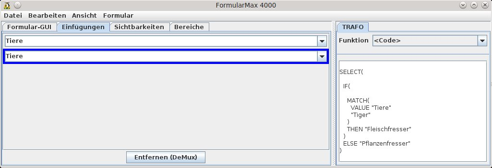
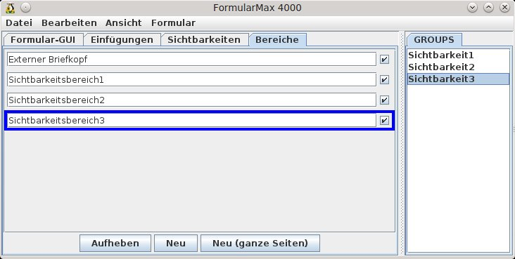
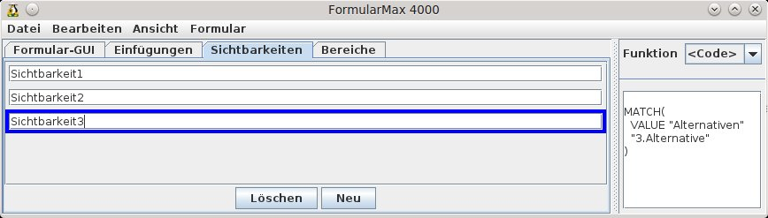
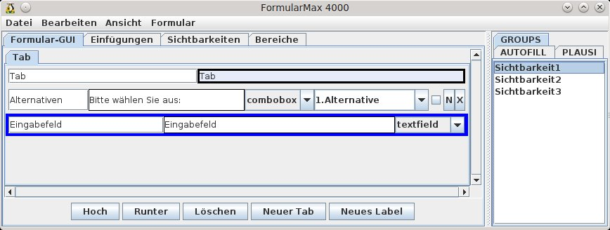
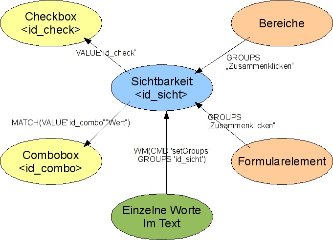

# Komfortfunktionen und weitere Features

<!-- toc -->

## Sachbearbeiterdaten automatisiert ins Formular einfügen

Neben der Möglichkeit Sachbearbeiterdaten wie in Kapitel [Automatisches Einfügen von Sachbearbeiterdaten](WollMux_Vorlage.md#automatisches-einfügen-von-sachbearbeiterdaten "wikilink") beschrieben über Textmarken einzufügen, gibt es bei Formularen die Option das gleiche über Eingabefelder zu erreichen.

Das Eingabefeld erhält dafür die Beschriftung **&lt;&lt;glob:ID&gt;&gt;**.

**ID** wird dabei durch die Werte bei den insertValues aus ersetzt. Zum Einfügen des Nachnamens würde die Beschriftung dann **&lt;&lt;glob:Nachname&gt;&gt;** lauten.

Auch diese Felder müssen in den FM4000 eingelesen werden. Dadurch wird die unter [Automatisches Einfügen von Sachbearbeiterdaten](WollMux_Vorlage.md#automatisches-einfügen-von-sachbearbeiterdaten "wikilink")  beschriebene Textmarke generiert und eingefügt.

----------------------------------------

## Gleiche Werte mehrmals verwenden

Es kommt öfters vor, dass gleiche Werte an verschiedenen Stellen in einer Vorlage vorkommen. Das normale bzw. bisherige Vorgehen wäre, die Werte dann jedes mal neu einzutragen. Der WollMux bietet hier aber eine Möglichkeit den Wert nur einmal eintragen zu müssen und an den anderen Stellen, an denen er erscheinen soll, wird der Wert automatisch eingefügt.

Das funktioniert sowohl mit Eingabefeldern und -listen als auch mit Checkboxen.

Vorgehensweise:

1. An der ersten Stelle, an der der Wert erscheinen soll, wird das passende Formularelement eingefügt. Dies erhält wie unter Kapitel [Vorarbeiten](FM4000.md#vorarbeiten "wikilink") beschrieben eine Beschriftung **Label&lt;&lt;ID&gt;&gt;**.
2. An allen anderen Stellen werden die Elemente eingefügt, die auf dieses Element verweisen. Die Beschriftung dort ist allerdings nur noch die ID erhält: **&lt;&lt;ID&gt;&gt;**. Dadurch wird festgelegt, dass diese Elemente den gleichen Wert erhalten, den das Feld mit der Beschriftung **Label&lt;&lt;ID&gt;&gt;** enthält.

3. Am Schluss werden die Felder in den FM4000 eingelesen. In der FormularGUI erscheint nur **eine** Eingabemöglichkeit für alle Werte. Im Tab *Einfügungen* kann die Anzahl der Einfügestellen überprüft werden.

Beispiel: In der Vorlage kommt öfters der Nachname des Adressaten vor. Das erste Feld mit dem Nachnamen erhält dann die Beschriftung Nachname&lt;&lt;Nachname&gt;&gt;. An allen anderen Stellen, an denen Felder mit dem Nachnamen erscheinen soll erhalten die Beschriftung &lt;&lt;Nachname&gt;&gt;.

----------------------------------------

## Gender – Funktion

In Schreiben, Bescheiden, usw. kommen immer wieder Bezeichnungen vor, die je nach Geschlecht etwas anders geschrieben werden, z.B. Antragstellerin oder Antragsteller. Dafür gab es bisher verschiedenste Schreibweisen, wie Antragsteller/Antragstellerin oder AntragstellerIn, …, die alle nicht besonders schön sind. Anderseits enthalten die meisten Schrieben eine Anrede, über die das Geschlecht bestimmt werden kann.

Der WollMux bietet nun eine Funktion, über die sich solche geschlechtsabhängigen Felder abhängig von der Anrede automatisiert befüllen lassen. Dazu muss dann nur noch einmal im Schreiben die Anrede ausgewählt werden, alles andere erledigt der WollMux.

**Vorgehensweise**:

1. Alle geschlechtsabhängigen Bezeichnungen sind Eingabelisten
  1. Das Schreiben enthält eine Anrede, wie „Sehr geehrte Frau/Herr/Damen und Herren“, wobei „Frau/Herr/Damen und Herren“ das Ausgangsfeld für die gender Funktion wird. Dazu wird eine Eingabeliste erstellt, die die Werte Herr oder Herrn, Frau und optional einen dritten Wert wie Damen und Herren erhält. Die Eingabeliste erhält als Bezeichnung und ID „Anrede“, geschrieben **Anrede&lt;&lt;Anrede&gt;&gt;**. Alle anderen geschlechtsabhängigen Bezeichnungen werden sich auf dieses Feld beziehen<br>
  
  2. In der Regel wird das erste „gender“-Feld das „geehrte/geehrter“ aus der Anrede sein. Dazu wird wieder eine Eingabeliste angelegt, die die Werte geehrter, geehrte und optional nochmal geehrte für die Plural-Form erhält. Das Feld heißt dann **&lt;&lt;gender:Anrede&gt;&gt;**
  3. Für alle anderen Felder ist das Vorgehen analog zu Punkt 2. In eine Eingabeliste werden die Werte eingetragen, z.B. Antragsteller, Antragstellerin und optional nochmal Antragsteller. Die Bezeichnung des Feldes wird wieder **&lt;&lt;gender:Anrede&gt;&gt;**

2.  Wenn alle geschlechtsabhängigen Felder vergeben sind, werden diese in den FM4000 eingelesen. In der FormularGUI wird es nur eine Auswahlmöglichkeit, nämlich für die Anrede geben, bei den Einfügungen wird es soviel Einträge geben, wie es geschlechtsabhängige Felder in der Vorlage gibt.<br>


> **WARNING** Die Reihenfolge in den Eingabelisten ist zwinged! Zuerst kommt die männliche, dann die weibliche und optional eine Form für Plural o.ä..<br>

> **HINT** Werden zwei gleiche Werte in einer Eingabeliste benötigt, setzt man hinter den doppelten Eintrag ein Leerzeichen.

Schematische Darstellung der gender Funktion mit optionalem Eintrag für Damen und Herren und den dazugehörigen Werten.

<table border="2" cellspacing="0" cellpadding="4" rules="all" style="margin:1em 1em 1em 0; border:solid 1px #AAAAAA; border-collapse:collapse; background-color:#F9F9F9; font-size:100%; empty-cells:show;">
<tr>
<td bgcolor="#87CEFA">Anrede&lt;&lt;Anrede&gt;&gt;</td>
<td bgcolor="#87CEFA">&lt;&lt;gender:Anrede&gt;&gt;</td>
<td bgcolor="#87CEFA">&lt;&lt;gender:Anrede&gt;&gt;</td>
<td bgcolor="#87CEFA">&lt;&lt;gender:Anrede&gt;&gt;</td>
</tr>
<tr>
<td>Herr</td>
<td>geehrter</td>
<td>Antragsteller</td>
<td>seiner</td>
</tr>
<tr>
<td>Frau</td>
<td>geehrte</td>
<td>Antragstellerin</td>
<td>ihrer</td>
</tr>
<tr>
<td>Damen und Herren</td>
<td>geehrte </td>
<td>Antragsteller</td>
<td>ihrer </td>
</tr>
</table>

> **WARNING** Sollte ein Schreiben keine Anrede enthalten, kann trotzdem die gender-Funktion verwendet werden. Dafür wird einfach in der Formular-GUI ein Feld für die Anrede angelegt, das aber nicht in der Vorlage erscheint (siehe Kapitel [Einfügen und Löschen von Elementen](FM4000.md#einfügen-und-löschen-von-elementen "wikilink"))

----------------------------------------

## Felder mit abhängigen Inhalten verwenden

Eine Abwandlung von Kapitel [Gleiche Werte mehrmals verwenden](Komfortfunktionen.md#gleiche-werte-mehrmals-verwenden "wikilink") stellt der Fall dar, dass nicht identische Werte an verschiedenen Stellen in der Vorlage erscheinen sollen, sondern von einander abhängige Werte. Dafür werden sinnvoller Weise Eingabelisten verwendet, wobei auch Eingabefelder funktionieren würden.

Man hat beispielsweise ein Feld, in dem man ein bestimmtes Tier auswählen kann (Tiger, Elefant, Giraffe, Löwe, …) und ein zweites Feld, in dem erscheinen soll, ob das Tier ein Pflanzenfresser oder ein Fleischfresser ist. Diese Auswahl soll automatisch vorgenommen werden, da es klar ist, welches Tier ein Pflanzenfresser (Giraffe, Elefant) oder Fleischfresser (Tiger, Löwe) ist

Diese Werte sollen nicht manuell sondern automatisch richtig befüllt werden.

**Vorgehensweise anhand des Beispieles** (zur Vereinfachung werden nur die Werte, Tiger und Elefant verweendet):

1. **Combobox erstellen**<br>
Man erstellt eine Combobox, die die Ausgangswerte enthält. Sie erhält die Beschriftung Tiere&lt;&lt;Tiere&gt;&gt; und die Werte Tiger und Elefant.

2. **Eingabefeld**<br>
An der Stelle, an der Pflanzenfresser bzw. Tierfresser abhängig von der Combobox erscheinen soll, wird ein Eingabefeld mit der gleichen ID (&lt;&lt;Tiere&gt;&gt;) angelegt.<br>
Man kann auch alternativ eine Eingabeliste mit den gewünschten Werten anlegen. Dies hat allerdings nur den Effekt, dass man auch in der Vorlage sieht, welche Werte an dieser Stelle erscheinen sollen. Diese Werte werden aber später mit den Werten, die im FM4000 festgelegt werden, überschrieben.

3. **Weitere Eingabefelder**<br>
Falls noch weitere abhängige Felder vorhanden sind, können analog zu 2., weitere Eingabefelder angelegt werden.
4. **Einlesen in den FM4000 und festlegen der Werte**<br>
In diesem Schritt werden nun die Werte vergeben, die in Abhängigkeit von der ersten Combobox im ersten Eingabefeld erscheinen sollen.<br>
Dazu müssen die Felder vorher in den FM4000 eingelesen werden. Danach führt man folgende Schritte aus:
  1. In den Tab *Einfügungen* wechseln
  2. Bei den *Einfügungen* gibt es nun mehrere mit der ID „Tiere“. Durch anklicken der entsprechenden Einfügungen kann man in der Vorlage überprüft werden, wo sie sich dort befindet. Man wählt nun die Einfügung aus, die die abhängigen Werte erhalten soll.
  3. Über *Ansicht → Trafo, Autofill...* die benötigte Ansicht aktivieren und in der neu erschienenen Spalte die Schaltfläche *Aktivieren* betätigen. Ggf die Spalte ein bisschen breiter ziehen.
  4. In der Combobox für Funktionen &lt;Code&gt; (ganz unten) auswählen.
  5. Nun wird ein Code eingegeben, der dafür sorgt, dass in diesem Feld für Elefant Pflanzenfresser und für Tiger Fleischfresser erscheint. Der Code ist folgendermaßen aufgebaut:<br>
```
SELECT(
    IF(
        MATCH(
            VALUE "Tiere"
            "Elefant"
        )<br>
        THEN "Planzenfresser"
    )<br>
    ELSE "Fleichfresser"
)
```


Tipps:
* Wenn das Feld für die Codeeingabe einen rosa Hintergrund bekommt, ist dafür ein Syntaxfehler (fehlende Klammer, Anführungszeichen, Schreibfehler, …) verantwortlich.
* Es ist auf die Groß- und Kleinschreibung zu achten
* Ein guter Hinweis, ob der Code passt ist, wenn nach dem erneuten öffnen des FM4000 der Code „schön“ formatiert ist.

Im Beispiel wird nur von zwei Werten ausgegangen, der Code kann natürlich so angepasst werden, dass er mit beliebig vielen Werten arbeiten kann. Dazu wird einfach der IF – THEN Teil so oft wie nötig wiederholt (Anzahl der Alternativen -1)

----------------------------------------

## Sichtbarkeiten

Der WollMux bietet die Möglichkeit Text und Textbereiche ein- bzw. ausblenden zu lassen. Dieses Feature kann dazu hergenommen werden, um Vorlagen, die sich nur marginal von einander unterscheiden, zu konsolidieren, indem man sie zusammenfasst.

Die Sichtbarkeiten werden prinzipiell entweder über Checkboxen oder Comboboxen gesteuert. Der Unterschied dabei ist, dass man
* über Checkboxen mehrere Alternativen gleichzeitig ein- oder ausblenden kann, da man für jede Alternative eine Checkbox vergibt, die dann separat aktiviert werden kann.
* über Comboboxen von mehreren Alternativen immer nur exakt eine Alternative auswählen kann, da eine Combobox nur einen Wert darstellen kann.

Je nachdem welchen Anwendungsfall man benötigt, verwendet man Checkboxen oder Comboboxen.

### Sichtbarkeiten über Checkboxen

Bei der Erläuterung der Vorgehensweise zur Erstellung der Sichtbarkeiten wird von einer Vorlage ausgegangen, die drei Alternativen (Alt1, Alt2, Alt3) beinhaltet, die ein- bzw. ausgeblendet werden sollen. Der FM4000 ist gestartet und die Formularelemente eingelesen und ggf. bearbeitet. Die Checkboxen, die die Sichtbarkeiten steuern, können entweder aus der Vorlage eingelesen werden oder sie werden nur in der FormularGUI angelegt.

Die hier vorgestellte Reihenfolge ist größtenteils nicht zwingend.

Vorgehensweise:

1. *Ansicht → TRAFO, PLAUSI, AUTOFILL, GROUPS* aktivieren.
2. Falls die Checkboxen nicht eingelesen werden, werden drei Checkboxen erstellt. Die Checkboxen erhalten IDs und sinnvolle Labels. In diesem Beispiel sind die IDs Alt1, Alt2 und Alt3, die Vorlage enthält in diesem Fall keine weiteren Formularelemente.

3. Als nächster Schritt werden die Bereiche festgelegt, die ein- oder ausgeblendet werden sollen. Jede Alternative wird dabei zu einem Bereich. Dazu wird in den Tab *Bereiche* gewechselt. Über Bereiche werden immer nur ganze Absätze ausgeblendet, wie einzelne Wörter ausgeblendet werden, steht in Kapitel [Sichtbarkeiten von einzelnen Wörtern oder Textteilen](Komfortfunktionen.md#sichtbarkeiten-von-einzelnen-wörtern-oder-textteilen "wikilink").
    1. In die Vorlage wechseln und die 1.Alternative markieren.
    2. Wieder zurück in den FM4000 gehen und dort auf *Neu* klicken. Es wird ein neuer Bereich angelegt. Den Bereich erkennt man durch graue Linien oberhalb und unterhalb des Bereichs.
    3. Über das Häkchen neben den Sichtbarkeiten kann getestet werden, ob der Text richtig ein- bzw. ausgeblendet wird.
    4. Für die anderen Alternativen gilt das gleiche Vorgehen.
    5. Ganze Seiten können mit *Neu (ganze Seite)* als Bereich erfasst werden. Bereiche können über *Aufheben* auch wieder entfernt werden, der Text bleibt dabei erhalten.
    6. Den Sichtbarkeitsbereichen können sinnvolle Namen vergeben werden.
    
4. Nun werden die Sichtbarkeiten definiert. Die Sichtbarkeiten stellen quasi die Verbindung der Checkboxen mit den Bereichen dar. Dazu wird in den Tab *Sichtbarkeiten* gewechselt.
    1. Über *Neu* drei neue Sichtbarkeiten anlegen.
    2. Auch den Sichtbarkeiten können andere sprechende Namen vergeben werden, damit man leicht feststellen kann, welche Sichtbarkeit zu welchem Bereich und Checkbox gehört. Dieser Name darf keine Leerzeichen enthalten.
    3. Auf Sichtbarkeit1 klicken. Dort steht momentan der Code *CAT „true“*. Dieser kann gelöscht werden.
    4. Stattdessen wird hier **VALUE „Alt1“** eingetragen. Dies bedeutet, dass diese Sichtbarkeit gilt, wenn die Checkbox mit der ID **Alt1** aktiviert ist.Das gleiche wird nun mit den anderen Sichtbarkeiten gemacht.
5. Als letzten Schritt müssen jetzt noch die Sichtbarkeiten den Bereichen zugeordnet werden. Dazu wird wieder in den Tab *Bereiche* gewechselt. Dort wird nacheinander auf jeden Bereich geklickt, der GROUPS View aktiviert und die Zuordnung durch Klicken auf die passende Sichtbarkeit hergestellt.


### Sichtbarkeiten über Comboboxen

Bei der Erläuterung der Vorgehensweise zur Erstellung der Sichtbarkeiten wird von einer Vorlage ausgegangen, die drei Alternativen (Alt1, Alt2, Alt3) beinhaltet, die ein- bzw. ausgeblendet werden sollen. Der FM4000 ist gestartet und die Formularelemente eingelesen und ggf. bearbeitet. Die Combobox, die die Sichtbarkeiten steuert, kann entweder aus der Vorlage eingelesen werden oder sie wird nur in der FormularGUI angelegt. Im Prinzip ist die Vorgehensweise fast identisch mit der bei den Checkboxen (Kapitel [Sichtbarkeiten über Checkboxen](Komfortfuntkionen.md#sichtbarkeiten-über-checkboxen "wikilink"))

Die hier vorgestellte Reihenfolge ist größtenteils nicht zwingend.

Vorgehensweise:
1. *Ansicht → TRAFO, PLAUSI, AUTOFILL, GROUPS* aktivieren.
2. Falls die Combobox nicht eingelesen wird, wird ein Combobox erstellt. Die Combobox Erhält eine ID, ein sinnvolles Label und drei Werte: Alt1, Alt2 und Alt3, die Vorlage enthält in diesem Fall keine weiteren Formularelemente.<br>

3. Als nächster Schritt werden die Bereiche festgelegt, die ein- oder ausgeblendet werden sollen. Jede Alternative wird dabei zu einem Bereich. Dazu wird in den Tab *Bereiche* gewechselt. Über Bereiche werden immer nur ganze Absätze ausgeblendet, wie einzelne Wörter ausgeblendet werden, steht in Kapitel [Sichtbarkeiten von einzelnen Wörtern oder Textteilen](Komfortfunktionen.md#sichtbarkeiten-von-einzelnen-wörtern-oder-textteilen "wikilink").
    1. In die Vorlage wechseln und die 1.Alternative markieren.
    2. Wieder zurück in den FM4000 gehen und dort auf *Neu* klicken. Es wird ein neuer Bereich angelegt. Den Bereich erkennt man durch graue Linien oberhalb und unterhalb des Bereichs.
    3. Über das Häkchen neben den Sichtbarkeiten kann getestet werden, ob der Text richtig ein- bzw. ausgeblendet wird.
    4. Für die anderen Alternativen gilt das gleiche Vorgehen.
    5. Ganze Seiten können mit *Neu (ganze Seite)* als Bereich erfasst werden. Bereiche können über *Aufheben* auch wieder entfernt werden, der Text bleibt dabei erhalten.
    6. Den Sichtbarkeitsbereichen können sinnvolle Namen vergeben werden.

4. Nun werden die Sichtbarkeiten definiert. Die Sichtbarkeiten stellen quasi die Verbindung der Combobox mit den Bereichen dar. Dazu wird in den Tab *Sichtbarkeiten* gewechselt.
    1. Über *Neu* drei neue Sichtbarkeiten anlegen.
    2. Auch den Sichtbarkeiten können andere sprechende Namen vergeben werden, damit man leicht feststellen kann, welche Sichtbarkeit zu welchem Bereich und Wert aus der Combobox gehört. Dieser Name darf keine Leerzeichen enthalten.
    3. Auf Sichtbarkeit1 klicken. Dort steht momentan der Code *CAT „true“*. Dieser kann gelöscht werden.
    4. Stattdessen wird hier **MATCH(VALUE „Alternativen“ „Alt1“)** eingetragen. Dies bedeutet, dass diese Sichtbarkeit gilt, wenn der Wert **Alt1** aus der Combobox mit der ID **Alternativen** aktiviert ist.
    5. Das gleiche wird nun mit den anderen Sichtbarkeiten gemacht.

5. Als letzten Schritt müssen jetzt noch die Sichtbarkeiten den Bereichen zugeordnet werden. Dazu wird wieder in den Tab *Bereiche* gewechselt. Dort wird nacheinander auf jeden Bereich geklickt, der GROUPS View aktiviert und die Zuordnung durch Klicken auf die passende Sichtbarkeit hergestellt.


### Sichtbarkeiten in der FormularGUI

Es gibt natürlich auch die Fälle, bei denen in den ausgeblendeten Bereichen Formularelemente, wie z.B. Eingabefelder enthalten sind. Diese sollen in der Formular-GUI nur dann erscheinen, wenn der dazugehörige Textteil ebenfalls eingeblendet ist. Ansonsten, soll das Element in der Formular-GUI nicht erscheinen.

Im weiteren wird das unter [Sichtbarkeiten über Comboboxen](Komfortfunktionen.md#sichtbarkeiten-über-comboboxen "wikilink") genannte Beispiel fortgeführt.

Vorgehensweise:
1. Ggf. in den Tab *Formular-GUI* wechseln.
2. Ggf. *Ansicht → TRAFO, PLAUSI, AUTOFILL, GROUPS* aktivieren.
3. Auf das auszublendene Element klicken.
4. Extra View aktivieren.
5. Auf den Tab GROUPS wechseln.
6. Dort auf die Gruppe klicken, zu der dieses Element gehören soll.


Es kann passieren, dass bei Sichtbarkeiten in der FormularGUI das eingeblendete Element – wenn es z.B. das letzte Element ist, nicht gleich (komplett) sichtbar ist, sondern erst nach unten gescrollt werden muss.

Dies kann man vermeiden indem man an die entsprechenden Stellen, meist ganz am unteren Ende „leere Labels“ (Kapitel [Einfügen und Löschen von Elementen](FM4000.md#einfügen-und-öschen-von-elementen "wikilink")) einfügt. Leer bedeutet, dass das Label keinen Text enthält. Es ist damit eigentlich unsichtbar, trotzdem wird der dafür vorgesehene Platz in der FormularGUI berücksichtigt und diese damit größer gemacht. Je mehr leere Labels eingefügt werden, desto länger wird die FormularGUI.

Man kann die FormularGUI durch solche leeren Labels auch breiter machen, indem man die benötigte Menge Leerzeichen einfügt.

### Sichtbarkeiten von einzelnen Wörtern oder Textteilen

Der WollMux bietet auch die Möglichkeit nur einzelne Wörter oder Textteile auszublenden. Das Vorgehen unterscheidet sich dabei deutlich von den anderen Sichtbarkeiten.

Bei diesem Beispiel wird davon ausgegangen, dass im FM4000 bereits Sichtbarkeitsgruppen angelegt worden ist. Zur Vereinfachung wird wieder das Beispiel aus Kapitel [Sichtbarkeiten über Comboboxen](Komfortfunktionen.md#sichtbarkeiten-über-comboboxen "wikilink") weitergeführt.

Vorgehensweise:
1. Den betroffenen Text markieren.
2. Über Einfügen → Textmarke eine Textmarke an diese Stelle einfügen. Die Textmarke lautet: **WM(CMD 'setGroups' GROUPS 'Sichtbarkeit3')** wobei Sichtbarkeit3 die Bezeichnung der Sichtbarkeit (siehe FM4000) ist.<br>


### Aufheben von Gruppen in Sichtbarkeiten

Möchte man z.B. ein Formularelement wieder aus der Gruppierung entfernen, ist dies über die grafische Oberfläche des FM4000 nicht möglich. Dazu muss man in die Formularbeschreibung (Kapitel [Formularbeschreibung editieren](FM4000.md#formularbeschreibung-editieren)) wechseln.

Dort sucht man nach dem betroffenen Element und löscht dann **GROUPS „Name der Sichtbarkeit“**. Im Beispiel aus Kapitel [Sichtbarkeiten in der FormularGUI](Komfortfunktionen.md#sichtbarkeiten-in-der-formulargui) müsste dann **GROUPS „Sichtbarkeit1“ **gelöscht werden.


Nachdem die Änderungen vorgenommen wurden, wird das Fenster über *Datei → Speichern* geschlossen, damit die Anpassungen übernommen werden.

### Schematische Darstellung der Sichtbarkeiten

Diese Darstellung verdeutlicht die Zusammenhänge der einzelnen Elemente bei der Verwendung von Sichtbarkeiten.


----------------------------------------

## AUTOFILLs, PLAUSIs TRAFOs und GROUPS

Um AUTOFILLs, PLAUSIs und TRAFOs zu bearbeiten, muss zuerst über *Ansicht → TRAFO,PLAUSI,AUTOFILL* die Extra-View aktiviert werden (ein Zusatzpanel an der rechten Seite des FM4000).

### AUTOFILLs

Der Tab *AUTOFILL* wird in der rechten Hälfte des FM4000-Fensters angezeigt, wenn in der linken der Tab *Formular-GUI* angezeigt wird und dort *genau ein* Eintrag selektiert ist. Wenn das ausgewählte Element weder PLAUSI noch AUTOFILL noch GROUPS gesetzt hat, so muss erst der Button *Aktivieren* in der Extra-View gedrückt werden, um die Tabs PLAUSI, AUTOFILL und GROUPS einzublenden. Die als AUTOFILL spezifizierte Funktion (falls nicht "&lt;keine&gt;") legt die automatische Vorbelegung des Formularfeldes fest.

Beim Verwenden bzw. Anlegen von Funktionen sollte man immer auf den Funktionstester (siehe Kapitel [Der Funktionstester](Komfortfunktionen.md#der-funktionstester)) zurückgreifen, da dort die Richtigkeit der Funktionen sehr einfach getestet werden kann, bevor sie in das Formular übertragen wird.

* Beispiel 1:<br>
In der Abtretungserklärung (auch als Beispiel in der WollMux Konfiguration enthalten) gibt es ein Feld, in dem die Höhe des Darlehensbetrages (ID *DarlBetrag*) eingetragen wird. An einer anderen Stelle wird die Höhe der Abtretung auf die Höhe des Darlehens zuzüglich 20% festgelegt. Dieses Feld (ID *DarlehenplusZusatzkosten*) soll natürlich automatisch berechnet werden. Dafür gibt es mehrere Berechnungsmöglichkeiten; in der Abtretungserklärung wurde folgende gewählt:<br>
`Darlehensbetrag + Darlehensbetrag * 20 / 100`<br>
<br>

Um keine Fehlermeldung angezeigt zu bekommen, wird hier mit dem SELECT Statement das Feld *DarlBetrag* mit einer 0 vorbelegt, da mit leeren Feldern nicht gerechnet werden kann.<br>
Da es sich um einen Geldbetrag handelt wird dieser noch zusätzlich auf zwei Nachkommastellen formatiert, das übernimmt der FORMAT Befehl.

* Beispiel 2:<br>
Bei einem Antrag auf Urlaubsübertragung für Beamte wird das Jahr eingegeben, aus dem der Resturlaub stammt und bis wann er übertragen werden soll, nämlich bis zum 30.09. des Folgejahres.<br>
Nachdem das Jahr aus dem der Resturlaub (ID: *Jahr*) stammt, eingegeben ist, ergibt sich das Datum für die Übertragung automatisch: '30.09.*Jahr* +1' (ID *bis\_zum*). Dieses Feld kann nun mit einem AUTOFILL vorbelegt werden.

Zusätzlich zur Berechnung des Jahres ist hier noch ein IF Statement nötig, da das zu berechnende Feld einen Fehler anzeigen würde, solange *Jahr* leer ist. Mit leeren Feldern kann keine Berechnung erfolgen. Das hat zwar keine Auswirkungen, da der Fehler verschwindet, sobald die Eingabe bei *Jahr* erfolgt ist, sieht aber nicht schön aus.<br>
Der Code wird beim Feld mit der ID *bis\_zum* im Tab *AUTOFILL* eingegeben.

### PLAUSIs

Der Tab *PLAUSI* wird in der rechten Hälfte des FM4000-Fensters angezeigt, wenn in der linken der Tab *Formular-GUI* angezeigt wird und dort *genau ein* Eintrag selektiert ist. Wenn das ausgewählte Element weder PLAUSI noch AUTOFILL noch GROUPS gesetzt hat, so muss erst der Button *Aktivieren* in der Extra-View gedrückt werden, um die Tabs PLAUSI, AUTOFILL und GROUPS einzublenden. Die als PLAUSI spezifizierte Funktion (falls nicht "&lt;keine&gt;") bestimmt eine Prüffunktion, die die Eingabe auf Korrektheit testet.

PLAUSIs (Plausibilitätsprüfungen) werden dazu verwendet, um für bestimmte Felder festzulegen, was sie enthalten sollen. Solange die PLAUSI nicht erfüllt ist, wird das Feld in der Formular-GUI farblich (Standard ist rosa) hinterlegt.

> **WARNING** PLAUSIs können Falscheingaben nicht verhindern. Sie sind nur Voragen für korrekte Inhalte der betroffenen Felder.

Häufig verwendete, vorgegebene PLAUSIs:
* Bereich: Legt einen Bereich fest innerhalb dessen sich die Eingabe bewegen soll, z.B. für Geldbeträge (100 - 200€) oder Altersangaben (18 – 21 Jahre)
* NichtLeer: Damit wird festgelegt, dass dieses Feld nicht leer sein darf.
* KorrektesDatum: Damit wird die Eingabe eines Datums in einem bestimmten Format gefordert.
* DatumNichtInVergangenheit:: Damit erfolgt eine Überprüfung, ob das Datum in der Vergangenheit liegt. Falls ja ist die PLAUSI nicht erfüllt.

Wenn bei diesen PLAUSIs die Benutzereingaben überprüft werden sollen, sind die im FM4000 erscheinenden Comboboxen auf \[nicht fest verdrahtet\] zu lassen. Beim Bereich sind aber die Grenzen festzulegen.


Wichtig ist bei der Verwendung von PLAUSIs auch entsprechende Hinweise, z.B. über Labels in der Formular-GUI mitzugeben. Ansonsten ist es dem Ausfüller unter Umständen nicht klar, was an dieser Stelle für eine Eingabe erwartet wird.

### GROUPS

Der Tab *GROUPS* wird in der rechten Hälfte des FM4000-Fensters angezeigt, wenn in der linken der Tab *Formular-GUI* oder *Bereiche* angezeigt wird und dort *genau ein* Eintrag selektiert ist. Wenn das ausgewählte Element weder PLAUSI noch AUTOFILL noch GROUPS gesetzt hat, so muss erst der Button *Aktivieren *in der Extra-View gedrückt werden, um die Tabs PLAUSI, AUTOFILL und GROUPS einzublenden. Auf dem Tab *GROUPS* sind alle definierten Sichtbarkeitsgruppen aufgeführt und können durch Anklicken bei gedrückter Ctrl/Strg-Taste dem ausgewählten Formularsteuerelement zugewiesen werden, so dass die Sichtbarkeit des Elements von der entsprechenden Sichtbarkeitsfunktion abhängt.

Die Verwendung von GROUPS ist für die Festlegung von Sichtbarkeiten relevant und wird im Kapitel [Sichtbarkeiten](Komfortfunktionen.md#sichtbarkeiten) erläutert.

### TRAFOs

Der Tab *TRAFO* wird in der rechten Hälfte des FM4000-Fensters angezeigt, wenn in der linken der Tab *Einfügungen* angezeigt wird und dort *genau ein* Eintrag selektiert ist. Ist für das ausgewählte Element noch keine TRAFO gesetzt, so muss der Tab TRAFO erst durch den *Aktivieren* Button in der Trafo-View freigeschaltet werden. Die als TRAFO spezifizierte Funktion (falls nicht "&lt;keine&gt;") gibt an, wie ein einzufügender Wert vor dem Einfügen umgewandelt werden soll.

Beispiele:
* die Darstellung der Telefonnummer nach DIN in den Briefköpfen wird über einen TRAFO gesteuert
* Die Verwendung von anhängigen Feldern wie in Kapitel [Felder mit abhängigen Inhalten verwenden](Komfortfunktionen.md#felder-mit-abhängigen-inhalten-verwenden) beschrieben, geschieht über TRAFOs.

Im folgenden sind die Möglichkeiten beschrieben, Funktionen zu spezifizieren.

> **HINT** Verwenden Sie den [Funktionstester](Komfortfunktionen.md#der-funktionstester "wikilink") um Ihre Funktionen einzugeben und zu testen.

#### &lt;Wert&gt;

Die Auswahl von "&lt;Wert&gt;" in der Funktion-ComboBox erlaubt die Eingabe eines (evtl. mehrzeiligen) Textes mit dem das Feld vorbelegt wird. Handelt es sich bei dem Feld um eine Checkbox, so wird der Text "true" als gesetzt und alles andere als nicht gesetzt interpretiert.

#### &lt;Code&gt;

Die Auswahl von "&lt;Code&gt;" in der Funktion-ComboBox erlaubt die
Direkteingabe einer [Funktion](Konfigurationsdatei_wollmux_conf.md#funktionen "wikilink") (ohne
umschließenden Funktionsbezeichner). Die Funktion muss vollständig
spezifiziert sein und alle Formularfelder auf die Bezug genommen wird
müssen mit ihrer korrekten ID referenziert werden. Im folgenden ein
Beispiel für eine PLAUSI, die testet, ob das Feld "Nachname" nicht leer
ist.

`MATCH(VALUE('Nachname'), ".+")`

Zu beachten ist, dass "Nachname" hier wirklich die ID des entsprechenden
Eingabefeldes ist. Ist die ID des Eingabefeldes z.B. "nachname" (man
beachte die Kleinschreibung), so wird die obige PLAUSI nicht funktionieren.

#### Globale Funktion

Der [Funktionen-Abschnitt der wollmux.conf](../Konfigurationsdatei_wollmux_conf.md#funktionen "wikilink")
erlaubt das Angeben von globalen Funktionen. Alle dort angegebenen
Funktionen werden vom FM4000 zur Auswahl angeboten. Erwartet eine
Funktion Parameter, so können diese in den entsprechenden ComboBoxen
gesetzt werden, entweder auf einen festen String oder als Referenz auf
ein Formularfeld. Die Auswahl von "\[nicht fest verdrahtet\]" lässt den
entsprechenden Parameter-Wert offen. Je nach Kontext werden offen
gelassene Parameter-Werte verschieden behandelt:
* Bei AUTOFILLs sollte nie ein Parameter unbelegt bleiben. Je nach Funktion können unbelegte Parameter zu Fehlern führen.
* Bei TRAFOs werden alle unbelegten Parameter mit dem jeweils zu transformierenden Wert belegt. Deshalb hat eine TRAFO fast immer mindestens einen unbelegten Parameter.
* Bei PLAUSIs werden alle unbelegten Parameter mit dem Wert des Formularfeldes zu dem die PLAUSI gehört belegt. Deshalb hat eine PLAUSI fast immer mindestens einen unbelegten Parameter.

#### Referatsspezifische Plugins

Der WollMux erlaubt den Referaten, [eigene Plugins](../Konfigurationsdatei_wollmux_conf.md#einbinden-referatseigener-pluginsclasspath "wikilink") einzubinden. Es gibt grundsätzlich zwei Möglichkeiten, eine Plugin-Funktion im FormularMax 4000 zu verwenden:

##### Global registrierte Plugin-Funktionen

Achtung: Wird eine global registrierte Plugin-Funktion für ein Formular verwendet, so muss diese bei jedem Anwender, der die Vorlage verwenden möchte global registriert sein. D.h. es ist *nicht* möglich, Funktionen temporär global zu registrieren, damit der Vorlagenersteller diese im FormularMax 4000 verwenden kann, und sie anschließend aus dem globalen *Funktionen*-Abschnitt zu entfernen. Wenn eine Funktion nicht dauerhaft im globalen *Funktionen*-Abschnitt erscheinen soll, so muss eine [nicht registrierte Plugin-Funktion](#nicht-registrierte-plugin-funktionen "wikilink") verwendet werden.

##### Nicht registrierte Plugin-Funktionen

Manchmal ist es nicht erwünscht, Plugin-Funktionen im globalen
*Funktionen*-Abschnitt zu registrieren. Gründe hierfür können zum
Beispiel folgende sein:
* Eine Funktion wird nur in einer oder zwei Vorlagen verwendet. Es kann störend sein, wenn solche Funktionen in jeder Funtionsauswahl-Kombobox des FormularMax 4000 angezeigt werden.
* Soll eine Vorlage an ein anderes Referat weitergegeben werden und die Vorlage verwendet eine global registrierte Plugin-Funktion, so muss das empfangende Referat die Plugin-Funktion ebenfalls global registrieren. Dabei sind schwer auflösbare Namenskonflikte möglich und die Funktion erscheint in jedem FormularMax 4000 des empfangenden Referats. Beides ist ungünstig.

In solchen Fällen ist es günstiger, auf das globale registrieren einer
Plugin-Funktion zu verzichten. Um diese dennoch verwenden zu können,
kann eine Kombination von BIND und EXTERN direkt eingegeben werden. Zu
diesem Zweck wird als Funktion "&lt;Code&gt;" ausgewählt und im
Eingabefeld ein Code eingegeben wie z.B. der folgende

```
BIND(
 FUNCTION(
   EXTERN(
     URL "java:de.muenchen.kvr.FormularFunktionen.resturlaub"
     PARAMS("p1", "p2", "p3")
   )
 )

 SET(
   "p1"
   VALUE "urlaubsanspruch1"
 )

 SET(
   "p2"
   VALUE "bereitsbeantragt1"
 )

 SET(
   "p3"
   VALUE "jetztbeantragt1"
 )
)
```

In diesem Beispiel wird die Plugin-Funktion
de.muenchen.kvr.FormularFunktionen.resturlaub verwendet. Diese erwartet
3 Parameter. Die Bezeichner *p1*, *p2* und *p3* sind willkürliche
Platzhalter für diese 3 Parameter. In den SET-Abschnitten werden den 3
Parametern entsprechende Aufrufwerte zugewiesen. *urlaubsanspruch1*,
*bereitsbeantragt1* und *jetztbeantragt1* sind *nicht* willkürlich
gewählt, sondern sind die IDs von den 3 Eingabefeldern des
WollMux-Formulars aus denen der Resturlaub berechnet werden soll. Es ist
wichtig, darauf zu achten, dass das Wort "VALUE" nicht vergessen wird.
Ansonsten würden "urlaubsanspruch1" etc. direkt als Strings übergeben
anstatt der Werte der Eingabefelder.

----------------------------------------

## Der Funktionstester

Der Funktionstester lässt sich über *Ansicht → Funktionstester* aufrufen. In dieser GUI kann man [WollMux-Funktionen](../Konfigurationsdatei_wollmux_conf.md#grundfunktionen "wikilink") eingeben und testen, bevor sie über die Zwischenablage in die Code-Ansicht von TRAFO, PLAUSI oder AUTOFILL kopiert werden. Die einzelnen Buttons des Funktionstesters fügen jeweils ein typisches Code-Muster für die entsprechende Funktion ein. Die VALUE-Buttons im oberen Teil des Testers nehmen die in den links daneben stehenden ComboBoxen eingegebenen bzw. ausgewählten Strings als Bezeichner. Die Eingabefelder rechts neben den VALUE-Buttons erlauben es, die Werte zu spezifizieren, die für die Auswertung der Funktion für die entsprechenden VALUE-Statements angenommen werden sollen.


Jede Funktion setzt sich aus einer oder mehrerer Grundfunktionen zusammen. Jede Grundfunktion besteht aus einem Bezeichner in Großbuchstaben, gefolgt von ihren Parametern (in Klammern, falls es mehr als einer ist). Im allgemeinen kann für jeden Parameter wieder eine beliebige Funktionsdefinition eingesetzt werden. Manche Parameter haben hier jedoch Einschränkungen.

### Fehlermeldungen abfangen

Da der WollMux nicht mit leeren Feldern rechnen kann, wird in diesen Fällen immer eine Fehlermeldung erscheinen. Dieses Verhalten tritt z.B. dann schon auf, wenn in einer einfachen Summenfunktion noch nicht alle Felder durch den Benutzer ausgefüllt sind. Da die Meldung erst durch das Ergebnis der Funktion ersetzt wird, nachdem alle dazugehörigen Felder ausgefüllt sind und die Meldung vorher den Benutzer des Formulars verwirren wird, gilt es, diese Fehlermeldungen abzufangen.

Dazu gibt es drei Möglichkeiten:
1. Man belegt alle Felder, die für die Funktion benötigt werden mit einem AUTOFILL-Wert „0“. Dadurch gibt es keine leeren Felder und auch keine Fehlermeldung mehr. Diese Möglichkeit wird aber z.B. bei Divisionen nicht funktionieren.
2. Man sagt der Funktion an sich, dass sie „0“ verwenden soll, wenn das entsprechende Feld leer ist.
3. Man fängt die Fehlermeldung an sich ab. Dies funktioniert mit der Funktion „ONERROR“.<br>
Bei einer Summenberechnung mit Feld „A“ und Feld „B“ würde das so aussehen:
```
SELECT(
    SUM(VALUE "A", VALUE "B")
    ONERROR("wird automatisch berechnet")
)
```
