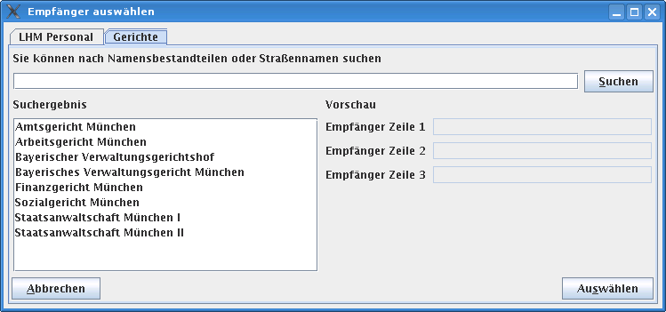

### Ich möchte eine externe Datenbank als Datenquelle im WollMux verwenden

siehe [Datenbanken mit dem WollMux verwenden](Datenbanken_mit_dem_WollMux_verwenden.md "wikilink")

### Ich möchte sämtliche Daten einer Datenquelle in der Empfängerauswahl sehen

Gerade wenn man nur wenige Datensätze in der Datenquelle hat, ist das
recht ergonomisch für den Benutzer.

Dafür sind zwei Änderungen in der conf wichtig, die hier rot eingekreist
sind.

<Kategorie:Wollmuxpraxis> [Kategorie:Handbuch des
WollMux](Kategorie:Handbuch_des_WollMux "wikilink")
