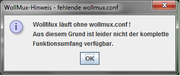

Voraussetzungen
---------------

Bevor sie den WollMux installieren können, müssen auf ihrem System folgende Programme vorhanden sein:

- **[LibreOffice](http://www.libreoffice.org/download/libreoffice-still/)**
- **[JAVA JRE](http://www.oracle.com/technetwork/java/javase/downloads/index.html)**

Vorbereitung
------------

- Überprüfen Sie, dass eine Java-Runtime-Umgebung in LibreOffice ausgewählt ist. Dazu starten Sie LibreOffice und öffnen den Menüpunkt Extras &gt; Optionen.
- Unter LibreOffice &gt; Erweitert muss eine Laufzeitumgebung ausgewählt werden. Ist dort keine zu sehen, so haben Sie entweder kein Java installiert, oder es konnte von LibreOffice nicht gefunden werden und Sie müssen es manuell hinzufügen.

Extension installieren
----------------------

- Laden Sie sich die Datei WollMux.oxt von unserer [Download-Seite](https://github.com/WollMux/WollMux/releases/latest) herunter.
- Für eine Installation auf Benutzerebene können Sie den Extension-Manager verwenden, den Sie über Extras &gt; Extension Manager in LibreOffice starten können.
- Wählen Sie "Hinzufügen" und navigieren zu Ihrem Download um dort die Datei WollMux.oxt zu selektieren.
- Abschließend bestätigen Sie mit "Öffnen" die Installation. Anschließend muss LibreOffice neu gestartet werden.

Sollten Sie den WollMux systemweit installieren wollen, so sind Administratorrechte notwendig. Verwenden Sie dann das Kommandozeilen-Tool **unopkg** von LibreOffice. Der gleichzeitige Betrieb von WollMux-Installationen auf Rechnerebene und WollMux-Installationen auf Benutzerebene kann zu Problemen führen und wird deshalb vom WollMux nicht unterstützt.

Der erste Start
---------------

Nach erfolgreicher Installation der WollMux-Extension wird beim Start des Writers auf die fehlende Datei “wollmux.conf” hingewiesen.

Das bedeutet, dass der WollMux ohne zentraler Vorlagensammlung arbeitet. Folgende Feature sind nutzbar:

- [Seriendruckvorlagen mit dem WollMux erstellen](Seriendruckvorlagen_mit_dem_WollMux_erstellen)
- [WollMux Formulare mit dem FM4000 erstellen](FormularMax_4000)

**Hinweis:** Bei älteren WollMux-Versionen (vor 16.04) muss eine WollMux-Konfiguration installiert werden.

WollMux-Konfiguration installieren
----------------------------------

Um die WollMuxBar und eine zentrale Vorlagensammlung nutzen zu können, wird eine WollMux-Konfiguration benötigt (siehe [Standardkonfiguration\_des\_WollMux\_installieren\_und\_pflegen](Standardkonfiguration_des_WollMux_installieren_und_pflegen)).