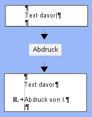
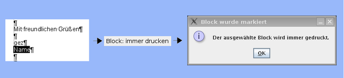
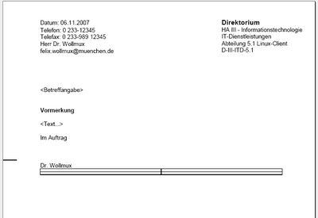
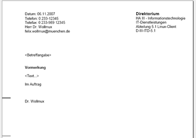
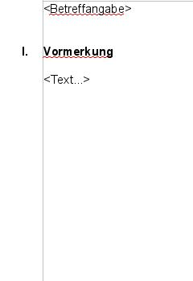

Dieser Artikel beschreibt die Verwendung der Hilfen für Sachleitende
Verfügungen, die der WollMux bereitstellt, aus Benutzersicht.

<!-- toc -->

Voraussetzungen für die Benutzung von Sachleitenden Verfügungen
===============================================================

Bevor Sie mit dem WollMux Sachleitende Verfügungen erstellen können,
müssen folgende Voraussetzungen erfüllt sein:

Einstellungen in OpenOffice
---------------------------

Folgende Einstellungen müssen in OpenOffice gesetzt sein, damit eine
reibungslose Arbeit mit Sachleitenden Verfügungen möglich ist:

-   Unter "Extras&rarr;Optionen.../Writer/Formatierungshilfen" muss die
    Anzeige von ausgeblendeten Text ausgeschaltet sein. Beim Drucken
    verwendet der WollMux die Möglichkeit in OpenOffice, Textbereiche
    ausblenden zu können. Damit OpenOffice beim Drucken die Anzahl der
    Gesamtseiten richtig berechnen kann, dürfen die ausgeblendeten
    Bereiche nicht angezeigt werden. Diese Option ist auf dem
    Basisclient bereits richtig gesetzt.

-   Unter "Extras-&gt;AutoKorrektur/Optionen" muss die Option
    "Nummerierung anwenden - Symbol:\*" deaktiviert sein. Die
    Verfügungspunkte von Sachleitenden Verfügungen beginnen mit
    römischen Ziffern. Damit OpenOffice diese Ziffern nicht als
    Aufzählungen interpretiert, muss diese Option ausgeschaltet werden.
    Auf dem Basisclient ist diese Option bereits richtig gesetzt.
    Ausserdem schaltet der WollMux diese Option automatisch ab, wenn das
    erste mal mit Sachleitenden Verfügungen gearbeitet wird.

Die OpenOffice Writer Symbolleiste "Sachleitende Verfügungen"
-------------------------------------------------------------

Die Symbolleiste "Sachleitende Verfügung" muss im OOo-Writer im Menü
"Ansicht" &rarr; Symbolleisten &rarr; Sachleitende Verfügungen aktiviert
werden. Die neue Symbolleiste "Sachleitende Verfügungen" enthält
Schaltflächen "Ziffer einfügen", "Abdruck" und "Zuleitungszeile". Des
weiteren sind fünf Schaltflächen zur Erstellung der Blöcke zur
Drucksteuerung enthalten: "Immer drucken", "Nicht im Original", "Nur
Original", "Nur Entwurf" und "Nur Abdrucke".

Im Folgenden sind die einzelnen Schaltflächen der Symbolleiste
ausführlicher beschrieben:

### Einfügen oder Entfernen von Elementen

Über die folgenden drei Schaltflächen können Elemente der Sachleitenden
Verfügungen eingefügt oder entfernt werden.

#### Die Schaltfläche "Ziffer Einfügen"

**Neue Ziffern einfügen**

Über die Schaltfläche "Ziffer Einfügen" ist es möglich eine römische
Ziffer einzufügen, mit der ein weiterer Verfügungspunkt im Dokument
gesetzt werden kann. Die neue Nummer ist um eins höher als die bereits
im Dokument vorhandenen vorherigen Ziffern. Folgen auf den neu gesetzten
Verfügungspunkt noch weitere Verfügungspunkte, so werden diese neu
nummeriert, so dass die Gesamtnummerierung aller Verfügungspunkte wieder
stimmt.

Folgende Graphiken demonstrieren die Funktionsweise von "Ziffer
einfügen":

<table>
<tr>
<th></th>
<th></th>
<th></th>
</tr>
<tr>
<td>Der Cursor steht am Anfang einer Zeile. Nach dem Drücken auf "Ziffer einfügen" wird eine neue Ziffer am linken Rand gesetzt und es kann mit dem Schreiben der Überschrift für diesen Verfügungspunkt begonnen werden.</td>
<td>Der Cursor steht an einer anderen Position in der aktuellen Zeile (hier am Ende): Die aktuelle Zeile wird mit einer Ziffer versehen und als Überschriftszeile eines Verfügungspunktes formatiert.</td>
<td>Der Cursor markiert einen ganzen Bereich: Die erste Zeile der Markierung erhält eine neue römische Ziffer und wird als Verfügungspunkte formatiert.</td>
</tr>
</table>

**Bestehende Ziffern löschen**

Ebenso können über die Schaltfläche bereits bestehende Verfügungspunkte
entfernt werden. Steht der Cursor auf einem Absatz, der bereits eine
Überschrift eines Verfügungspunktes ist, so wird die römische Ziffer am
Anfang der Überschriftszeile gelöscht und die Formatierung dieses
Absatzes auf "Fließtext" zurück gesetzt.

<table>
<tr>
<td></td>
<td></td>
</tr>
<tr>
<td>Der Cursor steht bereits auf einer Überschrift für einen Verfügungspunkt. Die römische Ziffer wird wieder entfernt und der Absatz auf "Fließtext" zurück gesetzt.</td>
<td>Der Cursor markiert einen ganzen Bereich in dem Bereits Überschriften für Verfügungspunkte enthalten sind: Alle Verfügungsunkte die von der Markierung berührt sind, werden auf "Fließtext" zurückgesetzt.</td>
</tr>
</table>

#### Die Schaltfläche "Abdruck"

**Neuen Abdruck einfügen**

Über die Schaltfläche Abdruck ist es möglich einen Verfügungspunkt mit
dem Inhalt "Abdruck von I.\[...\]" einzufügen. Der neue Verfügungspunkt
wird immer hinter dem Absatz eingefügt, in dem der Cursor steht.

<table>
<tr>
<td></td>
</tr>
<tr>
<td>Durch das Drücken auf "Abdruck" wird eine neue Abdruckzeile eingefügt und der Cursor in die Folgezeile nach "Abdruck von..." gesetzt.</td>
</tr>
</table>

Die Nummerierung der restlichen Verfügungspunkte wird dabei wie unter
["Ziffer einfügen"](#die-schaltfläche-ziffer-einfügen "wikilink")
automatisch angepasst. Bei bereits bestehenden Abdrücken wird dabei auch
der Text "Abdruck von I.\[...\]" so angepasst, dass stets alle Vorgänger
aufgeführt sind. Hinter dem automatisch erzeugten Text "Abdruck von I.,
..." kann beliebiger Freitext wie z.B. "mit Anlagen" eingegeben werden,
der bei der Anpassung der römischen Ziffern unversehrt bleibt. Wird z.B.
vor der Überschrift "Abdruck von I. mit Anlagen" ein weiterer
Verfügungspunkt eingefügt, so wird der Abdruck in "Abdruck von I. und
II. mit Anlagen" umbenannt.

Folgendes Beispiel verdeutlicht, wie die automatische Benennung der
Abdruck-Zeilen funktioniert. Es entstand durch mehrmaliges Drücken auf
"Abdruck":

**Bestehenden Abdruck entfernen**

Ebenso können über die Schaltfläche bereits bestehende Abdrucke entfernt
werden.

<table>
<tr>
<td></td>
<td></td>
</tr>
<tr>
<td>Der Cursor steht bereits auf einem Abdruck. Der Abdruck wird wieder entfernt.</td>
<td>Der Cursor markiert einen ganzen Bereich in dem Bereits Abdrucke enthalten sind: Alle Abdrucke die von der Markierung berührt sind, werden gelöscht.</td>
</tr>
</table>

#### Die Schaltfläche "Zuleitungszeile"

**Neue Zuleitungszeile einfügen**

Über die Schaltfläche Zuleitungszeile ist es möglich Absätze als
Zuleitungszeilen zu markieren die momentan markiert sind bzw. den Cursor
enthalten. Jeder Absatz des Typs Zuleitungszeile führt zu einem weiteren
Ausdruck. Eine Zuleitungszeile kann auch eine richtige Adresse mit
Straße, Hausnummer und PLZ sein. Für mehrzeilige Zuleitunsangaben muss
zwingend ein <i>Zeilen</i>umbruch (Shift-Enter bzw. Einfügen/Manueller
Umbruch/Zeilenumbruch), kein <i>Absatz</i>umbruch (einfaches Drücken der
Enter-Taste) verwendet werden, da ansonsten die Anzahl der ausgedruckten
Exemplare falsch berechnet wird.

<table>
<tr>
<td></td>
<td></td>
</tr>
<tr>
<td>Durch das Drücken auf Zuleitungszeile wird die Zeile in der der Cursor steht zur Zuleitungszeile gemacht und beim Ausdrucken wird ein Ausdruck erzeugt.</td>
<td>Durch das Drücken auf Zuleitungszeile werden alle Zeile die Markiert sind zur Zuleitungszeile gemacht und beim Ausdrucken wird pro Absatz ein Ausdruck erzeugt.</td>
</tr>
</table>

**Bestehende Zuleitungszeile löschen**

Falls der Absatz schon als Zuleitungszeile definiert ist, wird dieser
nach Betätigen der Schaltfläche wieder aufgehoben (und das Absatzformat
auf Fliesstext zurückgesetzt).

<table>
<tr>
<td></td>
<td></td>
</tr>
<tr>
<td>Durch das Drücken auf Zuleitungszeile wird die Zeile in der der Cursor steht auf Fliesstext zurückgesetzt.</td>
<td>Durch das Drücken auf Zuleitungszeile werden alle Zeile die Markiert sind auf Fliesstext zurückgesetzt.</td>
</tr>
</table>

### Die Schaltflächen zur Drucksteuerung einzelner Blöcke

#### Schaltfläche "Immer drucken"

Mit der Schaltfläche "Immer drucken" kann ein markierter Block
ausgezeichnet werden, der immer gedruckt wird, auch dann, wenn
Textbereiche unter einer Überschrift eines Verfügungspunktes sonst
ausgeblendet werden.

Block "immer drucken" einfügen

Block "immer drucken" entfernen

Zum Entfernen einer "immer drucken"-Markierung markieren Sie bitte den
entsprechenden Text mit der Maus und betätigen die Schaltfläche "immer
drucken" erneut:

Ist in der
[WollMux-Konfiguration](Konfigurationsdatei_wollmux_conf.md#der-abschnitt-sachleitendeverfuegungen "wikilink")
eine Hintergrundfarbe für diesen Druckblock definiert, so wird der
Druckblock mit der dort definierten Farbe hinterlegt um den Block
optisch abzuheben und leichter orten zu können. Ob eine solche Farbe
definiert ist, können Sie bei Ihrer Systemadministration erfragen. Beim
Drucken eines entsprechenden Dokuments wird die Hintergrundfarbe
**nicht** mit ausgedruckt.

#### Schaltfläche "Nicht im Original"

Mit der Schaltfläche "Nicht im Original" kann ein markierter Block
ausgezeichnet werden der in allen Ausdrucken außer dem Original gedruckt
wird (als Original gilt dabei grundsätzlich immer die Fassung, bei der
alle römischen Ziffern inklusive I. ausgeblendet sind).

Das Markieren eines Blocks und das Aufheben der Markierung eines Blocks
funktioniert analog zum Block "Immer drucken" durch das Betätigen der
zugehörigen Schaltfläche.

Ist in der
[WollMux-Konfiguration](Konfigurationsdatei_wollmux_conf.md#der-abschnitt-sachleitendeverfuegungen "wikilink")
eine Hintergrundfarbe für diesen Druckblock definiert, so wird der
Druckblock mit der dort definierten Farbe hinterlegt um den Block
optisch abzuheben und leichter orten zu können. Ob eine solche Farbe
definiert ist, können Sie bei Ihrer Systemadministration erfragen. Beim
Drucken eines entsprechenden Dokuments wird die Hintergrundfarbe
**nicht** mit ausgedruckt.

#### Schaltfläche "Nur Original"

Mit der Schaltfläche "Nur Original" kann ein markierter Block
ausgezeichnet werden der ausschließlich im Original gedruckt wird (als
Original gilt dabei grundsätzlich immer die Fassung, bei der alle
römischen Ziffern inklusive I. ausgeblendet sind).

Das Markieren eines Blocks und das Aufheben der Markierung eines Blocks
funktioniert analog zum Block "Immer drucken" durch das Betätigen der
zugehörigen Schaltfläche.

Ist in der
[WollMux-Konfiguration](Konfigurationsdatei_wollmux_conf.md#der-abschnitt-sachleitendeverfuegungen "wikilink")
eine Hintergrundfarbe für diesen Druckblock definiert, so wird der
Druckblock mit der dort definierten Farbe hinterlegt um den Block
optisch abzuheben und leichter orten zu können. Ob eine solche Farbe
definiert ist, können Sie bei Ihrer Systemadministration erfragen. Beim
Drucken eines entsprechenden Dokuments wird die Hintergrundfarbe
**nicht** mit ausgedruckt.

#### Schaltfläche "Nur Entwurf"

Mit der Schaltfläche "Nur Entwurf" kann ein markiert Block ausgezeichnet
werden der nur im Entwurf gedruckt wird. Als Entwurf wird der Ausdruck
bezeichnet der alle Sachleitende Verfügungen enthält.

Das Markieren eines Blocks und das Aufheben der Markierung eines Blocks
funktioniert analog zum Block "Immer drucken" durch das Betätigen der
zugehörigen Schaltfläche.

Ist in der
[WollMux-Konfiguration](Konfigurationsdatei_wollmux_conf.md#der-abschnitt-sachleitendeverfuegungen "wikilink")
eine Hintergrundfarbe für diesen Druckblock definiert, so wird der
Druckblock mit der dort definierten Farbe hinterlegt um den Block
optisch abzuheben und leichter orten zu können. Ob eine solche Farbe
definiert ist, können Sie bei Ihrer Systemadministration erfragen. Beim
Drucken eines entsprechenden Dokuments wird die Hintergrundfarbe
**nicht** mit ausgedruckt.

#### Schaltfläche "Nur Abdrucke"

Mit der Schaltfläche "Nur Abdrucke" kann ein markiert Block
ausgezeichnet werden der nur in Abdrucken gedruckt wird. Als Abdrucke
werden alle Ausdrucke außer dem ersten (dem Original) und dem letzten
(dem Entwurf) bezeichnet.

Das Markieren eines Blocks und das Aufheben der Markierung eines Blocks
funktioniert analog zum Block "Immer drucken" durch das Betätigen der
zugehörigen Schaltfläche.

Ist in der
[WollMux-Konfiguration](Konfigurationsdatei_wollmux_conf.md#der-abschnitt-sachleitendeverfuegungen "wikilink")
eine Hintergrundfarbe für diesen Druckblock definiert, so wird der
Druckblock mit der dort definierten Farbe hinterlegt um den Block
optisch abzuheben und leichter orten zu können. Ob eine solche Farbe
definiert ist, können Sie bei Ihrer Systemadministration erfragen. Beim
Drucken eines entsprechenden Dokuments wird die Hintergrundfarbe
**nicht** mit ausgedruckt.

Der Textrahmen "WollMuxVerfuegungspunkt1"
-----------------------------------------

Im im Dokument ein Textrahmen mit dem Namen "WollMuxVerfuegungspunkt1"
vorhanden (Beispiel siehe externer Briefkopf), so wird dieser Rahmen
besonders behandelt. Er dient dazu, die Ziffer "I." zu positionieren,
die im externen Briefkopf neben dem Empfängerfeld angezeigt werden soll.

Der Rahmen kann ausschließlich den Inhalt "I." besitzen und wird vom
WollMux automatisch verwaltet. Bei der Erstellung dieses Textrahmens
muss kein Inhalt eingefügt werden, da der WollMux den Inhalt "I." genau
dann automatisch einträgt, wenn mindestens ein (weiterer)
Verfügungspunkt im Dokument vorhanden ist. Ist kein Verfügungspunkt im
Dokument vorhanden, so bleibt dieser Rahmen leer.

Ist im Dokument ein Textrahmen "WollMuxVerfuegungspunkt1" vorhanden, so
beginnt die Zählung der weiteren Verfügungspunkte automatisch mit "II.".

Definition von Textbereichen zum Ausblenden problematischer Inhalte
-------------------------------------------------------------------

Manche Textinhalte werden von OpenOffice.org nicht korrekt ausgeblendet,
wenn sie sich unterhalb eines während des Drucks ausgeblendeten
Verfügungspunktes befinden. Davon sind folgende, uns bekannte Elemente
betroffen:

-   Tabellen mit sichtbaren Rahmen: Beim Ausblenden eines
    Verfügungspunktes der eine Tabelle mit sichtbaren Rahmen enthält,
    wird zwar der Inhalt der Tabelle ausgeblendet, die Rahmen bleiben
    aber als Gerüst sichtbar.
-   Manuelle Seitenumbrüche: Wird unterhalb eines ausgeblendeten
    Verfügungspunktes mit Seitenumbrüchen gearbeitet, so blendet
    OpenOffice.org diese Seitenumbrüche nicht aus. Als Ergebnis
    entstehen ungewünschte leere Seiten, bei denen nur die Kopfzeile mit
    einer falschen Gesamtseitenzahl angezeigt wird.

**Beispiel**

Diese Vormerkung enthält nach dem letzten Verfügungspunkt Wiedervorlage einen Textteil mit Informationen zum Dokument, die nur im Entwurf gedruckt werden sollen. Die Informationen sollen dabei als Tabelle dargestellt werden.

Beim Ausdrucken des Originals werden zwar die Überschriften der Verfügungspunkte II und III richtig ausgeblendet, von der Tabelle bleibt jedoch ein ungewollter leerer Rahmen übrig.

Mit Hilfe sogenannter Textbereiche ist es aber dennoch möglich, diese
Inhalte zuverlässig auszublenden. Dazu markieren Sie (als
Vorlagenersteller) bitte die betroffenen Textteile mit der Maus und
fügen Sie über Einfügen&rarr;Bereich... einen neuen Bereich ein. Abhängig
von der Position des betroffenen Textteils achten Sie bei der Erstellung
des Bereichs bitte auf folgende Regeln:

Unterhalb eines Verfügungspunktes: Befindet sich der problematische Inhalt unterhalb einer **Überschrift eines Verfügungspunktes**, so kann der Bereich beliebig benannt werden. Bitte achten Sie beim Markieren der betroffenen Textteile aber darauf, dass der Bereich nicht vor der Überschrift des zugehörigen Verfügungspunktes startet. Innerhalb eines so erzeugten Bereichs können keine Druckblöcke (z.B. "Block immer drucken") verwendet werden, da stets der gesamte betroffene Bereich ausgeblendet wird und so auch die Druckblöcke nicht angezeigt würden wenn sie angezeigt werden sollten.

**Beispiel**

Diese Vormerkung enthält nach dem letzten Verfügungspunkt Wiedervorlage einen Textteil mit Informationen zum Dokument und einer Tabelle, die nur im Entwurf gedruckt werden sollen. Der problematische Textteil wurde nun aber in einen Textbereich (grauer Rand um den Textteil) mit dem Namen "Dokumentinfo" verpackt.

Beim Ausdrucken des Originals werden alle auszublendenden Inhalte korrekt ausgeblendet.

Innerhalb eines Blocks zur Drucksteuerung: Mit den **[Blöcken zur Drucksteuerung](#die-schaltflächen-zur-drucksteuerung-einzelner-blöcke "wikilink")** können beliebige Textstellen beim Drucken der Sachleitenden Verfügungen ein- oder ausgeblendet werden, auch dann, wenn sie sich nicht direkt unterhalb einer Überschrift, sondern z.B. in einem eigenen Textrahmen befinden. Liegt der problematische Inhalt in einem solchen Druckblock, so muss der Bereichsname nach folgendem System aufgebaut sein:

`<beliebiger Name> GROUPS '<SLV_Sichtbarkeitsgruppe>'`

Dabei können Sie an die Stelle <beliebiger Name> einen beliebigen
Namen setzen. An der Stelle <SLV_Sichtbarkeitsgruppe> muss einer der
folgenden Werte eingetragen werden:
-   **SLV\_AllVersions**: Analog zum Druckblock "Immer drucken" wird
    dieser Bereich in allen Ausdrucke gedruckt.
-   **SLV\_NotInOriginal**: Analog zum Druckblock "Nicht im
    Original" wird dieser Bereich in alle Ausdrucke außer dem
    Original gedruckt.
-   **SLV\_OriginalOnly**: Analog zum Druckblock "Nur Original" wird
    dieser Bereich ausschließlich im Original gedruckt.
-   **SLV\_DraftOnly**: Analog zum Druckblock "Nur Entwurf" wird
    dieser Bereich nur im Entwurf gedruckt.
-   **SLV\_CopyOnly**: Analog zum Druckblock "Nur Abdrucke" wird
    dieser Bereich in alle Ausdrucke außer dem Original und dem
    Entwurf gedruckt.

Auf diese Weise definieren Sie einen [Textbereich mit der Namenserweiterung GROUPS](Dokumentkommandos_des_WollMux.md#textbereiche-mit-der-namenserweiterung-groups-listemitsichtbarkeitsgruppen "wikilink"),
der über obige spezielle Sichtbarkeitsgruppen angesteuert wird. Die
Sichtbarkeitsgruppen werden beim Drucken automatisch vom WollMux
gesetzt und steuern so die Sichtbarkeit des Textbereichs.

Drucken von Sachleitende Verfügungen
------------------------------------

Sachleitende Verfügungen können über die OOo-Writer Symbolleiste
"Standard" &rarr; Schaltfläche "Datei direkt drucken"

oder über das OOo-Writer Menü "Datei" &rarr; "Drucken" ausgedruckt
werden.

Es erscheint der Dialog "Wollmux Komfortdruck", falls Sachleitende
Verfügungen Elemente vorhanden sind.

Ausdrucke: In der Spalte "Ausdrucke" sind die Überschriften aller erkannten Verfügungspunkte aufgelistet. Beim Klick auf eine Überschrift klappt eine Liste aller Zuleitungszeilen auf, die diesem Verfügungspunkt zugeordnet sind. Jede dort aufgelistete Zuleitungszeile zählt den Kopien-Zähler dieses Verfügungspunktes um eins rauf.
Kopien: In der Spalte "Kopien" kann für jeden Ausdruck eingestellt werden, wie oft dieser Ausdruck gedruckt werden soll. Da normalerweise für jede Zuleitungszeile des Verfügungspunktes eine Kopie benötigt wird, wird der Kopien-Zähler mit der Anzahl der zugehörigen Zuleitungszeilen vorbelegt. Um zu verhindern, dass eine Ausfertigung gedruckt wird, setzen Sie den entsprechenden Kopien-Zähler auf 0.

### Beispiel: Drucken eines internen Briefes

Über die Symbolleiste "Datei direkt drucken" oder den Menüeintrag
"Drucken" erscheint der Dialog "Wollmux Komfortdruck".

Nach Betätigen der Schaltfläche "Alle Ausdrucke drucken" erhält man
folgende drei Ausdrucke. Jede als Zuleitungszeile markierte Zeile, zählt
als ein Ausdruck. Weglegen zählt ebenfalls als ein Ausdruck. Bei nicht
benötigen eines Ausdruckes muss die Zahl entsprechend gesetzt werden.
Ein- und Ausblendungen z.B für "I.A. Name" können über [Schaltflächen zur Drucksteuerung einzelner Blöcke](#die-schaltflächen-zur-drucksteuerung-einzelner-blöcke "wikilink")
gesetzt werden.

<table>
<tr>
<td></td>
<td></td>
<td></td>
</tr>
<tr>
<td>Ausdruck kann auch einzeln über die Schaltfläche "Drucken" rechts neben "III. Weglegen" ausgedruckt werden</td>
<td>Ausdruck kann auch einzeln über die Schaltfläche "Drucken" rechts neben "II. Abdruck von I." ausgedruckt werden</td>
<td>Ausdruck kann auch einzeln über die Schaltfläche "Drucken" rechts neben "I. Vormerkung" ausgedruckt werden</td>
</tr>
</table>

### Beispiel: Drucken eines externen Briefes

Über die Symbolleiste "Datei direkt drucken" oder den Menüeintrag
"Drucken" erscheint der Dialog "Wollmux Komfortdruck".

Nach Betätigen der Schaltfläche "Alle Ausdrucke drucken" erhält man
folgende vier Ausdrucke. Jede als Zuleitungszeile markierte Zeile, zählt
als ein Ausdruck. WV (Wiedervorlage) zählt ebenfalls als ein Ausdruck.
Bei nicht benötigen eines Ausdruckes muss die Zahl entsprechend gesetzt
werden. Ein- und Ausblendungen z.B für "I.A. Name" können über
[Schaltflächen zur Drucksteuerung einzelner Blöcke](#die-schaltflächen-zur-drucksteuerung-einzelner-blöcke "wikilink")
gesetzt werden.

<table>
<tr>
<th>Ausdruck "III. WV....."</th>
<th>Ausdruck "II. Abdruck von I."</th>
<th>Ausdruck "II. Abdruck von I."</th>
<th>Ausdruck "I. Original"</th>
</tr>
<tr>
<td></td>
<td></td>
<td></td>
<td></td>
</tr>
<tr>
<td>Ausdruck kann auch einzeln über die Schaltfläche "Drucken" rechts neben "III. WV ....." ausgedruckt werden</td>
<td>Ausdruck kann auch einzeln über die Schaltfläche "Drucken" rechts neben "II. Abdruck von I." ausgedruckt werden</td>
<td>Ausdruck kann auch einzeln über die Schaltfläche "Drucken" rechts neben "II. Abdruck von I." ausgedruckt werden</td>
<td>Ausdruck kann auch einzeln über die Schaltfläche "Drucken" rechts neben "I. Original" ausgedruckt werden</td>
</tr>
</table>

### Grundsätzliches zu Sachleitende Verfügungen Drucken

-   Bei einem Externen Brief wird die I. als "I. Original" angezeigt,
    sonst wird die Beschreibung aus der Verfügung angezeigt (z.B.
    Vormerkung oder Niederschrift).
-   Falls bei einer Verfügung kein Absatz als Zuleitungszeile markiert
    ist, wird der Druckzähler mit 1 initialisiert.
-   Alle als Zuleitungszeile markierten Absätze werden als Dropdown zu
    der jeweiligen Verfügung angezeigt, mit der dazugehörigen Anzahl
    der Ausdrucke.
-   Jeder Ausdruck kann einzeln mit einer Schaltfläche "Drucken" neben
    der entsprechenden Verfügung ausgedruckt werden.
-   Die Summe aller Ausdrucke wird als "read only" Feld angezeigt.
-   Alle Ausdrucke können über die Schaltfläche "Alle Drucken"
    ausgedruckt werden.
-   Über die Schaltfläche "Druckeinstellungen" kann ein anderer Drucker
    ausgewählt werden oder Einstellungen geändert werden.

Anhang Details
--------------

Hier eine Zusammenfassung des Verhaltens aller Schaltflächen in den
verschiedenen möglichen Situationen:

<table border="2" cellspacing="0" cellpadding="4" rules="all" style="margin:1em 1em 1em 0; border:solid 1px #AAAAAA; border-collapse:collapse; background-color:#F9F9F9; font-size:100%; empty-cells:show;">
<tr>
<th> Situation/Schaltfläche
</th>
<th> Ziffer Einfügen
</th>
<th> Abdruck
</th>
<th> Zuleitungszeile
</th></tr>
<tr>
<th> 1) Der Cursor steht auf Fließtext und markiert keinen Bereich
</th>
<td> 1a) Die römische Ziffer wird links in dem Absatz eingefügt, in dem sich der Cursor befindet (bei Bereichen an der Startposition des Cursors) und als Verfügungspunkt (fett) formatiert. Der Cursor bleibt unverändert.
</td>
<td> 1b) An der Cursorposition (Bei Bereichen vor der Startposition des Cursors) wird ein neuer Absatz eingefügt und als Verfügungspunkt mit dem Text "Abdruck von I. ..." formatiert. Danach folgt ein zusätzlicher Absatz nach dem Abdruck. Der Cursor steht in jedem Fall danach am Anfang des ersten Absatzes nach dem Abdruck.
</td>
<td> 1c) Der Absatz in dem sich der Cursor befindet wird als Zuleitungszeile formatiert und der Cursor bleibt unverändert.
</td></tr>
<tr>
<th> 2) Der Cursor steht auf einem Verfügungspunkt und markiert keinen Bereich
</th>
<td> 2a) Die römische Ziffer des Verfügungspunktes wird gelöscht und das Absatzformat auf "Fließtext" zurück gesetzt. Der Cursor bleibt unverändert.
</td>
<td> 2b) Am Ende des Absatzes des Verfügungspunktes wird der Abdruck eingefügt (bis auf die Position) wie unter 1b) beschrieben.
</td>
<td> 2c) Der Verfügungspunkt in dem sich der Cursor befindet wird als Verfügung mit Zuleitung formatiert und der Cursor bleibt unverändert.
</td></tr>
<tr>
<th> 3) Der Cursor steht auf einem Abdruck und markiert keinen Bereich
</th>
<td> 3a) Der Abdruck wird entfernt wie unter 3b) beschrieben.
</td>
<td> 3b) Der komplette Absatz des Abdrucks wird gelöscht. Folgte auf den Abdruck eine Leerzeile, so wird auch diese gelöscht. Der Cursor steht danach am Ende der Vorgängerzeile des Abdrucks.
</td>
<td> 3c) Nach dem Abdruck wird eine neue Leerzeile eingefügt und diese als Zuleitungszeile formatiert. Der Cursor steht am Anfang der neuen Zuleitungszeile.
</td></tr>
<tr>
<th> 4) Der Cursor steht auf einem Verfügungspunkt mit Zuleitung und markiert keinen Bereich
</th>
<td> 4a) Die Ziffer wird entfernt und der Absatz als Zuleitungszeile markiert. Der Cursor bleibt unverändert.
</td>
<td> 4b) Am Ende des Absatzes des Verfügungspunktes mit Zuleitung wird der Abdruck eingefügt (bis auf die Position) wie unter 1b) beschrieben.
</td>
<td> 4c) Die Zuleitung wird entfernt, in dem der Absatz als normaler Verfügungspunkt formatiert wird. Der Cursor bleibt unverändert.
</td></tr>
<tr>
<th> 5) Der Cursor steht auf einer Zuleitungszeile und markiert keinen Bereich
</th>
<td> 5a) Die römische Ziffer wird in dem Absatz eingefügt, in dem der Cursor steht (bei Bereichen an der Startposition des Cursors) und der Absatz als Verfügungspunkt mit Zuleitung markiert. Der Cursor bleibt unverändert.
</td>
<td> 5b) Der Abdruck wird eingefügt wie unter 1b) beschrieben.
</td>
<td> 5c) Die Zuleitungszeile wird entfernt, in dem das Absatzformat auf "Fließtext" zurück gesetzt wird. Der Cursor bleibt unverändert.
</td></tr>
<tr>
<th> 6) Der Cursor erstreckt sich über mehrere Zeilen und markiert damit verschiedene Elemente (Verfügungspunkte, Zuleitungszeilen, Abdrücke, Verfügungspunkte mit Zuleitungen). Mindestens ein Absatz mit dem Typ des einzufügenden Elements ist in der Auswahl vorhanden:
</th>
<td> 6a) Alle enthaltenen Verfügungspunkte mit Zuleitung werden wie in 4a) beschrieben entfernt. Alle enthaltenen Abdrücke werden wie in 3b) beschrieben entfernt. Alle anderen enthaltenen Verfügungspunkte werden wie in 2a) beschrieben entfernt. Der Cursor bleibt unverändert.
</td>
<td> 6b) Alle enthaltenen Abdrücke werden wie in 3b) beschrieben entfernt. Der Cursor bleibt unverändert.
</td>
<td> 6c) Alle enthaltenen Zuleitungszeilen werden wie in 5c) beschrieben entfernt. Der Cursor bleibt unverändert.
</td></tr>
<tr>
<th> 7) Der Cursor erstreckt sich über mehrere Zeilen und markiert damit verschiedene Elemente (Verfügungspunkte, Zuleitungszeilen, Abdrücke, Verfügungspunkte mit Zuleitungen). Jedoch ist <b>kein</b> Absatz mit dem Typ des einzufügenden Elements ist in der Auswahl vorhanden:
</th>
<td> 7a) Der Absatz, in dem sich die Startposition des Bereichs befindet wird als Verfügungspunkt formatiert (für Fließtext 1a) und für Zuleitungszeilen 5a)). Der Cursor bleibt unverändert.
</td>
<td> 7b) An der Startposition des Bereiches wird der der Abdruck eingefügt (für Fließtext und Zuleitungszeilen 1b), für für Verfügungspunkte 3b)).
</td>
<td> 7c) Alle Fließtext-Absätze werden wie in 1c) behandelt, alle Abdrücke werden ignoriert und alle anderen Verfügungspunkte wie 2c) behandelt. Der Cursor bleibt unverändert.
</td></tr></table>

<Category:Eierlegender_WollMux> <Category:Handbuch_des_WollMux>
