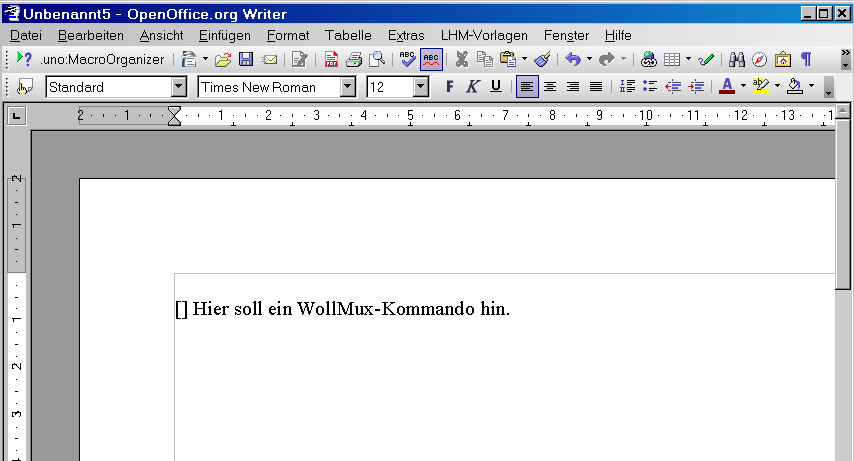
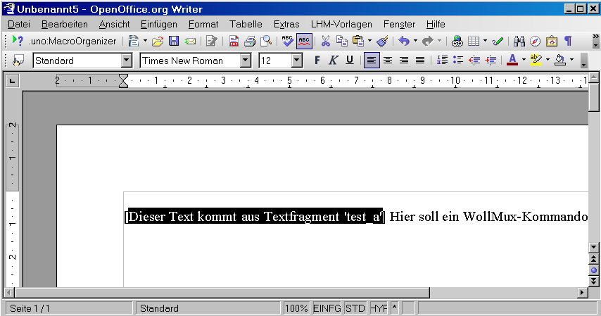

Introduction
============

The Concept of “Textfragments”
------------------------------

A “Textfragment” is part of a Writer document. A Textfragment can be as
simple as you like (a single word, for example) or very complex (such as
an entire letterhead template). Automatic assembly of Textfragments from
different sources is an essential aspect of WollMux. This process makes
it possible to harmonize city-wide requirements with department-specific
requirements and to manage them centrally.

Paragraph formatting (i.e. styles) can be stored in their own
Textfragments. This makes it possible to store fonts in a central file,
not in each document. It also makes it possible to update the font used
in a single place, without having to adapt each template separately.

Remark: The term “Textfragment” was selected to avoid confusion with the terms “text block”, “snippet”, or “clip”, since these terms are primarily associated with manual selection and insertion by the end user.

References to Textfragments and automatic replacement
-----------------------------------------------------

WollMux searches each newly-opened document for special commands, called
[Document Commands](WollMux_document_commands.md "wikilink"), which
among other things can reference Textfragments that should be inserted.
When WollMux finds a corresponding command, it automatically inserts the
referenced Textfragment. It is a recursive process. This means it is
possible for a Textfragment to reference one or more different
Textfragments, which in turn can also reference one or more
Textfragments! Complex content can be assembled from individual parts
from various sources. This means WollMux is capable of true “document
generation” or “document assembly.”

Managing Textfragments; configuration and linking
-------------------------------------------------

Remark: This section reflects the original purpose of WollMux: managing Munich's documents.

All references are linked indirectly via a table. This table is
specified in the [wollmux.conf configuration file](Konfigurationsdatei_wollmux.conf#Textfragmente "wikilink"). It
translates reference indicators to concrete files where the
Textfragments are stored. The goal of this approach is to address
changing city-wide, standard templates by changing only centrally-stored
templates. Each department should be able to avoid massive changes in
its own templates; the city-wide material should be provided
automatically.

In accordance with the three-stage concept of WollMux, user-specific
adaptations can be done without having to copy centrally-stored
templates. For example, users can use their own footers without having
to paste them into and adapt them to each template. Above all, it means
the end user will never fall out of synch with centrally stored
templates.

The task of managing individual Textfragment files is a department-level
task. Typically these will be stored in corresponding folders on network
drives, although WollMux also supports loading Textfragments via HTTP.
How and when modified Textfragments are made available to the end user,
and specifically how and when new city-wide Textfragments are made
available, is left to each individual department.

Note that to date there is no WollMux mechanism for automatic
distribution via city-wide software distribution. There is also no
automatic caching of all Textfragments on the end user's computer. This
task is left to individual departments via their normal method of data
distribution to workstations.

Example: City masthead, department-specific content
---------------------------------------------------

Assume the city wants to adopt the following masthead for use in all
external communication.

```
|---------|
|Header   |
|---------|
|         |
|         |
|---------|
|L| Footer|
|---------|
```

Let's assume that the header is the place for data such as caseworker
name, department, et cetera. The footer holds information like bank
transfer informaton, page number, et cetera. “L” indicates an area for
department-specific logos.

Without WollMux, each department would have to make copies of such
templates and insert their own logo. This is avoidable waste of
resources. And if, for example, the city decides the logo needs to be on
the right, the whole process needs to be redone:

```
|---------|
|Header   |
|---------|
|         |
|         |
|---------|
|Footer |L|
|---------|
```

Without WollMux, each department would have to modify each and every
deparment-specific template. With WollMux, all the department has to do
is use the centrally-provided city masthead, embedding their own header,
footer and logo as Textfragment references. WollMux then automatically
inserts the header, footer and logo when it opens the document.

Once again, all references are linked indirectly via a a table, which
translates reference indicators into links to the concrete data files
where the Textfragments are stored. In accordance with the WollMux-wide
three-stage concept (city, department, end user), each department can
partially modify or completely change the table in the wollmux.conf
file, it's no problem for departments to use, modify, and replace an
individual logo without needing to modify the layout, which is centrally
stored.

Handling Textfragments and templates
====================================

WollMux doesn't distinguish between Textfragments and templates; in
fact, each template is represented in WollMux as a Textfragment. The
following passage, therefore, is as valid for Textfragments as it is for
templates:

Transfer of paragraph formatting when Textfragments are inserted
----------------------------------------------------------------

When you insert a Textfragment in template, (for instance, with the
document command
[insertFrag](Dokumentkommandos_des_WollMux#Das_Kommando_.22insertFrag.22 "wikilink")),
there are two possibilities for transferring paragraph formatting:

#### Paragraph formatting is taken from the template

If the Textfragment to be inserted consists of an entire paragraph, the
formatting of the Textfragment (usually a template itself) is used. The
following image clarifies this behavior:


The template here is on the left. It contains the insertion point for
the Textfragment. The contents of the Textfragment, which appears here
on the right, is inserted into the template. The Textfragment is
formatted “Standard”, and the template is formatted “Bescheidstext”.

Since the Textfragment consists of exactly one paragraph, it assumes the
format of the template.

This allows you to create small Textfragments without worrying about how
they're formatted. Only the content matters. Formatting only comes into
play when the Textfragment is inserted. You can freely define in the
template what style the Textfragment will eventually use.

#### Paragraph formatting is taken from the Textfragment

If the Textfragment to be inserted contains at least three paragraphs,
of which the first and the last have no content, the Textfragment's
paragraph formatting is used. After insertion, the two empty (and
undesired) paragraphs are deleted. The following image clarifies this
behavior:


The template (left) contains the insertion point "<Hauptabteilung>". The
Textfragment is inserted here. The insertion point has “Standard” style
set, the Textfragment the style “Hauptabteilung\_Fachbereich”.

After insertion of the Textfragment in the template, the inserted
content retains the style “Hauptabteilung\_Fachbereich”. The two empty
paragraphs at the beginning and end of the Textfragment are deleted.
Only the desired content remains.

This lets you insert pre-formatted content in your templates if you
like. In contrast to the previous example, pre-formatted content can
span more than one paragraph. Just remember to add an empty paragraph at
the beginning and at the end of the Textfragment.

#### Important Notes

-   In general, initial or final paragraphs that are empty get deleted
    after insertion. For this reason, use one or the other of the
    processes described above: either use a single, non-empty paragraph,
    or content enclosed by empty paragraphs.
-   An empty paragraph will also be deleted if the first paragraph is
    not empty.
-   A paragraph that contains only WollMux-specific directives or
    bookmarks will be considered empty. To retain a Textfragment that
    contains such information, make sure it contains at least one
    “space” character.
-   If a table is the initial content of a Textfragment, it *must* be
    preceded by an empty paragraph. If you don't do this, correct
    insertion is not guaranteed, and even if correctly inserted may not
    be in newer versions of WollMux.
-   If a table is the final content of a Textfragment, it *must* be
    followed by an empty paragraph. If you don't do this, correct
    insertion is not guaranteed, and even if correctly inserted may not
    be in newer versions of WollMux.

Behavior of the file extensions .odt und .ott
---------------------------------------------

For the letterhead system, it doesn't make in difference in principal
whether the the document is stored as “Document” (.odt) or as “Template”
(.ott). If you open a document or Textfragment with the WollMuxBar, it's
always opened "**as Template**". This means that a new document with the
title “UntitledX” (where “X” is a number) is created, and **document
commands in the template are immediately evaluated**.

If you open a template using the file system or a browser, it will be
opened in the mode determined by the file extension. This means that if
the file extension is ".odt", the document will be opened "**as
Document**" for editing, and the **WollMux commands it contains will not
be evaluated**. If the file extension is ".ott", it will be opened “as
Template”.

Using document commands in Textfragments
========================================

> **INFO** the terms “document commands” and “WollMux commands” are used interchangeably.

Embedding WollMux commands in a document
----------------------------------------

Here is a step-by-step example of how [WollMux
commands](Dokumentkommandos_des_WollMux "wikilink") can be embedded in
your own documents or templates:



The command “insertFrag” is inserted between the square brackets "\[\]".
Place the cursor between the two brackets.

Since WollMux commands are named bookmarks (or “Textmarks”), they can be
created directly with “Insert&rarr;Bookmark”:


A brief dialog appears for bookmark creation. In the text field, enter
the desired WM command, here “WM(CMD 'insertFrag' FRAG\_ID 'test\_a')”.
For the command to function, the referenced Textfragment “test\_a” must
be [created and
registered](Textfragmente_im_WollMux#Erstellung_eines_Textfragments_oder_einer_Vorlage "wikilink").


Done! The command is embedded in the document. We can save the document
with any name we like.

Navigation between WollMux commands, editing and deleting commands
------------------------------------------------------------------

Since WollMux commands are stored in bookmarks, and bookmarks are
invisible by default, here's how to navigate between WM commands and
normal text.

Assume the cursor is at the "." at the end of a sentence. We want to
know:

-   which WM commands exist in the document in the first place,
-   how we can find the command we just created,
-   how we can edit a command after the fact,
-   and how we can delete a command.


A right-click on the string “Page 1 of 1” in the status bar, lower left,
gives us an overview of all available bookmarks. Sice we haven't defined
any other bookmarks, only our command appears in the example. A
left-click on the command moves the cursor to the spot where our command
should be inserted.

Another possibility, one that allows a quick view of all bookmarks and
thus WM commands: the Navigator. Among other things, the Navigator shows
all defined bookmarks, and with them WM commands. Start it with
“Edit&rarr;Navigator” or more quickly via the function key F5:


- **Navigating**: The Navigator displays all bookmarks and WM commands. A double-click takes the cursor to the command.

- **Editing**: Right-click on an entry in the Navigator, then “Bookmark-&gt;Rename” and enter new command text.

- **Delete**: Press the “Del” key to delete an entry selected in the Navigator.

Executing and testing WM commands
---------------------------------

1) Save and close the template or document.

2) Reopen the template. WollMux automatically activates and runs all
WollMux commands.



In the example shown, once opened the the text “Dieser Text kommt aus
Textfragment 'test\_a'” from the Textfragment 'test\_a' is inserted at
the command location.

<Kategorie:Office_Vorlagenumsteller_Handbuch>

<Category:AG-Office> <Category:Eierlegender_WollMux>
