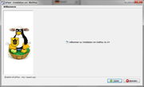
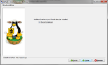
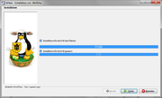
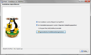
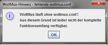

# {{ page.title }}

<!-- toc -->

Allgemeines
-----------

Ab der Version 16.04 des WollMux wird ein platformunabhägiger
Java-Installer (izPack) mitgeliefert, welcher die empfohlene
Installationsvariante ist. Allgemeine Information zur Verwendung von
izPack-Installern finden sich
[hier](https://izpack.atlassian.net/wiki/display/IZPACK/Launching+an+IzPack+Installation).

Voraussetzungen
---------------

Bevor sie den WollMux installieren können, müssen auf ihrem System
folgende Programme vorhanden sein:

-   **[LibreOffice](http://www.libreoffice.org/download/libreoffice-still/)**
    oder
    **[OpenOffice](http://www.openoffice.org/de/downloads/index.html)**
-   **[JAVA JRE (x86)](http://www.oracle.com/technetwork/java/javase/downloads/index.html)**

Java Installer
--------------

Die Installation kann mit einem Doppelklick auf die Jar-Datei oder
manuell gestartet werden:

`java -jar wollmux-16.04-installer.jar`

Folgender Aufruf ermöglicht eine zusätzliche Debugausgabe des
Installers:

`java -DDEBUG=true -jar wollmux-16.04-installer.jar`

### Installationsverlauf

-   Sprachauswahl (Abbildung 1)

-   Willkommensdialog (Abbildung 2)

-   Zielverzeichnis (Abbildung 3)
    -   Unter Windows wird der Installationspfad *C:\\Program
        Files* bzw. *C:\\Program Files (x86)* vorgegeben.
    -   Unter Linux wird das Benutzerverzeichnis vorgeschlagen.

-   Komponenten (Abbildung 4)
    -   Im Dialog “Auswahl Installationspakete” kann die Installation
        der WollMux.oxt deaktiviert werden.
    -   Die Extension liegt im Installationsverzeichnis und kann
        jederzeit über den Extension-Manager manuell
        nachinstalliert werden.

-   Registry Eintrag (Abbildung 5)
    - Hier wird ein Registry Eintrag (HKEY\_LOCAL\_MACHINE//Software/WollMux bzw. HKEY\_LOCAL\_MACHINE//Software/WOW6432Node/WollMux für 32-Bit Java) angelegt, der den Pfad zur WollMux Konfiguration hat (siehe. [Konfigurationsdatei wollmux.conf](Konfigurationsdatei_wollmux_conf.md "wikilink")

-   Systemweite Installation (Abbildung 6)
    -   WollMux.oxt kann für alle Benutzer (“shared”)
        installiert werden.
    -   Standardmäßig ist die Option nicht aktiv.
    -   Für eine Shared-Installation unter Linux muss der Installer als
        sudo aufgerufen werden.
    -   Unter Windows verlangt der Installer automatisch Admin-Rechte.

-   Zusammenfassung (Abbildung 7)

-   Installation (Abbildung 8)

-   Desktop-Icons und Startmenü (Abbildung 9)
    -   Desktop-Verknüpfungen können nur unter Windows angelegt werden.
    -   Standardmäßig werden keine Desktop-Verknüpfungen erstellt

-   Abschluß (Abbildung 10)
    -   Die Datei **auto-install.xml** kann über den Button
        *“Automatisches Installationsskript generieren”*
        erstellt werden. Dabei werden alle getroffenen
        Einstellungen gespeichert.

### Unbeaufsichtigte Installation

Die Installation kann auch über die Konsole ohne GUI ausgeführt werden
([Unattended
Installation](https://izpack.atlassian.net/wiki/display/IZPACK/Unattended+Installations)).\
Folgende Szenarien sind denkbar:

-   Aufruf des Installers mit Standardeinstellungen und zusätzlicher
    Debugausgabe

` java -DDEBUG=true -jar wollmux-16.04-installer.jar -options-system`

-   Aufruf des Installers mit Standardeinstellungen für eine systemweite
    Installation

` java -Dlocal=false -jar wollmux-16.04-installer.jar -options-system`

-   Aufruf des Installers mit Standardeinstellungen für eine systemweite
    Installation mit Vorgabe des Zielordners

` java "-DINSTALL_PATH=C:\Program Files (x86)\WollMux" "-Dlocal=false" -jar wollmux-16.04-installer.jar -options-system`

Sobald eine Änderung an den Standardeinstellungen benötigt wird, muss
man einmalig die Installation manuell mit GUI durchführen und (wie in
Abbildung 9 beschrieben) ein Installationsskript erstellen.

Dieses Installationsskript kann nun für alle weiteren Installationen
verwendet werden:

`java -jar wollmux-16.04-installer.jar auto-install.xml`

Uninstaller
-----------

Der
Java-Uninstaller liegt im WollMux-Installationsverzeichnis unter dem
Ordner “Uninstaller”, welcher die Deinstallation mit eigener GUI
erleichtert (Abbildung 10).

-   Der Uninstaller kann ebenfalls Unattended ausgeführt werden:

`java -jar "`<WollMux-Pfad>`\Uninstaller\uninstaller.jar“ -c -f`

Der erste Start
---------------

Nach
erfolgreicher Installation der WollMux-Extension
(LibreOffice/OpenOffice), wird beim Start des Writers auf die fehlende
Datei “wollmux.conf” hingewiesen (Abbildung 11).

Das bedeutet, dass der WollMux ohne zentraler Vorlagensammlung
arbeitet.\
Folgende Feature sind nutzbar:

-   [ Seriendruckvorlagen mit dem WollMux    erstellen](Seriendruckvorlagen_mit_dem_WollMux_erstellen.md "wikilink")
-   [ WollMux Formulare mit dem FM4000 erstellen](FormularMax_4000.md "wikilink")

Um die WollMuxBar und eine zentrale Vorlagensammlung nutzen zu können,
wird eine WollMux-Konfiguration benötigt (siehe
[Standardkonfiguration des WollMux installieren und pflegen](Standardkonfiguration_des_WollMux_installieren_und_pflegen.md "wikilink")).

Ältere Versionen
----------------

-   siehe [WollMux installieren (vor Version 16.04)](WollMux_installieren_vor_Version_16.04.md "wikilink")

<Category:Eierlegender_WollMux> <Category:Handbuch_des_WollMux>
